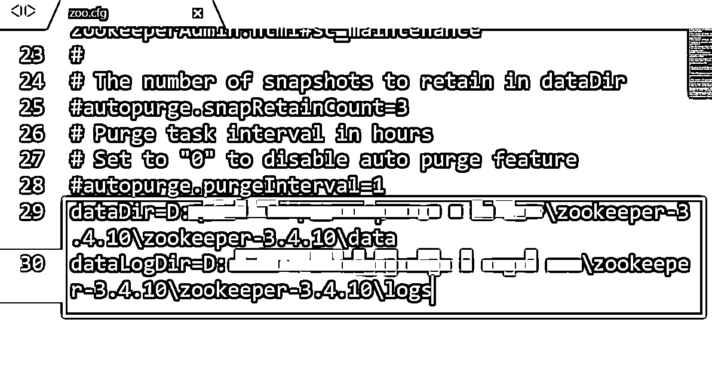
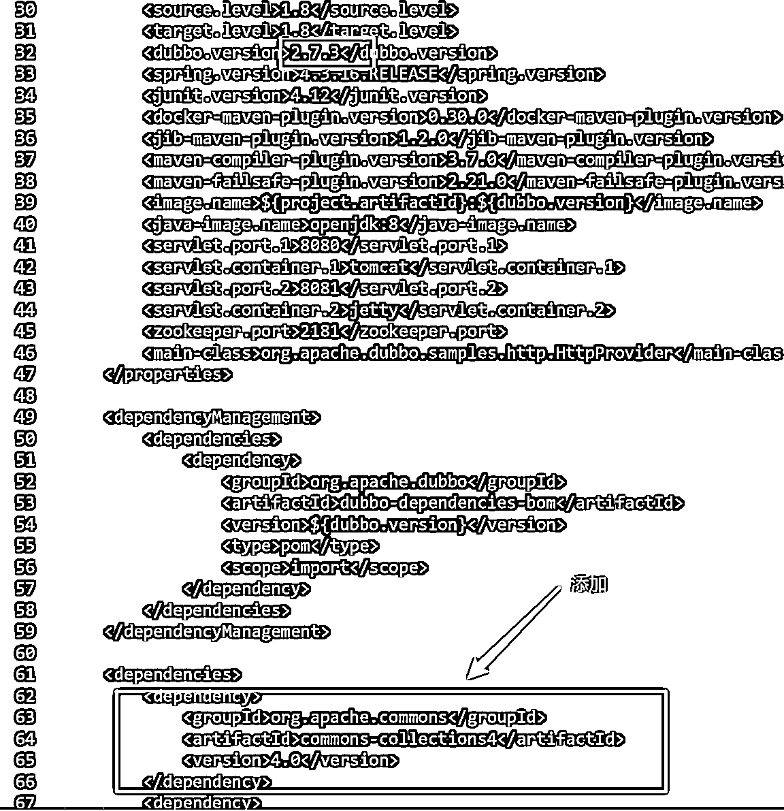
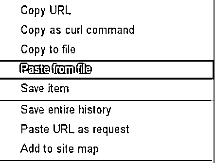
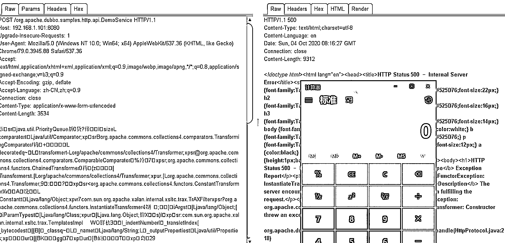
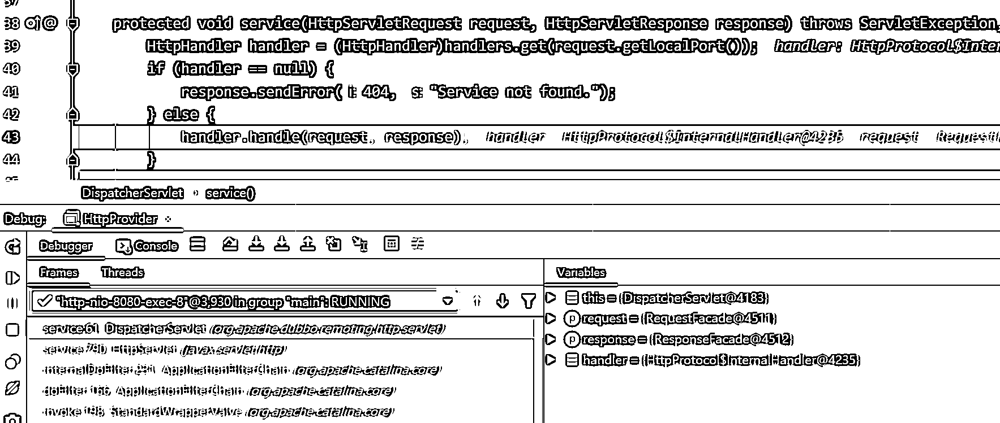
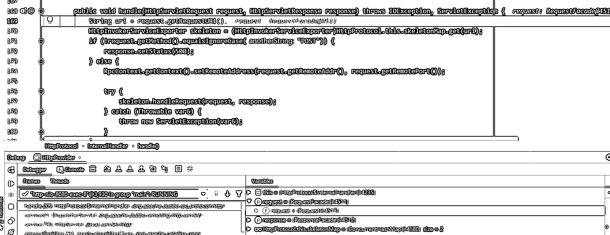
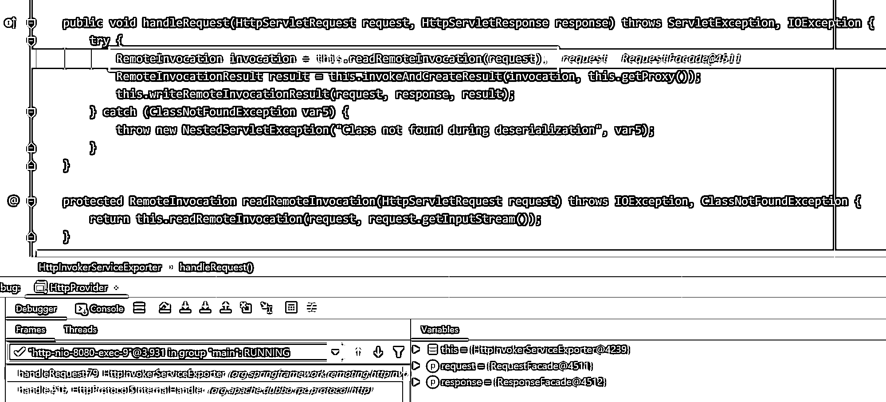
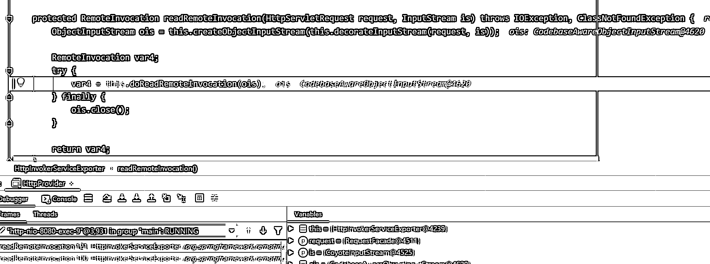
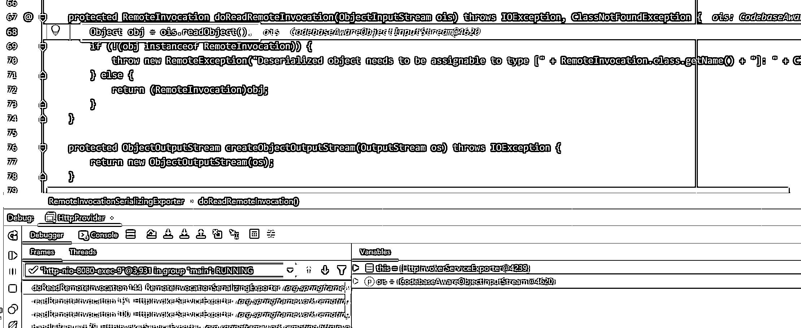

# Apache Dubbo 反序列化漏洞（CVE-2019-17564）复现分析 - v1ntlyn - 博客园

> 原文：[`www.cnblogs.com/v1ntlyn/p/13767814.html`](https://www.cnblogs.com/v1ntlyn/p/13767814.html)

## 漏洞描述

Apache Dubbo 是一款高性能 Java RPC 框架，核心功能是方便面向**接口**的**远程过程**调用，集群容错和负载均衡，以及服务自动注册与发现。

Apache Dubbo 支持多种协议，官方默认为 Dubbo 协议。当用户选择 http 协议进行通信时，Apache Dubbo 将接受来自消费者远程调用的 POST 请求并执行一个反序列化的操作。由于此步骤没有任何安全校验，因此可以造成反序列化执行任意代码。

漏洞影响范围：

*   2.7.0 <= Apache Dubbo <= 2.7.4
*   2.6.0 <= Apache Dubbo <= 2.6.7
*   Apache Dubbo = 2.5.x

## 环境搭建

复现环境：win10 + jdk1.8 + idea(搭建 dubbo) + zookeeper 3.4.10

*ZooKeeper*是一个分布式的，开放源码的分布式应用程序协调服务,主要是用来解决分布式应用中经常遇到的一些数据管理问题。

首先先下载 zookeeper 的压缩包：[`archive.apache.org/dist/zookeeper/zookeeper-3.4.10/zookeeper-3.4.10.tar.gz`](https://archive.apache.org/dist/zookeeper/zookeeper-3.4.10/zookeeper-3.4.10.tar.gz)

然后在解压后的根目录下新建两个文件夹：data 和 logs，后面配置要用到。

接着修改 conf 目录下的 zoo_sample.cfg 为 zoo.cfg，

并添加如下内容，分别为刚刚新建的 data 和 logs 目录路径



双击 bin 目录下的 zkServer.cmd，启动，zookeeper 会监听 2181 端口


zookeeper 配置好后，开始搭建 dubbo，这里以官方的 domo 为例：[`github.com/apache/dubbo-samples/tree/master/java/dubbo-samples-http`](https://github.com/apache/dubbo-samples/tree/master/java/dubbo-samples-http)

下载后修改 dubbo-samples-http 里面的 pom.xml

先修改版本为 2.7.3，然后添加依赖：

```
<dependency>
    <groupId>org.apache.commons</groupId>
    <artifactId>commons-collections4</artifactId>
    <version>4.0</version>
</dependency> 
```



然后导入 idea，maven 下载依赖构建项目即可。（如果下载时间特别长，可以考虑更换源，方法参考：[`www.cnblogs.com/zaqzzz/p/12443794.html`](https://www.cnblogs.com/zaqzzz/p/12443794.html))

最后启动 dubbo\samples\http\HttpProvider 服务，出现 dubbo service started 就说明搭建完成了。


## 复现分析

首先要先通过反序列化工具 ysoserial 生成 payload，保存到 calc.ser 文件

```
java -jar ysoserial-0.0.6-SNAPSHOT-all.jar CommonsCollections4 "calc" > calc.ser 
```

浏览器访问 http://192.168.1.101:8080/org.apache.dubbo.samples.http.api.DemoService 并 burp 抓包该请求，首先先修改为 post 类型，接着在 post 的内容里导入我们刚刚生成的 payload，不要直接复制，burp 右键 Paste from file 添加 payload



发包，成功弹出了计算器。



下面简单分析下该漏洞，从 idea 的报错调用栈可以看出，javax.servlet.http.HttpServlet.service 应该就是入口


查看 javax.servlet.http.HttpServlet.service，在有处理 request 请求的地方加个断点，如下


重新开启调试模式，burp 再次发送攻击请求，来到断点处


跟入来到 DispatcherServlet 的 service 方法，通过请求中的端口去获取服务信息，如果没有则返回 404 Service not found



下面继续跟入 handle 方法，由于我们传输的协议是 http，所以就进到了 HttpProtocol 类中对应的 handle 方法。



然后先判断请求类型是不是为 post，如果不是的话就直接返回 500。

确定请求类型为 post 后，根据请求的内容生成 HttpInvokerServiceExporter 对象，最后再调用其 handleRequest 方法，跟入查看



这里发现是通过 readRemoteInvocation 来处理我们的 request 请求，继续跟入


这里返回了 readRemoteInvocation 的结果，继续跟入



可以看到，这里先是获取了我们 request 请求的数据流，接着传入到了 doReadRemoteInvocation 方法，跟入查看



可以看到反序列化入口了，这里直接调用了 Readobject，整个攻击请求的处理流程基本清晰了，这个漏洞其实并不复杂，修复的话可以直接升级到 2.7.5 以上，或者关闭 http 协议，其他的思路的话还可以考虑用 jsonrpc 的处理，而不是通过**httpinvoker**，这样的话就没办法处理我们的 java 序列化字节流从而抛出异常。

## reference：

[`www.lmxspace.com/2020/02/16/Apache-Dubbo 反序列化漏洞（CVE-2019-17564）`](http://www.lmxspace.com/2020/02/16/Apache-Dubbo%E5%8F%8D%E5%BA%8F%E5%88%97%E5%8C%96%E6%BC%8F%E6%B4%9E%EF%BC%88CVE-2019-17564%EF%BC%89)