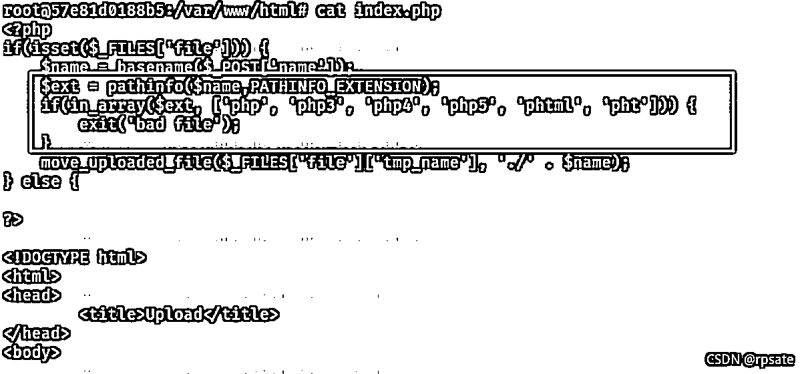
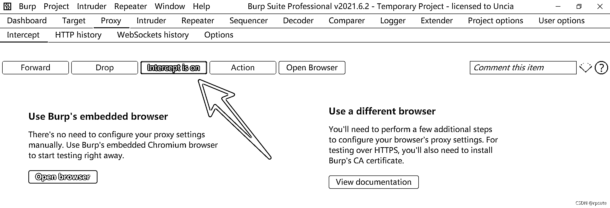
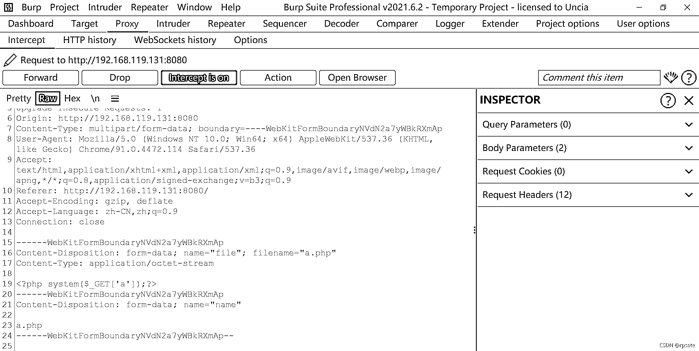
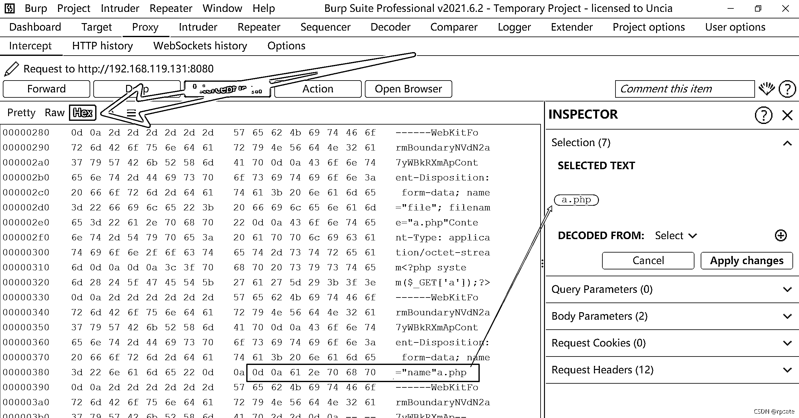

# Apache HTTPD 换行解析漏洞（CVE-2017-15715） 漏洞复现 - rpsate - 博客园

> 原文：[`www.cnblogs.com/masses0x1/p/15780874.html`](https://www.cnblogs.com/masses0x1/p/15780874.html)

## 前言

Apache 在 2.4.0-2.4.29 版本中存在一个解析漏洞。程序在解析 PHP 时，如果文件名最后有一个换行符`x0A`，apache 依然会将其当成 php 解析，但是在上传文件时可以成功的绕过黑名单。

> 如果上传文件的 php 程序是设置的白名单，那么这个漏洞将无法利用。

## 漏洞环境

该环境使用 vulhub 搭建，该漏洞路径为 `vulhub/httpd/CVE-2017-15715`。进入该漏洞路径后执行以下命令：

```
docker-compose up -d 
```

> -d 表示后台运行。
> 
> 注意：该命令必须在漏洞目录下执行，该命令是启动当前目录下的 docker 容器。
> 
> 如果不会搭建环境可以参考官方文档：[`vulhub.org/#/docs/`](https://vulhub.org/#/docs/)

## 原理分析

启动容器后执行以下命令查看容器 ID。

```
docker ps 
```


然后执行以下命令进入容器。

```
docker exec -it 容器 ID /bin/bash 
```

> exec 表示在容器中执行一个命令，该命令后加容器 ID 和要执行命令，上面执行的命令就是/bin/bash。
> -i 表示即使没有连接，也要保持 STDIN 打开，也就是一直监听命令的状态。
> -t 表示分配一个 tty 终端设备，加上这个参数就具有按 TAB 自动补全命令等等功能。
> 更多详细内容可以参考：[`blog.csdn.net/qq_40081976/article/details/84590119`](https://blog.csdn.net/qq_40081976/article/details/84590119)，docker exec 的使用-it 操作。

查看一下上传文件的 php 文件:

```
cat index.php 
```



该程序是采用黑名单的形式，如果文件后缀名不在名单内即可上传，所以 `a.php\x0A`不在黑名单列表中，可以上传。但是`x0A`是换行符，所以 apache 会直接忽略，将其当成 php 来执行。

## 漏洞复现

打开目标地址 `http://192.168.119.131:8080/`，选择一句话木马准备上传。


然后打开 burpsuite，开启数据监听。



点击网页中提交按钮，上传文件。此时 burpsuite 就会抓取提交的数据。



点击 `Hex`按钮，进入十六进制编辑页面，并找到文件名`a.php`的位置。



然后再文件名后插入`0A`，这个位置也就是在 `od oa`的前面。


然后点击 `Forward`按钮，这时候浏览器上什么也没有显示，但是此时文件已经上传成功了。接下来访问一句话木马`a.php%0a`，并通过参数 a 传递命令即可控制服务器。

```
http://192.168.119.131:8080/a.php%0A?a=id 
```


> 注意：该文件名是通过`$_POST['name']`获取的，所以会将 `x0A`保留。如果文件名使用的是`$_FILES['file']['name']`获取将会自动把末尾的`x0A`去掉，导致无法利用该漏洞。