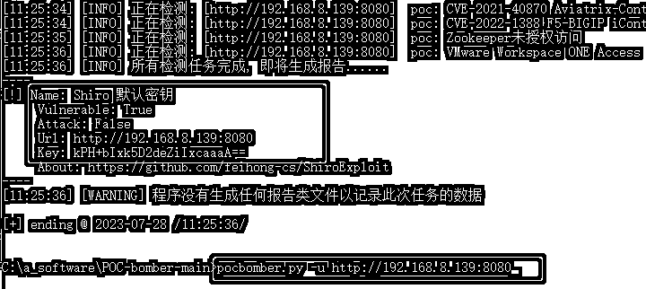
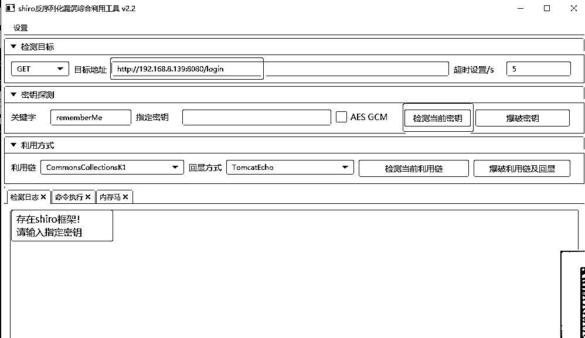
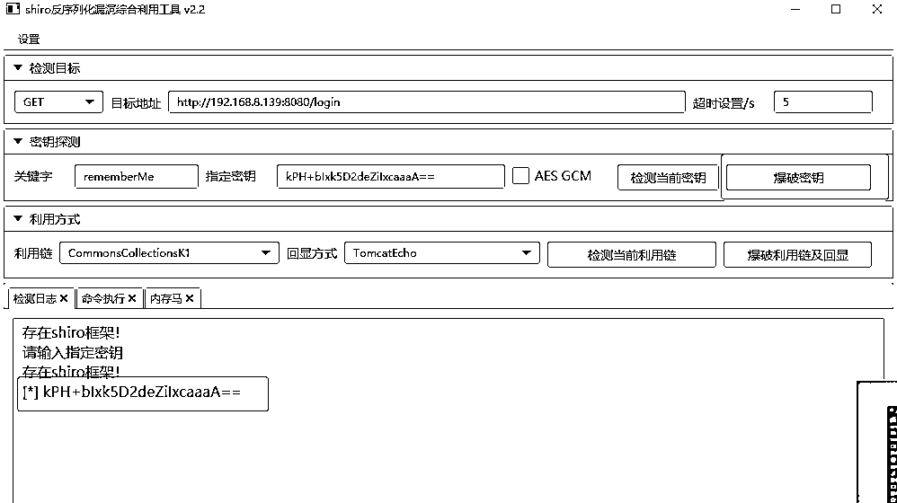
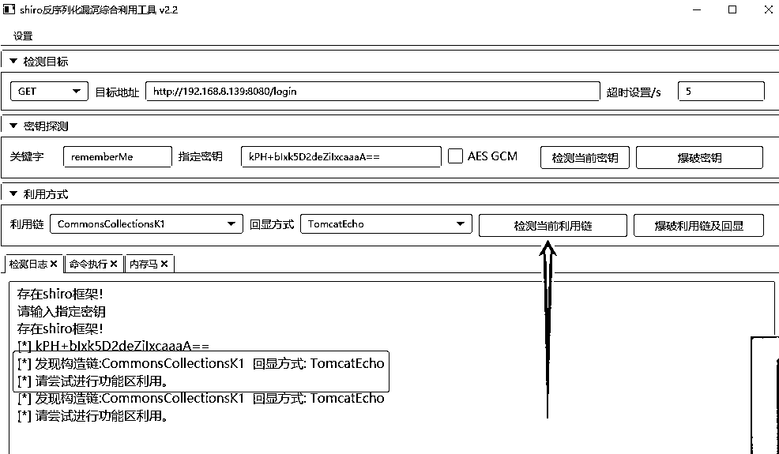
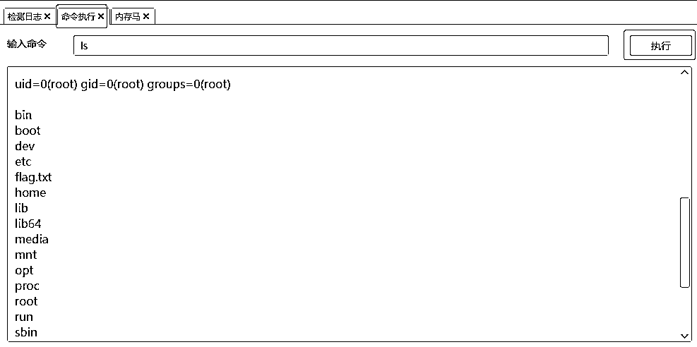

# Apache Shiro 反序列化漏洞（CVE-2016-4437） - dustfree - 博客园

> 原文：[`www.cnblogs.com/dustfree/p/17587261.html`](https://www.cnblogs.com/dustfree/p/17587261.html)

# 漏洞简介

Apache Shiro 是一款开源安全框架，提供身份验证、授权、密码学和会话管理。Shiro 框架直观、易用，同时也能提供健壮的安全性。

版本信息：Apache Shiro <= 1.2.4

漏洞名称：Apache Shiro 1.2.4 反序列化漏洞，即 shiro-550 反序列化漏洞。

漏洞形成原理：

```
1、检索 RememberMe cookie 的值
2、Base 64 解码
3、使用 AES 解密(加密密钥硬编码)
4、进行反序列化操作（未作过滤处理）
在调用反序列化时未进行任何过滤，导致可以触发远程代码执行漏洞。
```

# 漏洞复现

开启 vulhub 靶场环境，确保 shiro 正常运行

```
cd vulhub-master/shiro/CVE-2016-4437
docker-compose up -d
docker ps -a
docker logs 58a9  #58a9 替换成你的容器名称
```


启动 Poc-number.py 快速打点工具，输入命令进行检测

```
pocbomber.py -u http://192.168.8.139:8080
```


检测出 shiro 框架，并成功爆破 shiro 密钥



开启 shiro 综合利用工具


输入目标地址、指定密钥、点击 检测当前密钥



或者点击 爆破密钥，成功爆破密钥



点击 检测当前利用链



点击 命令执行，输入命令 id，输入命令 ls，成功输出结果



#手动检测：bp 抓包识别指纹——.py 脚本、dnslog 外带检测漏洞——利用过程 { 详细 }