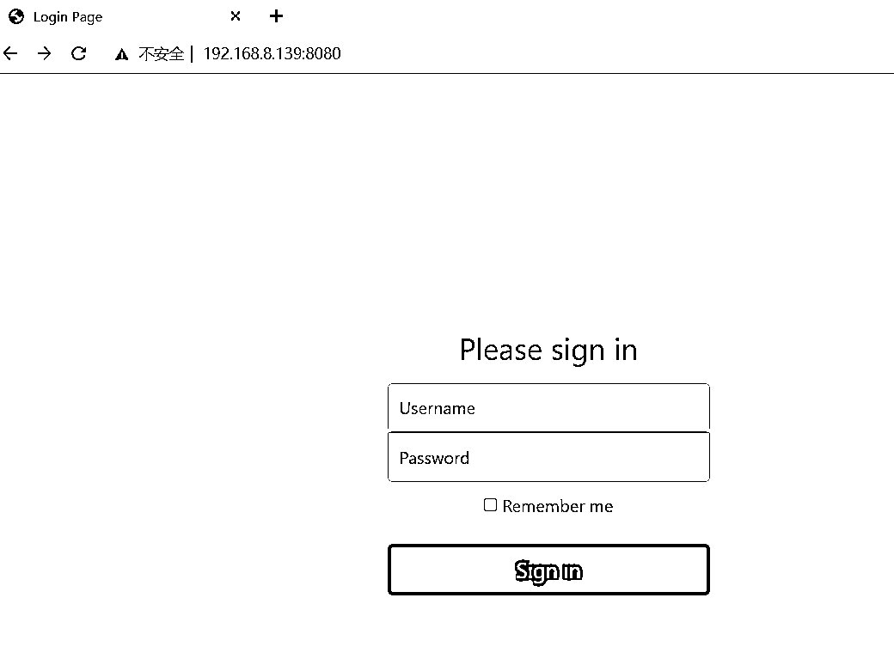
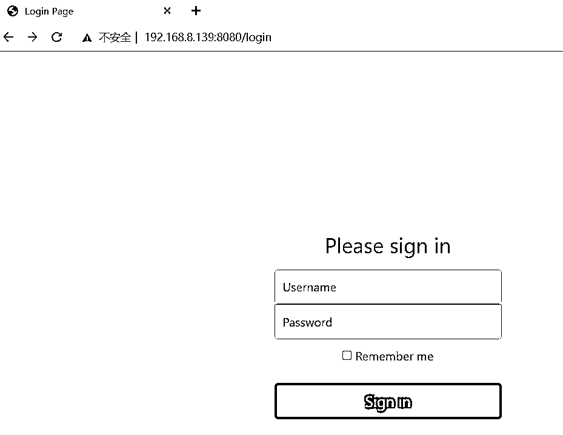
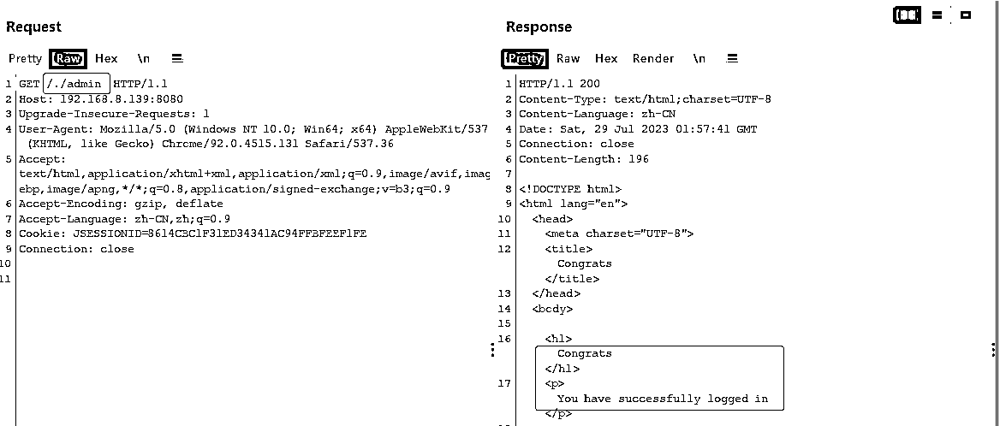
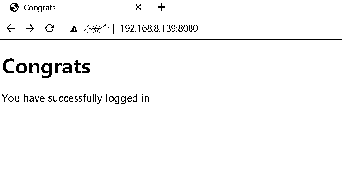

# Apache Shiro 认证绕过漏洞（CVE-2010-3863） - dustfree - 博客园

> 原文：[`www.cnblogs.com/dustfree/p/17589314.html`](https://www.cnblogs.com/dustfree/p/17589314.html)

# 漏洞简介

Apache Shiro 是一款开源安全框架，提供身份验证、授权、密码学和会话管理。Shiro 框架直观、易用，同时也能提供健壮的安全性。

在 Apache Shiro 1.1.0 以前的版本中，shiro 进行权限验证前未对 url 做标准化处理，攻击者可以构造/、//、/./、/…/ 等绕过权限验证。

# 漏洞复现

开启 vulhub 靶场环境，确保 shiro 正常运行

```
cd vulhub-master/shiro/CVE-2010-3863/
docker-compose up -d
docker ps -a
docker logs 655d #替换成你的容器名称
```


浏览器访问[`192.168.8.139:8080/`](http://192.168.8.139:8080/)

直接请求访问/admin，无法访问，将会被重定向到登录页面。抓包查看重定向过程：




构造恶意请求/./admin，即可绕过权限校验，访问到管理页面。抓包查看过程：





注：必须进行抓包、改包操作，方可复现成功。浏览器直接地址栏直接输入构造的恶意请求，无法成功。