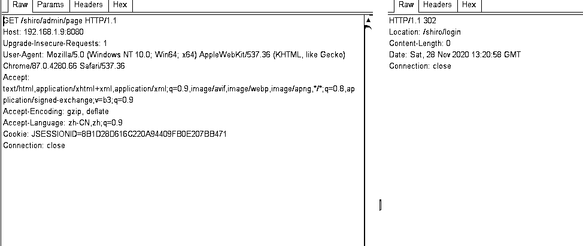
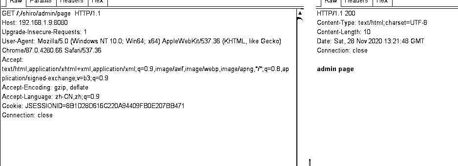

# Apache Shiro 身份验证绕过漏洞 复现(CVE-2020-11989) - 渗透测试中心 - 博客园

> 原文：[`www.cnblogs.com/backlion/p/14055275.html`](https://www.cnblogs.com/backlion/p/14055275.html)

### 0x00 漏洞简述

Apache Shiro 1.5.3 之前的版本中，当将 Apache Shiro 与 Spring 动态控制器一起使用时，精心编制的请求可能会导致绕过身份验证,如果直接访问 /shiro/admin/page ，会返回 302 跳转要求登录，访问 /;/shiro/admin/page , 就能直接绕过 Shiro 权限验证，访问到/admin 路由中的信息

### 0x01 漏洞影响

Apache Shiro 1.5.3 之前的版本 Spring 框架中只使用 Shiro 鉴权

### 0x02 环境搭建

1.下载项目到本地 https://github.com/l3yx/springboot-shiro 2.通过 idea 编辑器对其进行编译成 war 包，然后讲放入到 tomcat 下的 webapps 目录中，运行即可。这里已编译好 war 包：https://github.com/backlion/demo/blob/master/shiro.war

### 0x03 漏洞复现

1.权限配置如下，其中/admin 下的路由需要登录才能访问

```
@Bean  ShiroFilterFactoryBean  shiroFilterFactoryBean(){  ShiroFilterFactoryBean  bean  =  new  ShiroFilterFactoryBean();  bean.setSecurityManager(securityManager());  bean.setLoginUrl("/login");  bean.setSuccessUrl("/index");  bean.setUnauthorizedUrl("/unauthorizedurl");  Map<String,  String>  map  =  new  LinkedHashMap<>();  map.put("/doLogin",  "anon");  map.put("/admin/*",  "authc");  bean.setFilterChainDefinitionMap(map);  return  bean;  }  ---  @GetMapping("/admin/page")  public  String  admin()  {  return  "admin page";  }
```

2.maven 打包项目为 shiro.war，部署于 Tomcat。该漏洞成功利用存在下面两个条件

1.  应用不能部署根目录 root 目录下，也就是需要 context-path，server.servlet.context-path=/shiro，如果为根目录则 context-path 为空，就会被 CVE-2020-1957 的 patch 将 URL 格式化，值得注意的是若 Shiro 版本小于 1.5.2 的话那么该条件就不需要。
2.  Spring 控制器中没有另外的权限校验代码

3.如果直接访问 /shiro/admin/page ，会返回 302 跳转要求登录 4.但是访问 /;/shiro/admin/page , 就能直接绕过 Shiro 权限验证，访问到/admin 路由中的信息 

### 0x04 漏洞分析

由于 Shiro 的权限校验是通过判断 url 匹配来做的，如果能找到 Shiro 获取的 url 与 Web 框架处理 url 不一致的情况就能造成权限绕过。Shiro 中对于 URL 的获取及匹配在 org.apache.shiro.web.filter.mgt.PathMatchingFilterChainResolver#getChain 以访问/;/shiro/admin/page 举例，通过 getPathWithinApplication 函数得到的路径为/跟入该函数的处理逻辑 org.apache.shiro.web.util.WebUtils#getPathWithinApplication 可以看到 org.apache.shiro.web.util.WebUtils#getRequestUri 获取到的是/ 这里分别通过 getContextPath() getServletPath() getPathInfo()获取并拼接得到/;/test//admin/page，传入后 decodeAndCleanUriString 变成了/,org.apache.shiro.web.util.WebUtils#decodeAndCleanUriString 在 decodeAndCleanUriString，会根据 ascii 为 59 的字符也就是;进行 URL 的截断，所以最终返回了/回到最开始的/;/shiro/admin/page 请求，该 request 请求会进入 spring 中，spring 处理 url 函数如下 org.springframework.web.util.UrlPathHelper#getPathWithinServletMapping 在 getPathWithinApplication 处理下是能正确获取到 context-path 与路由，最终经过 getPathWithinServletMapping 函数格式化处理后，得到最终路径为/admin/page，所以我们可以正常访问到该页面因此总结来说就是当 URL 进入到 Tomcat 时，Tomcat 判断/;shiro/admin/page ,为 shiro 应用下的/admin/page 路由，进入到 Shiro 时被;截断被认作为/,再进入 Spring 时又被正确处理为 test 应用下的/admin/page 路由，最后导致 shiro 的权限绕过。 

### 0x05 漏洞修复

升级到最新版,官方已在新版本中修复了该漏洞

### 0x06 参考文献

[`l3yx.github.io/2020/06/30/Shiro-%E6%9D%83%E9%99%90%E7%BB%95%E8%BF%87%E6%BC%8F%E6%B4%9E-CVE-2020-11989/`](https://l3yx.github.io/2020/06/30/Shiro-%E6%9D%83%E9%99%90%E7%BB%95%E8%BF%87%E6%BC%8F%E6%B4%9E-CVE-2020-11989/)

[`xz.aliyun.com/t/8223`](https://xz.aliyun.com/t/8223)