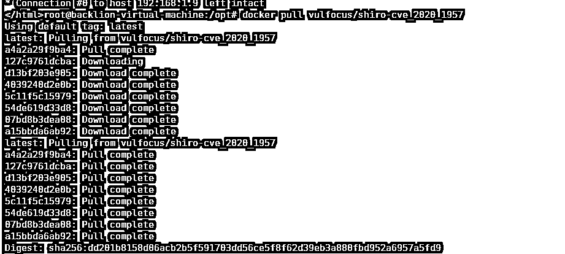
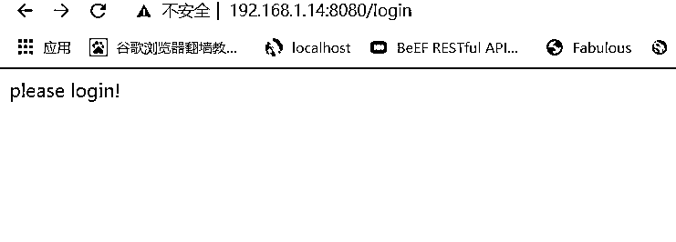
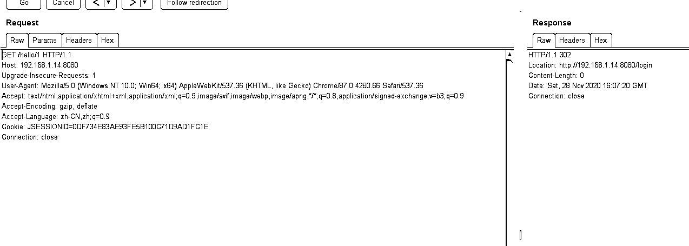
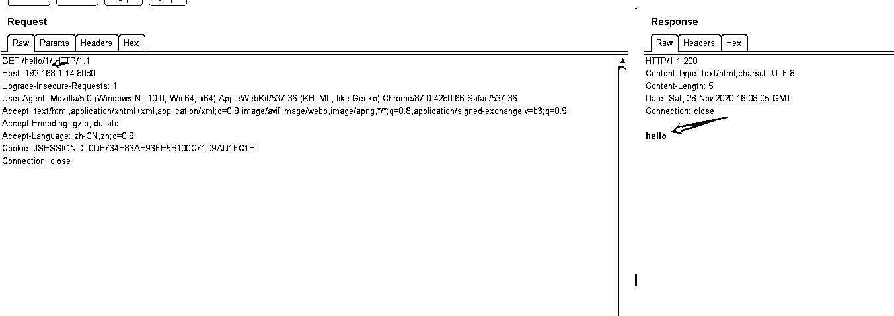
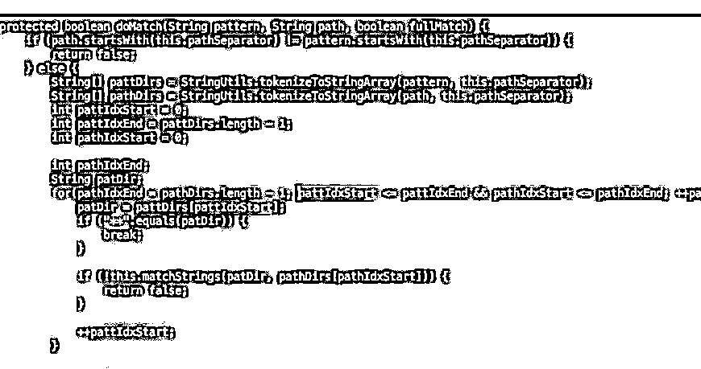

# Apache Shiro 身份验证绕过漏洞复现 (cve-2020-1957) - 渗透测试中心 - 博客园

> 原文：[`www.cnblogs.com/backlion/p/14055274.html`](https://www.cnblogs.com/backlion/p/14055274.html)

### 0x00 漏洞描述

Apache Shiro 1.5.2 之前版本中存在安全漏洞。攻击者可借助特制的请求利用该漏洞绕过身份验证。Shiro 框架通过拦截器功能来对用户访问权限进行控制，如 anon, authc 等拦截器。anon 为匿名拦截器，不需要登录即可访问；authc 为登录拦截器，需要登录才可以访问。Shiro 的 URL 路径表达式为 Ant 格式，路径通配符*表示匹配零个或多个字符串，/*可以匹配/hello，但是匹配不到/hello/，因为*通配符无法匹配路径。假设/hello 接口设置了 authc 拦截器，访问/hello 会进行权限判断，但如果访问的是/hello/，那么将无法正确匹配 URL，直接放行，进入到 spring 拦截器。spring 中的/hello 和/hello/形式的 URL 访问的资源是一样的，从而实现了权限绕过。 

### 0x01 漏洞影响

Apache Shiro < 1.5.2

### 0x02  Shiro 拦截器

Shiro 框架通过拦截器功能来实现对用户访问权限的控制和拦截。Shiro 中常见的拦截器有 anon,authc 等拦截器。1.anon 为匿名拦截器，不需要登录就能访问，一般用于静态资源,或者移动端接口
2.authc 为登录拦截器，需要登录认证才能访问的资源。用户可以在 Shiro.ini 编写匹配 URL 配置，将会拦截匹配的 URL，并执行响应的拦截器。从而实现对 URL 的访问控制，URL 路径表达式通常为 ANT 格式。如下配置，访问 /index.html 主页的时候，Shiro 将不会对其进行登录判断，anon 拦截器不需要登录就能进行访问。而对于/user/xiaoming 等 /user/xiaogang 等接口，authc 拦截器将会对其进行登录判断，有登录认证才能访问资源。[urls] /index.html = anon /user/** = authcShiro 的 URL 路径表达式为 Ant 格式，路径通配符支持 ? * ** 。?：匹配一个字符 *：匹配零个或多个字符串 **：匹配路径中的零个或多个路径其中*表示匹配零个或多个字符串，/*可以匹配/hello，但匹配不到/hello/因为*通配符无法匹配路径。假设/hello 接口设置了 authc 拦截器，访问/hello 将会被进行权限判断，如果请求的 URI 为/hello/呢，/*URL 路径表达式将无法正确匹配，放行。然后进入到 spring(Servlet)拦截器，spring 中/hello 形式和/hello/形式的 URL 访问的资源是一样的。 

### 0x03  环境搭建

下载 demo 代码 :https://github.com/lenve/javaboy-code-samples/tree/master/shiro/shiro-basic 导入 ideaShiro 版本 1.4.2    <dependency>        <groupId>org.apache.shiro</groupId>        <artifactId>shiro-web</artifactId>        <version>1.4.2</version>    </dependency>    <dependency>        <groupId>org.apache.shiro</groupId>        <artifactId>shiro-spring</artifactId>        <version>1.4.2</version>    </dependency>修改 ShiroConfig 配置文件，添加 authc 拦截器的拦截正则    @Bean    ShiroFilterFactoryBean shiroFilterFactoryBean() {        ShiroFilterFactoryBean bean = new ShiroFilterFactoryBean();        ...        ...        //map.put("/*", "authc");        map.put("/hello/*", "authc");         bean.setFilterChainDefinitionMap(map);        return bean;    }修改路由控制器方法@GetMapping("/hello/{currentPage}")    public String hello(@PathVariable Integer currentPage) {        return "hello";}通过 idea 进行编译，可获得 war 包这里通过 docker 快速搭建漏洞环境：docker pull vulfocus/shiro-cve_2020_1957docker imagesdocker run -d -p 8080:8080 -v /var/run/docker.sock:/var/run/docker.sock -e VUL_IP=192.168.1.14  29136b1d3c61-v /var/run/docker.sock:/var/run/docker.sock 为 docker 交互连接。-e DOCKER_URL 为 Docker 连接方式，默认通过 unix://var/run/docker.sock 进行连接，也可以通过 tcp://xxx.xxx.xxx.xxx:2375 进行连接（必须开放 2375 端口）。-v /vulfocus-api/db.sqlite3:db.sqlite3 映射数据库为本地文件。-e VUL_IP=xxx.xxx.xxx.xxx 为 Docker 服务器 IP ，不能为 127.0.0.1。  http://192.168.1.14:8080/login

### 0x04 漏洞复现

**1、Shiro1.4.2 版本绕过权限**访问/hello/1 接口，可以看到被 authc 拦截器拦截了，将会跳转到登录接口进行登录。访问/hello/1/，成功绕过 authc 拦截器，获取到了资源。**2、Shiro1.4.2 版本绕过漏洞分析**漏洞初始成因可以定位到 PathMatchingFilterChainResolver 的 getChain 函数下，该函数作用根据 URL 路径匹配中配置的 url 路径表达式来匹配输入的 URL，判断是否匹配拦截器，匹配成功将会返回响应的拦截器执行链，让 ShiroFither 执行权限操作的。其对于 URL 路径表达式和输入 URL 的匹配主要通过 pathMathches 函数进行匹配。pathMatches 函数其最终会调用 shiro.util.AntPathMatcher 类中 doMatch 的对于 ant 格式的 pathPattern 和 requestURI 进行匹配。//pathMatches:135, PathMatchingFilterChainResolver (org.apache.shiro.web.filter.mgt) protected boolean pathMatches(String pattern, String path) { PatternMatcher pathMatcher = this.getPathMatcher(); return pathMatcher.matches(pattern, path); }doMatch:109, AntPathMatcher (org.apache.shiro.util)，当 Shiro 的 Ant 格式的 pathPattern 中的的*通配符是不支持匹配路径的，所以/hello/* 不能成功匹配/hello/1/ ，也就不会触发 authc 拦截器进行权限拦截。从而成功绕过了 Shiro 拦截器，而后再进入到 spring 拦截器中，/hello/1/与/hello/1 能获取到相同的资源。**3、Shiro≤1.5.1 版本绕过**在 1.5.1 版本中，/hello/会直接跳转到登录绕过 payload，/fdsf;/../hello/1，成功绕过。或者其他 payload，xxxx/..;/hello/1，成功绕过（shiro 的 1.5.1 及其之前的版本）  其中以上处理过程：

1.  客户端请求 URL: /xxxx/..;/hello/1
2.  shrio 内部处理得到校验 URL 为 /xxxx/..,校验通过
3.  springboot 处理 /xxxx/..;/hello/1 , 最终请求 /hello, 成功访问了后台请求.

**4.Shiro≤1.5.1 版本漏洞分析**问题同样可以定位到 getChain 函数中对于 requestURI 的获取中，如下图所示，this.getPathWithinApplication(request)获取的 requestURI 为/fdsf ，而不是我们输入的/fdsf;/../hello/1，从而导致后面的 URI 路径模式匹配返回 False，从而再次绕过了 shiro 拦截器。getPathWithinApplication 函数中会调用 WebUtils (org.apache.shiro.web.util)中的 getRequestUri 函数获取 RequestUri。

```
public static String getRequestUri(HttpServletRequest request) {
        String uri = (String)request.getAttribute("javax.servlet.include.request_uri");
        if (uri == null) {
            uri = request.getRequestURI();
        }

        return normalize(decodeAndCleanUriString(request, uri));
    } 
```

RequestUri 函数中最终调用 decodeAndCleanUriString 函数对 URI 进行清洗。

```
private static String decodeAndCleanUriString(HttpServletRequest request, String uri) {
      uri = decodeRequestString(request, uri);
      int semicolonIndex = uri.indexOf(59);//获取;号的位置
      return semicolonIndex != -1 ? uri.substring(0, semicolonIndex) : uri;
  } 
```

如果 URI 中存在;号的话，则会删除其后面的所有字符。/fdsf;/../hello/1/最终也就变成了/fdsf。  **5.漏洞****总结**  在 web 容器中，Shiro 的拦截器是先与 spring(Servlet)执行，两者拦截器对于 URI 模式匹配的差异，导致 Shiro 拦截器的绕过，而 Shiro 对其进行了两次修复，其第一次在 shiro1.4.2 版本出现漏洞后为删除 requestURI 后面的/号进行 URL 路径匹配，算是简单的修复了添加/号绕过的方式，而后在 1.5.2 版本中通过 requestURI 自主拼接的方式修复了/fdsf;/../hello/1/等使用了;号方式的绕过

### 0x05  修复方案

1.升级 1.5.2 版本及以上在 shiro1.5.2 版本已加入的过滤器规则： @Test    void testGetRequestUriWithServlet() {        dotTestGetPathWithinApplicationFromRequest("/", "/servlet", "/foobar", "/servlet/foobar")        dotTestGetPathWithinApplicationFromRequest("", "/servlet", "/foobar", "/servlet/foobar")        dotTestGetPathWithinApplicationFromRequest("", "servlet", "/foobar", "/servlet/foobar")        dotTestGetPathWithinApplicationFromRequest("/", "servlet", "/foobar", "/servlet/foobar")        dotTestGetPathWithinApplicationFromRequest("//", "servlet", "/foobar", "/servlet/foobar")        dotTestGetPathWithinApplicationFromRequest("//", "//servlet", "//foobar", "/servlet/foobar")        dotTestGetPathWithinApplicationFromRequest("/context-path", "/servlet", "/foobar", "/servlet/foobar")        dotTestGetPathWithinApplicationFromRequest("//context-path", "//servlet", "//foobar", "/servlet/foobar")        dotTestGetPathWithinApplicationFromRequest("//context-path", "/servlet", "/../servlet/other", "/servlet/other")        dotTestGetPathWithinApplicationFromRequest("//context-path", "/asdf", "/../servlet/other", "/servlet/other")        dotTestGetPathWithinApplicationFromRequest("//context-path", "/asdf", ";/../servlet/other", "/asdf")        dotTestGetPathWithinApplicationFromRequest("/context%2525path", "/servlet", "/foobar", "/servlet/foobar")        dotTestGetPathWithinApplicationFromRequest("/c%6Fntext%20path", "/servlet", "/foobar", "/servlet/foobar")        dotTestGetPathWithinApplicationFromRequest("/context path", "/servlet", "/foobar", "/servlet/foobar")        dotTestGetPathWithinApplicationFromRequest("", null, null, "/")        dotTestGetPathWithinApplicationFromRequest("", "index.jsp", null, "/index.jsp")    } 2.尽量避免使用*通配符作为动态路由拦截器的 URL 路径表达式。

### 0x06  参考文献

[`www.zhihuifly.com/t/topic/2822`](https://www.zhihuifly.com/t/topic/2822)https://paper.seebug.org/1196/https://xz.aliyun.com/t/8281