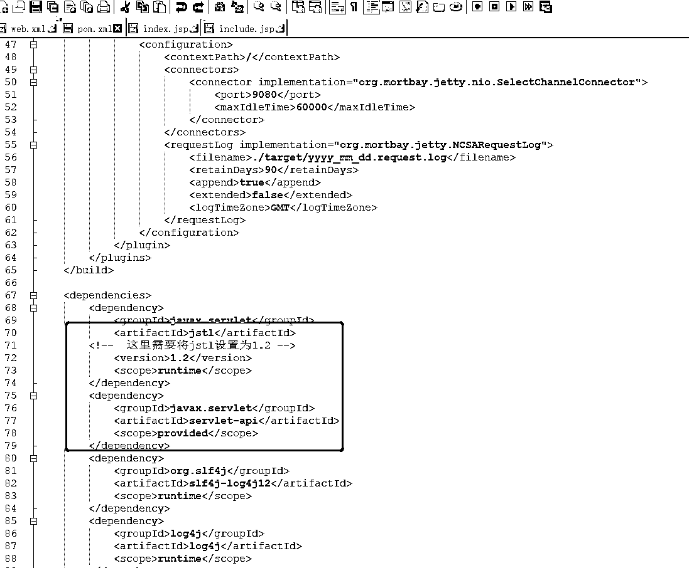
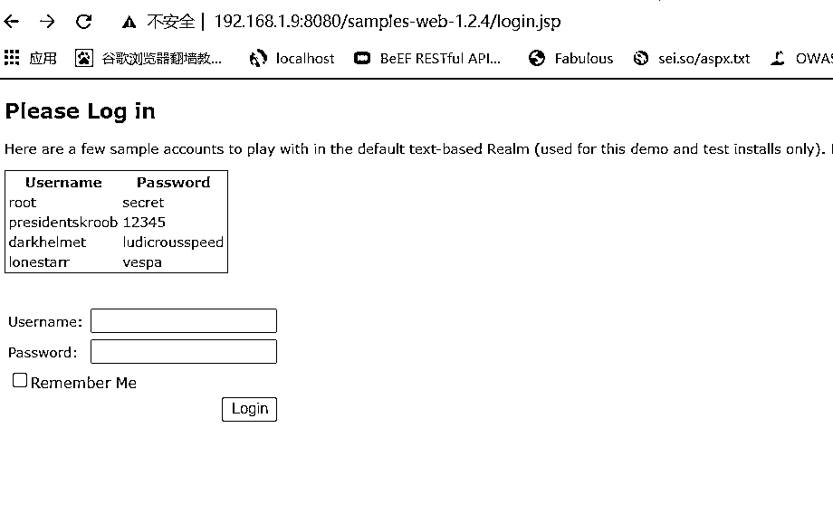
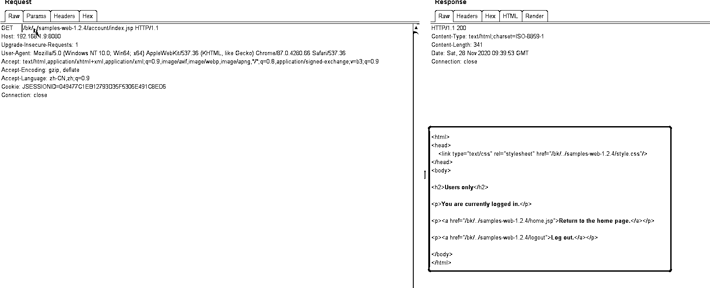
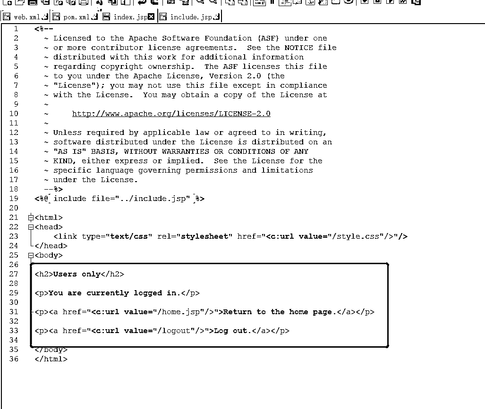
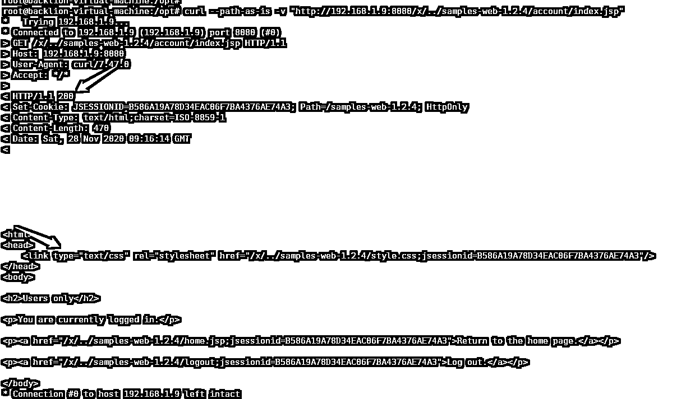

# Apache Shiro 身份验证绕过漏洞复现（CVE-2016-6802） - 渗透测试中心 - 博客园

> 原文：[`www.cnblogs.com/backlion/p/14055279.html`](https://www.cnblogs.com/backlion/p/14055279.html)

### 0x00 漏洞详情

shiro 在路径控制的时候，未能对传入的 url 编码进行 decode 解码，导致攻击者可以绕过过滤器，访问被过滤的路径。

### 0x01 漏洞影响

shrio <1.3.2

### 0x02 环境搭建

由于这个版本还没有 shiro-spring-boot-starter，只能从 GitHub 上获取项目进行测试，https://github.com/godzeo/shiro_1.2.4_sample/archive/master.zip。

接下来还需要在 samples/web/pom.xml 文件中，将 jstl 的版本指定为 1.2。

通过 idea 编辑器对其进行编译成 war 包，然后放到 tomcat 中 webapps 目录中运行。已编译好的 war 包：https://github.com/backlion/demo/blob/master/samples-web-1.2.4.war

### 0x03 漏洞复现

访问 http://192.168.1.9:8080/account/index.jsp 的时候，页面返回 403 或者 302t。因此可以确定 account 路径是属于被过滤路径。此时使用 burp 截断，然后在访问路径的前添加 /任意目录名/../，即可绕过认证权限进行访问。1.首先直接访问后台主页，然后直接 302 跳转2.如果在访问路径前加上/任意目录名/../，即可越权访问3.这里可以对其后台主页源码查看确实是和绕过后访问的页面内容是一致的。

### 0x04  漏洞分析

关于这个漏洞，网上公开的资料非常少，唯二能找到的有用的就是 GitHub 上的 commit 记录，以及 CVE 的描述信息。

*   GitHub commit 信息：https://github.com/apache/shiro/commit/b15ab927709ca18ea4a02538be01919a19ab65af
*   CVE 描述：https://cve.mitre.org/cgi-bin/cvename.cgi?name=CVE-2016-6802 根据 commit 信息，可以定位到缺陷是在 WebUtils.java 中的 getContextPath 方法。


CVE 描述如下：

Apache Shiro before 1.3.2 allows attackers to bypass intended servlet filters and gain access by leveraging use of a non-root servlet context path.

根据这个 CVE 描述以及 commit 信息，我们可以知道，漏洞是出现在 Non-ROOT ContextPath 的情况下，获取 ContextPath 时造成的，不过详细信息还无从得知。

既然是与 ContextPath 相关，所以部署样例项目的时候，需要部署到某个 ContextPath 下面，不能使用 ROOT。我们先在 getContextPath 函数的入口处 247 行打个断点，并且发送一个正常的需要登录才能访问的请求看一下这附近代码的处理逻辑；

```
curl -v "http://192.168.1.9:8080/samples-web-1.2.4/account/index.jsp"
```

```

```

断下来之后可以看到，这里就是取了 ContextPath，并无特殊操作，我们跟着 return 继续向下跟。如果不了解 ContextPath，建议先自行 Google 一下。 

跟到 org.apache.shiro.web.util.WebUtils#getPathWithinApplication 这个函数，可以发现，我们刚刚获取的 ContextPath 其实是为了计算出 RequestURI ，参考画线的两行代码； 

继续一直跟到了 org.apache.shiro.web.filter.mgt.PathMatchingFilterChainResolver#getChain 这个函数中，可以看到这里最终其实是获取了 RequestURI 的，这里稍微单步跟一下，不难发现 103 行附近的 for 循环，是用我们获取到 RequestURI 进行一个匹配处理，对匹配到情况执行相应的操作。
我们这里请求的是 account/index.jsp，刚好匹配到了 /account/** 这个模式。在配置文件 (shiro.ini) 中，/account/** 这个目录是需要登录后的用户才能访问的，猜测这里后续的操作则是校验当前用户是否已经登录，或者说是否有权限； 

这里直接 F9 放行，可以发现确实 302 跳转到了登录页面。这样一来，思路就清晰了，出问题的地方是 ContextPath，而 ContextPath 是用来生成 RequestURI 的，而 RequestURI 又是决定这个请求是否需要鉴权的。所以我们只需要构造出畸形的 ContextPath，使其生成出畸形的 RequestURI，就可以绕过 ApacheShiro 的鉴权机制了。

那么应当如何构造呢？根据 commit 的补丁代码，可以看到是是进行了解码和 normalize 操作，那肯定是因为有非 normal 的路径导致的，猜测只需要构造 /x/../ 这样的路径，让其取到错误的 ContextPath 即可。

重新断下来之后，可以看到 ContextPath 的值已经变成 /x/../sample_web_war 了，再向下跟一下，看看计算出的 RequestURI 是什么？经过 normalize 和解码之后，RequestURI 的值为 /sample_web_war/account/index.jsp。 

继续向下跟到刚刚看到过的匹配部分，不难看出现在的 RequestURI 已经无法正常匹配到 /account/** 这个模式了，也就不会进入校验是否登录的阶段，我们把这次请求放行之后看看是否正常。 

curl --path-as-is -v "http://192.168.1.9:8080/x/../samples-web-1.2.4/account/index.jsp"



成功的返回了需要登录之后才能看到的页面内容。主要还是因为对 ContextPath 和 RequestURI 处理不一致导致的。

### 0x05  参考文献

https://blog.csdn.net/qq_41832837/article/details/109064636#%E8%BF%9C%E7%A8%8B%E5%AE%89%E5%85%A8%E9%99%90%E5%88%B6%E7%BB%95%E8%BF%87%E6%BC%8F%E6%B4%9E%EF%BC%88CVE-2016-6802%EF%BC%89

http://ll29.cn/Apache%20Shiro/Apache%20Shiro%E8%BF%9C%E7%A8%8B%E5%AE%89%E5%85%A8%E9%99%90%E5%88%B6%E7%BB%95%E8%BF%87%E6%BC%8F%E6%B4%9E[CVE-2016-6802].html

https://lightless.me/archives/apache-shiro-analysis.html

https://github.com/godzeo/shiro_1.2.4_sample