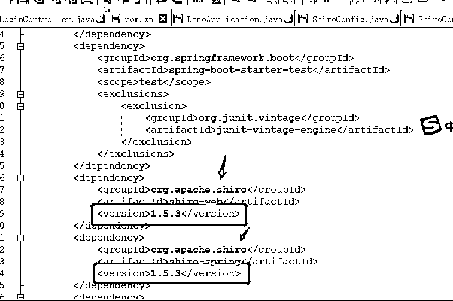
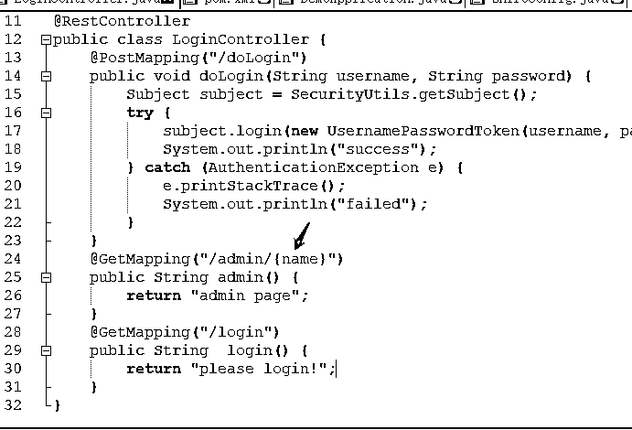
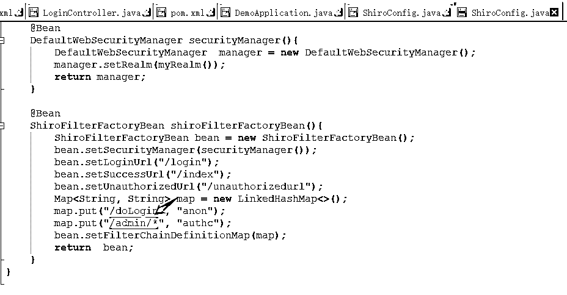
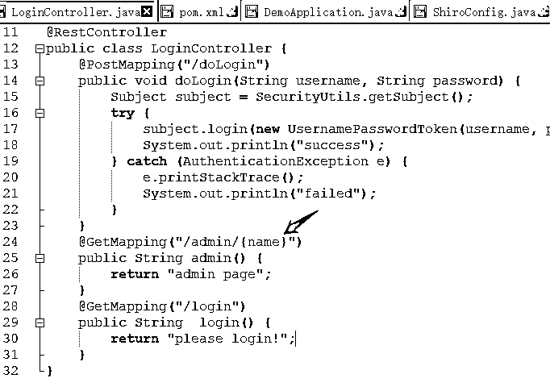
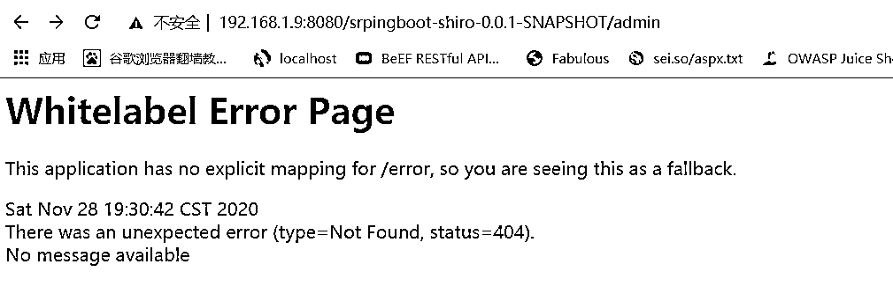
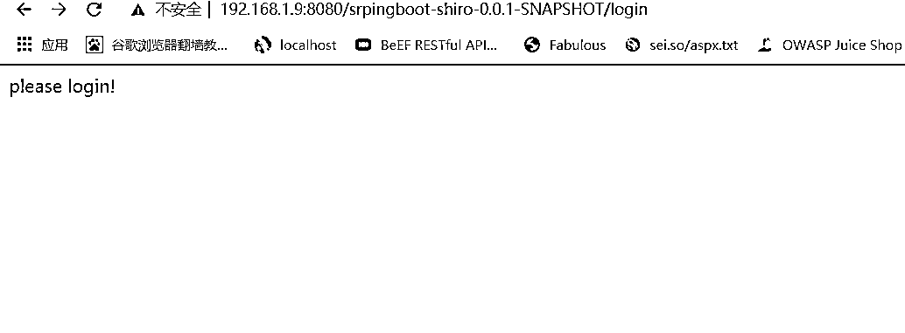

# Apache Shiro 身份验证绕过漏洞复现(CVE-2020-13933) - 渗透测试中心 - 博客园

> 原文：[`www.cnblogs.com/backlion/p/14055278.html`](https://www.cnblogs.com/backlion/p/14055278.html)

### 0x00 漏洞描述

Apache Shiro 是一个强大且易用的 Java 安全框架,执行身份验证、授权、密码和会话管理。之前 Apache Shiro 身份验证绕过漏洞 CVE-2020-11989 的修复补丁存在缺陷，在 1.5.3 及其之前的版本，由于 shiro 在处理 url 时与 spring 仍然存在差异，依然存在身份校验绕过漏洞由于处理身份验证请求时出错，远程攻击者可以发送特制的 HTTP 请求，绕过身份验证过程并获得对应用程序的未授权访问。

### 0x01 漏洞影响

Apache Shiro < 1.6.0

### 0x02 环境搭建

1.下载项目到本地 https://github.com/l3yx/springboot-shiro2.将 pom.xml 中的 1.5.2 替换为 1.5.3，将 src/main/java/org/syclover/srpingbootshiroLoginController 中的后台验证/admin/page 替换为/admin/{name}3.通过 IDEA 编辑器重新 build 并运行即可，已编译好的 war 包将其放到 tomcat 下的 webapps 目录下运行即可 https://github.com/backlion/demo/blob/master/srpingboot-shiro-0.0.1-SNAPSHOT.war

### 0x03 代码说明

1.ShiroConfig.java(pringboot-shiro-master\src\main\java\org\syclover\srpingbootshiro\ShiroConfig.java)权限配置， 当请求/admin/* 资源时， 302 跳转到登陆页面进行身份认证: 2.LoginController.java(springboot-shiro-master\src\main\java\org\syclover\srpingbootshiro\LoginController.java)/admin/{name}： 请求名为 name 的的资源（触发身份认证）: 

### 0x04 漏洞复现

1.不在请求路由中指定资源名称时，不触发身份验证，也无资源返回：http://192.168.1.9:8080/srpingboot-shiro-0.0.1-SNAPSHOT/admin2.在请求路由中指定资源名称时，302 跳转到身份验证页面：http://192.168.1.9:8080/srpingboot-shiro-0.0.1-SNAPSHOT/login3.构造特定 PoC 请求指定资源时，不触发身份验证，并绕过权限(通过%3b 绕过）http://192.168.1.9:8080/srpingboot-shiro-0.0.1-SNAPSHOT/admin/%3bpage

### 0x05 漏洞分析

可以看到出问题的地方在 org.apache.shiro.web.util.Webutils#getPathWithinApplication，shiro1.5.3 进行了修改，直接在这里下断点，然后 dubug 调试更新后利用 getServletPath 和 getPathInfo 进行获取 URL，然而真正的漏洞点并不在此可以看到拼合后 URL 是没问题的，再看经过 removeSemicolon 处理后可以看到只保留了/admin/*，可以在控制器里添加/admin/*路由进行测试，

```
@GetMapping("/admin*")
    public String admin2() {
        return "please login, admin";
    }
```

http://192.168.1.9:8080/srpingboot-shiro-0.0.1-SNAPSHOT/admin/*



访问是不会有权限验证的，当然，在后面添加上参数的话就需要权限了

跟进 removeSemicolon


同样，将;后的内容截断，包括;

再看下 Spring 如何处理


Spring 没有问题，获取到的是/admin/;page，然后将;page 作为一整个字符串，匹配/admin/{name}路由，导致越权

再看下是怎么处理 URL 的

```
`org.springframework.web.util.UrlPathHelper#decodeAndCleanUriString
```


```
removeSemicolonContent          # 去除;及以后部分
decodeRequestString                 # 进行 urldecode 解码
getSanitizedPath                        # 将//替换为/
```

而 shiro 则相反首先进行了 urldecode，接着才去去除，从而导致了漏洞**漏洞 DEBUG 位置:**shiro-web-1.5.3.jar

```
// org.apache.shiro.web.util.WebUtils.java  // line 111  public  static  String getPathWithinApplication(HttpServletRequest request) { return normalize(removeSemicolon(getServletPath(request) + getPathInfo(request)));
}
```

pring-web-5.2.5.RELEASE.jar

```
// org.springframework.web.util.UrlPathHelper.java  // line 459  private  String decodeAndCleanUriString(HttpServletRequest request, String uri) {
    uri = removeSemicolonContent(uri);
    uri = decodeRequestString(request, uri);
    uri = getSanitizedPath(uri); return uri;
}
```

### 0x06 漏洞修复

```
目前官方已发布漏洞修复版本，更新 Apache Shiro >= 1.6.0 
```

### 0x07 参考文献

```
https://github.com/lyy289065406/CVE-2020-13933
```

```
https://www.cnblogs.com/ph4nt0mer/p/13535999.html
```

```
https://xz.aliyun.com/t/8223
```