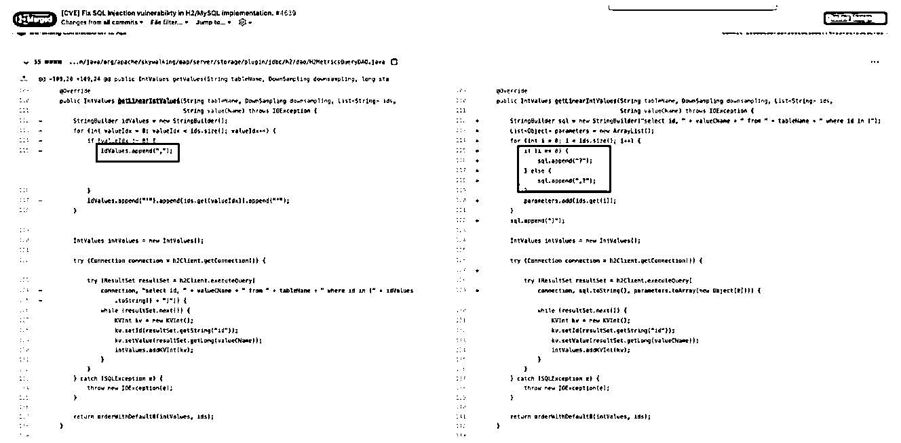
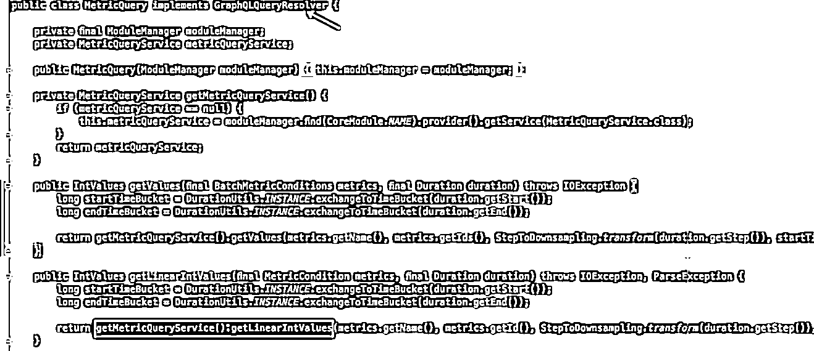
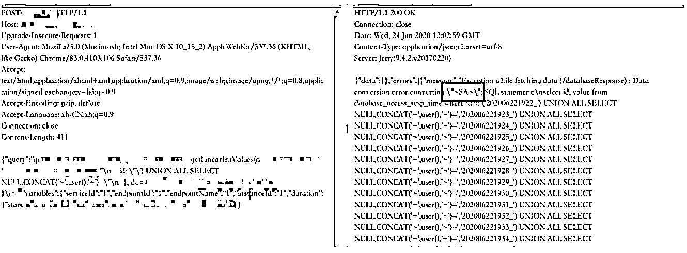
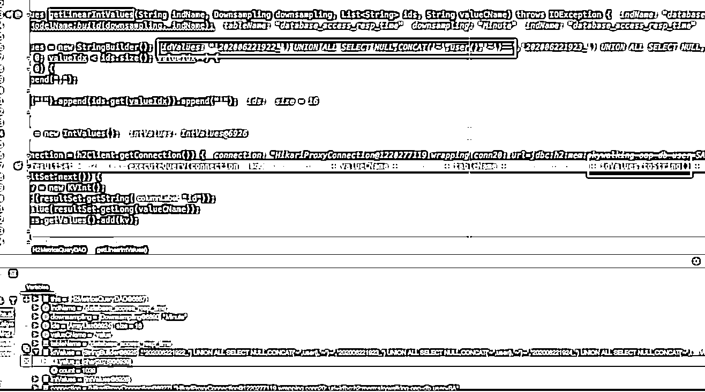

# Apache SkyWalking SQL 注入漏洞复现分析 (CVE-2020-9483) - luzhouxiaoshuai - 博客园

> 原文：[`www.cnblogs.com/kebibuluan/p/14103339.html`](https://www.cnblogs.com/kebibuluan/p/14103339.html)

转载自：https://anquan.baidu.com/article/1097

## 1、前言

Apache SkyWalking 是一款开源的应用性能监控系统，包括指标监控，分布式追踪，分布式系统性能诊断等。近日，百度云安全团队监测到国内某厂商发布了 Apache SkyWalking SQL 注入漏洞的风险通告，漏洞编号为 CVE-2020-9483。当 SkyWalking 使用 H2、MySQL 或者 TiDB 作为存储方案时，攻击者可通过默认未授权的 GraphQL 接口构造恶意请求，从而获取敏感数据。本文主要由 github 上的漏洞补丁分析而来，若有不正确的地方还请及时指正。

## 2、调试环境搭建

漏洞影响 6.0.0-6.6.0、7.0.0 版本，根据 github 上项目文档，直接利用 IDEA 调试需要先进行编译。本文为了简单使用远程调试的方式，在官网下载编译好的 6.5.0 版本

(https://www.apache.org/dyn/closer.cgi/skywalking/6.5.0/apache-skywalking-apm-6.5.0.tar.gz)，

编辑 oapServ ice.sh 加入如下调试命令并运行。

下载 6.5.0 源码

 (https://www.apache.org/dyn/closer.cgi/skywalking/6.5.0/apache-skywalking -apm-6.5.0-src.tgz)

导入 IDEA，添加 Remote Configuration，并设置 module classpath 为 oap-server。至此，远程调试环境搭建完成。

## 3、漏洞分析

由于 openwall 上对该漏洞描述很简单，我们还是到 github 上寻找最近的 issue。经过寻找我们发现了下面的 pull request

(https://github.com/apache/skywalking/pull/4639/commits /2b6aae3b733f9dbeae1d6eff4f1975c723e1e7d1)，

作者为 wu-sheng 和 openwall 上漏洞作者相印证，基本确定该处文件修改为漏洞成因。

修改涉及 getLinearIntValues、getMultipleLinearIntValues、getThermodynamic 等多个方法但修复手法类似，本文以 getLinearIntValues 为例进行分析。

可以看到 ids 参数由原先的直接拼接 sql 改为利用”?”进行占位预编译，这是典型的 SQL 注入修复方法。我们向上搜索 getLinearIntValues 方法在哪里调用，

找到了 org/apache/skywalking/oap/server/core/query/MetricQueryService.java 的 getLinearIntValues 方法。

继续向上追踪 getLinearIntValues，在 org/apache/skywalking/oap/query/graphql/resolver /MetricQuery.java 有了发现，并且 MetricQuery 类实现了 GraphQLQueryResolver 接口。

查询文档可知，支持 GraphQL 的查询服务要实现 GraphQLQueryResolver 接口，该接口仅仅是一个声明接口，没有任何方法。同时，在 schema 配置文件 metric.graphqls 中，我们发现 getLinearIntValues 方法的查询配置。

对 GraphQL 语法不熟悉的师傅可以通过如下例子进行熟悉:

HeroNameAndFriends 是操作名称，可用可不用，方便回溯查询记录。

$episode 声明一个变量，它的类型是 Episode，默认值为 JEDI。$withFriends 同理。变量在后面通过 JSON 传递值。

firsthero 是别名。为了避免冲突，可以取别名。

hero 后面的(episode: $episode)表示参数，可以限定查询的条件，参数的值可以为常量。

...on Droid 和...on Human 在整个查询中，我们查询的主题是 hero（主角），而根据 Query 定义，hero 返回的值由 getHero 函数和传入参数 episode 决定，该函数返回一个对象，对象的 type 可能是 Human 或者 Droid。这部分语法就是根据查询返回对象的不同类型而输出不同的结果。

通过上述知识我们可以构造如下请求，通过 Union 注入获取当前用户。

通过 Debug 发现 ids 参数引入恶意语句直接拼接到 SQL 语句中。同样的，漏洞不仅仅只是存在 getLinearIntValues 方法，有多个方法可被利用，并且由于 GraphQL 接口默认是未授权的，漏洞危害较大建议用户及时修复。

## 4、安全产品解决方案

百度安全智能一体化产品已支持 CVE-2020-9483 检测和拦截，有需要的用户可以访问 anquan.baidu.com 联系我们。

参考链接：

https://github.com/apache/skywalking/commit/4ce2e9e87398efcee4b646af1143f4dc2ae10dc7

https://www.openwall.com/lists/oss-security/2020/06/15/1