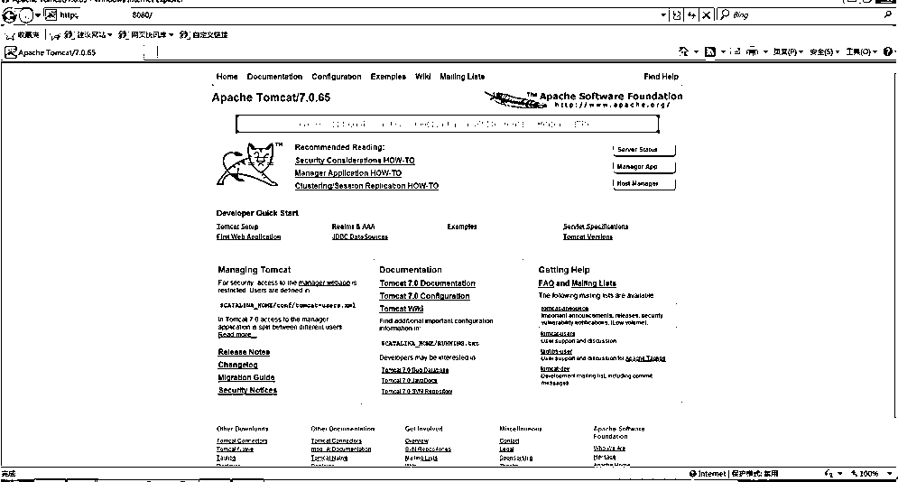

# Apache tomcat 上传漏洞（CVE-2017-12615） - 终落 - 博客园

> 原文：[`www.cnblogs.com/twlr/p/12989985.html`](https://www.cnblogs.com/twlr/p/12989985.html)

## Apache tomcat 上传漏洞

### 0x00 漏洞简述

　　Windows 上的 Apache Tomcat 如果开启 PUT 方法(默认关闭)，则存在此漏洞，攻击者可以利用该漏洞上传 JSP 文件，从而导致远程代码执行。

### 0x01 漏洞分析

　　因为漏洞需要开启 put 方法，默认情况下开启 readonly 是拒绝 put 方法的，所以我们要关闭 readonly 在执行上传漏洞

　　readonly 存在于/conf/web.xml 中，打开 web.xml 可发现 readonly 处于 true 就会 拒绝 put 方法的使用

　　

### 0x02 漏洞复现

 　　我们需要使 readonly=false，在源码 114 行添加：

```
    <init-param>
        <param-name>readonly</param-name>
        <param-value>false</param-value>
    </init-param>
```

　　然后访问 tomcat：

　　

 　　通过 burp 抓包，修改数据包，进行上传；

　　通过 Tomcat 的 conf/web.xml 配置，可知当后缀为.jsp 或者.jspx 的时候，铜鼓哦 JspSevlet 处理请求；而 DefaultServlet 存在漏洞，他处理静态资源，所以我们需要绕过这个限制，在文件名后面添加空格即可。

　　

 　　访问 url：

　　

 　　上传成功！

### 0x03 修复建议

　　1、禁用 put 方法

　　2、更新官方补丁