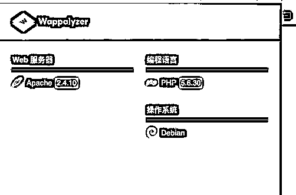
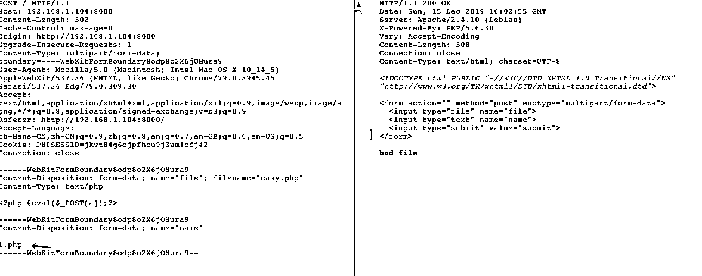
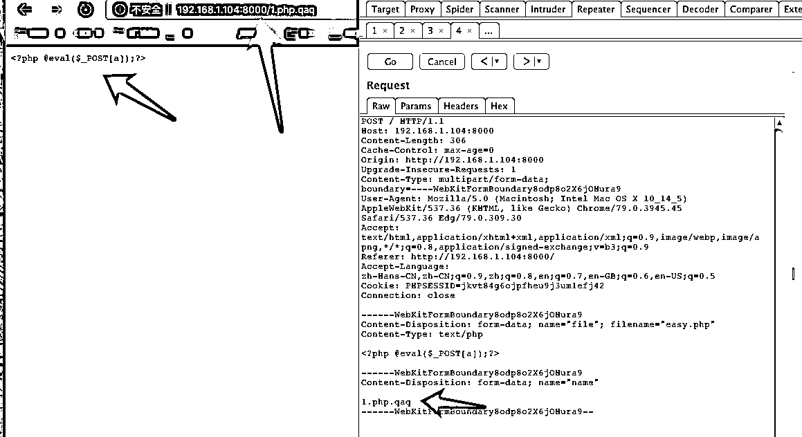
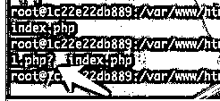

# Apache 解析漏洞复现(CVE-2017-15715),可以绕过黑名单 - Zahad003 - 博客园

> 原文：[`www.cnblogs.com/Mikasa-Ackerman/p/Apache-jie-xi-lou-dong-fu-xian-CVE201715715-ke-yi-.html`](https://www.cnblogs.com/Mikasa-Ackerman/p/Apache-jie-xi-lou-dong-fu-xian-CVE201715715-ke-yi-.html)

照着 P 神的文章准备复现一下(总结一下经验)

## 环境的安装

这里面直接使用的 vulhub 里面的环境来进行安装的(为了方便吗)

基础环境如下



实际上 Apache 版本在`2.4.0~2.4.29`即可

index.php 文件内容

```
<!DOCTYPE html PUBLIC "-//W3C//DTD XHTML 1.0 Transitional//EN" "http://www.w3.org/TR/xhtml1/DTD/xhtml1-transitional.dtd">

<form action="" method="post" enctype="multipart/form-data">
  <input type="file" name="file">
  <input type="text" name="name">
  <input type="submit" value="submit">
</form>

<?php
if(isset($_FILES['file'])) {
    $name = basename($_POST['name']);
    $ext = pathinfo($name,PATHINFO_EXTENSION);
    if(in_array($ext, ['php', 'php3', 'php4', 'php5', 'phtml', 'pht'])) {
        exit('bad file');
    }
    move_uploaded_file($_FILES['file']['tmp_name'], './' . $name);
}?>
</body> 
```

可以看到进行了黑名单处理



正常的 php 后缀会被拦截



尝试上传未知的后缀名,但是不能解析(apache 老的解析漏洞不存在)



利用 burp 的十六进制功能来插入 oa(其实也就是换行符,因为\n 的十六进制就是 0a)



明显的多个换行



在服务器上生成了对于的文件

访问[`ip:port/xxxx.php%0a 即可 Getshell`](http://ip:port/xxxx.php%0a%E5%8D%B3%E5%8F%AFGetshell)

## 漏洞原理

其实就是正则的一个坑,在默认的 Apache 的配置里面,判断是否解析为 php 文件是使用正则来匹配的`(php|php4|phtml)$`,而这个\(符号不仅仅是可以匹配行尾,还可以匹配一个换行(因此我们上传的带有换行的文件就会被解析,但是\)_FILES['xxx']['name']会默认的将换行给去掉,因此就显得有些鸡肋了,当然 P 神也说了,$这个思想是值得学习的)

## 后记

这里面特地的使用 POST 发送用户名(因为使用$_FILES['xxx']['name']会将我们添加的换行给去掉)