# Atlassian-bitbucket RCE (CVE-2022-43781) 漏洞分析记录 - magic_zero - 博客园

> 原文：[`www.cnblogs.com/magic-zero/p/16926491.html`](https://www.cnblogs.com/magic-zero/p/16926491.html)

## 前言

距离上次写博客转眼已过去快三年，“空白”的这三年中也曾遇到很多有趣可成文的东西，但是因各种原因未能在此畅快抒怀。而在忙中偷闲的时候，也曾反省自己，以免迷失。回想最初入行安全的时候，全因一本早期的黑客杂志而对漏洞研究有了独特的热情，再后来在 Wooyun 看过前辈们精彩的漏洞之后更加坚定的将漏洞研究作为自己未来努力的方向。但是在入行 5,6 年之后回头来看，却也常因外部嘈杂的声音淹没自己内心真实的想法，慢慢于繁重、枯燥的工作中磨灭了自己。深夜辗转之时，不免在难过之余暗自唏嘘。《周易》有卦，外险内动名之为屯，如何把握未来的路，或许只能先做好当下了罢。

## 环境搭建

[官方仓库](https://hub.docker.com/r/atlassian/bitbucket-server/tags)维护了各种版本的 Bitbicket，我们根据[漏洞描述](https://confluence.atlassian.com/bitbucketserver/bitbucket-server-and-data-center-security-advisory-2022-11-16-1180141667.html)选择一个可以触发漏洞的版本即可。

然后根据镜像启动一个容器即可:
`docker run --name="bitbucket" -d -p 7990:7990 -p 7999:7999 atlassian/bitbucket-server:8.0.4-ubuntu-jdk11`

## 补丁对比

这次漏洞的更新并没有直接给出一个类似之前 Confluence 的 bash 脚本，因此给漏洞位置的确定带来了一定的困难。我本地选择了 8.0.4 和 8.0.5 的版本进行比对，得到的结果如下图：

其中 licenses 目录忽略，osgi-framework-bundles 目录为 osgi 的 bundle 所在目录，打开可以看到对比结果：

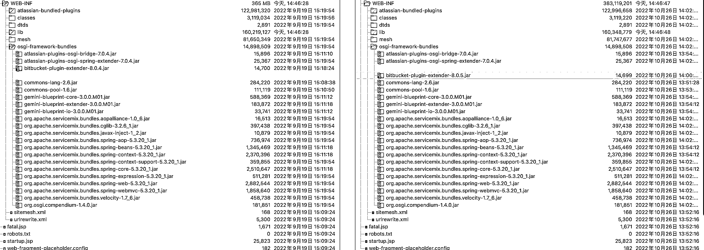

大小相差只有 1 字节，排除。接着是 atlassian-bundled-plugins 目录为插件目录，根据大小和 jar 包的名称过一圈，最终锁定为 app/WEB-INF/lib/bitbucket-process-8.0.x.jar：

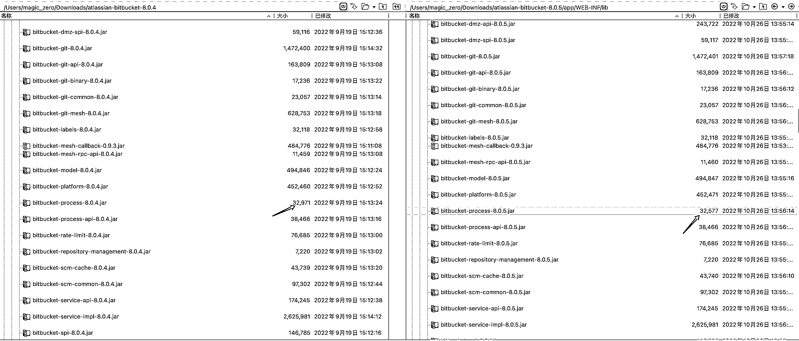

然后 diff 对比一下：

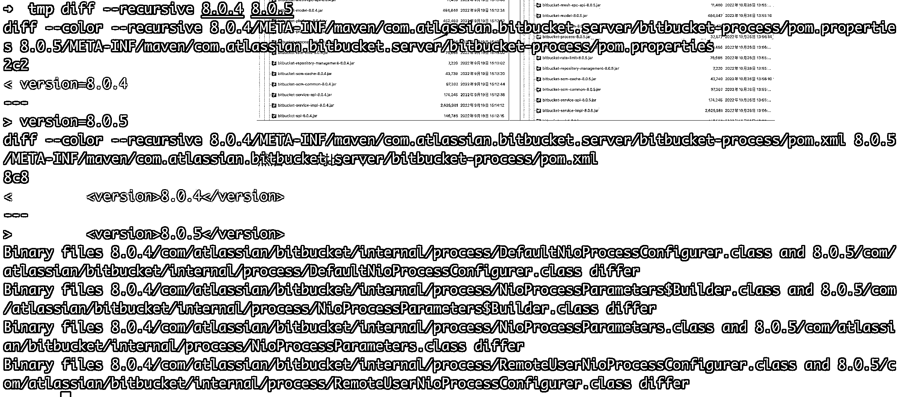

然后使用 Idea 的对比工具查看：

可以看到在 8.0.5 的版本新增了 environmentPut 和 environmentPutIfAbsent 两个函数，其中核心的判断逻辑是对传入值是否为 0x00 进行了检查，并且在`com.atlassian.bitbucket.internal.process.RemoteUserNioProcessConfigurer`中在将用户名放入环境变量时使用 environmentPut 代替了原先直接 put 的操作（代码上边为 8.0.5，下边为 8.0.4）：

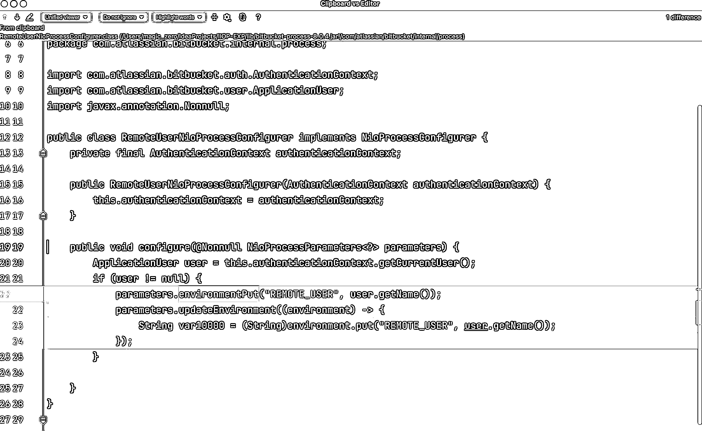

而漏洞的描述信息说是由用户控制用户名从而控制环境变量导致命令注入，至此推断基本吻合：

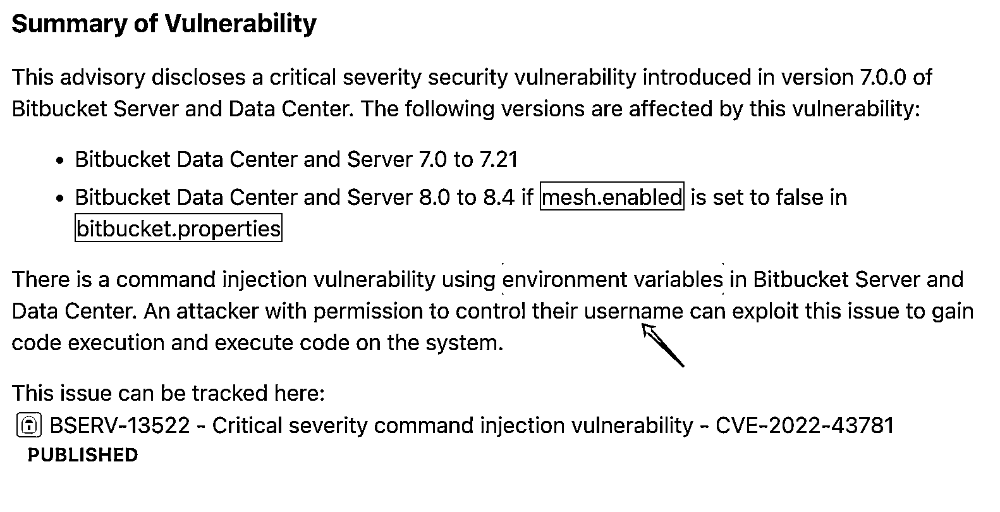

## 漏洞触发

搞清楚漏洞原理之后，开始寻找能够触发命令执行的 Git 环境变量，搜索到了[Git 官方的文档](https://git-scm.com/book/zh/v2/Git-%25E5%2586%2585%25E9%2583%25A8%25E5%258E%259F%25E7%2590%2586-%25E7%258E%25AF%25E5%25A2%2583%25E5%258F%2598%25E9%2587%258F)：

但是该命令不支持命令行参数，文档中也说如果需要支持参数，最好自己去封装一个脚本，然后我开始看 Git 的详细手册：

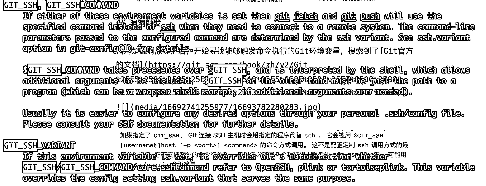

其中 GIT_SSH_COMMAND 是支持参数的！

然后开始研究能够触发漏洞的路由，根据 NioCommand 在网络上搜索找到了这样的一个报错堆栈：

找到 RepositoryController 之后，经过几轮调试发现：

1.  注册用户必须有仓库的访问权限，否则没办法触发 Git 相关的操作
2.  注册用户需要拥有创建或者访问仓库的权限

因此我为了调试本漏洞，首先开启注册功能，正如官方的缓解措施中告诉我们要关闭注册的那样，我们先将它打开 ^_

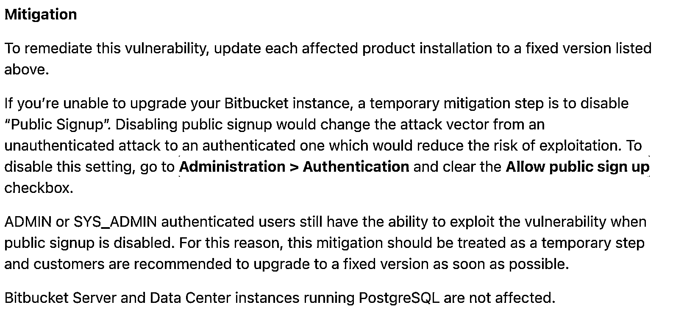

注册用户，使用 burp 修改空格为 NULL 空字符：

发包之后注册成功，登录的时候也要把这个字符修改掉，发包之后断点命中(com.zaxxer.nuprocess.linux.LinuxProcess#toEnvironmentBlock)：

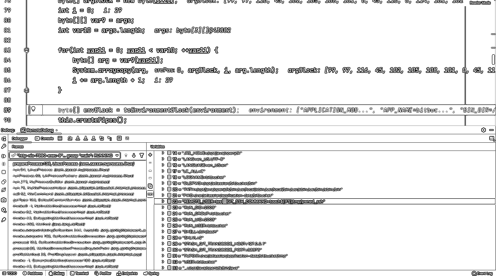

跟进 toEnvironmentBlock 这个函数：

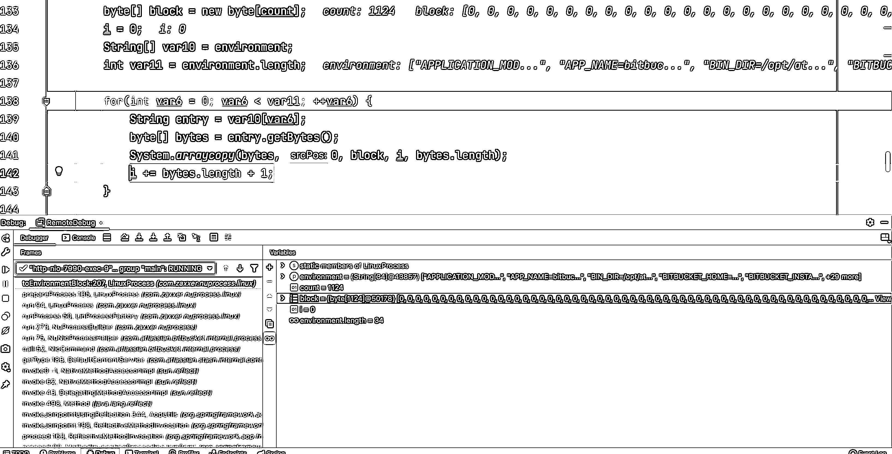

这里有两个需要重点关注，也是这个漏洞能利用成功的关键：

1.  环境变量初始化的时候使用了 byte 数组，数组初始值全为 0，从调试窗口可以看到
2.  每次复制一个数据，都会跳过一个位置将 0 字节(NULL)放到该值的末尾。这个从 for 循环最后一行可以体现出来

接着我让循环走两轮来证明以上的分析：

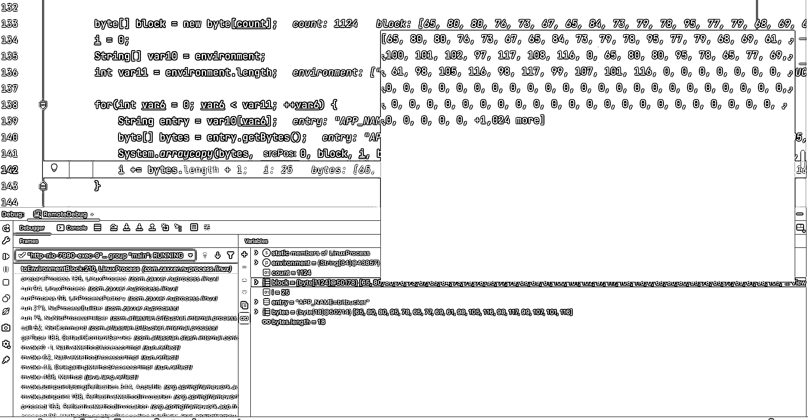

可以看到两轮复制之后数据中间明显有一个空字节。这样我们创建的 用户名+NULL+环境变量，就很自然会注入一个新的环境变量：

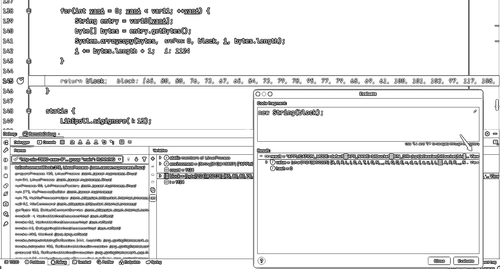

将字节数组转化为字符串后，放到文本工具中将<0x00>替换为换行符方便查看：

但是执行过后并没有在目标/tmp/创建文件。因为触发这个命令执行的必要条件是 Git 连接 SSH 主机，而在 Bitbucket 中却很难找寻到这样的场景。

正当我搜索枯肠且感觉距离真相不远的时候，朋友直接丢来了[一篇文章](https://petrusviet.medium.com/cve-2022-43781-32bc29de8960)，顿时兴趣全无(╥╯^╰╥)，虽然这篇文章中的越南文字我不认识，但是看到了关键性的 GIT_EXTERNAL_DIFF。manual 手册的说明如下：

大意是当设置了该环境变量，git diff 的时候将会调用该程序。要比 GIT_SSH_COMMADN 触发条件要容易得多了。

## 完整复现步骤

1.  注册一个用户名为 字符串+NULL+GIT_EXTERNAL_DIFF=命令 的用户

2.  访问任何一个 public 的仓库

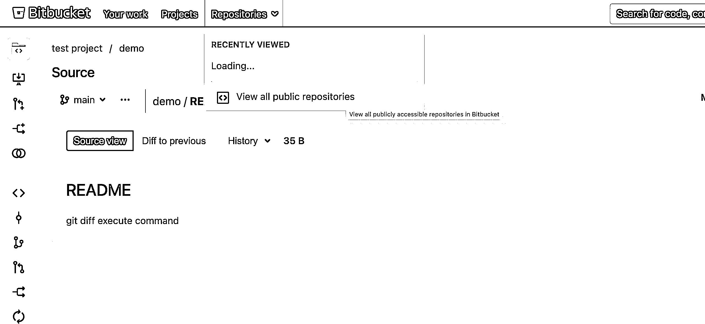

3.  访问 Commit 记录有变更过的文件触发 git diff 命令

4.  命令执行成功

