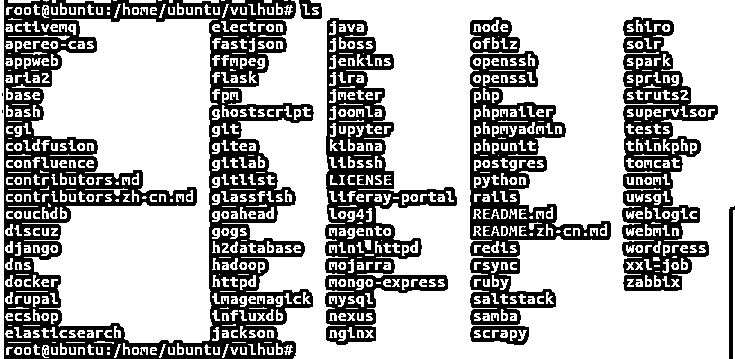
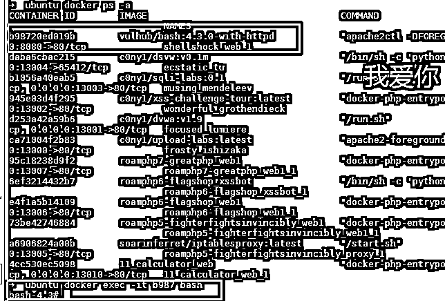
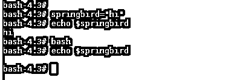
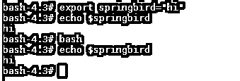
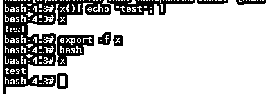
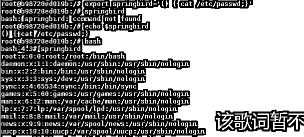
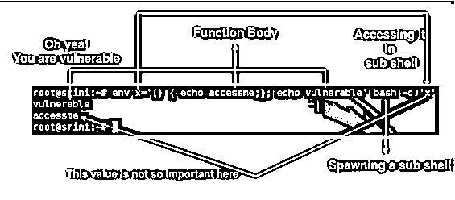
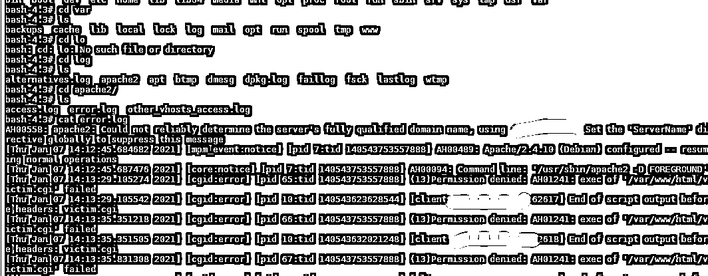
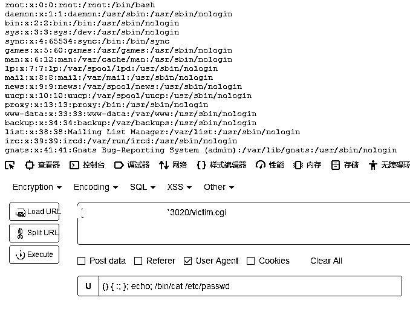
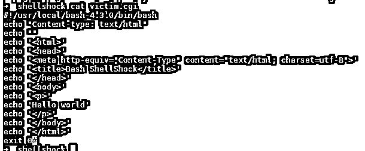

# Bash 破壳漏洞 Shellshock （CVE-2014-6271）复现分析 - 春告鳥 - 博客园

> 原文：[`www.cnblogs.com/Cl0ud/p/14248937.html`](https://www.cnblogs.com/Cl0ud/p/14248937.html)

### 漏洞简介

GNU Bash 4.3 及之前版本在评估某些构造的环境变量时存在安全漏洞，向环境变量值内的函数定义后添加多余的字符串会触发此漏洞，攻击者可利用此漏洞改变或绕过环境限制，以执行 Shell 命令。某些服务和应用允许未经身份验证的远程攻击者提供环境变量以利用此漏洞。此漏洞源于在调用 Bash Shell 之前可以用构造的值创建环境变量。这些变量可以包含代码，在 Shell 被调用后会被立即执行。

这个漏洞的英文是：**ShellShock**，中文名被 XCERT 命名为：破壳漏洞。

该漏洞在 Red Hat、CentOS、Ubuntu 、Fedora 、Amazon Linux 、OS X 10.10 中均拥有存在 CVE-2014-6271（即“破壳”漏洞）漏洞的 Bash 版本，同时由于 Bash 在各主流操作系统的广泛应用，此漏洞的影响范围包括但不限于大多数应用 Bash 的 Unix、Linux、Mac OS X，而针对这些操作系统管理下的数据均存在高危威胁。

漏洞的利用方式会通过与 Bash 交互的多种应用展开，包括 HTTP、OpenSSH、DHCP 等

### 环境部署

安装部署`vulhub`环境：[`www.cnblogs.com/Cl0ud/p/14195114.html`](https://www.cnblogs.com/Cl0ud/p/14195114.html)

进入`vulhub`文件夹



进入`bash`文件夹下的`shellshock`


执行命令启动`docker`

```
docker-compose up -d 
```


服务起在`8080`端口


### 本地漏洞检测



进入`docker`容器

`payload`为： `env x='() { :;}; echo shellshocked' bash –c "echo hi"`


如果输出`shellshocked`则表示存在漏洞

### 本地漏洞检测 POC 分析

口语化阐释一下漏洞原理：`父进程中的特殊变量字符串(这里指字符串内容为函数)成为环境变量后，在子进程中调用该字符串时将其理解为函数执行`

在`shell`中函数定义：[`www.runoob.com/linux/linux-shell-func.html`](https://www.runoob.com/linux/linux-shell-func.html)

```
#!/bin/bash
# author:菜鸟教程
# url:www.runoob.com

demoFun(){
    echo "这是我的第一个 shell 函数!"
}
echo "-----函数开始执行-----"
demoFun
echo "-----函数执行完毕-----" 
```

在`shell`中定义变量

```
springbird="hi" 
```

使用`echo` 输出



然后开启以后新的进程后，可以看到`$springbird`变量没有继承到子进程中来

那么我们怎么样才能在子进程中使用父进程的变量呢？(自问自答)

可以将变量存储到环境变量中，这样就可以在父子进程中一起使用该变量了

我们使用`export`命令将其设置为环境变量，`export`简介：[`www.runoob.com/linux/linux-comm-export.html`](https://www.runoob.com/linux/linux-comm-export.html)

如图：



可以看到设置环境变量后子进程也能够使用该变量了

这个时候我们设置一个函数作为环境变量

```
x(){ echo "test"; } 
```

如图



可以看到子进程中也能成功执行该函数

这时候我们改变一点点



创建字符串环境变量`springbird`

```
export springbird='() { cat /etc/passwd;}' 
```

**注意**：

`()`和`{`之间有空格

可以看到我们创建的字符串变量被设置成环境变量后在子进程解释成了函数执行，成功读取了 `/etc/passwd`

所以触发并利用破壳漏洞的所需要的几点：

*   被攻击的 bash 存在漏洞（版本小于等于 4.3）
*   攻击者可以控制环境变量
*   新的 bash 进程被打开触发漏洞并执行命令

从上面的分析中可以看出，漏洞的根本原因存在于 Bash 的 ENV 命令实现上，因此漏洞本身是不能够直接导致远程代码执行的。如果要达到远程代码执行的目的，必须借助第三方服务程序作为媒介才能够实现，第三方服务程序也必须要满足众多条件才可以充当此媒介的角色。

### 漏洞原理

该`Bash`使用的环境变量是通过函数名称来调用的，导致漏洞出问题是以`(){`开头定义的环境变量在命令`ENV`中解析成函数后，`Bash`执行并未退出，而是继续解析并执行 shell 命令。而其核心的原因在于在输入的过滤中没有严格限制边界，也没有做出合法化的参数判断。

偷图：



### 插曲

访问靶场的漏洞文件时出现了`500 Internal Server Error`的错误，即访问`http://靶场地址/victim.cgi`时报错

进入容器内部

```
docker exec -it 6d40 bash 
```

查看`apache2`的`error.log`



发现错误为权限不足：

> `[cgid:error] [pid 69:tid 140543753557888] (13)Permission denied: AH01241: exec of '/var/www/html/victim.cgi' failed`


修改其权限为`755`即可

```
chmod 755 victim.cgi 
```


### 漏洞利用

按照前面分析的漏洞原理，此处构造读取`/etc/passwd`的`payload`

`() { :; }; echo; /bin/cat /etc/passwd`



可以看到打出了`passwd`

### 还有一个问题

但是我们在`victim.cgi`文件里面并没有看到调用环境变量，我们从`User-agent`里面打过去的`payload`为什么就生效了



在这篇博文中提到：[`www.guildhab.top/?p=1805`](https://www.guildhab.top/?p=1805)

> CGI 脚本会继承系统的环境变量。CGI 环境变量在 CGI 程序启动时初始化，在结束时销毁。
> 
> 当一个 CGI 脚本未被 HTTP 服务器调用时，它的环境变量几乎是系统环境变量的复制，当这个 CGI 脚本被 HTTP 服务器调用时，它的环境变量就会增加关于 HTTP 服务器，客户端，CGI 传输过程等条目

也就是说，每当 CGI 脚本接收到一次 HTTP 请求，它的环境变量就会新增一些条目，比如`User-agent`，`Connection`等信息

所以这里我们通过修改`User-Agent`来修改 CGI 环境变量

### 漏洞利用场景

1.  **程序在某一时刻使用 bash 作为脚本解释器处理环境变量赋值**
2.  **环境变量的赋值字符串来源于用户输入 , 且没有通过有效的过滤**

### 参考链接

*   [`www.wangan.com/docs/419`](https://www.wangan.com/docs/419)
*   [`zgao.top/bash 破壳漏洞 cve-2014-6271 复现分析/`](https://zgao.top/bash%E7%A0%B4%E5%A3%B3%E6%BC%8F%E6%B4%9Ecve-2014-6271%E5%A4%8D%E7%8E%B0%E5%88%86%E6%9E%90/)
*   [`www.freebuf.com/articles/system/50065.html`](https://www.freebuf.com/articles/system/50065.html)
*   [`blog.knownsec.com/2014/10/shellshock_response_profile_v4/`](https://blog.knownsec.com/2014/10/shellshock_response_profile_v4/)
*   [`www.guildhab.top/?p=1805`](https://www.guildhab.top/?p=1805)