# CVE-2010-0249（极光）分析报告 - 一曲沙丶天涯 - 博客园

> 原文：[`www.cnblogs.com/jf-blog/p/12368687.html`](https://www.cnblogs.com/jf-blog/p/12368687.html)

# 1.    发现可疑流量

A.分析流量，导出字节流

 

B.得到网页代码，发现需要执行的代码需要解密（加密的字符串部分太长了，就省略了）：

 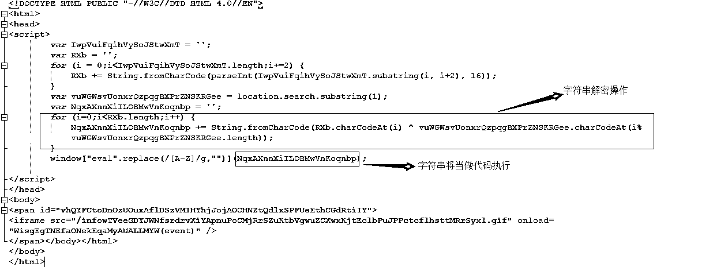

    C.通过在网页下断点，将解密后的代码从提取出来，并做修饰（payLoad 太长被省略）：

 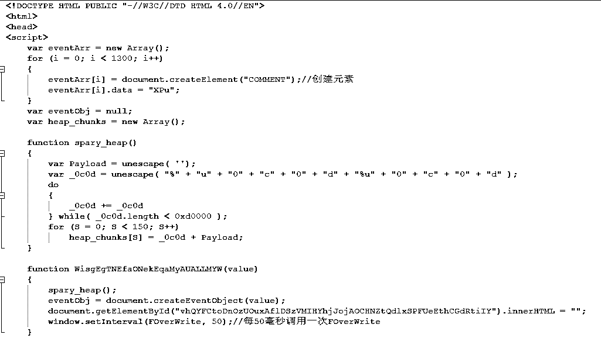

    很明显能看出来，这是在进行堆喷射！应该是在利用漏洞，至于漏洞在哪里，继续分析。

# 2.    漏洞复现

A.使用 phpStudy 构建网站，在 xp 虚拟机中用 ie6 访问

 

 崩掉了：

 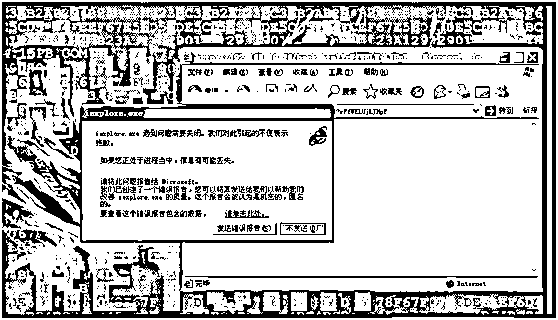

B.调试

 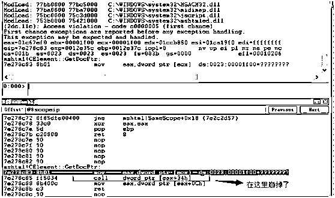

 

进行栈回溯

 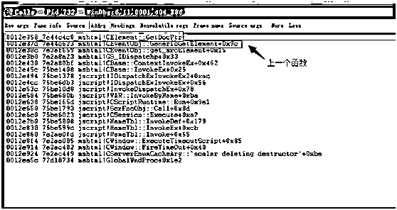

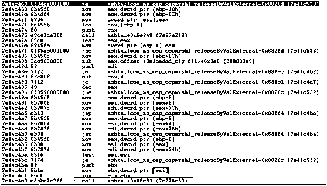

通过栈回溯：ecx 来源于[esi],拖入 OD 调试一下

 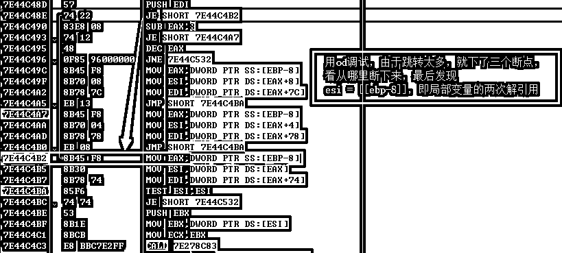

可以看出，ecx = [[[ebp-8]]],这个函数是 mshtml.dll 中的，把 mshtml.dll 拖入 IDA 看一下。

 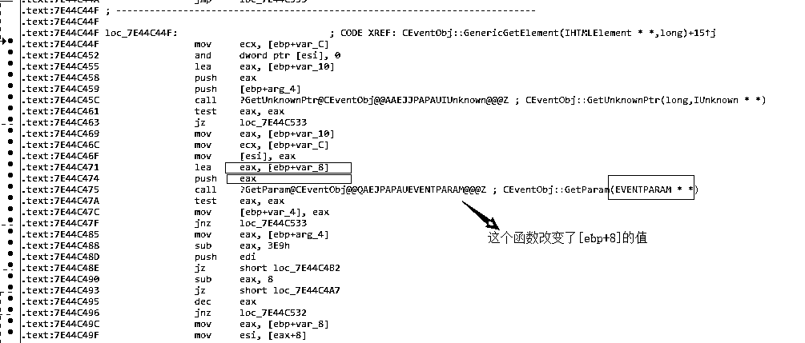

这个函数的参数是一个对象的二级指针

 

 

 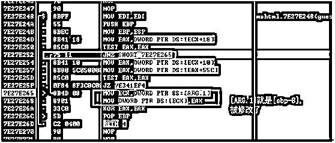

继续溯源

 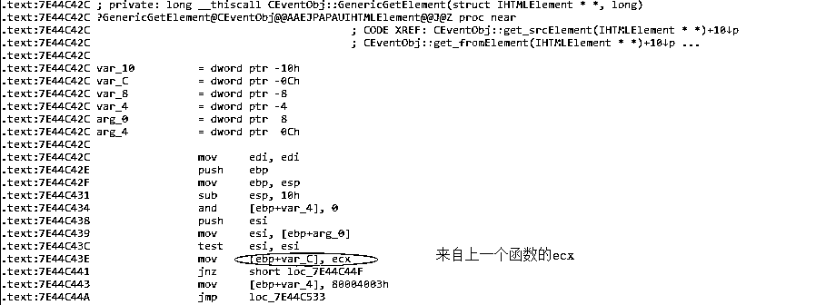

找到上一个函数

 

 

C.根源

①到这里需要知道事件对象是如何创建和保存的，前面已经知道 html 中创建了一个 image 对象，对 CImgElement 下断点在 windbg 中输入 bu mshtml!CImgElement::CImgElement

 

ecx(01c6cd20)即创造的 CImageElement 对象指针。

②在 CTreeNode 下断点

 

ecx(01cb04b0)即创造的 CTreeNode 对象指针。

 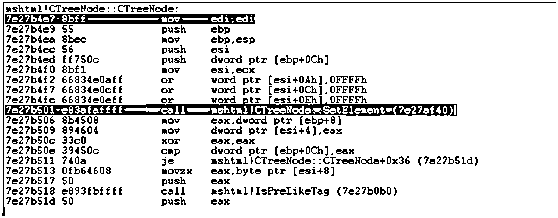

CTreeNode::SetElement 将该 CImgElement 类与 CTreeNode 关联

为了在 event 中能够访问相应的 Element，CEventObj 并不是直接就在其类中保存一个 CElement 结构的指针，而是在 CImgElement 对象创建后，又创建了相应的 CTreeNode 对象，由 CTreeNode 对象的属性中保存 CImgElement 类指针。然后将 CTreeNode 对象的地址，保存在这个 img 的事件对象 CEventObj 类的一个 EVENTPARAM 结构中。

# 3.    漏洞成因

表层：访问了被释放的对象，最后 call 了不可访问区域

 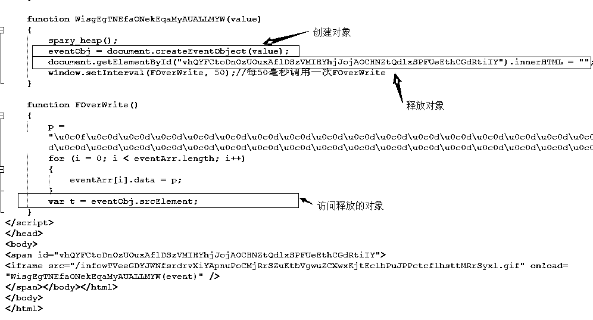

通过多层指针访问对象 element,通过虚函数表指针找到虚函数表，然后 call 了虚函数，

原对象已经被释放了，访问的不知道啥东西，就崩了。

# 4.    PoC

原理：创建对象，再释放，向对象里面写数据（如 0x0C0D,或者 0x0A0D),主要是再次访问释放的对象时，就会将写的数据当成地址调用（虚函数表），因为是大面积覆盖，不论是多少次级指针，都指向同一个地址，就是 0x0C0D0C0D 周围保存的也是 0x0C0D0C0D，最终就会 call 0x0C0D0C0D。

这时候我们再针对 0x0C0D0C0D 或者 0x0A0D0A0D，进行堆喷射，使执行到 shellcode 中。

 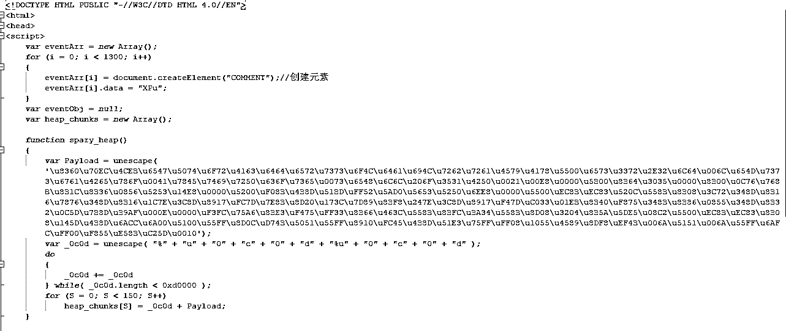

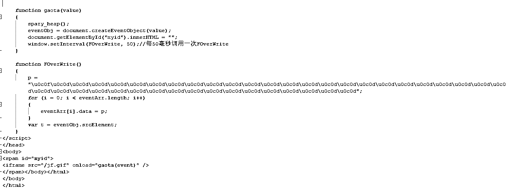

# 5.    结语

通过该漏洞可以进行恶意网站访问时，将被攻击，执行恶意代码，或拒绝服务。

# 6.    参考资料

[`www.geoffchappell.com/notes/security/aurora/index.htm`](http://www.geoffchappell.com/notes/security/aurora/index.htm)