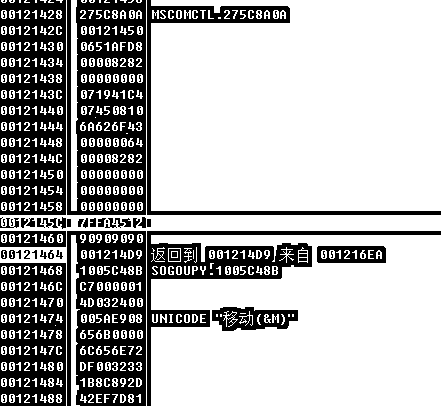
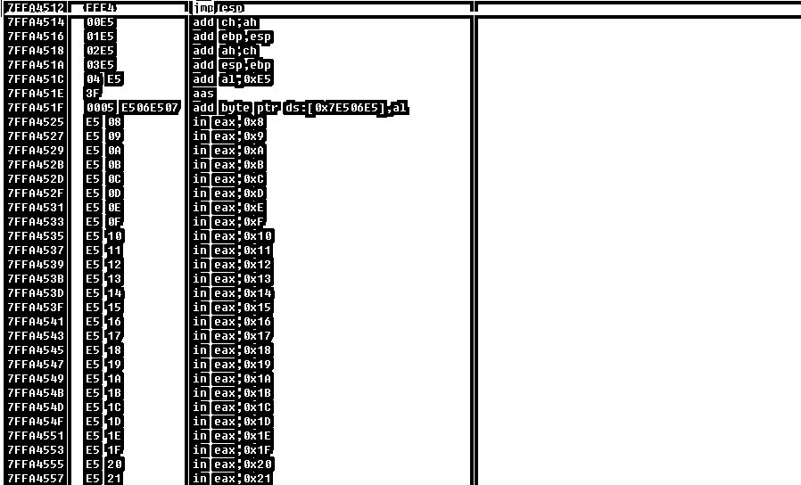
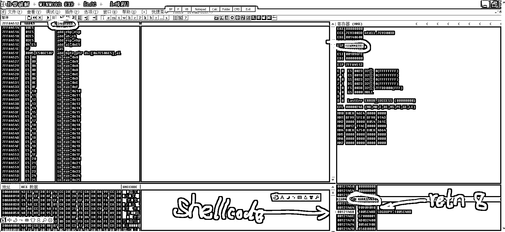

# CVE-2012-0158 个人分析 - Ox9A82 - 博客园

> 原文：[`www.cnblogs.com/Ox9A82/p/5306711.html`](https://www.cnblogs.com/Ox9A82/p/5306711.html)

CVE-2012-0158 是一个比较有名的老漏洞了，这次从论坛上找到一个 poc 文件，利用这个 poc 来分析 CVE-2012-0158 漏洞的形成。

http://bbs.pediy.com/showthread.php?t=207638

参考自此帖子，但是分析是个人独立完成的，只是参考了 poc 并没有抄袭思路。

本文步骤:**重现漏洞-->漏洞分析-->漏洞利用-->总结**

## **1.重现漏洞**

打开 poc 文件，结果如图

环境如下

如图可见漏洞复现成功，弹出一个计算器。

## 2.漏洞分析

通过已有的 POC 找出漏洞产生的原因。

首先定位 shellcode 在内存中的地址，这里使用的是通过对 api 下断点找到 shellcode 的地址。

如图。可见此时 shellcode 已在栈中。00121461 即为栈中空间，从 3 个 nop 起为 shellcode

在此时看一下栈的整体结构，如下图

4 个 byte 的 nop 之后接的便是 shellcode，根据栈溢出的特点我猜测，7FFA4512 为覆盖栈返回地址的地方。跟一下发现如图

原来 7FFA4512 处是一个 jmp esp

这是一个常见的栈溢出跳板。据此我判断这是一个使用跳板地址覆盖栈返回地址的栈溢出，而且此时的 esp 正好指向 shellcode 的起始位置，4 个 byte 的 nop 用来

抵消 retn 0x8 造成的 esp 下移。据此栈示意图如下

接下来查找是哪里发生的覆盖，因为是当前函数的栈祯发生溢出，说明肯定是子函数或者当前函数导致的覆盖。但是本栈祯已经被覆盖的一塌糊涂了，怎么知道这个函数的地址呢？

那么就只能对栈进行回溯，正好可以发现一个已经用过的函数返回地址，找到发生溢出的这个栈祯。经过单步跟进最终发现产生问题的语句在这里，如图

可见是一个 rep movs 导致的溢出。

 

如图可知溢出函数处于 mscomctl 模块