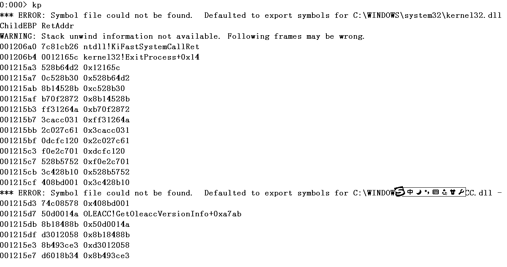
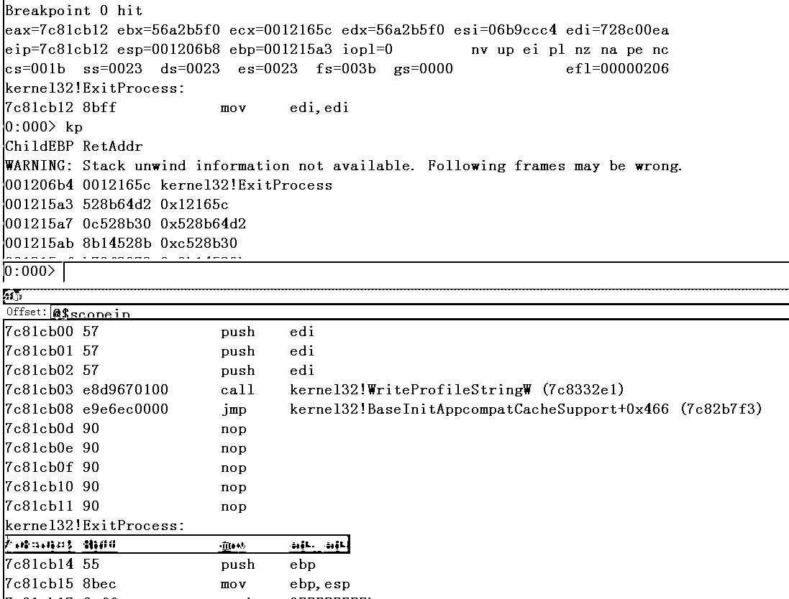
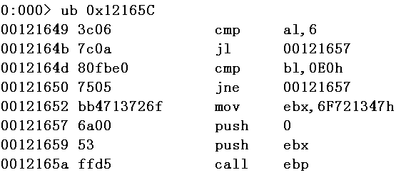
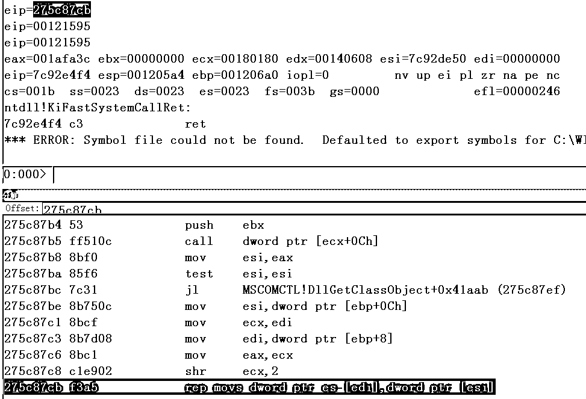
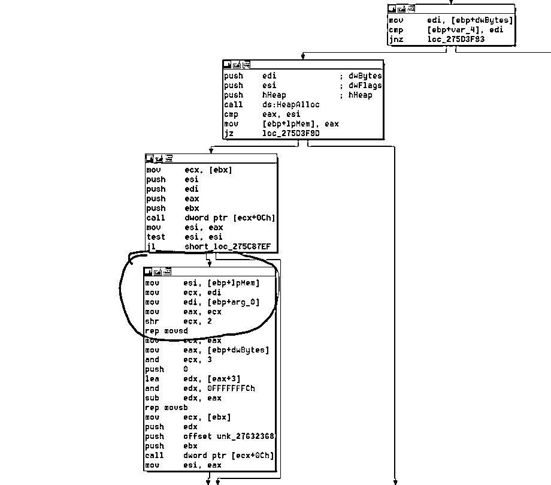
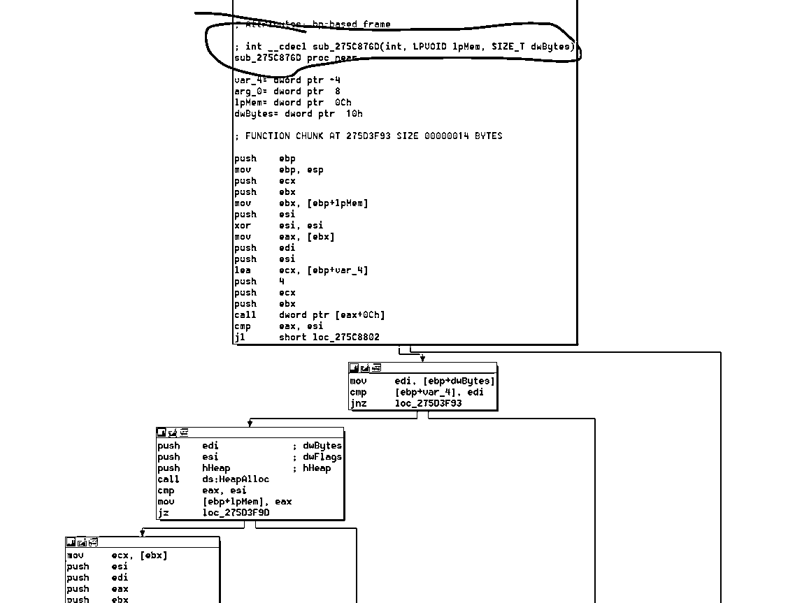
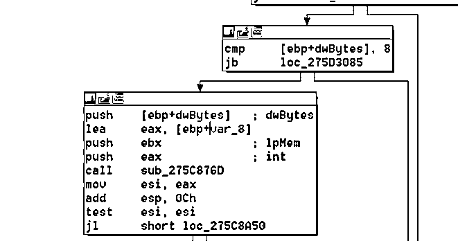

# CVE-2012-0158 基于 exp 分析 - Ox9A82 - 博客园

> 原文：[`www.cnblogs.com/Ox9A82/p/5709817.html`](https://www.cnblogs.com/Ox9A82/p/5709817.html)

CVE-2012-0158 这个洞我之前分析过，漏洞战争这本书里也写过，但是都是用 poc 分析的，我这次找了一个弹计算器的 exp 来分析，感觉用 poc 和用 exp 还是不一样的，从 exp 分析要比从 poc 分析更复杂一些，或者说是要使用一些独特的小技巧。顺带补齐漏洞利用的内容，上次没有写这个，看了一下漏洞分析这本书也没有写怎么利用的这个漏洞。

### 0x0.分析漏洞

### 0x2.漏洞本质成因

### 0x3.漏洞利用

### 0x0.分析漏洞

首先是用 windbg 挂载 word2003 进程，F5 继续执行之后加载 exp 文件,会发现中断在了如图所示的地方。


可以由图看出来这是进程退出了，由此推测是 shellcode 执行完成并且安全顺利的退出了进程。我们要做的就是定位 shellcode 在内存中的位置。kp 一下，如图。可以看到是刚刚调用了 ExitProcess 函数。



通过对 ExitProcess 函数下断就可以顺藤摸瓜找到 shellcode 的位置，如图我们可以看到 ExitProcess 的调用位置是 0x12165C，这个地址明显是在栈上的。



我们来看下 0x12165C 这个地址到底是有什么东西，如图可以看到确实是 shellcode。



然后就是最重要的问题了，我们知道栈溢出是函数向栈上写入数据导致的。我们现在已经知道了栈上的写入位置了，那么怎么找出是在哪个函数中进行写入的呢？这里就是一个技巧了，也是从仙果版主那里学到的。

方法是：对这块栈下写入记录断点，根据断点输出情况来分析。

但是这个断点会影响效率，所以我们尽可能晚的去下记录断点。我们在准备打开文件时 Ctrl+Break 抛出一个断点。然后下断 ba w 4 0x12165C "r eip;gc"，输出如图。



可以看到了，最后一个非栈上 eip 既是漏洞的触发点。如果对这个地方下断的话可以看到 0x275c87cb 这个地方的是执行过多次的，我们反复调试可以找到最后触发漏洞的那一次，也可以对 ecx 即复制的大小下条件断点进行输出来看一下什么情况。

如图所示我使用了 ba e 1 MSCOMCTL!DllGetClassObject+0x41a84 "r ecx;gc"来下条件记录断点，输出可以看到有一个超大的 ecx=0x8282 而我们知道 ecx 就是复制的次数也就是复制的字节数，这里我们就找到了是第 4 次调用到 memcpy 时发生了溢出。


在第四次调用时断下来，看一下前面。我们可以看到以下一些语句

```
1 275c878a 8b7d10      mov edi,dword ptr [ebp+10h] 2 275c87c1 8bcf        mov ecx,edi 3 275c87c8 c1e902      shr    ecx,2
4 275c87cb  f3a5       rep movs dword ptr es:[edi],dword ptr [esi]
```

可以看出所谓的复制的字节数其实是来自上层传递过来的参数 3。来 kv 看一下，的确如此。


我们在 IDA 里看一下到底是怎么导致的漏洞





可以看到参数都是从上面传过来的，0x8282 这么大的导致溢出的值也是上层出现的问题，我们继续往上跟踪。我们知道栈溢出是属于一个函数的栈，我们的目的就是找出是那个函数的局部变量缓冲区被溢出了，所以我们要明确向上跟踪的目标，就是找出是某个函数的局部变量我们的目的就达到了。

 根据 00121458 275e701a 06b5ce6c 07a70810 00000000 MSCOMCTL!DllGetClassObject+0x41cc6 这个栈回溯来看，我们继续跟到了这个函数位置。如下图



根据上图我们明显的看到了漏洞的造成，目的地址是栈中的一个 8 字节的局部缓冲区，但是在复制的时候判断复制尺寸的大小使用 cmp [ebp+dwBytes],8 jb loc_275d3085 时却是大于 8 时跳转到复制路径（注意那根红色的线），所以就造成了明显的溢出。

至此，漏洞分析完毕。

### 0x2.漏洞本质成因

如果是根据网上的资料来看的话，样本的分析应该很简单，只是一个 OLE 对象而已。但是我手里只有一个经过加密的 exp（而且还是 excel 的）。这就给分析工作增大了难度