# CVE-2014-1767 漏洞分析(2015.1) - 會飛的貓 - 博客园

> 原文：[`www.cnblogs.com/flycat-2016/p/5450275.html`](https://www.cnblogs.com/flycat-2016/p/5450275.html)

**CVE-2014-1767 漏洞分析**

**1\. 简介**

该漏洞是由于 Windows 的 afd.sys 驱动在对系统内存的管理操作中，存在着悬垂指针的问题。在特定情况下攻击者可以通过该悬垂指针造成内存的 double free 漏洞。

实现对漏洞的有效利用，攻击者利用成功可导致权限提升。afd.sys 是内核用来管理 socket 的模块。

影响的系统包括(32bit & 64 bit)：

**　　 Windows Server 2003**

**Windows Vista**

**Windows Server 2008**

**Windows 7**

**Windows 8 & Windows 8.1**

**Windows Server 2012**

测试环境：

Win7 32bit

下面对漏洞成因做简单分析。

注：本文是以分析思路来写的，并不是总结性的。所以会有些绕，想了解漏洞成因，请直接看最后的流程分析。

**2.漏洞分析**

**2.1 "POC"**

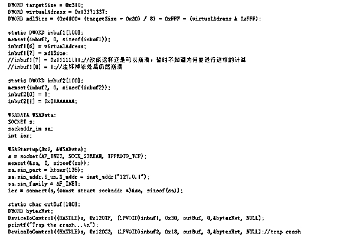

POC 主要做了这么两件事：

1\. 初始化了一个本地 socket 连接。

2\. 给这个 socket 发送了两个控制码：0x1207F 和 0x120C3。

**2.2 First Crash**

将编译好的程序放在虚拟机中运行，触发漏洞之后的 BSOD：

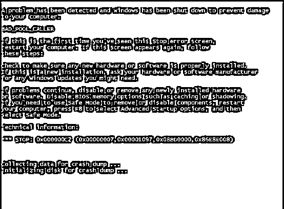

显示的信息为 BAD_POOL_CALLER，BugCheck 0xc2。

设置双机调试后，触发 BSOD，部分 windbg 输出的信息：

调用堆栈：

目前，我们可以知道：

出问题的是 afd.sys 模块，漏洞的类型为 double free，free 的对象是 Mdl，并且发生崩溃时存在这样的调用关系：

afd!AfdTransmitPacketsà afd!AfdTliGetTpInfoà afd!AfdReturnTpInfoànt!IoFreeMdl

**2.3 Second Crash?**

对 afd.sys 开启 Special Pool 后，再次运行 POC，但是却没有发生崩溃，这有点奇怪。可是我们必须找到切入点，对问题 Mdl 对象进行回溯，然后搞清楚整个流程，锁定问题。

未开启 Special Pool 时，我们知道最后崩溃时的函数调用关系，或许可以对 afd!AfdReturnTpInfo 下断点，若此时也调用了该函数，可能会获得一些信息。但首先我们要搞清楚 POC 向 afd.sys 发送的两个控制码所对应的内核函数。

要找到这个对应关系，有这样的调试技巧：用户层的 IoControl 消息到都会被内核包装成 IRP 包，发送给对应驱动的 IRP_MJ_DEVICE_CONTROL 例程来处理，IRP_MJ_DEVICE_CONTROL 例程会根据控制码来选择对应的函数。

感谢 Windbg 为我们提供了这样的功能：

这样就可以得到 afd.sys 对应的 IRP_MJ_DEVICE_CONTROL 例程为 afd!AfdDispatchDeviceControl，利用 IDA 对该函数简单分析后，其大致流程如下：

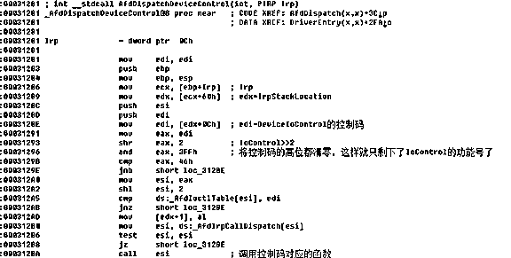

设置如下两个断点：

再次运行 POC，便可以得到两个控制码所对应的内核函数：

0x1207F：afd!AfdTransmitFile

0x120C3：afd!AfdTransmitPackets

接下来对上面提到的 afd!AfdReturnTpInfo 下断点，此时对 afd.sys 仍然开启了 Special pool。看看有啥惊喜。

运行 POC，待其断下来之后，对释放的 Mdl 进行跟踪：

咦，此时调用 afd!AfdReturnTpInfo 的并不是 afd!AfdTransmitPackets，而是 afd!AfdTransmitFile。好像还不能明白发生了什么，先记录下此时 Mdl 分配和释放的相关函数调用关系：

分配：afd!AfdTransmitFile+0x170à nt!VerifierIoAllocateMdl

释放：afd!AfdTransmitFile+0x5a3à afd!AfdReturnTpInfo+0xadxà nt!IoFreeMdl

nt!VerifierIoAllocateMdl 这个函数有点奇怪，正常情况都是调用 nt!IoAllocateMdl 来分配 Mdl 的空间，IDA 中此时也是调用的 IoAllocateMdl，这是否是导致开启 special pool 后不崩溃的原因？这个问题还有待考证。

接着再看，在函数 afd!AfdReturnTpInfo 内，Mdl=[edi+0ch]，所以利用同样的方法，在 windbg 中查看 edi 的分配释放记录：

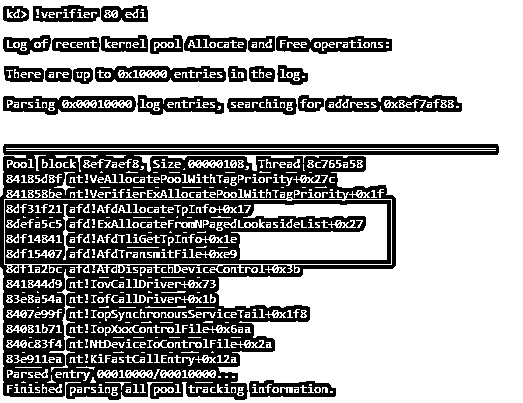

记录下关于 edi 的函数的调用关系：

AfdTransmitFileàAfdTliGetTpInfoàExAllocateFromNPagedLookasideListàAfdAllocateTpInfo

而在函数 afd!AfdReturnTpInfo 中，edi=[esi+20h]，同样的方法：

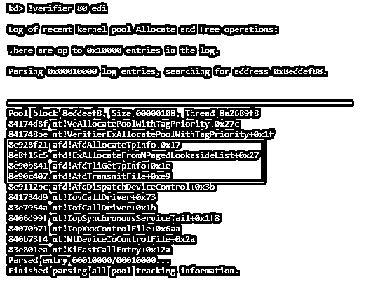

咦，怎么会和 edi 的结果一样？根据此时的函数调用，来看看 afd!AfdTliGetTpInfo 这个函数：

从这段 IDA 截图，根据微软的匈牙利命名法，可以知道函数 afd! AfdReturnTpInfo 中的 edi 为 TpInfoElement，esi=TpInfo。并且 TpInfoElementArray=*(DWORD*)(TpInfo+20h)，sizeof(TpInfoElement)=0x18。

稍作总结一下我们所知道的：IoControl=0x1207F 时，会调用 afd!AfdTransmitFile，afd!AfdTransmitFile 会调用 afd!AfdTliGetTpInfo 分配一个 TpInfo，接着会调用 nt!IoAllocateMdl 分配一个 Mdl，然后会从 TpInfo 结构中得到这个 Mdl，并释放掉。

接着用 windbg 使用系统继续运行，windbg 再也没有断下来，有一点忧伤。再次查看崩溃时的函数调用关系，将断点的位置提前到 afd!AfdReturnTpInfo 开始的时候。然后 IoControl=0x120C3 时，断点断下来后，利用 windbg 跟踪此时的 esi：

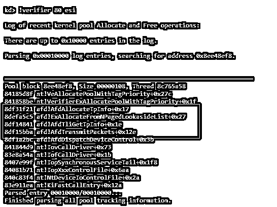

这个调用关系看起来十分的眼熟，和 IoControl=0x1207F 时除了对应的内核函数不同，其他调用简直一模一样！那么我们来看看此时是如果避开了释放 Mdl 的流程。

利用 windbg 单步跟踪一下，发现其在 afd!AfdReturnTpInfo+0x69 处，由于[esi+28h]=0，跳转到另一条不执行释放 Mdl 的流程了。

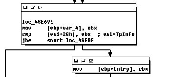

而此时 esi=TpInfo，我们可以猜测 TpInfo 结构另一个成员：TpInfo+28h=TpInfoElementCount。

好了，现在对整个流程有一个粗略的了解了。再回看一下漏洞的描述，"Mdl double free"，那么可以大胆的猜测一下：double free 的 Mdl 就是 afd!AfdTransmitFile 所创建的 Mdl！

**2.4 大胆的假设**

关闭 special pool，设置如下两个断点：

记录下 afd! AfdTransmitFile 所创建的 Mdl 的地址，和最后调用 afd!AfdTransmitPackets 时释放 Mdl 地址做比较。

我们惊奇的发现，这两个地址是一样的！也就是最后 afd!AfdTransmitPackets 流程中释放的 Mdl 正是 afd!AfdTransmitFile 所创建的 Mdl！

这样我们对整个流程又有了进一步的了解：

IoControl=0x1207F，对应的内核函数 afd!AfdTransmitFile 会创建 TpInfo 结构，分配一个 Mdl 并将地址存入到 TpInfo 结构的 TpInfoElementArray 中，接着其会调用 afd!AfdReturnTpInfo 释放掉 Mdl。

IoControl=0x120C3，对应的内核函数 afd!AfdTransmitPackets 会从 TpInfo 取出 Mdl，而这个 Mdl 正好是 afd!AfdTransmitFile 已经释放掉了的，此时 afd!AfdTransmitPackets 会尝试对其进行第二次释放。然后就 BSOD。

目前有一个大大的疑问：为什么 afd!AfdTransmitPackets 流程中释放的就那么巧的就是 afd!AfdTransmitFile 所创建的那个 Mdl？内核中 pool 的分配和释放时刻都在发生，为何会恰好得到那一块 pool？

看来，得要去分析一下 TpInfo 分配和释放相关的一些东西了。

**2.5 一些函数**

通过上面的分析，我们知道了一些和 TpInfo 分配和释放相关的函数：

ExAllocateFromNPagedLookasideList，AfdTliGetTpInfo，AfdAllocateTpInfo，AfdReturnTpInfo，ExFreeToNPagedLookasideList，AfdTransmitFile 和 AfdTransmitPackets。

结合静态和动态分析，将 POC 流程走的这个几个函数分析出来，特别留意和 POC 的关系。这个没啥好说的了，就直接把逆出来的伪 C 代码贴出来，然后加以解释了。

再说第一个函数之前，介绍一下 IRP 和 IO_Stack_Location，比如 IOControl=0x120C3 时：

函数 AfdTransmitPackets 开始时候的 ecx 就是 IRP：

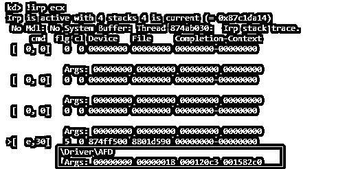

红框内的值是否看起来有一点眼熟？回头看看 POC，这正是第二次 DeviceIoControl 的部分参数。IRP 的结构微软一直藏着掖着的，公开的部分结构也比较模糊。

IO_Stack_Location 位置 IRP+60h 位置，其结构很简单但是因为有一个 union 结构的存在，显得很多，此时 Parameters 对应的是 DeviceIoControl，结构如下：

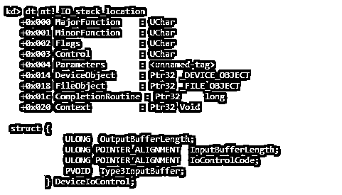

此时 IO_Stack_Location 的内存：

其中的 Type3InputBuffer 成员是用来存储 DeviceIoControl 中 InputBuffer 的内容，位于 IO_Stack_Location+0x10 的位置。

**AfdTransmitFile**

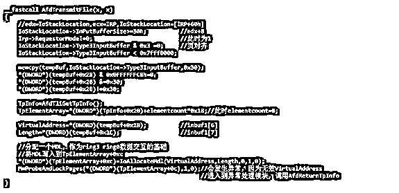

1\. 检查用户层 DeviceIoControl 中 InputBufferSize 是否大于 30h。

2\. 对 IoStackLocation->Type3InputBuffer 做一些有效性检查。

3\. 调用 AfdTliGetTpInfo 分配一个 TpInfo 结构。

4\. 根据 VirtualAddress 和 Length 创建一个 Mdl(此时 VirtualAddress 和 Length 的值是从 Type3InputBuffer 得到的，分别对应的是 inbuf1[6]和 inbuf1[7])，并将其地址写入到 TpElementArray 的合适位置。

5\. 调用函数 MmProbeAndLockPages 准备操作这块 Mdl，但是此时因为要映射的地址无效(VirtualAddress=0x13371337)，触发异常，调用 AfdReturnTpInfo 释放 TpInfo。

**AfdTliGetTpInfo**

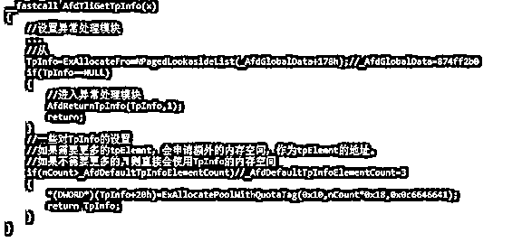

1\. 设置异常处理模块,发生异常会调用 AfdReturnInfo 函数。

2\. 调用 ExAllocateFromNPagedLookasideList 函数从 Lookaside List 为 TpInfo 分配一块 pool。

3\. 判断 tpElementCount 是否大于 3，大于则会为 TpElementArray 更多的空间，否则就直接用 TpInfo 的空间了。

这里的 nCount 是通过用户层 DeviceIoControl 的 InputBuffer 获得，位于 InputBuffer[2]。

来解释一下此时的 Lookaside，可以看到其是一个定值为 0x874ff428，这表明其是一个 Dedicated Lookaside Lists，相当于专用的 Lookaside 。用 windbg 查看这个 Lookaside：

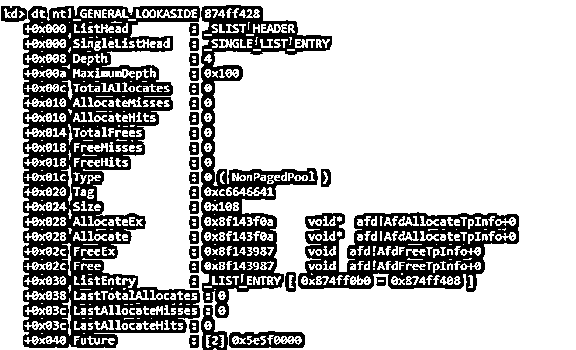

可以看到，刚开始的时候这个 Lookaside 为空。

**Lookaside 的分配和释放算法是理解为何会得到同一个 Mdl 的关键所在，来看一下：**

首先是分配算法，流程如下：

1\. 记录分配的次数。

2\. 尝试从 Lookaside 卸载下一个 ListEntry。第一次的 IOControl，Lookaside 为空，所以会进入到下一步的流程。

3\. 尝试失败，调用 Lookaside 的分配函数重新分配一块 pool。

接着是释放算法：

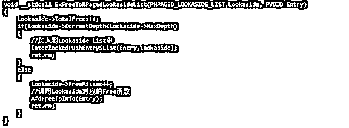

流程：

1\. 记录释放的次数。

2\. 如果此时 Lookaside 的 Depth 小于 Lookaside 的 MaxDepth，则会将参数中的 ListEntry 加入到 Lookaside 中，否则进入下一步。

3\. 记录释放失败的次数，调用 Lookaside 对应的释放函数。

在来看看 TpInfo 的分配和释放函数：

分配函数没有什么好说的，下面是释放函数：

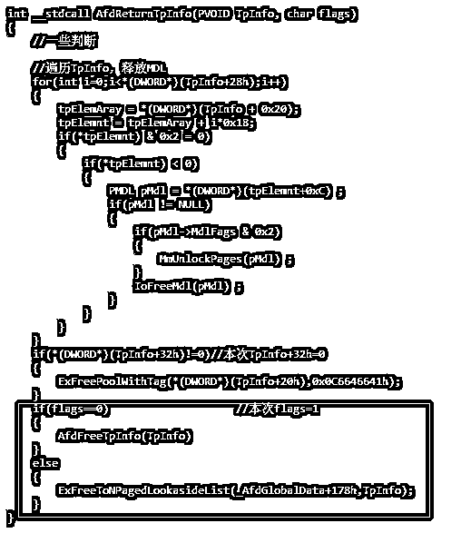

流程：

1\. 遍历 TpInfo 的 TpElementArray 数组，释放 Mdl。

2\. flags(第二个参数)为 0，调用 AfdFreeTpInfo 释放 TpInfo，否则调用 ExFreeToNPagedLookasideList。

好了，现在还剩最后一个函数，IOControl=0x000120c3 对应的 AfdTransmitPackets 函数：

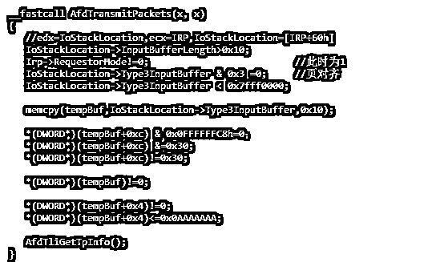

流程：

1\. 对 IRP 和 IoStackLocation 做有效性检查。

2\. (IoStackLocation->InputBufferLength)>0x10。

3\. InputBuffer[0]!=0，InputBuffer[1]<=0x0AAAAAAA。这点解释了 POC 中 inbuf2 的值。

4\. 调用 AfdTliGetTpInfo()。

**2.6 流程分析**

现在是时候做一个总结了，整个漏洞的流程如下。

POC 创建了一个以 socket 为基础的本地网络连接，调用 DeviceIoControl 向 socket 对象分别发送两个控制码 0x1207F 和 0x120C3，这两次控制码分别对应 afd.sys 的 AfdTransmitFile 和 AfdTransmitPackets。

**IOControl=0x1207F**

1\. AfdTransmitFile 会调用 AfdTliGetTpInfo 来获得一个 TpInfo 结构，AfdTliGetTpInfo 会尝试从 Dedicated Lookaside Lists 获得一个 ListEntry，但是由于此时这个 Lookaside 为空，所以调用 AfdAllocateTpInfo 函数重新分配了一块 pool 给 TpInfo 使用。

2\. 接着 AfdTransmitFile 根据用户层传递过来的 VirtualAddress=0x13371337 和 Length 来创建一个 Mdl，用来和用户层交互，并将这个 Mdl 的地址保存到 TpInfo 结构中的 TpElementArray 数组中。

3\. AfdTransmitFile 接着调用 MmProbeAndLockPages 函数，准备对申请的 Mdl 进行操作，但是由于无效的地址(VirtualAddress=0x13371337)，程序进入到异常处理的流程中。

4\. 异常处理流程会调用 AfdReturnTpInfo 函数，AfdReturnTpInfo 函数遍历 TpInfo 结构的 TpElementArray 数组，将 Mdl 释放掉。接着其会调用 ExFreeToNPagedLookasideList 释放刚创建的 TpInfo。

5\. 但是因为此时这个 Lookaside 很"闲"，ExFreeToNPagedLookasideList 不会将 TpInfo 释放掉，而是将其挂载到 Dedicated Lookaside List 中去。但此时 TpInfo 所在 pool 数据还保留着，并没有清空，当然也包括已经释放掉的 Mdl 地址，成了一个 dangling pointer，这里就埋下了隐患。这是第一次 free 的地方。

第一次 IoControl 的操作主要就是放置一个 dangling pointer 到 Dedicated Lookaside Lists 中。

第二次 IoControl 对这个 dangling pointer 进行二次释放。

**IOControl=0x120C3**

1\. 接下来 AfdTransmitPackets 同样会调用 AfdTliGetTpInfo 创建一个 TpInfo 结构。AfdTliGetTpInfo 会调用 ExAllocateFromNPagedLookasideList，尝试从 Dedicated Lookaside Lists 获得 ListEntry。因为此时的 Dedicated Lookaside Lists 不为空，所以会从中卸载一个 ListEntry 给 TpInfo 使用，而此时 Lookaside 就只有一个上一次 AfdTransmitFile 函数放入的 ListEntry，所以这个 ListEntry 正好是响应上一个控制码所放进去的那个！

2\. 接着 AfdTliGetTpInfo 会从用户层输入 inbuf2[1]获得值 0x0AAAAAAA，作为 TpElementCount，接下来会创建一个 0x0AAAAAAA*0x18=0xFFFFFFF0 大小的 pool,这显然太大了，所以会再一次的进去到异常处理的操作。

3\. 异常处理会调用 AfdReturnTpInfo，其会遍历 TpInfo 尝试释放掉 Mdl。因为此时的 TpInfo 所在的 pool 正是" dangling pointer"，而 Mdl 已经被释放过一次了，这时发生 double-free。

4\. 然后发生 BSOD。

**2.7.总结**

此漏洞被 2014 年黑客奥斯卡评为最佳提权漏洞，因为其从 Windows 上的内核级漏洞绕过 Windows 8.1 上的 IE11 沙箱。关于漏洞成因流程有两个比较有意思的地方：

1\. 两次使内核函数进入到异常处理流程。

2\. 两次从 Lookaside 得到的 pool 地址相同。

**3\. 参考**

[`www.secniu.com/cve-2014-1767-afd-sys-double-free-vulnerability-analysis-and-exploit/`](http://www.secniu.com/cve-2014-1767-afd-sys-double-free-vulnerability-analysis-and-exploit/)

http://www.siberas.de/papers/Pwn2Own_2014_AFD.sys_privilege_escalation.pdf

by：会飞的猫
转载请注明:http://www.cnblogs.com/flycat-2016