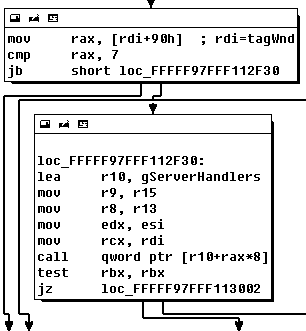
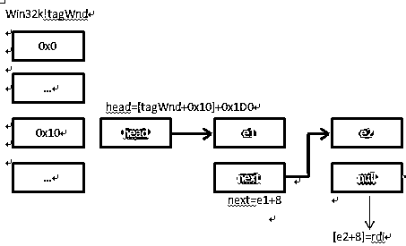
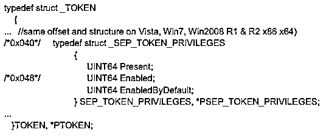

# CVE-2014-4113 Win8.1 64 位利用(2014.11) - 會飛的貓 - 博客园

> 原文：[`www.cnblogs.com/flycat-2016/p/5450247.html`](https://www.cnblogs.com/flycat-2016/p/5450247.html)

**CVE-2014-4113 Win8.1 64 位利用**

关于漏洞成因的分析已经很多了，但是样本针对的是 win8 之前的利用，国外研究员 Moritz Jodeit 对 Win8.1 上的利用做了研究，并给出了思路。根据其思路，对 Win8.1 利用做尝试。

Win8.1 中调用 xxxMNFindWindowFromPoint 函数后，对得到的窗口对象 tagWnd 结构的处理代码存在差异：

Win8.1 从[tag+90h]获得的值会经过检查，确定其小于 7 才会进行下一步操作，r10+rax*8 为一个内核地址，所以这是我们没有办法控制的，得需要寻找另一条流程。    

**1.构造 fake tagWnd**

漏洞触发后，通过在几个关键位置巧妙地构造 fake tagWnd，比如下图：

可以让程序的流程就来到这样一段代码：

这段代码的作用是遍历 head=[tagWnd+10h]+1D0h 处的链表：如果[[tagWnd+10h]+1D0h ]等于 NULL，则[head]=rdi,否则继续遍历直到找到最后一个表项，并将 rdi 的值赋给最后一个表项的 next 指针。

下图中这个链表除去表头共有 2 个表项，指令"mov [rax],rdi"就将 rdi 的值赋给最后一个表项的 next 指针。而这最后一个表项的值是我们可以控制的，所以可以进一步将该处理解为：我们可以将任意地址的 8 个空 byte 用一个内核地址(rdi)来覆盖。由于 64 位系统的特点，内核地址的范围为 0xFFFF0800`0000000~0xFFFFFFFF`FFFFFFFF,所以 rdi 的高位两字节一定为 0xff，这是下一步能够获得高权限 Token 的关键。

**2.获得高权限的 Token**

在 Windows 系统中，Token 是管理权限的关键，类似于古代所使用的令牌，若是能够通过"合法"的途径制作一块高权限的令牌，便也达到了提权的目的。

内核中 TOKEN 对象结构中有一个很重要的 SEP_TOKEN_PRIVILEGES 结构，其中的每一位都代表一种权限，如下：

在决定一个 Token 所表示的权限时，SEP_TOKEN_PRIVILEGES 结构中的 Enable 的值是真正起作用的。可见似乎可以通过改写[TOKEN+0x48]处的值来改变权限。

上一步我们已经找到了一段代码：可以向我们可控的任意地址连续 8 个字节为 0 写入一个内核地址。若能在 SEP_TOKEN_PRIVILEGES 结构中找到一段连续 8 字节为 0 的地址并且能够使 edi 中高位的 0xff 覆盖 Enabled 的关键位置，那么就可以得到一个高权限的 Token 了。这样的好处是提权的代码都在内核执行，还不用考虑 SMEP 的问题。

若能够在利用程序进程的 Token 结构找到这样的一段内存便是极好的，但是其 Token 的 SEP_TOKEN_PRIVILEGES 结构中并未找到一段连续 8 个字节为 0 的地址，所有不能利用该方法直接改写利用进程的 Token 来达到提权。

幸好微软提供 CreateRestrictedToken 函数,我们可以创建一个拥有最小权限的 restricted token，并调用 AdjustTokenPrivileges 使其 SEP_TOKEN_PRIVILEGES 结构中具有连续 8 个字节为 0：

现在已经拥有了一段连续 8 字节为 0 的 SEP_TOKEN_PRIVILEGES 结构，接下来需要确定使用 edi 覆盖 SEP_TOKEN_PRIVILEGES 结构的起始位置，因为我们只能够确定 edi 的高位两字节为 0xff。

SEP_TOKEN_PRIVILEGES 结构中最重要的是 SeDebugPrivilege 权限。只要具有该权限，就可以调试系统进程，也就具有注入代码到系统进程并远程执行的权限，等于有了管理员权限。所以一定得保证该标志位为 1，即被 rdi 高位两字节覆盖。

结合 Windows 的 Big Endian 内存组织方式，选择 SEP_TOKEN_PRIVILEGES+3 的位置作为被 edi 覆盖的起始位置。但是需要对这个值再减去 8 后，再赋给[[tagWnd+10h]+170h]。因为最后操作的时候，SEP_TOKEN_PRIVILEGES+3 是作为链表第一项也是最后一个表项，需要加上 8 后再操作。

被 edi 覆盖后 SEP_TOKEN_PRIVILEGES 结构各成员的值如下：

红框内为被 edi 覆盖的部分，可见 Enable 成员编号 8 到 23 的权限都具有了。

至此，我们已经得到了一个具有 SeDebugPrivilege 等权限的 Token 了。

**注:此处在实现的时候出现问题,通过查看内存确认获得了高权限的 Token,****但是程序却进入到了一个挂起线程无限等待的流程中了**。

**3.利用高权限的 Token**

因为得到的 Token 具有 SeDebugPrivilege 权限，接下来只需要调用 WriteProcessMemory 将 shellcode 注入到一个系统进程里去，再调用 CreateRemoteThread 来启动。这样就完成了整个的提权利用。

by：会飞的猫
转载请注明:http://www.cnblogs.com/flycat-2016