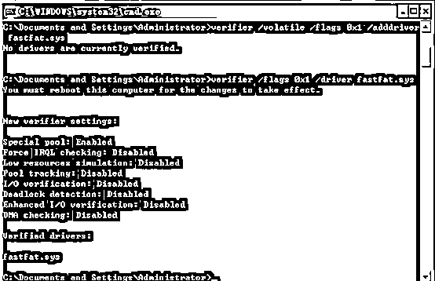
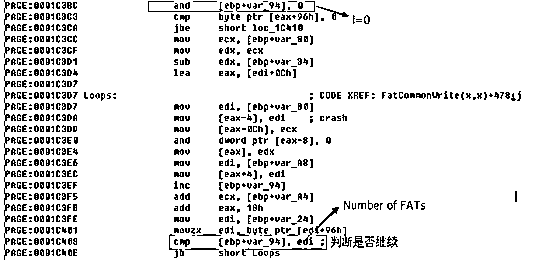

# CVE-2014-4115 漏洞分析(2014.11) - 會飛的貓 - 博客园

> 原文：[`www.cnblogs.com/flycat-2016/p/5428223.html`](https://www.cnblogs.com/flycat-2016/p/5428223.html)

#  CVE-2014-4115 漏洞分析

**一、简介**

该漏洞是由于 Windows 的 Fastfat.sys 组件在处理 FAT32 格式的硬盘分区存在问题。攻击者利用成功可导致权限提升。

影响的系统包括：

**Windows Server 2003**

**Windows Vista**

**Windows Server 2008**

**Windows XP **不提供补丁更新，但是漏洞仍在存在。

测试环境：

WinXP SP3

下面对漏洞成因做简单分析。

**二、漏洞分析**

**1\. "POC"**

触发漏洞需要一个 FAT32 格式（一般都是这个格式）的 U 盘，然后用 010 工具将 U 盘偏移+10h 位置的 02 改为大于 2 的数值如:77

 这个偏移官网上的解释：

**2.First Crash**

然后用虚拟机连接该 U 盘，实验中打开 U 盘中的文件不会触发，只有当删除 U 盘内文件或者在 U 盘中创建新文件才会触发。触发后的 BSOD： 

显示的信息为 BAD_POOL_HEADER。

**3.Second Crash**

内核中使用的 pool 类似于用户态的 heap，调试时需要对 fastfat.sys 开启 Special Pool,就像调试 IE 漏洞时候开启调试堆一样。下面两条命令都可以：

verifier /volatile /flags 0x1 /adddriver MyDriver.sys //无需重启立即生效,重启后失效

verifier /flags 0x1 /driver MyDriver.sys                 //重启后生效

触发漏洞后 windbg 显示的信息：

相关寄存器：

相关堆栈：

根据这些信息，目前知道了问题函数为 FatCommonWrite，问题寄存器为 eax。

**4.回溯**

对崩溃时的 eax 寄存器进行回溯，发现其可能和 ExAllocatePoolWithTag 函数的返回值有关：

可以看到如果 cl 大于 2，会调用 ExAllocatePoolWithTag。为了确定程序是否走了这个流程，需要动态调试一下。设置下面这两个断点：

第一个断点是为了过滤掉除了 explorer.exe 进程以外的进程去 FatCommonWrite 函数调用。（利用的是进程的 EPROCESS 结构找到 name,再和"explorer.exe"字符串比较。）

第二个断点就是上图 IDA 截图的"cmp cl,2"指令的位置。

同样开启 Special Pool 断下来的情况：

此时 cl=0x77，所以会去调用 ExAllocatePoolWithTag 分配 pool。此时 cl 的值恰好等于我们修改 U 盘+10h 位置的值，也就是 Number of FATs，这可以通过多次修改 U 盘该位置的值来确定。

所以崩溃时的 eax 和分配的 pool 有关，回溯完毕。

**5.Anaysis on vulnerability cause**

调用 ExAllocatePoolWithTag 分配了一个 77h 字节的 pool 之后，程序会进入到一个循环：

经过动态调试，红框中的 edi 等于 0x77 也就是 Number of FATs。所以该循环的框架：

for(i=0;i<Number of FATs;i++){…}

接着再来看看"mov [eax-4],edi"这条造成崩溃的指令，在崩溃之前都操作了什么。得到的结果是这个样子的，eax-4 的地址依次为：

0x87700f90 0x87700fa8 0x87700fc0 0x87700fe8 0x87700ff0 0x87701008（crash）

而分配的 pool 的起始地址为 0x87700f88，大小为 0x77 字节：

所以可以确定这段循环是在对刚调用 ExAllocatePoolWithTag 分配的 0x77 字节的 pool 进行操作。所以可以将这个循环更具体一点了：

这样一来，漏洞的成因就很明显了：调用 ExAllocatePoolWithTag 分配 pool 时，应该分配 Number of FATs * 18h 大小的 pool，而不是 Number of FATs 大小的。

**三、参考**

[`www.icewall.pl/?p=680&lang=en`](http://www.icewall.pl/?p=680&lang=en)

[`blog.vulnhunt.com/index.php/2014/12/03/cve-2014-4115_analysis/`](http://blog.vulnhunt.com/index.php/2014/12/03/cve-2014-4115_analysis/)

[`msdn.microsoft.com/en-us/library/windows/hardware/ff551832(v=vs.85).aspx`](http://msdn.microsoft.com/en-us/library/windows/hardware/ff551832(v=vs.85).aspx)

[`technet.microsoft.com/en-us/library/security/ms14-063.aspx`](https://technet.microsoft.com/en-us/library/security/ms14-063.aspx)